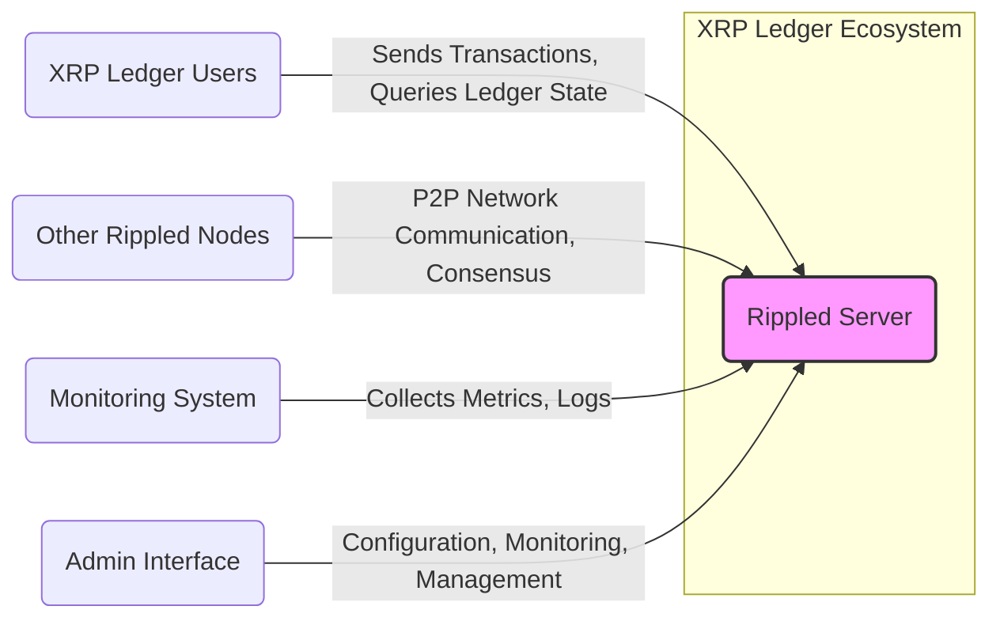
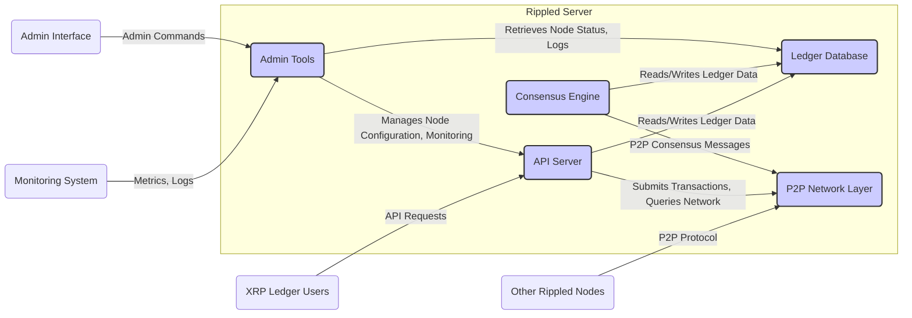
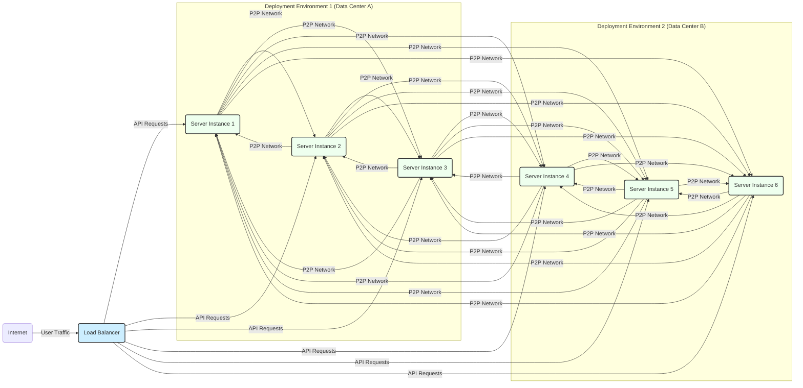

# BUSINESS POSTURE

The rippled project aims to provide a robust, scalable, and secure server for the XRP Ledger, a decentralized cryptographic ledger. The primary business goal is to maintain and enhance the infrastructure that supports the XRP Ledger, enabling fast, low-cost, and reliable transactions of value.

Business Priorities:
- Reliability and Availability: Ensuring the XRP Ledger is consistently operational and accessible for transaction processing.
- Security and Integrity: Protecting the ledger from manipulation, unauthorized access, and ensuring the integrity of transaction data.
- Scalability and Performance:  Maintaining and improving the network's capacity to handle increasing transaction volumes and user growth.
- Compliance and Regulation: Adhering to relevant financial regulations and compliance standards in different jurisdictions where the XRP Ledger is used.
- Community and Ecosystem Growth: Fostering a healthy ecosystem around the XRP Ledger by providing a stable and feature-rich server implementation.

Business Risks:
- Security Breaches and Financial Loss: Vulnerabilities in rippled could lead to exploits, resulting in loss of funds or manipulation of the ledger, causing significant financial damage and reputational harm.
- Network Disruptions and Downtime:  Failures in rippled or the network infrastructure could lead to network outages, disrupting transaction processing and impacting users.
- Regulatory Scrutiny and Non-compliance:  Failure to comply with evolving financial regulations could result in legal penalties, fines, and restrictions on the use of the XRP Ledger.
- Performance Bottlenecks and Scalability Issues:  Inability to handle increasing transaction volumes could lead to network congestion, slow transaction processing, and user dissatisfaction.
- Forks and Consensus Failures:  Issues in the consensus mechanism or software bugs could lead to network forks or failures in reaching consensus, compromising the integrity of the ledger.

# SECURITY POSTURE

Existing Security Controls:
- security control: Code Review - The project is open source and benefits from community code review. (Implemented: GitHub repository, pull request process)
- security control: Fuzzing - The project likely employs fuzzing techniques to identify potential vulnerabilities in the code. (Likely implemented in development and testing pipelines, details not explicitly provided in the repository)
- security control: Static Analysis - Static analysis tools are likely used to identify potential code defects and security vulnerabilities. (Likely implemented in development and testing pipelines, details not explicitly provided in the repository)
- security control: Unit and Integration Testing -  Extensive unit and integration tests are likely in place to ensure code correctness and prevent regressions. (Implemented: Test suites within the repository)
- security control: Access Control - Access to the GitHub repository and build infrastructure is likely controlled via role-based access control. (Implemented: GitHub repository settings, build system access controls)

Accepted Risks:
- accepted risk: Complexity of Distributed Systems - Distributed consensus systems are inherently complex, and subtle vulnerabilities might exist despite rigorous testing and review.
- accepted risk: Dependency Vulnerabilities - The project relies on external libraries and dependencies, which may contain undiscovered vulnerabilities.
- accepted risk: Zero-day Exploits -  The possibility of undiscovered zero-day vulnerabilities in the codebase or dependencies remains an inherent risk.

Recommended Security Controls:
- security control: Security Audits - Regular independent security audits by reputable firms to identify vulnerabilities and weaknesses in the codebase and architecture.
- security control: Penetration Testing - Periodic penetration testing to simulate real-world attacks and assess the effectiveness of security controls.
- security control: Bug Bounty Program - Implement a public bug bounty program to incentivize external security researchers to find and report vulnerabilities.
- security control: Security Training for Developers - Provide security training to developers to enhance their awareness of secure coding practices and common vulnerabilities.
- security control: Dependency Scanning and Management - Implement automated dependency scanning and management tools to identify and remediate vulnerabilities in third-party libraries.
- security control: Runtime Application Self-Protection (RASP) - Consider implementing RASP techniques to detect and prevent attacks at runtime.
- security control: Infrastructure Security Hardening -  Ensure robust security hardening of the infrastructure where rippled nodes are deployed, including operating system, network, and container security.
- security control: Incident Response Plan - Develop and maintain a comprehensive incident response plan to effectively handle security incidents and breaches.

Security Requirements:
- Authentication:
    - Requirement: Secure node-to-node authentication to prevent unauthorized nodes from joining the network and participating in consensus.
    - Requirement: Secure authentication mechanisms for administrative access to rippled nodes.
- Authorization:
    - Requirement: Fine-grained authorization controls to restrict access to sensitive functionalities and data within rippled.
    - Requirement: Role-based access control for administrative tasks.
- Input Validation:
    - Requirement: Robust input validation for all external inputs, including network messages, API requests, and configuration parameters, to prevent injection attacks and other input-related vulnerabilities.
    - Requirement: Strict adherence to protocol specifications and message formats to prevent malformed or malicious messages from disrupting the network.
- Cryptography:
    - Requirement: Use of strong and well-vetted cryptographic algorithms and libraries for all security-sensitive operations, including signing, encryption, and hashing.
    - Requirement: Secure key management practices for cryptographic keys used by rippled nodes.
    - Requirement: Protection of private keys used for signing transactions and node identities.

# DESIGN

## C4 CONTEXT

Context Diagram Elements:

- Element:
    - Name: Rippled Server
    - Type: Software System
    - Description: The core server software for the XRP Ledger, responsible for participating in the peer-to-peer network, validating transactions, maintaining the ledger, and providing APIs for clients.
    - Responsibilities:
        - Participating in the XRP Ledger peer-to-peer network.
        - Validating and processing transactions.
        - Maintaining a local copy of the XRP Ledger.
        - Participating in the consensus process.
        - Providing APIs for clients to interact with the ledger.
        - Exposing administrative interfaces for monitoring and management.
    - Security controls:
        - Node-to-node authentication and encryption.
        - Input validation for network messages and API requests.
        - Authorization controls for administrative interfaces.
        - Rate limiting and DDoS protection.

- Element:
    - Name: XRP Ledger Users
    - Type: Person/System
    - Description: Individuals or systems that interact with the XRP Ledger to send transactions, query ledger state, and manage accounts.
    - Responsibilities:
        - Creating and signing transactions.
        - Submitting transactions to the XRP Ledger network.
        - Querying ledger state and account information.
        - Managing XRP accounts and keys.
    - Security controls:
        - Client-side key management and security practices.
        - Secure communication channels when interacting with rippled nodes (e.g., HTTPS).
        - User authentication and authorization at the application level (outside of rippled scope).

- Element:
    - Name: Other Rippled Nodes
    - Type: Software System
    - Description: Other instances of the rippled server running on the XRP Ledger network, forming the peer-to-peer network.
    - Responsibilities:
        - Participating in the XRP Ledger peer-to-peer network.
        - Exchanging ledger data and transaction information.
        - Participating in the consensus process.
    - Security controls:
        - Node-to-node authentication and encryption.
        - Peer reputation and blacklisting mechanisms.
        - Consensus protocol security.

- Element:
    - Name: Monitoring System
    - Type: Software System
    - Description: External system used to monitor the health, performance, and security of rippled nodes and the XRP Ledger network.
    - Responsibilities:
        - Collecting metrics and logs from rippled nodes.
        - Alerting on anomalies and security events.
        - Providing dashboards and visualizations for monitoring.
    - Security controls:
        - Secure communication channels for collecting metrics and logs (e.g., encrypted protocols).
        - Access control to monitoring data and dashboards.
        - Secure storage of monitoring data.

- Element:
    - Name: Admin Interface
    - Type: Software System
    - Description:  Interface (command-line or web-based) for administrators to configure, monitor, and manage rippled nodes.
    - Responsibilities:
        - Node configuration and setup.
        - Monitoring node status and performance.
        - Managing node logs and diagnostics.
        - Performing administrative tasks (e.g., restarting node, updating configuration).
    - Security controls:
        - Strong authentication for administrative access.
        - Role-based access control for administrative functions.
        - Audit logging of administrative actions.
        - Secure communication channels (e.g., SSH, HTTPS).

## C4 CONTAINER

Container Diagram Elements:

- Element:
    - Name: API Server
    - Type: Application
    - Description: Provides APIs (e.g., REST, WebSocket) for external users and applications to interact with the XRP Ledger. Handles transaction submission, ledger queries, and account management requests.
    - Responsibilities:
        - Receiving and validating API requests.
        - Interacting with the Ledger Database to retrieve and store data.
        - Communicating with the P2P Network Layer to submit transactions and query network state.
        - Enforcing API access controls and rate limiting.
    - Security controls:
        - Input validation for API requests.
        - API authentication and authorization (if applicable for certain APIs).
        - Rate limiting and DDoS protection for API endpoints.
        - Secure communication channels (HTTPS).

- Element:
    - Name: Consensus Engine
    - Type: Application
    - Description: Implements the XRP Ledger consensus protocol, responsible for validating transactions, reaching agreement on the ledger state, and appending new ledgers to the chain.
    - Responsibilities:
        - Participating in the consensus process with other nodes.
        - Validating transactions and ledger proposals.
        - Reaching agreement on the canonical ledger.
        - Updating the Ledger Database with new ledger versions.
        - Implementing Byzantine Fault Tolerance.
    - Security controls:
        - Consensus protocol security mechanisms (e.g., cryptographic signatures, validation rules).
        - Resistance to Sybil attacks and other consensus-related attacks.
        - Secure communication channels with other consensus engine instances.

- Element:
    - Name: Ledger Database
    - Type: Data Store
    - Description: Stores the XRP Ledger data, including account balances, transaction history, and ledger state.  Likely uses a high-performance database system optimized for ledger operations.
    - Responsibilities:
        - Persistently storing the XRP Ledger data.
        - Providing efficient read and write access to ledger data.
        - Ensuring data integrity and consistency.
        - Potentially implementing data replication and backup mechanisms.
    - Security controls:
        - Database access controls and authentication.
        - Data encryption at rest and in transit (if applicable).
        - Database hardening and security best practices.
        - Regular backups and disaster recovery mechanisms.

- Element:
    - Name: P2P Network Layer
    - Type: Application
    - Description: Handles peer-to-peer communication with other rippled nodes on the XRP Ledger network. Implements the network protocol for message exchange, node discovery, and network management.
    - Responsibilities:
        - Establishing and maintaining connections with other rippled nodes.
        - Broadcasting and receiving network messages (transactions, ledger proposals, etc.).
        - Implementing node discovery and peer selection mechanisms.
        - Handling network security and message integrity.
    - Security controls:
        - Node-to-node authentication and encryption.
        - Message integrity checks and digital signatures.
        - Peer reputation and blacklisting mechanisms.
        - DDoS protection at the network level.

- Element:
    - Name: Admin Tools
    - Type: Application
    - Description: Provides command-line and potentially web-based tools for administrators to manage and monitor the rippled server.
    - Responsibilities:
        - Node configuration management.
        - Monitoring node status, performance, and logs.
        - Performing administrative tasks (e.g., restarting node, updating configuration).
        - Exposing metrics for monitoring systems.
    - Security controls:
        - Strong authentication for administrative access.
        - Role-based access control for administrative functions.
        - Audit logging of administrative actions.
        - Secure communication channels (SSH, HTTPS).

## DEPLOYMENT

Deployment Architecture: Distributed Node Network

Rippled is designed to be deployed as a distributed network of nodes. Each node typically runs on dedicated server infrastructure or within virtualized environments. For a production deployment, multiple geographically distributed nodes are recommended for redundancy and resilience.

Deployment Diagram Elements:

- Element:
    - Name: Server Instance (Server A1, A2, A3, B1, B2, B3)
    - Type: Infrastructure (Physical Server or Virtual Machine)
    - Description: Represents a single instance of the rippled server software running on a server. Each server instance hosts all containers described in the Container Diagram (API Server, Consensus Engine, Ledger Database, P2P Network Layer, Admin Tools).
    - Responsibilities:
        - Running all rippled containers.
        - Participating in the XRP Ledger network.
        - Processing transactions and maintaining the ledger.
    - Security controls:
        - Operating system hardening.
        - Firewall configuration to restrict network access.
        - Intrusion detection and prevention systems (IDS/IPS).
        - Security monitoring and logging.
        - Regular security patching and updates.

- Element:
    - Name: Load Balancer
    - Type: Infrastructure (Network Device or Software)
    - Description: Distributes incoming API requests across multiple rippled server instances to ensure high availability and scalability of the API service.
    - Responsibilities:
        - Distributing API traffic across backend rippled servers.
        - Performing health checks on backend servers.
        - Providing a single entry point for API requests.
        - Potentially providing DDoS protection and rate limiting at the network edge.
    - Security controls:
        - Load balancer hardening and security configuration.
        - SSL/TLS termination for API traffic.
        - Access control to load balancer management interface.
        - DDoS protection and rate limiting capabilities.

- Element:
    - Name: Internet
    - Type: Network
    - Description: The public internet, representing the external network from which user traffic originates.
    - Responsibilities:
        - Providing connectivity for users to access the XRP Ledger API.
    - Security controls:
        - N/A - Security of the internet is outside the scope of rippled deployment, but reliance on secure protocols (HTTPS) is crucial.

## BUILD

Build Process: Automated CI/CD Pipeline

The rippled project likely employs an automated CI/CD pipeline for building, testing, and publishing the software. This pipeline ensures consistent builds, automated testing, and facilitates rapid iteration and deployment.

```mermaid
flowchart LR
    developer("Developer") -- "Code Commit" --> github_repo("GitHub Repository")
    github_repo -- "Webhook Trigger" --> ci_server("CI Server (e.g., GitHub Actions)")
    ci_server -- "Build & Test" --> build_environment("Build Environment")
    build_environment -- "Artifacts" --> artifact_repository("Artifact Repository")
    artifact_repository -- "Deployment" --> deployment_environment("Deployment Environment")

    subgraph "Build Environment"
        source_code_checkout("Source Code Checkout")
        dependency_resolution("Dependency Resolution")
        compilation("Compilation")
        unit_tests("Unit Tests")
        integration_tests("Integration Tests")
        static_analysis("Static Analysis & SAST")
        containerization("Containerization (e.g., Docker)")
    end
    build_environment -- "Input" --> source_code_checkout
    source_code_checkout -- "Output" --> dependency_resolution
    dependency_resolution -- "Output" --> compilation
    compilation -- "Output" --> unit_tests
    unit_tests -- "Output" --> integration_tests
    integration_tests -- "Output" --> static_analysis
    static_analysis -- "Output" --> containerization

    style github_repo fill:#cdf,stroke:#333,stroke-width:2px
    style ci_server fill:#cdf,stroke:#333,stroke-width:2px
    style artifact_repository fill:#cdf,stroke:#333,stroke-width:2px
    style deployment_environment fill:#cdf,stroke:#333,stroke-width:2px
    style build_environment fill:#eff,stroke:#333,stroke-width:2px
```

Build Diagram Elements:

- Element:
    - Name: GitHub Repository
    - Type: Code Repository
    - Description: Hosts the source code for the rippled project, including code, build scripts, and configuration files.
    - Responsibilities:
        - Version control of source code.
        - Collaboration platform for developers.
        - Triggering CI/CD pipelines on code changes.
    - Security controls:
        - Access control to the repository (authentication and authorization).
        - Branch protection and code review requirements.
        - Audit logging of repository actions.

- Element:
    - Name: CI Server (e.g., GitHub Actions)
    - Type: Build Automation System
    - Description: Orchestrates the automated build, test, and deployment pipeline. Executes build scripts, runs tests, and manages artifact publishing.
    - Responsibilities:
        - Automating the build and test process.
        - Running static analysis and security scans.
        - Packaging build artifacts.
        - Triggering deployments.
    - Security controls:
        - Secure configuration of CI/CD pipelines.
        - Access control to CI/CD system and configurations.
        - Secrets management for credentials used in the pipeline.
        - Audit logging of CI/CD pipeline executions.

- Element:
    - Name: Build Environment
    - Type: Compute Environment
    - Description:  A temporary or dedicated environment where the build process is executed. Includes steps like source code checkout, dependency resolution, compilation, testing, static analysis, and containerization.
    - Responsibilities:
        - Providing a consistent and reproducible build environment.
        - Executing build steps and tests.
        - Generating build artifacts.
    - Security controls:
        - Secure build environment configuration.
        - Isolation of build environments.
        - Dependency scanning and vulnerability checks during dependency resolution.
        - Static Application Security Testing (SAST) during static analysis.

- Element:
    - Name: Artifact Repository
    - Type: Storage System
    - Description: Stores the build artifacts (e.g., binaries, container images) produced by the CI/CD pipeline.
    - Responsibilities:
        - Securely storing build artifacts.
        - Versioning and managing artifacts.
        - Providing access to artifacts for deployment.
    - Security controls:
        - Access control to the artifact repository.
        - Integrity checks for artifacts (e.g., checksums, signatures).
        - Vulnerability scanning of container images in the repository.

- Element:
    - Name: Deployment Environment
    - Type: Target Environment
    - Description: The target infrastructure where the rippled server is deployed (as described in the Deployment section).
    - Responsibilities:
        - Running the deployed rippled software.
        - Providing the runtime environment for rippled.
    - Security controls:
        - Security controls as described in the Deployment section (OS hardening, firewalls, IDS/IPS, etc.).

# RISK ASSESSMENT

Critical Business Processes:
- Processing XRP transactions: This is the core function of the XRP Ledger and rippled. Ensuring secure and reliable transaction processing is paramount.
- Maintaining ledger integrity:  Protecting the ledger from unauthorized modifications and ensuring the accuracy and consistency of ledger data is crucial for trust and functionality.
- Network consensus:  The consensus mechanism is critical for maintaining agreement across the distributed network and preventing forks or inconsistencies.

Data to Protect and Sensitivity:
- Transaction data: Highly sensitive financial data, including transaction details, amounts, and participants. Confidentiality, integrity, and availability are critical.
- Account information:  Sensitive data related to user accounts, including account balances and public keys. Confidentiality and integrity are crucial.
- Ledger state:  The complete state of the XRP Ledger, representing the current balances and transaction history. Integrity and availability are paramount.
- Private keys:  Extremely sensitive cryptographic keys used for signing transactions and node identities. Confidentiality is absolutely critical. Loss or compromise of private keys can lead to catastrophic security breaches.

# QUESTIONS & ASSUMPTIONS

Questions:
- What specific regulatory compliance standards are relevant to the rippled project and XRP Ledger? (e.g., KYC/AML, data privacy regulations)
- Are there specific performance or scalability targets for the rippled server?
- What are the current incident response procedures for security incidents related to rippled?
- What specific security tools and technologies are currently used in the development, build, and deployment pipelines?

Assumptions:
- BUSINESS POSTURE:
    - The primary business goal is to maintain a secure, reliable, and scalable infrastructure for the XRP Ledger.
    - Security and integrity are top priorities due to the financial nature of the system.
    - Compliance with relevant financial regulations is important.
- SECURITY POSTURE:
    - Standard secure software development lifecycle practices are followed.
    - Basic security controls like code review and testing are in place.
    - Security is a significant concern and ongoing effort for the project.
- DESIGN:
    - Rippled is designed as a distributed system with a peer-to-peer network architecture.
    - A modular design with components like API Server, Consensus Engine, and Ledger Database is assumed.
    - Deployment is distributed across multiple server instances for redundancy and scalability.
    - An automated CI/CD pipeline is used for building and deploying rippled.