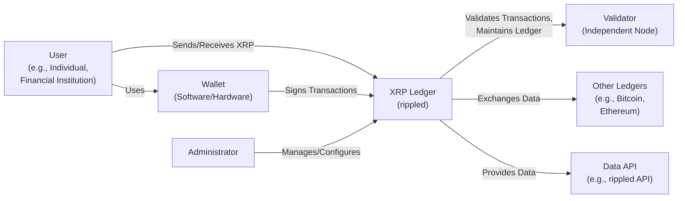
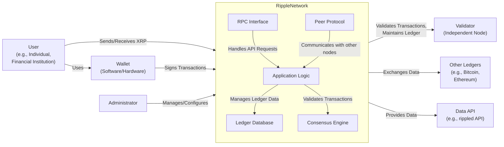
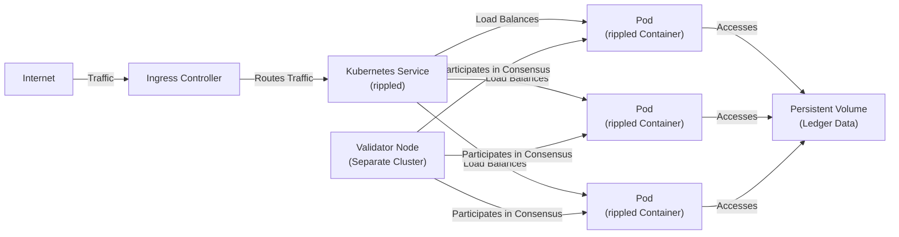
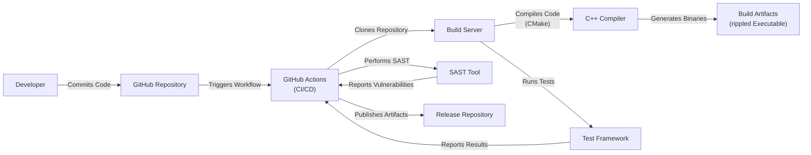

# BUSINESS POSTURE

Ripple's rippled server (XRP Ledger) is a core component of a global, decentralized payment network aiming to enable real-time, low-cost cross-border transactions. The business priorities and goals are centered around:

*   Reliability and Availability: The network must operate continuously and reliably to facilitate transactions at any time. Downtime or instability directly impacts users' ability to transact and erodes trust in the system.
*   Scalability: The network needs to handle a growing volume of transactions as adoption increases, without sacrificing performance or increasing costs significantly.
*   Security: Protecting the integrity of the ledger and users' funds is paramount. This includes preventing double-spending, unauthorized access, and other malicious activities.
*   Decentralization: Maintaining a distributed network of validators is crucial for censorship resistance and resilience against single points of failure.
*   Compliance: Adhering to relevant regulations and legal frameworks in various jurisdictions is essential for long-term viability and mainstream adoption.
*   Interoperability: Facilitating seamless exchange and interaction with other payment networks and financial systems.
*   Speed: Transactions must be confirmed quickly to provide a user experience competitive with traditional payment systems.

Business Risks:

*   Cryptocurrency Volatility Risk: The value of XRP, the native cryptocurrency of the XRP Ledger, is subject to market fluctuations, which can impact the perceived value and utility of the network.
*   Regulatory Risk: The evolving regulatory landscape for cryptocurrencies poses a significant risk. Changes in regulations could impact Ripple's operations, the use of XRP, or the ability to interact with traditional financial systems.
*   Security Breach Risk: A successful attack on the network could lead to loss of funds, reputational damage, and loss of user trust. This includes attacks targeting the consensus mechanism, individual nodes, or user wallets.
*   Competition Risk: The presence of other established and emerging payment networks and cryptocurrencies creates competitive pressure.
*   Adoption Risk: The success of the XRP Ledger depends on widespread adoption by financial institutions and users. Failure to achieve sufficient adoption could limit its growth and impact.
*   Technology Risk: Reliance on specific technologies (like the XRP Ledger consensus protocol) introduces the risk of unforeseen vulnerabilities or limitations.
*   Reputational Risk: Negative publicity, controversies, or legal challenges can damage Ripple's reputation and hinder adoption.

# SECURITY POSTURE

Existing Security Controls:

*   security control: Cryptographic Signatures: All transactions on the XRP Ledger are cryptographically signed by the sender, ensuring authenticity and preventing unauthorized spending. (Implemented in rippled source code, transaction processing logic).
*   security control: Consensus Protocol: The XRP Ledger uses a unique consensus protocol to validate transactions and maintain the integrity of the ledger. This protocol is designed to be Byzantine fault-tolerant, meaning it can function correctly even if some nodes are malicious or faulty. (Described in Ripple's documentation and implemented in the rippled source code).
*   security control: Peer-to-Peer Network: The rippled server operates on a peer-to-peer network, where nodes communicate with each other to share transaction data and reach consensus. (Implemented in rippled source code, networking logic).
*   security control: Data Validation: The rippled server performs extensive data validation to ensure that transactions are well-formed and adhere to the network's rules. (Implemented in rippled source code, transaction processing logic).
*   security control: Regular Audits: Ripple engages in regular security audits of the rippled codebase and infrastructure. (Mentioned in Ripple's documentation and public statements).
*   security control: Bug Bounty Program: Ripple operates a bug bounty program to incentivize security researchers to identify and report vulnerabilities. (Mentioned in Ripple's documentation and public statements).
*   security control: Secure Coding Practices: Ripple follows secure coding practices to minimize the risk of vulnerabilities in the rippled codebase. (Implied through development practices and documentation).

Accepted Risks:

*   accepted risk: Centralization Concerns: While the XRP Ledger is decentralized, there are concerns about the concentration of validators and the influence of Ripple on the network's governance.
*   accepted risk: 51% Attack: Like any decentralized ledger, the XRP Ledger is theoretically vulnerable to a 51% attack, where a single entity or group controls a majority of the network's validating power. However, the unique consensus mechanism of the XRP Ledger is designed to mitigate this risk.
*   accepted risk: Regulatory Uncertainty: The regulatory landscape for cryptocurrencies is still evolving, and there is a risk that future regulations could negatively impact the XRP Ledger.

Recommended Security Controls:

*   security control: Formal Verification: Employ formal verification techniques to mathematically prove the correctness of critical parts of the codebase, especially the consensus algorithm.
*   security control: Intrusion Detection and Prevention Systems (IDPS): Implement robust IDPS to monitor network traffic and server activity for malicious behavior.
*   security control: Multi-Signature Wallets: Encourage the use of multi-signature wallets for managing XRP holdings, especially for large amounts.
*   security control: Hardware Security Modules (HSMs): Utilize HSMs to protect sensitive cryptographic keys used by validators and other critical infrastructure.
*   security control: Penetration Testing: Conduct regular penetration testing by independent security experts to identify and address vulnerabilities.

Security Requirements:

*   Authentication:
    *   All transactions must be authenticated using strong cryptographic signatures.
    *   Access to administrative interfaces and sensitive data must be protected by strong authentication mechanisms.
*   Authorization:
    *   Access control lists (ACLs) or similar mechanisms should be used to restrict access to sensitive resources based on roles and permissions.
    *   The principle of least privilege should be enforced, granting users only the minimum necessary access.
*   Input Validation:
    *   All inputs to the rippled server, including transaction data, API requests, and configuration parameters, must be rigorously validated to prevent injection attacks and other vulnerabilities.
    *   Data should be validated against predefined schemas and rules.
*   Cryptography:
    *   Strong, well-vetted cryptographic algorithms should be used for all cryptographic operations, including signing, encryption, and hashing.
    *   Key management practices should be robust and secure, protecting keys from unauthorized access and disclosure.
    *   Regularly review and update cryptographic algorithms and key lengths to stay ahead of evolving threats.

# DESIGN

## C4 CONTEXT

Element Descriptions:

*   Element:
    *   Name: User
    *   Type: Person
    *   Description: An individual or financial institution that uses the XRP Ledger to send and receive payments.
    *   Responsibilities: Initiates transactions, manages XRP holdings.
    *   Security controls: Uses strong passwords, protects private keys, uses secure wallets.

*   Element:
    *   Name: XRP Ledger (rippled)
    *   Type: Software System
    *   Description: The decentralized network of rippled servers that maintains the XRP Ledger.
    *   Responsibilities: Validates transactions, maintains the ledger, reaches consensus.
    *   Security controls: Cryptographic signatures, consensus protocol, data validation, peer-to-peer network.

*   Element:
    *   Name: Validator
    *   Type: Software System
    *   Description: An independent node that participates in the consensus process to validate transactions.
    *   Responsibilities: Validates transactions, proposes ledger updates.
    *   Security controls: Secure server infrastructure, key management, network security.

*   Element:
    *   Name: Other Ledgers
    *   Type: Software System
    *   Description: Other blockchain networks, such as Bitcoin or Ethereum.
    *   Responsibilities: Maintain their own ledgers, facilitate transactions on their respective networks.
    *   Security controls: Dependent on the specific ledger's security mechanisms.

*   Element:
    *   Name: Data API
    *   Type: Software System
    *   Description: An interface that provides access to data on the XRP Ledger, such as transaction history and account balances.
    *   Responsibilities: Provides data to users and applications.
    *   Security controls: Authentication, authorization, rate limiting, input validation.

*   Element:
    *   Name: Wallet
    *   Type: Software System/Hardware Device
    *   Description: Software or hardware used to store and manage XRP private keys and sign transactions.
    *   Responsibilities: Securely stores private keys, signs transactions.
    *   Security controls: Strong encryption, secure storage, multi-factor authentication (for some wallets).

*   Element:
    *   Name: Administrator
    *   Type: Person
    *   Description: A person responsible for managing and configuring the rippled server.
    *   Responsibilities: Server configuration, maintenance, monitoring.
    *   Security controls: Strong authentication, access controls, secure remote access.

## C4 CONTAINER

Element Descriptions:

*   Element:
    *   Name: RPC Interface
    *   Type: API
    *   Description: Handles API requests from users and applications.
    *   Responsibilities: Receives and processes API requests, returns responses.
    *   Security controls: Input validation, authentication, authorization, rate limiting.

*   Element:
    *   Name: Peer Protocol
    *   Type: Network Protocol
    *   Description: Handles communication with other rippled nodes.
    *   Responsibilities: Discovers peers, exchanges transaction data, participates in consensus.
    *   Security controls: Secure communication channels (TLS), peer authentication.

*   Element:
    *   Name: Application Logic
    *   Type: Application Component
    *   Description: Core logic of the rippled server.
    *   Responsibilities: Processes transactions, manages ledger data, interacts with other components.
    *   Security controls: Secure coding practices, data validation.

*   Element:
    *   Name: Ledger Database
    *   Type: Database
    *   Description: Stores the XRP Ledger data.
    *   Responsibilities: Persistently stores ledger data, provides access to data.
    *   Security controls: Data encryption, access controls, regular backups.

*   Element:
    *   Name: Consensus Engine
    *   Type: Application Component
    *   Description: Implements the XRP Ledger consensus protocol.
    *   Responsibilities: Validates transactions, reaches consensus with other validators.
    *   Security controls: Byzantine fault tolerance, robust algorithm design.

## DEPLOYMENT

Possible Deployment Solutions:

1.  Bare Metal Servers: Deploying rippled directly on physical servers.
2.  Virtual Machines (VMs): Deploying rippled on VMs within a cloud environment (e.g., AWS, Google Cloud, Azure) or on-premises infrastructure.
3.  Containers (Docker): Packaging rippled and its dependencies into a Docker container for deployment on various platforms.
4.  Kubernetes: Orchestrating rippled deployments using Kubernetes for scalability, resilience, and automated management.

Chosen Solution: Kubernetes

Element Descriptions:

*   Element:
    *   Name: Internet
    *   Type: External Entity
    *   Description: The public internet.
    *   Responsibilities: Routes traffic to the Kubernetes cluster.
    *   Security controls: Firewall, DDoS protection.

*   Element:
    *   Name: Ingress Controller
    *   Type: Software Component
    *   Description: Manages external access to the rippled service.
    *   Responsibilities: Routes incoming traffic to the appropriate service.
    *   Security controls: TLS termination, SSL certificates, access controls.

*   Element:
    *   Name: Kubernetes Service (rippled)
    *   Type: Kubernetes Resource
    *   Description: A logical abstraction over a set of rippled pods.
    *   Responsibilities: Provides a stable endpoint for accessing rippled.
    *   Security controls: Network policies.

*   Element:
    *   Name: Pod (rippled Container)
    *   Type: Kubernetes Resource
    *   Description: A single instance of the rippled container.
    *   Responsibilities: Runs the rippled server software.
    *   Security controls: Container security best practices, resource limits.

*   Element:
    *   Name: Persistent Volume (Ledger Data)
    *   Type: Storage
    *   Description: Persistent storage for the XRP Ledger data.
    *   Responsibilities: Stores ledger data reliably.
    *   Security controls: Data encryption, access controls, backups.

*   Element:
    *   Name: Validator Node (Separate Cluster)
    *   Type: Software System/Infrastructure
    *   Description: Represents validator nodes, potentially running in a separate Kubernetes cluster or infrastructure.
    *   Responsibilities: Participate in the consensus process.
    *   Security controls: Secure infrastructure, key management, network security.

## BUILD

The rippled build process involves compiling the C++ source code, running tests, and creating release artifacts. Ripple uses a combination of tools and processes, including CMake, GitHub Actions, and potentially other internal tools.

Security Controls in Build Process:

*   security control: Version Control (GitHub): The rippled source code is managed using Git and hosted on GitHub, providing version control, audit trails, and collaboration features.
*   security control: Build Automation (GitHub Actions): GitHub Actions is used to automate the build process, ensuring consistency and repeatability.
*   security control: Static Application Security Testing (SAST): SAST tools are integrated into the build pipeline to automatically scan the codebase for potential vulnerabilities.
*   security control: Dependency Management: The build process manages dependencies using appropriate tools (likely CMake and package managers) to ensure that only approved and up-to-date libraries are used.
*   security control: Code Review: Code changes are reviewed by other developers before being merged into the main codebase.
*   security control: Software Composition Analysis (SCA): While not explicitly mentioned, SCA tools *should* be used to identify known vulnerabilities in third-party libraries.

# RISK ASSESSMENT

Critical Business Processes:

*   Transaction Processing: The core process of validating and recording transactions on the XRP Ledger.
*   Consensus Mechanism: The process by which validators agree on the state of the ledger.
*   Key Management: The secure generation, storage, and use of cryptographic keys.
*   Network Communication: The secure exchange of data between rippled nodes.

Data Sensitivity:

*   Transaction Data: Includes sender, receiver, amount, and timestamp. Sensitivity: Medium (publicly visible on the ledger, but can be linked to identities).
*   Account Balances: The amount of XRP held by each account. Sensitivity: Medium (publicly visible on the ledger).
*   Private Keys: Used to authorize transactions. Sensitivity: Extremely High (compromise leads to loss of funds).
*   Validator Keys: Used to participate in consensus. Sensitivity: High (compromise can disrupt the network).
*   Configuration Data: Server settings and parameters. Sensitivity: Medium to High (depending on the specific configuration).
*   API Keys: Used to access the rippled API. Sensitivity: Medium to High (depending on the permissions associated with the key).

# QUESTIONS & ASSUMPTIONS

Questions:

*   What specific SAST and SCA tools are used in the build process?
*   What are the specific procedures for key management, especially for validator keys?
*   What are the details of the incident response plan for security breaches?
*   What are the specific regulatory requirements that Ripple is currently addressing?
*   What mechanisms are in place to prevent or mitigate denial-of-service (DoS) attacks?
*   What is the process for updating the rippled software on validator nodes?
*   Are there any specific hardware security requirements for validator nodes?
*   What are the monitoring and alerting systems in place to detect and respond to security incidents?

Assumptions:

*   BUSINESS POSTURE: Ripple prioritizes security and compliance, given its role in the financial industry.
*   BUSINESS POSTURE: Ripple has a dedicated security team responsible for maintaining the security of the rippled server and the XRP Ledger.
*   SECURITY POSTURE: Secure coding practices are followed throughout the development lifecycle.
*   SECURITY POSTURE: Regular security audits and penetration tests are conducted.
*   DESIGN: The deployment environment is properly secured and monitored.
*   DESIGN: The build process includes automated security checks.
*   DESIGN: The network infrastructure is designed to be resilient to failures and attacks.
*   DESIGN: Validators are geographically distributed to enhance decentralization.