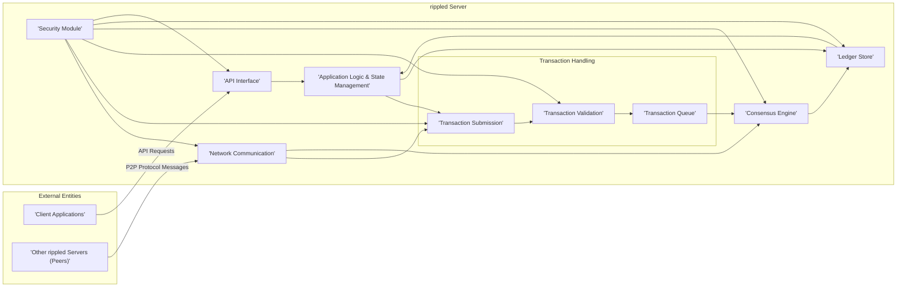
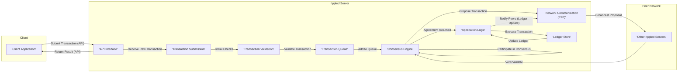

# Project Design Document: RippleD Server

**Version:** 1.1
**Date:** October 26, 2023
**Author:** AI Software Architect

## 1. Introduction

This document provides a detailed design overview of the `rippled` server, the core component of the XRP Ledger (XRPL). This document is intended to serve as a foundation for subsequent threat modeling activities. It outlines the key architectural components, data flows, and security considerations of the `rippled` server, providing a more granular view for security analysis.

## 2. Project Goals

*   Provide a robust and reliable server for participating in the XRP Ledger network.
*   Facilitate transaction processing, validation, and consensus within the network.
*   Maintain a local, authoritative copy of the shared ledger.
*   Offer secure and well-defined APIs for clients to interact with the XRP Ledger.
*   Ensure the confidentiality, integrity, and availability of the ledger data and server operations.

## 3. Non-Goals

*   Detailed implementation specifics of individual modules' internal logic.
*   Low-level performance benchmarking and optimization details.
*   Specific, in-depth mathematical proofs or cryptographic details of the consensus algorithm.
*   A comprehensive explanation of the entire XRP Ledger protocol specification.

## 4. High-Level Architecture

The `rippled` server is a modular system with distinct responsibilities. The following diagram illustrates the high-level architecture and interactions between key components:

## 5. Component Descriptions

This section provides a more detailed breakdown of the `rippled` server's components:

*   **Network Communication:**
    *   Responsible for all network interactions.
    *   **P2P Communication:** Handles communication with other `rippled` servers using the XRP Ledger peer-to-peer protocol. This includes message routing, connection management, and peer discovery. Utilizes TCP and optionally TLS for secure peer connections.
    *   **Client API Communication:** Manages incoming API requests from client applications, often using protocols like HTTPS or WebSockets. Handles connection management and initial request parsing.

*   **Transaction Handling:**
    *   Manages the lifecycle of transactions within the server.
    *   **Transaction Submission:**  Receives raw transactions from the API Interface or other peers.
    *   **Transaction Validation:** Performs comprehensive checks on the transaction's syntax, semantics, signatures, and account balances to ensure it's valid according to the XRP Ledger rules.
    *   **Transaction Queue:** Holds validated transactions awaiting inclusion in the next proposed ledger. Implements prioritization and management of the transaction pool.

*   **Consensus Engine:**
    *   Implements the core logic of the XRP Ledger consensus protocol.
    *   Participates in the Federated Byzantine Agreement (FBA) process to agree on the next valid ledger version with other trusted validators.
    *   Receives proposed transactions, votes on their inclusion, and processes validation messages from other validators.

*   **Ledger Store:**
    *   Provides persistent storage for the XRP Ledger data.
    *   Stores the complete history of the ledger, including accounts, balances, transaction history, and other ledger objects.
    *   Offers efficient read and write operations for other components. May utilize a database system optimized for this purpose.

*   **Application Logic & State Management:**
    *   Contains the core business logic of the `rippled` server, implementing the rules and constraints of the XRP Ledger protocol.
    *   Executes validated transactions, updating the ledger state in memory before persisting it to the Ledger Store.
    *   Manages the in-memory representation of the current ledger state.

*   **API Interface:**
    *   Provides a set of APIs for external clients to interact with the `rippled` server.
    *   Supports various protocols like JSON-RPC over HTTP(S) and WebSocket.
    *   Handles authentication and authorization of client requests.
    *   Exposes functionalities for submitting transactions, querying ledger data, subscribing to ledger updates, and retrieving server information.

*   **Security Module:**
    *   Enforces security policies and provides security-related functionalities across the `rippled` server.
    *   Manages cryptographic keys and performs cryptographic operations (signing, verification).
    *   Handles authentication and authorization for both internal components and external interactions.
    *   May include features for rate limiting, intrusion detection, and auditing.

## 6. Data Flow

The following diagram illustrates a more detailed flow of a transaction through the `rippled` server:

**Detailed Transaction Data Flow:**

1. **Transaction Submission (API):** A client application submits a transaction to the `rippled` server via the API Interface.
2. **Receive Raw Transaction:** The API Interface receives the raw transaction data.
3. **Initial Checks:** The Transaction Submission component performs basic checks on the transaction format.
4. **Validate Transaction:** The Transaction Validation component performs comprehensive validation, including signature verification, account existence, and sufficient balance checks.
5. **Add to Queue:** If the transaction is valid, it's added to the Transaction Queue.
6. **Propose Transaction:** The Consensus Engine selects transactions from the queue to propose for inclusion in the next ledger.
7. **Broadcast Proposal:** The Network Communication (P2P) component broadcasts the proposed transaction to other `rippled` servers in the network.
8. **Participate in Consensus:** The Consensus Engine engages in the consensus process with other validators, exchanging messages and voting on the proposed ledger.
9. **Vote/Validate:** Other `rippled` servers in the peer network validate the proposed transactions and participate in the voting process.
10. **Agreement Reached:** Once a consensus is reached on the set of transactions for the next ledger, the Consensus Engine signals the Application Logic.
11. **Execute Transaction:** The Application Logic executes the agreed-upon transactions, updating the in-memory ledger state.
12. **Update Ledger:** The updated ledger state is persisted to the Ledger Store.
13. **Return Result (API):** The API Interface sends a confirmation or error message back to the client application.
14. **Notify Peers (Ledger Update):** The Application Logic, via Network Communication, informs other peers about the newly validated ledger.

## 7. Security Considerations

This section provides a more detailed breakdown of security considerations, categorized for clarity:

*   **Network Security:**
    *   **Threats:** Eavesdropping, man-in-the-middle attacks, DoS/DDoS attacks, unauthorized peer connections.
    *   **Considerations:**
        *   Enforce TLS for all peer-to-peer and client API communication to ensure confidentiality and integrity.
        *   Implement robust peer authentication and authorization mechanisms to prevent unauthorized nodes from joining the network.
        *   Employ rate limiting and traffic shaping to mitigate DoS/DDoS attacks.
        *   Properly configure firewalls to restrict access to necessary ports only.

*   **API Security:**
    *   **Threats:** Unauthorized access, injection attacks (e.g., SQL injection, command injection), cross-site scripting (XSS), cross-site request forgery (CSRF), API key compromise.
    *   **Considerations:**
        *   Implement strong authentication (e.g., API keys, OAuth 2.0) and authorization mechanisms for all API endpoints.
        *   Thoroughly validate all input data to prevent injection attacks.
        *   Implement appropriate output encoding to prevent XSS vulnerabilities.
        *   Use anti-CSRF tokens to protect against CSRF attacks.
        *   Securely store and manage API keys and credentials.
        *   Implement rate limiting to prevent abuse and resource exhaustion.

*   **Consensus Security:**
    *   **Threats:** Sybil attacks, Byzantine attacks by malicious validators, consensus manipulation.
    *   **Considerations:**
        *   The XRP Ledger's consensus algorithm is designed to be Byzantine Fault Tolerant.
        *   Rely on a well-vetted and trusted set of validators.
        *   Implement mechanisms to detect and potentially isolate malicious or faulty validators.
        *   Monitor consensus participation and performance for anomalies.

*   **Ledger Integrity:**
    *   **Threats:** Ledger tampering, data corruption, unauthorized modifications.
    *   **Considerations:**
        *   Utilize cryptographic hashing (Merkle trees) to ensure the integrity and immutability of the ledger data.
        *   Transactions are digitally signed, providing non-repudiation.
        *   Implement robust data validation and consistency checks within the Ledger Store.
        *   Regularly back up ledger data to prevent data loss.

*   **Data Storage Security:**
    *   **Threats:** Unauthorized access to sensitive data (private keys, ledger data), data breaches.
    *   **Considerations:**
        *   Securely store private keys, potentially using hardware security modules (HSMs).
        *   Implement access control mechanisms to restrict access to ledger data based on roles and permissions.
        *   Consider encrypting sensitive data at rest.

*   **Code Security:**
    *   **Threats:** Software vulnerabilities (buffer overflows, memory leaks, race conditions), insecure dependencies.
    *   **Considerations:**
        *   Adhere to secure coding practices throughout the development lifecycle.
        *   Conduct regular security audits and penetration testing.
        *   Implement dependency management and vulnerability scanning for third-party libraries.

*   **Operational Security:**
    *   **Threats:** Misconfiguration, unauthorized access to servers, lack of monitoring, inadequate logging.
    *   **Considerations:**
        *   Follow secure deployment and configuration best practices.
        *   Implement strong access controls for server infrastructure.
        *   Establish comprehensive monitoring and logging of security-related events.
        *   Develop and maintain an incident response plan for security breaches.
        *   Regularly apply security updates and patches.

## 8. Deployment Considerations

*   `rippled` servers can be deployed on various operating systems (e.g., Linux, macOS, Windows), with Linux being the most common production environment.
*   Deployment involves configuring network interfaces, database connections (if applicable for the Ledger Store), and security settings.
*   Servers can be configured as validating nodes (participating in consensus) or non-validating nodes (providing API access and relaying transactions).
*   Proper monitoring tools and logging infrastructure are essential for maintaining operational stability and detecting security incidents.
*   Consider using containerization technologies (e.g., Docker) for easier deployment and management.

## 9. Future Considerations

*   Ongoing enhancements to the API to support new features and functionalities of the XRP Ledger.
*   Potential improvements to the consensus algorithm for increased performance and scalability.
*   Exploration of new cryptographic techniques for enhanced security and privacy.
*   Integration with emerging technologies and protocols within the blockchain space.
*   Continuous monitoring of the threat landscape and adaptation of security measures accordingly.

This improved design document provides a more granular and security-focused overview of the `rippled` server architecture. The detailed component descriptions, enhanced data flow diagrams, and comprehensive security considerations will be valuable for conducting thorough threat modeling exercises.
