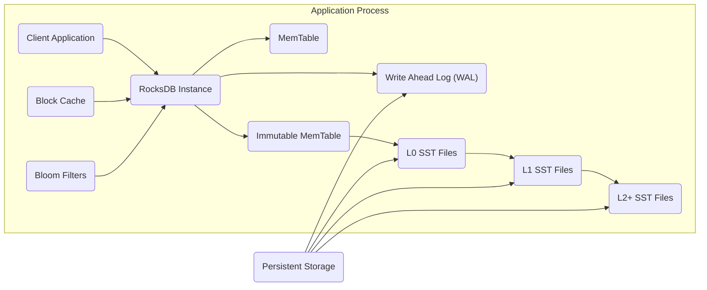
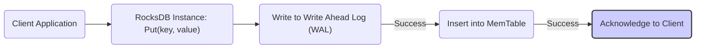
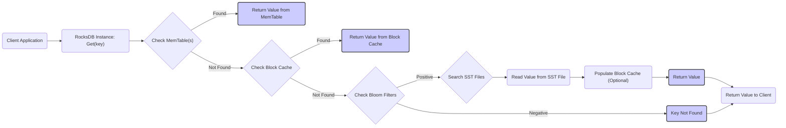
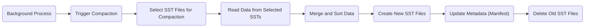

## Project Design Document: RocksDB

**1. Introduction**

This document provides a detailed design overview of the RocksDB embedded persistent key-value store. It aims to capture the essential architectural components, data flows, and interactions within the system. This document will serve as the foundation for subsequent threat modeling activities.

**2. Goals**

* Provide a comprehensive description of the RocksDB architecture.
* Identify key components and their responsibilities with more detail.
* Illustrate the data flow during read and write operations with greater clarity.
* Outline important security considerations within the design, including potential vulnerabilities.
* Serve as a basis for identifying potential threats and vulnerabilities.

**3. Non-Goals**

* Provide a line-by-line code explanation.
* Detail every configuration option.
* Include performance benchmarking data.
* Cover specific use cases or integrations.

**4. High-Level Architecture**

RocksDB is designed as an embedded database, meaning it runs within the application's process. It utilizes a Log-Structured Merge-Tree (LSM-Tree) architecture to optimize for write performance.

**5. Component Breakdown**

* **Client Application:** The external application that embeds and interacts with the RocksDB library. This application initiates read and write requests.
* **RocksDB Instance:** The core engine providing the key-value store functionality. It manages all internal components, including memory management, concurrency control, and interaction with persistent storage.
* **MemTable:** An in-memory data structure (typically a skip list or hash table) where recent write operations are buffered. This provides low-latency writes. Multiple MemTables can exist concurrently during the flushing process.
* **Write Ahead Log (WAL):** A persistent, sequential log of all write operations before they are applied to the MemTable. This ensures durability and atomicity of write operations in case of system crashes. The WAL is typically stored on persistent storage.
* **Immutable MemTable:** When the active MemTable reaches a configured size limit, it becomes immutable. A new MemTable is created to handle subsequent writes. The immutable MemTable is then scheduled for flushing to disk.
* **SST Files (Sorted Static Table):** On-disk files containing sorted key-value pairs. These files are immutable once created. RocksDB organizes SST files into levels (L0, L1, L2, etc.) to optimize read performance.
    * **L0 SST Files:** Created directly from flushing immutable MemTables. They may have overlapping key ranges and are generally smaller.
    * **L1+ SST Files:** Created by the compaction process, merging SST files from lower levels. They have non-overlapping key ranges within each level, making reads more efficient. Higher levels generally contain larger SST files.
* **Block Cache:** An in-memory cache for frequently accessed data blocks read from SST files. This significantly improves read performance by reducing disk I/O. The cache can be configured with different eviction policies.
* **Bloom Filters:** Probabilistic data structures associated with SST files. They are used to quickly determine if a key is *not* present in an SST file, avoiding unnecessary disk reads. False positives are possible, but false negatives are not.
* **Compaction:** A background process that merges and sorts SST files from different levels. This process optimizes read performance by reducing the number of files that need to be checked during a read operation and reclaims disk space by removing obsolete data.

**6. Data Flow**

**6.1. Write Operation**

* The client application initiates a write operation by calling the `Put(key, value)` method on the RocksDB instance.
* The write operation (key and value) is first atomically appended to the Write Ahead Log (WAL) to ensure durability. This write is typically synchronous.
* If the WAL write is successful, the key-value pair is inserted into the active MemTable.
* The RocksDB instance acknowledges the successful write to the client application.

**6.2. Read Operation**

* The client application initiates a read operation by calling the `Get(key)` method on the RocksDB instance.
* RocksDB first checks the active MemTable and any immutable MemTables that haven't been flushed to disk yet.
* If the key is not found in the MemTables, it checks the Block Cache for the corresponding data block.
* If not found in the Block Cache, RocksDB consults the Bloom filters associated with the SST files to quickly determine if the key might exist in a particular file.
* If the Bloom filter indicates a potential presence (positive result), RocksDB searches the relevant SST files on disk, starting from the lowest levels.
* The value is read from the SST file.
* Optionally, the retrieved data block is populated into the Block Cache for future access.
* The value is returned to the client application. If the Bloom filter indicates the key is not present (negative result), RocksDB can directly conclude the key is not found.

**6.3. Compaction Process**

* A background process within the RocksDB instance periodically triggers compaction based on configured policies (e.g., size thresholds, time intervals).
* The compaction process selects SST files from one or more levels based on the chosen compaction strategy.
* Data is read from the selected SST files.
* The data is merged and sorted to create new, larger SST files in the target level. Duplicate keys are resolved, and deleted keys are removed.
* Metadata, specifically the Manifest file, is updated to reflect the new SST file structure and the removal of the old files. The Manifest keeps track of all SST files and their levels.
* The old, compacted SST files are eventually deleted after the Manifest update is persisted.

**7. Security Considerations (Pre-Threat Modeling)**

* **Data at Rest Encryption:** RocksDB supports encrypting data stored in SST files using configurable encryption algorithms. This protects data confidentiality if the underlying storage is compromised. The encryption keys need to be managed securely by the embedding application.
    * **Potential Threats:** Key compromise, weak encryption algorithms, improper key management.
* **Data in Transit Encryption:** As an embedded database, "data in transit" primarily refers to data moving between the application and the RocksDB library within the same process. However, if the underlying storage is accessed over a network (e.g., network-attached storage), encryption for that communication is the responsibility of the storage layer and outside the direct control of RocksDB.
    * **Potential Threats:**  If storage is network-based and unencrypted, eavesdropping on network traffic.
* **Access Control:** RocksDB itself does not implement user authentication or authorization. Access control is entirely the responsibility of the embedding application. The application must ensure that only authorized processes and users can interact with the RocksDB instance and its underlying files. File system permissions are critical here.
    * **Potential Threats:** Unauthorized access to the database files, leading to data breaches or manipulation.
* **Write Ahead Log (WAL) Security:** The WAL contains sensitive data representing recent write operations. Protecting the integrity and confidentiality of the WAL is crucial for data durability and preventing replay attacks. Encryption of the WAL can be configured.
    * **Potential Threats:** WAL file corruption leading to data loss, unauthorized modification of the WAL to alter the database state, replay attacks if the WAL is compromised.
* **Configuration Security:** Improperly configured RocksDB instances can introduce vulnerabilities. For example, disabling the WAL can lead to data loss in case of crashes. Default configurations should be reviewed for security implications.
    * **Potential Threats:** Data loss due to misconfiguration, performance issues leading to denial of service.
* **Denial of Service (DoS):** Resource exhaustion attacks targeting memory, disk space, or CPU usage during compaction are potential threats. Large write bursts or inefficient queries could also lead to DoS.
    * **Potential Threats:**  Application unavailability due to RocksDB resource exhaustion.
* **Code Injection:** While less likely due to the nature of the RocksDB API, if user-provided data is used directly in RocksDB API calls without proper sanitization (e.g., in custom comparators or merge operators), it could potentially lead to code injection vulnerabilities.
    * **Potential Threats:** Arbitrary code execution within the application process.
* **Dependency Management:** Vulnerabilities in RocksDB's dependencies (e.g., compression libraries) could also pose a security risk. Regular updates and vulnerability scanning of dependencies are important.
    * **Potential Threats:** Exploitation of known vulnerabilities in dependent libraries.
* **Physical Security:** The physical security of the storage where RocksDB data files reside is crucial. Unauthorized physical access could lead to data theft or tampering.
    * **Potential Threats:** Data theft, data corruption, unauthorized access to sensitive information.
* **Trust Boundaries:** The primary trust boundary exists between the embedding application and the RocksDB library. The application trusts RocksDB to handle data correctly and securely. Another trust boundary exists between the application process and the underlying persistent storage.

**8. Deployment Considerations**

* **Embedded Library:** RocksDB is typically deployed as a library embedded within an application process. This means its security context is the same as the application.
* **File System Access:** RocksDB requires direct access to the file system for storing its data files (WAL, SST files, and the Manifest). Appropriate file system permissions are essential for security.
* **Resource Management:** The embedding application is responsible for managing the resources consumed by RocksDB (memory, disk space, CPU). Resource limits should be configured to prevent DoS.
* **Configuration Management:** Securely managing RocksDB configuration options is important to avoid introducing vulnerabilities.

**9. Future Considerations**

* **Enhanced Security Features:** Potential future enhancements could include built-in authentication/authorization mechanisms, more granular access control, or enhanced auditing capabilities within the RocksDB engine itself.
* **Auditing:** Implementing more comprehensive auditing capabilities to track operations performed on the database could improve security monitoring and incident response.
* **Key Rotation:**  Support for automatic key rotation for data-at-rest encryption would enhance security.

This document provides a more detailed and comprehensive understanding of the RocksDB architecture for threat modeling. The identified components, data flows, and security considerations, along with the potential threats, will be crucial for systematically identifying and mitigating vulnerabilities within systems using RocksDB.
