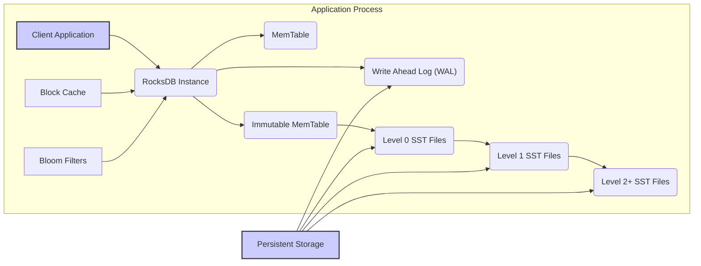
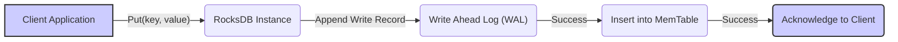
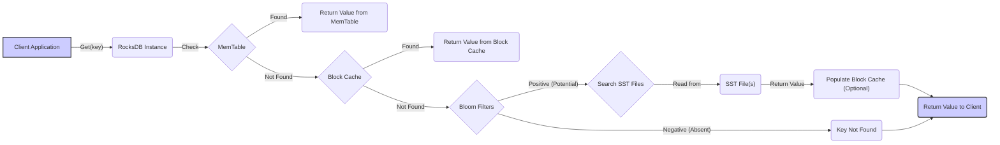
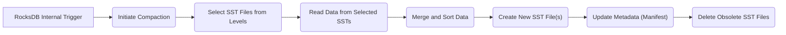

## Project Design Document: RocksDB (Improved for Threat Modeling)

**1. Introduction**

This document provides an enhanced design overview of the RocksDB embedded persistent key-value store, specifically tailored for security engineers and architects to perform thorough threat modeling. It details the essential architectural components, data flows, and interactions within the system, with a strong emphasis on security-relevant aspects. This document serves as the foundational artifact for identifying potential threats, vulnerabilities, and attack vectors.

**2. Goals**

* Clearly articulate the architecture of RocksDB, highlighting components relevant to security.
* Precisely define the boundaries and interactions between RocksDB and its environment.
* Illustrate the complete data lifecycle within RocksDB, from ingestion to persistence and retrieval.
* Explicitly identify potential security concerns and design choices that impact security.
* Provide a structured and detailed description suitable for systematic threat identification and analysis.

**3. Non-Goals**

* This document does not aim to be a comprehensive user manual or API reference.
* It will not delve into the intricacies of every internal algorithm or data structure unless directly relevant to security.
* Performance benchmarks and optimization strategies are outside the scope of this document.
* Specific integration details with particular applications are not covered.

**4. High-Level Architecture**

RocksDB operates as an embedded library within an application process. Its core is the Log-Structured Merge-Tree (LSM-Tree) architecture, optimized for high write throughput. Understanding the interactions between the application and RocksDB, as well as RocksDB's internal components and persistent storage, is crucial for security analysis.

* **Client Application:** The software that embeds and utilizes the RocksDB library. This is the primary point of interaction and potential attack entry.
* **RocksDB Instance:** The central engine managing all internal operations and data. Its security relies on the integrity of its components and configurations.
* **MemTable:** An in-memory buffer for recent writes, offering fast write performance but representing a volatile data store.
* **Write Ahead Log (WAL):** A durable, append-only log ensuring data persistence and recovery in case of failures. Its integrity is paramount for data durability.
* **Immutable MemTable:** A read-only version of the MemTable, staged for flushing to disk.
* **SST Files (Sorted Static Table):** On-disk files storing sorted key-value pairs, organized into levels. These are the persistent storage units, and their security depends on file system permissions and potential encryption.
    * **Level 0 SST Files:** Initially created from flushed immutable MemTables, potentially with overlapping key ranges.
    * **Level 1+ SST Files:** Result from compaction processes, with non-overlapping key ranges within each level.
* **Block Cache:** An in-memory cache for frequently accessed data blocks from SST files, improving read performance but potentially exposing data in memory.
* **Bloom Filters:** Probabilistic data structures associated with SST files, used to efficiently determine the absence of keys, reducing unnecessary disk I/O.

**5. Data Flow (Detailed for Security Analysis)**

Understanding how data moves through RocksDB is crucial for identifying potential interception or manipulation points.

**5.1. Write Operation Flow**

* The client application initiates a write operation using the `Put(key, value)` API.
* The RocksDB instance first appends a record of the write operation to the Write Ahead Log (WAL). This ensures durability: even if the system crashes before the data reaches the MemTable or SST files, the write can be replayed from the WAL. **Security Relevance:** The WAL's integrity is critical. Tampering with the WAL could lead to data loss or corruption.
* Upon successful write to the WAL, the key-value pair is inserted into the MemTable. **Security Relevance:** Data resides in memory at this stage, making it vulnerable to memory access attacks if the application process is compromised.
* The RocksDB instance acknowledges the successful write to the client application.

**5.2. Read Operation Flow**

* The client application requests data using the `Get(key)` API.
* RocksDB first checks the MemTable. **Security Relevance:** Data in the MemTable is in memory and subject to potential memory access vulnerabilities.
* If not found, it checks the Block Cache. **Security Relevance:** The Block Cache holds decrypted data (if encryption at rest is enabled), making it a potential target if the process memory is compromised.
* If not in the Block Cache, Bloom filters associated with SST files are consulted to quickly determine if the key might exist in specific SST files.
* If the Bloom filter suggests the key might be present, RocksDB searches the relevant SST files on disk. **Security Relevance:** Access to SST files is governed by file system permissions. Unauthorized access could lead to data breaches.
* The value is read from the SST file. If encryption at rest is enabled, the data is decrypted at this stage.
* Optionally, the retrieved data block is populated into the Block Cache.
* The value is returned to the client application.

**5.3. Compaction Process Flow**

* RocksDB internally triggers the compaction process based on configured policies.
* SST files from different levels are selected for merging. **Security Relevance:**  Compaction involves reading and writing data, making it a potential window for observation or manipulation if the process is compromised.
* Data is read from the selected SST files.
* The data is merged and sorted to create new, larger SST files. **Security Relevance:**  During merging, data is temporarily held in memory, which could be a vulnerability.
* New SST files are created. **Security Relevance:** The security attributes (permissions, encryption) of these new files must be correctly applied.
* Metadata (stored in the MANIFEST file) is updated to reflect the new SST file structure. **Security Relevance:** The integrity of the MANIFEST file is crucial for the correct functioning of RocksDB. Corruption or tampering can lead to data loss or inconsistency.
* The old, compacted SST files are deleted. **Security Relevance:** Secure deletion practices should be followed to prevent data remanence.

**6. Security Considerations and Potential Threats**

This section outlines key security considerations inherent in the RocksDB design and potential threats that need to be addressed.

* **Data at Rest Encryption:**
    * **Consideration:** RocksDB supports encrypting data stored in SST files.
    * **Threats:**
        * **Missing or Weak Encryption:** If encryption is not enabled or uses weak algorithms, data is vulnerable if the storage is compromised.
        * **Key Management Issues:** Improper storage or handling of encryption keys can lead to unauthorized decryption.
* **Data in Transit Security:**
    * **Consideration:**  As an embedded database, "in transit" primarily refers to data within the application process. However, if the underlying storage is network-attached, that communication needs protection.
    * **Threats:**
        * **Memory Access Attacks:** If the application process is compromised, attackers could potentially access decrypted data in memory (MemTable, Block Cache).
        * **Network Sniffing (for network storage):** If SST files are stored on a network share without encryption, data can be intercepted.
* **Access Control and Authorization:**
    * **Consideration:** RocksDB itself does not implement user authentication or authorization. This is the responsibility of the embedding application.
    * **Threats:**
        * **Unauthorized Access:** If the embedding application doesn't implement proper access controls, any process with access to the application can interact with RocksDB data.
        * **Privilege Escalation:** Vulnerabilities in the embedding application could allow attackers to gain elevated privileges and access RocksDB data.
* **Write Ahead Log (WAL) Security:**
    * **Consideration:** The WAL contains a record of all recent write operations.
    * **Threats:**
        * **WAL Tampering:** If an attacker can modify the WAL, they could potentially corrupt the database or replay old transactions.
        * **WAL Disclosure:** If the WAL is not properly protected, sensitive data could be exposed.
* **Configuration Security:**
    * **Consideration:** RocksDB has numerous configuration options that can impact security.
    * **Threats:**
        * **Insecure Defaults:** Using default configurations might leave the system vulnerable.
        * **Misconfiguration:** Incorrectly configuring options like disabling the WAL or using weak encryption can have severe security consequences.
* **Denial of Service (DoS):**
    * **Consideration:** RocksDB consumes system resources (memory, disk I/O, CPU).
    * **Threats:**
        * **Resource Exhaustion:** Attackers could flood RocksDB with write requests, exhausting resources and causing the application to become unavailable.
        * **Compaction Abuse:** Triggering excessive compaction operations could consume resources and impact performance.
* **Code Injection:**
    * **Consideration:** While less likely due to the nature of the API, improper handling of input could theoretically lead to issues.
    * **Threats:**
        * **Unsanitized Input:** If user-provided data is directly used in RocksDB API calls without proper validation, it could potentially lead to unexpected behavior or vulnerabilities.
* **Dependency Management:**
    * **Consideration:** RocksDB relies on other libraries.
    * **Threats:**
        * **Vulnerable Dependencies:** Security vulnerabilities in RocksDB's dependencies could be exploited.
* **Physical Security:**
    * **Consideration:** The physical storage where SST files and the WAL reside needs to be secured.
    * **Threats:**
        * **Data Theft:** Physical access to the storage media could allow attackers to copy or steal the database files.
        * **Data Destruction:** Physical damage to the storage media could lead to data loss.

**7. Deployment Considerations (Security Implications)**

The way RocksDB is deployed can significantly impact its security posture.

* **Embedded within Application:** This is the most common deployment model. Security relies heavily on the security of the embedding application process.
* **File System Permissions:** Proper file system permissions are crucial to restrict access to the WAL and SST files. Only the application process running RocksDB should have read and write access.
* **Network Attached Storage (NAS/SAN):** If RocksDB data is stored on network storage, ensure secure communication protocols (e.g., encryption) are used. Authentication and authorization for accessing the network storage are also critical.
* **Containerization:** When deployed in containers, ensure proper container security practices are followed, including limiting container privileges and securing the container image.

**8. Future Considerations (Security Enhancements)**

* **Built-in Authentication/Authorization:**  Exploring options for integrating authentication and authorization mechanisms directly within RocksDB could enhance security.
* **Auditing Capabilities:** Implementing auditing features to track data access and modifications would improve security monitoring and incident response.
* **Enhanced Encryption Options:**  Investigating more granular encryption options or integration with hardware security modules (HSMs) could provide stronger data protection.
* **Secure Defaults:**  Reviewing and hardening default configuration settings to minimize potential vulnerabilities.

This improved design document provides a more detailed and security-focused overview of RocksDB, making it a valuable resource for comprehensive threat modeling activities. By understanding the components, data flows, and potential threats, security engineers can effectively identify and mitigate risks associated with using RocksDB.