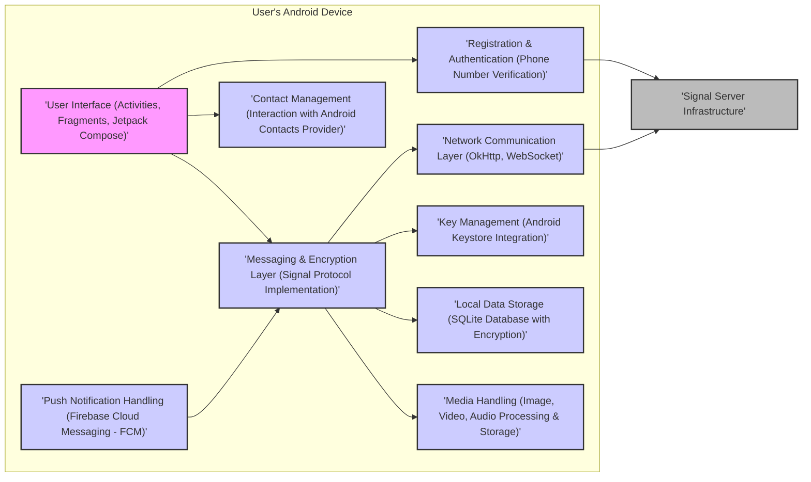

## Project Design Document: Signal Android Application (Improved)

**1. Project Overview**

This document details the architecture of the Signal Android application, a privacy-focused and open-source messaging platform. It aims to provide a clear understanding of the application's structure, components, and data pathways to facilitate effective threat modeling. This design is based on the publicly available source code of the Signal Android application.

**2. Goals and Objectives**

*   Present a comprehensive architectural overview of the Signal Android application.
*   Clearly define the roles and interactions of key application components.
*   Illustrate the flow of data during critical operations within the application.
*   Emphasize security-relevant design choices and mechanisms.
*   Serve as a foundational resource for identifying potential security threats and vulnerabilities.

**3. Target Audience**

*   Security engineers and analysts responsible for threat modeling the Signal Android application.
*   Software developers contributing to the Signal Android project or integrating with its ecosystem.
*   Technical individuals seeking an in-depth understanding of the application's internal workings.

**4. Scope**

This document focuses specifically on the design of the Signal Android application running on a user's device. It encompasses:

*   Major application components and their primary responsibilities.
*   Data flow during core functionalities like message sending and receiving.
*   Mechanisms for local data storage and management.
*   High-level interactions with the external Signal server infrastructure.
*   Key security features and their implementation within the application.

This document does *not* cover:

*   The detailed internal design and implementation of the Signal server infrastructure.
*   The intricate details of the Signal Protocol itself (though key security properties will be highlighted).
*   Implementation specifics of third-party libraries used by the application.
*   The design of other Signal clients (e.g., Signal Desktop, Signal iOS).

**5. High-Level Architecture**



**6. Detailed Component Design**

*   **User Interface (Activities, Fragments, Jetpack Compose):**
    *   Responsible for rendering the user interface and handling user interactions.
    *   Utilizes Android Activities, Fragments, and increasingly Jetpack Compose for UI development.
    *   Communicates with the Messaging & Encryption Layer to initiate actions and display data.
    *   Includes components for chat screens, contact lists, settings, and media viewers.

*   **Messaging & Encryption Layer (Signal Protocol Implementation):**
    *   The core logic for sending, receiving, encrypting, and decrypting messages.
    *   Implements the Signal Protocol, providing end-to-end encryption, forward secrecy, and future secrecy.
    *   Manages message queues, delivery receipts, and typing indicators.
    *   Interacts with the Key Management component for cryptographic operations.
    *   Utilizes the Network Communication Layer for sending and receiving data.

*   **Media Handling (Image, Video, Audio Processing & Storage):**
    *   Handles the capture, encoding, decoding, display, and storage of media attachments.
    *   May involve image compression, video transcoding, and audio encoding.
    *   Integrates with the Messaging & Encryption Layer for secure transmission of media.
    *   May utilize temporary storage before encryption and sending.

*   **Local Data Storage (SQLite Database with Encryption):**
    *   Persists application data locally using an SQLite database.
    *   Employs SQLCipher for encrypting the database at rest, protecting sensitive information stored on the device.
    *   Stores messages, contacts, conversation metadata, and cryptographic keys.

*   **Key Management (Android Keystore Integration):**
    *   Manages cryptographic keys, leveraging the Android Keystore system for secure storage of private keys.
    *   Generates identity keys, signed prekeys, and ephemeral keys used in the Signal Protocol.
    *   Handles key exchange mechanisms with other users.

*   **Push Notification Handling (Firebase Cloud Messaging - FCM):**
    *   Relies on Firebase Cloud Messaging (FCM) to receive push notifications from the Signal server, alerting users of new messages or calls.
    *   The content of push notifications is designed to minimize information leakage.
    *   Triggers message fetching from the server upon receiving a notification.

*   **Contact Management (Interaction with Android Contacts Provider):**
    *   Manages the user's contact list, optionally synchronizing with the Android Contacts Provider.
    *   Facilitates contact discovery and verification within the Signal network.
    *   Handles displaying contact information and associating contacts with Signal users.

*   **Registration & Authentication (Phone Number Verification):**
    *   Handles user registration with the Signal service, typically involving phone number verification via SMS.
    *   Authenticates users upon application launch, often using a local PIN or biometric authentication.
    *   Manages device linking and session management.

*   **Network Communication Layer (OkHttp, WebSocket):**
    *   Provides the underlying mechanism for communicating with the Signal server infrastructure.
    *   Utilizes the OkHttp library for standard HTTP requests and responses.
    *   Employs WebSocket for persistent, bidirectional communication channels, particularly for real-time messaging.
    *   Enforces TLS encryption for all network communication.

**7. Data Flow**

Simplified data flow for sending an encrypted text message:

```mermaid
graph LR
    subgraph "Sender's Device"
        A1["'User Interface'"]
        B1["'Messaging & Encryption Layer'"]
        E1["'Key Management'"]
        I1["'Network Communication Layer'"]
    end

    subgraph "Signal Server"
        S1["'Message Routing & Delivery'"]
    end

    subgraph "Recipient's Device"
        A2["'User Interface'"]
        B2["'Messaging & Encryption Layer'"]
        E2["'Key Management'"]
        I2["'Network Communication Layer'"]
        F2["'Push Notification Handling'"]
    end

    "A1" -- "Compose & Send Message" --> "B1"
    "B1" -- "Retrieve Recipient's Session Key" --> "E1"
    "B1" -- "Encrypt Message using Signal Protocol" --> "B1"
    "B1" -- "Send Encrypted Message" --> "I1"
    "I1" -- "Send to Server (TLS Encrypted)" --> "S1"
    "S1" -- "Route Message to Recipient" --> "I2"
    "I2" -- "Receive Encrypted Message (TLS Encrypted)" --> "B2"
    "F2" -- "Receive Push Notification (Triggered by Server)" --> "B2"
    "B2" -- "Retrieve Session Key" --> "E2"
    "B2" -- "Decrypt Message using Signal Protocol" --> "B2"
    "B2" -- "Display Message" --> "A2"

    style A1 fill:#f9f,stroke:#333,stroke-width:2px
    style B1 fill:#ccf,stroke:#333,stroke-width:2px
    style E1 fill:#ccf,stroke:#333,stroke-width:2px
    style I1 fill:#ccf,stroke:#333,stroke-width:2px
    style S1 fill:#bbb,stroke:#333,stroke-width:2px
    style A2 fill:#f9f,stroke:#333,stroke-width:2px
    style B2 fill:#ccf,stroke:#333,stroke-width:2px
    style E2 fill:#ccf,stroke:#333,stroke-width:2px
    style I2 fill:#ccf,stroke:#333,stroke-width:2px
    style F2 fill:#ccf,stroke:#333,stroke-width:2px
```

**8. Security Considerations**

*   **End-to-End Encryption (Signal Protocol):** Provides strong confidentiality and integrity of communication, ensuring only the intended recipients can decrypt messages.
*   **Forward Secrecy:** Compromise of long-term keys does not compromise past conversations due to the use of ephemeral session keys.
*   **Future Secrecy (Post-Compromise Security):** Compromise of current session keys does not compromise future conversations due to the continuous generation of new session keys.
*   **Local Data Encryption (SQLCipher):** Protects sensitive data stored on the device from unauthorized access if the device is compromised.
*   **Secure Key Storage (Android Keystore):** Leverages hardware-backed security features to protect private cryptographic keys from extraction.
*   **Push Notification Privacy:**  Minimizes the information contained within push notifications to reduce potential leakage.
*   **Contact Discovery Service:** Employs a privacy-preserving mechanism (cryptographic hashing) for discovering contacts who are also Signal users.
*   **Open Source and Auditable:** The open-source nature of the application allows for public scrutiny and independent security audits, enhancing trust and identifying potential vulnerabilities.
*   **Code Obfuscation and ProGuard:** While not a primary security feature, code obfuscation can make reverse engineering more difficult.

**9. Deployment Model**

The Signal Android application is primarily distributed through:

*   **Google Play Store:** The official and most common distribution channel for Android applications.
*   **Signal Website (Direct APK Download):** Provides an alternative download method for users who cannot access the Play Store.
*   **F-Droid:** A repository for free and open-source Android software, offering another distribution option.

**10. Future Considerations**

*   Adoption of newer Android platform features and APIs.
*   Potential enhancements and updates to the Signal Protocol.
*   Ongoing improvements to media handling efficiency and security.
*   Continuous security audits and timely patching of identified vulnerabilities.
*   Exploration of new privacy-enhancing technologies.

This improved design document provides a more detailed and structured overview of the Signal Android application's architecture, emphasizing key security aspects relevant for threat modeling. The inclusion of specific technologies and the refined data flow diagram should further aid in identifying potential attack surfaces and vulnerabilities.