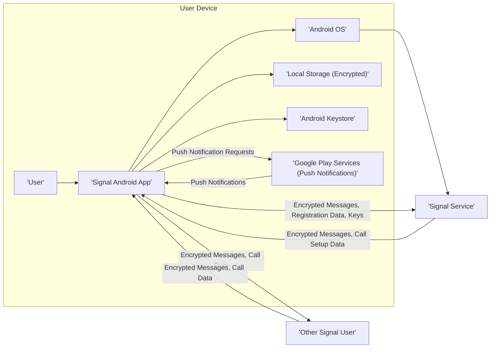
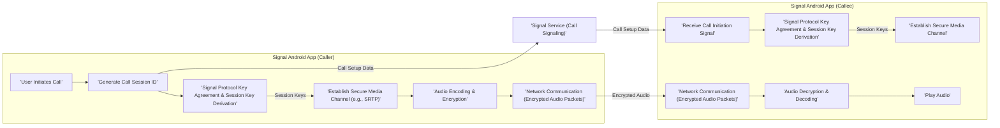

## Project Design Document: Signal Android Application (Improved)

**1. Introduction**

This document provides an enhanced architectural design of the Signal Android application, based on the publicly available codebase at [https://github.com/signalapp/signal-android](https://github.com/signalapp/signal-android). This improved document aims to provide a more detailed and nuanced understanding of the application's structure and functionality, specifically for the purpose of subsequent threat modeling activities. It elaborates on the key components, data flows, and interactions within the application, with a stronger emphasis on areas of potential security concern and attack surfaces. The target audience for this document includes security engineers, developers, penetration testers, and anyone involved in the security assessment of the Signal Android application.

**2. System Overview**

The Signal Android application facilitates secure and private communication through text messaging, voice calls, and video calls. It relies heavily on the Signal Protocol for end-to-end encryption, ensuring that only the communicating parties can access the content of their conversations. The application interacts with the Signal Service, the backend infrastructure, for essential functions such as user registration, cryptographic key exchange, message routing, and presence information.

**3. Key Components**

This section provides a more detailed breakdown of the major components within the Signal Android application, highlighting their specific responsibilities and security implications.

*   **User Interface (UI) Layer:**
    *   Presents the application's functionality to the user and captures user input.
    *   Composed of Android Activities, Fragments, and custom Views, often implemented using Kotlin and Jetpack Compose.
    *   Handles user interactions for composing and sending messages, initiating and managing calls, and configuring application settings.
    *   Displays received messages, call notifications, contact information, and other relevant data.
    *   Security Implications: Potential for UI redressing attacks, information leakage through poorly managed UI state, and vulnerabilities in custom view implementations.
*   **Message Management Subsystem:**
    *   Core component responsible for the lifecycle of messages within the application.
    *   Includes modules for message composition, encryption using the Signal Protocol, storage in the local database, and display.
    *   Manages various message types, including text, media, and disappearing messages.
    *   Handles message drafts, editing, deletion, and synchronization across linked devices.
    *   Security Implications: Critical for ensuring the confidentiality and integrity of messages. Vulnerabilities here could lead to message interception, manipulation, or unauthorized access.
*   **Call Management Subsystem:**
    *   Manages the initiation, establishment, and termination of secure voice and video calls.
    *   Leverages the Signal Protocol for end-to-end encryption of call media streams.
    *   Handles session negotiation, media encoding/decoding, and network transport for calls.
    *   Integrates with the operating system for audio and video input/output.
    *   Security Implications:  Ensuring the privacy of call content and metadata. Vulnerabilities could expose call audio/video or allow unauthorized call interception.
*   **Contact Management Subsystem:**
    *   Manages the user's contact list and their association with Signal users.
    *   Allows users to add, remove, and block contacts.
    *   Optionally integrates with the device's contact list, requiring user permission.
    *   Handles contact discovery (e.g., through phone number lookup) and verification (e.g., safety number verification).
    *   Security Implications: Potential for privacy leaks related to contact information. Securely managing contact verification is crucial to prevent man-in-the-middle attacks.
*   **Key Management Subsystem:**
    *   Responsible for the generation, storage, and management of cryptographic keys used by the Signal Protocol.
    *   Utilizes the Android Keystore for secure storage of long-term private keys, providing hardware-backed security where available.
    *   Handles the complex key exchange mechanisms of the Signal Protocol to establish secure communication sessions.
    *   Manages session keys for ongoing message and call encryption.
    *   Security Implications:  The security of this component is paramount. Compromise of private keys would have severe consequences for user privacy.
*   **Network Communication Layer:**
    *   Handles all network communication between the Signal Android application and the Signal Service.
    *   Primarily uses secure WebSockets for real-time message delivery and other communication.
    *   Manages network connectivity, handles network errors, and implements retry mechanisms.
    *   May utilize HTTPS for certain API calls.
    *   Security Implications: Ensuring secure and authenticated communication with the Signal Service to prevent eavesdropping and tampering.
*   **Local Data Storage Layer:**
    *   Persists application data locally on the device, including message history, contact information, settings, and encrypted cryptographic material.
    *   Typically uses an SQLite database, encrypted using SQLCipher or similar encryption-at-rest mechanisms.
    *   Security Implications: Protecting sensitive data stored on the device from unauthorized access if the device is lost or compromised.
*   **Push Notification Handling Subsystem:**
    *   Receives and processes push notifications from the Signal Service via Google Play Services (Firebase Cloud Messaging).
    *   Alerts the user of new messages or calls when the application is in the background or closed.
    *   Push notification payloads are designed to be minimal and encrypted, revealing no message content.
    *   Security Implications: Potential for information leakage if push notification handling is not implemented securely. Reliance on Google Play Services introduces a dependency and potential attack vector.
*   **Media Handling Subsystem:**
    *   Manages the sending, receiving, and display of media files (images, videos, audio, files).
    *   Encrypts media files before transmission and decrypts them upon receipt, often using the Signal Protocol's attachment encryption.
    *   Manages local storage of media files, ensuring they are also encrypted at rest.
    *   Security Implications: Ensuring the confidentiality and integrity of media content. Vulnerabilities could lead to unauthorized access or manipulation of media.
*   **Background Services and Workers:**
    *   Performs tasks in the background, such as listening for incoming messages and calls, refreshing session keys, and synchronizing data.
    *   Utilizes Android's Service and WorkManager APIs for background task execution.
    *   Security Implications: Ensuring that background tasks are executed securely and do not introduce vulnerabilities or leak information.

**4. Data Flow Diagrams**

This section provides more detailed data flow diagrams for critical functionalities, highlighting security-relevant steps.

*   **Sending an Encrypted Text Message:**

```mermaid
graph LR
    subgraph "Signal Android App (Sender)"
        A["'User Input (Message Text)'"]
        B["'Message Composition & Metadata Generation'"]
        C["'Signal Protocol Session Lookup/Establishment'"]
        D["'Signal Protocol Encryption (PreKeys, Session Keys)'"]
        E["'Network Communication (Encrypted Payload)'"]
    end
    F["'Signal Service (Message Routing)'"]
    subgraph "Signal Android App (Receiver)"
        G["'Network Communication (Encrypted Payload)'"]
        H["'Signal Protocol Session Lookup'"]
        I["'Signal Protocol Decryption'"]
        J["'Message Display'"]
        K["'Local Storage (Encrypted Message)'"]
    end

    A --> B
    B --> C
    C --> D
    D -- "Encrypted Message Payload" --> E
    E -- "Encrypted Message Payload" --> F
    F -- "Encrypted Message Payload" --> G
    G --> H
    H --> I
    I --> J
    I --> K
```

*   **Receiving an Encrypted Text Message:** (Covered in the reverse flow of "Sending an Encrypted Text Message")

*   **Initiating an End-to-End Encrypted Voice Call:**

**5. Security Considerations**

This section provides a more comprehensive list of security considerations and potential threats relevant to the Signal Android application.

*   **Signal Protocol Vulnerabilities:**  Potential weaknesses in the implementation or cryptographic primitives of the Signal Protocol itself.
*   **Local Data Encryption Weaknesses:**  Insufficient encryption algorithms, weak key derivation, or vulnerabilities in the encryption implementation for local storage.
*   **Android Keystore Exploitation:**  Vulnerabilities that could allow extraction of private keys from the Android Keystore.
*   **Network Interception and Man-in-the-Middle Attacks:**  Attempts to intercept communication with the Signal Service or other users.
*   **Push Notification Security Issues:**  Compromise of the push notification infrastructure or vulnerabilities in how push notifications are handled, potentially leading to information leakage or denial of service.
*   **Code Injection Vulnerabilities:**  SQL injection, cross-site scripting (in web views, if any), or other injection flaws in the application code.
*   **Memory Corruption Vulnerabilities:**  Buffer overflows, use-after-free errors, or other memory safety issues that could lead to crashes or arbitrary code execution.
*   **Side-Channel Attacks:**  Exploiting information leaked through timing, power consumption, or other side channels.
*   **Third-Party Library Vulnerabilities:**  Security flaws in any third-party libraries integrated into the application.
*   **Permissions Overreach:**  The application requesting unnecessary permissions that could be abused.
*   **Insecure Data Handling:**  Improper handling of sensitive data in memory or during processing.
*   **Binary Patching and Reverse Engineering:**  The ease with which the application can be reverse engineered or modified.
*   **Denial of Service Attacks:**  Attempts to make the application or its services unavailable.
*   **Phishing and Social Engineering:**  Attacks targeting users to obtain their credentials or sensitive information.
*   **Supply Chain Attacks:**  Compromise of the development environment or build process.
*   **Key Compromise:**  Theft or compromise of user's private keys.
*   **Metadata Leakage:**  Unintentional exposure of metadata related to messages or calls.
*   **Device Compromise:**  If the user's device is compromised, the security of the Signal application is also at risk.

**6. Assumptions and Constraints**

*   It is assumed that the core cryptographic primitives used by the Signal Protocol are secure.
*   This design document primarily focuses on the client-side Android application.
*   The analysis assumes the user's device is running a reasonably up-to-date and secure version of the Android operating system with necessary security patches.
*   The document is based on the publicly available codebase and general knowledge of the application's functionality. Internal implementation details not exposed in the codebase are not covered in detail.
*   The subsequent threat modeling process will further refine and expand upon these initial security considerations and assumptions.

**7. Future Considerations**

*   Detailed security analysis of the Signal Protocol implementation within the Android application, including cryptographic operations and key management flows.
*   In-depth examination of the application's interaction with Android's security features, such as the Keystore, SELinux, and permission model.
*   Security assessment of any third-party integrations and their potential impact on the application's security posture.
*   Analysis of the application's resilience against various attack vectors identified in the threat modeling process.
*   Regular security audits and penetration testing to identify and address potential vulnerabilities.

This improved document provides a more comprehensive and detailed architectural overview of the Signal Android application, specifically tailored for effective threat modeling. The enhanced information on components, data flows, and security considerations will facilitate a more thorough and accurate assessment of potential security risks.