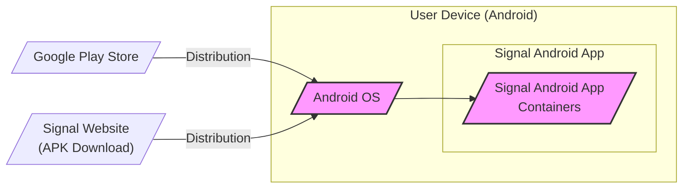

# BUSINESS POSTURE

Signal-Android project is part of the Signal ecosystem, which aims to provide private and secure communication for everyone. The primary business priority is to maintain and enhance user privacy and security while offering a reliable and user-friendly messaging platform.

Business goals include:
- Providing end-to-end encrypted messaging and calling.
- Ensuring user data privacy and minimizing data collection.
- Maintaining open-source and auditable codebase.
- Offering cross-platform compatibility.
- Growing user base and adoption.

Most important business risks to address:
- Data breaches and exposure of user communications.
- Loss of user trust due to security vulnerabilities.
- Regulatory compliance issues related to data privacy.
- Service disruptions affecting user communication.
- Reputational damage from security incidents.

# SECURITY POSTURE

Existing security controls:
- security control: End-to-end encryption for messages and calls (implemented within Signal protocol and application code).
- security control: Open-source codebase for public audit and scrutiny (GitHub repository).
- security control: Regular security audits by third-party firms (information available publicly).
- security control: Bug bounty program to incentivize vulnerability reporting (information available publicly).
- security control: Use of memory-safe languages and secure coding practices (inferred from project description and community discussions).
- security control: Application sandboxing provided by the Android operating system (OS level security feature).
- security control: Secure key management practices within the application (implemented within Signal protocol and application code).
- security control: Protection against metadata collection and minimization of stored data (design principle of Signal).

Accepted risks:
- accepted risk: Reliance on user device security posture, if device is compromised, application security can be bypassed.
- accepted risk: Potential vulnerabilities in third-party libraries used by the application.
- accepted risk: Risk of side-channel attacks on mobile devices.
- accepted risk: User account compromise due to weak passwords or phishing attacks outside of Signal application control.

Recommended security controls:
- security control: Implement automated security scanning tools (SAST/DAST) in the CI/CD pipeline.
- security control: Conduct regular penetration testing of the application and associated infrastructure.
- security control: Implement robust input validation and sanitization throughout the application.
- security control: Enhance monitoring and logging for security-relevant events within the application.
- security control: Implement rate limiting and anti-abuse mechanisms to protect against denial-of-service and spam.

Security requirements:
- Authentication:
    - security requirement: Secure registration and authentication process using phone numbers and optional PIN.
    - security requirement: Two-factor authentication consideration for enhanced account security (not currently primary authentication method).
    - security requirement: Protection against account takeover attacks.
- Authorization:
    - security requirement: Access control to user data and application features based on user identity and permissions.
    - security requirement: Secure session management to maintain user authentication state.
    - security requirement: Protection against unauthorized access to local data storage.
- Input validation:
    - security requirement: Validate all user inputs to prevent injection attacks (e.g., XSS, SQL injection - although less relevant for mobile app, still important for any backend interactions).
    - security requirement: Sanitize user inputs before processing and storage to prevent data corruption and security issues.
    - security requirement: Validate data received from external sources and APIs.
- Cryptography:
    - security requirement: Use strong and up-to-date cryptographic algorithms and libraries for encryption, hashing, and digital signatures (Signal Protocol).
    - security requirement: Secure key generation, storage, and management practices.
    - security requirement: Protection of cryptographic keys from unauthorized access and compromise.
    - security requirement: Implement TLS/SSL for all network communication to protect data in transit.

# DESIGN

## C4 CONTEXT

```mermaid
flowchart LR
    subgraph "Signal Ecosystem"
        C(["Signal Android App"])
    end
    A[/"User"/] -->|Uses| C
    C -->|Secure Messages, Calls| B[/"Signal Server"/]
    C -->|Push Notifications| D[/"Push Notification Services"/\n(e.g., Google FCM, Apple APNS)/]
    B -->|Message Delivery, Account Management| D
    C -->|Interactions| E[/"Other Signal Clients"/\n(iOS, Desktop)/]
    style C fill:#f9f,stroke:#333,stroke-width:2px
```

Context Diagram Elements:

- 1. Name: User
    - 2. Type: Person
    - 3. Description: Individuals who use the Signal Android application to send and receive secure messages and calls.
    - 4. Responsibilities: Initiating communication, managing their contacts, configuring application settings.
    - 5. Security controls: Strong device password/PIN, device security updates, responsible application usage.

- 1. Name: Signal Android App
    - 2. Type: Software System
    - 3. Description: The Signal application running on Android devices, providing end-to-end encrypted messaging and calling.
    - 4. Responsibilities: Encrypting and decrypting messages and calls, managing user interface, handling local data storage, communicating with Signal Server and push notification services.
    - 5. Security controls: Application sandboxing, secure coding practices, input validation, cryptography (Signal Protocol), secure key management, regular updates.

- 1. Name: Signal Server
    - 2. Type: Software System
    - 3. Description: Backend infrastructure that facilitates message routing, delivery, and account management for Signal users.
    - 4. Responsibilities: Message routing, delivery confirmation, user account management, key distribution (within Signal Protocol), relaying push notifications.
    - 5. Security controls: Server-side security hardening, access control, intrusion detection, secure logging, data minimization, TLS/SSL for communication.

- 1. Name: Push Notification Services (e.g., Google FCM, Apple APNS)
    - 2. Type: External System
    - 3. Description: Third-party services used to deliver push notifications to user devices when new messages or calls arrive while the application is in the background.
    - 4. Responsibilities: Reliable delivery of push notifications to Android devices.
    - 5. Security controls: Reliance on the security of third-party services, Signal minimizes data sent in push notifications, end-to-end encryption ensures message content remains private even if push notifications are intercepted.

- 1. Name: Other Signal Clients (iOS, Desktop)
    - 2. Type: Software System
    - 3. Description: Other official Signal applications available on different platforms (iOS, Desktop), allowing users to communicate securely across devices.
    - 4. Responsibilities: Providing cross-platform secure communication within the Signal ecosystem.
    - 5. Security controls: Platform-specific security controls, consistent application of Signal Protocol, secure synchronization mechanisms.

## C4 CONTAINER

```mermaid
flowchart LR
    subgraph "Signal Android App"
        direction TB
        A[/"User Interface"/\n(Android Activities,\nFragments, Views)/]
        B[/"Local Data Storage"/\n(SQLite Database,\nEncrypted File Storage)/]
        C[/"Signal Protocol Library"/\n(Java/Native Crypto\nImplementation)/]
        D[/"Network Communication"/\n(HTTP Client,\nWebSockets)/]
        E[/"Push Notification\nHandler"/\n(Firebase SDK)/]
        F[/"Background Services"/\n(Message Processing,\nSync, etc.)/]
        A --> B
        A --> D
        A --> E
        A --> F
        D --> C
        F --> C
        E --> F
        B --> C
    end
    style A fill:#f9f,stroke:#333,stroke-width:2px
    style B fill:#f9f,stroke:#333,stroke-width:2px
    style C fill:#f9f,stroke:#333,stroke-width:2px
    style D fill:#f9f,stroke:#333,stroke-width:2px
    style E fill:#f9f,stroke:#333,stroke-width:2px
    style F fill:#f9f,stroke:#333,stroke-width:2px
```

Container Diagram Elements:

- 1. Name: User Interface (Android Activities, Fragments, Views)
    - 2. Type: Container
    - 3. Description: Responsible for presenting the user interface, handling user interactions, and displaying information to the user. Built using Android UI framework components.
    - 4. Responsibilities: User input handling, data presentation, UI logic, navigation.
    - 5. Security controls: Input validation at UI level, protection against UI-based attacks (e.g., tapjacking), secure handling of sensitive data displayed on screen.

- 1. Name: Local Data Storage (SQLite Database, Encrypted File Storage)
    - 2. Type: Container
    - 3. Description: Persists user data locally on the Android device, including messages, contacts, settings, and keys. Data is stored encrypted at rest.
    - 4. Responsibilities: Local data persistence, data retrieval, data management, ensuring data integrity and confidentiality at rest.
    - 5. Security controls: Android's file system permissions, database encryption, application sandboxing, secure key storage for data encryption keys.

- 1. Name: Signal Protocol Library (Java/Native Crypto Implementation)
    - 2. Type: Container
    - 3. Description: Implements the core cryptographic functions of the Signal Protocol, including encryption, decryption, key exchange, and digital signatures. May include native components for performance-critical operations.
    - 4. Responsibilities: End-to-end encryption and decryption, secure key management, cryptographic operations.
    - 5. Security controls: Secure coding practices in crypto implementation, use of well-vetted cryptographic libraries, protection against side-channel attacks, regular security audits of crypto code.

- 1. Name: Network Communication (HTTP Client, WebSockets)
    - 2. Type: Container
    - 3. Description: Handles all network communication with the Signal Server and potentially other services. Uses secure protocols like HTTPS and WebSockets for communication.
    - 4. Responsibilities: Sending and receiving messages, establishing secure connections, handling network requests and responses.
    - 5. Security controls: TLS/SSL encryption for all network traffic, certificate pinning, protection against man-in-the-middle attacks, secure handling of network credentials.

- 1. Name: Push Notification Handler (Firebase SDK)
    - 2. Type: Container
    - 3. Description: Integrates with push notification services (like Firebase Cloud Messaging) to receive and handle push notifications for incoming messages and calls.
    - 4. Responsibilities: Receiving push notifications, waking up the application in background, triggering message retrieval.
    - 5. Security controls: Reliance on Firebase SDK security, minimal data in push notifications, end-to-end encryption protects message content even if push notifications are intercepted.

- 1. Name: Background Services (Message Processing, Sync, etc.)
    - 2. Type: Container
    - 3. Description: Runs background tasks such as message processing, synchronization with other devices, handling incoming messages, and maintaining connection to the Signal Server.
    - 4. Responsibilities: Background message processing, data synchronization, maintaining persistent connections, handling background tasks.
    - 5. Security controls: Secure inter-process communication within the application, protection against background task vulnerabilities, resource management to prevent denial-of-service.

## DEPLOYMENT

Deployment Architecture: User Device Deployment



Deployment Diagram Elements:

- 1. Name: Android OS
    - 2. Type: Infrastructure
    - 3. Description: The Android operating system running on user's mobile device. Provides the runtime environment and system-level security features for the Signal Android application.
    - 4. Responsibilities: Operating system functionalities, application sandboxing, resource management, security features (permissions, etc.).
    - 5. Security controls: OS security updates, kernel hardening, permission management, application sandboxing, device encryption.

- 1. Name: Signal Android App Containers
    - 2. Type: Container Instance
    - 3. Description: Represents the running instance of the Signal Android application and its containers (as described in the Container Diagram) deployed on the Android OS.
    - 4. Responsibilities: Executing application logic, providing secure messaging and calling functionality on the user device.
    - 5. Security controls: Application-level security controls (as described in Security Posture and Container Diagram), leveraging Android OS security features.

- 1. Name: Google Play Store
    - 2. Type: Distribution Channel
    - 3. Description: The primary distribution platform for Android applications, used to distribute and update the Signal Android application to users.
    - 4. Responsibilities: Application distribution, updates, malware scanning (Play Protect).
    - 5. Security controls: Google Play Protect malware scanning, developer account verification, application signing.

- 1. Name: Signal Website (APK Download)
    - 2. Type: Distribution Channel
    - 3. Description: Signal's official website provides a direct download link for the Signal Android application APK file, offering an alternative distribution method outside of the Google Play Store.
    - 4. Responsibilities: Alternative application distribution for users who cannot or prefer not to use the Play Store.
    - 5. Security controls: Code signing by Signal, HTTPS for download, users need to enable "Install from Unknown Sources" which introduces a security consideration for users.

## BUILD

```mermaid
flowchart LR
    A[/"Developer"/] --> B{{"Code Changes"}}
    B --> C[/"GitHub Repository"/\n(Source Code,\nBuild Scripts)/]
    C --> D[/"CI/CD System"/\n(GitHub Actions,\nJenkins)/]
    D -->|Build Process\n(Compilation,\nTesting,\nSecurity Scans)| E[/"Build Artifacts"/\n(APK File)/]
    E --> F[/"Code Signing Server"/\n(Private Key\nManagement)/]
    F -->|Signed APK| G[/"Distribution Channels"/\n(Google Play Store,\nSignal Website)/]
    style C fill:#f9f,stroke:#333,stroke-width:2px
    style D fill:#f9f,stroke:#333,stroke-width:2px
    style E fill:#f9f,stroke:#333,stroke-width:2px
    style F fill:#f9f,stroke:#333,stroke-width:2px
    style G fill:#f9f,stroke:#333,stroke-width:2px
```

Build Process Elements:

- 1. Name: Developer
    - 2. Type: Person
    - 3. Description: Software developers who write and modify the source code of the Signal Android application.
    - 4. Responsibilities: Code development, bug fixing, feature implementation, code reviews.
    - 5. Security controls: Secure development practices, code review process, access control to development environment.

- 1. Name: GitHub Repository (Source Code, Build Scripts)
    - 2. Type: Code Repository
    - 3. Description: Hosts the source code of the Signal Android application, including build scripts, configuration files, and other project assets.
    - 4. Responsibilities: Version control, source code management, collaboration platform for developers.
    - 5. Security controls: Access control to repository, branch protection, audit logging, vulnerability scanning of dependencies.

- 1. Name: CI/CD System (GitHub Actions, Jenkins)
    - 2. Type: Build Automation System
    - 3. Description: Automates the build, test, and deployment process for the Signal Android application. May use tools like GitHub Actions or Jenkins.
    - 4. Responsibilities: Automated build process, compilation, testing, static analysis, security scanning, artifact generation.
    - 5. Security controls: Secure build environment, access control to CI/CD system, automated security scans (SAST/DAST), dependency vulnerability checks, build process integrity.

- 1. Name: Build Artifacts (APK File)
    - 2. Type: Software Artifact
    - 3. Description: The compiled and packaged Android application (APK file) produced by the build process.
    - 4. Responsibilities: Deployable application package.
    - 5. Security controls: Integrity checks (checksums), code signing.

- 1. Name: Code Signing Server (Private Key Management)
    - 2. Type: Security Infrastructure
    - 3. Description: Securely manages the private key used to sign the Android application APK file. Code signing verifies the authenticity and integrity of the application.
    - 4. Responsibilities: Secure key storage, code signing process, ensuring only authorized builds are signed.
    - 5. Security controls: Hardware Security Module (HSM) for key storage, access control to signing server, audit logging of signing operations.

- 1. Name: Distribution Channels (Google Play Store, Signal Website)
    - 2. Type: Distribution Platform
    - 3. Description: Platforms used to distribute the signed APK file to end-users (Google Play Store, Signal Website).
    - 4. Responsibilities: Application distribution to users.
    - 5. Security controls: Platform-specific security controls (Play Store malware scanning), HTTPS for website distribution, code signing verification by user devices.

# RISK ASSESSMENT

Critical business process we are trying to protect:
- Secure and private communication for users.
- Maintaining user trust and privacy reputation.
- Ensuring availability and reliability of the Signal service.

Data we are trying to protect and their sensitivity:
- User messages and call content: Highly sensitive, personal communication, requires confidentiality and integrity.
- User contact lists: Sensitive, personal data, requires confidentiality and integrity.
- User profile information (phone number, settings): Sensitive, personal data, requires confidentiality and integrity.
- Metadata (message timestamps, sender/receiver information): Less sensitive than message content, but still privacy-relevant, requires minimization and protection against exposure.
- Cryptographic keys: Highly sensitive, critical for security, requires confidentiality, integrity, and availability.

# QUESTIONS & ASSUMPTIONS

Questions:
- What specific SAST/DAST tools are used in the CI/CD pipeline?
- What is the frequency of penetration testing and security audits?
- Are there specific incident response plans in place for security incidents related to the Android application?
- What are the details of the key management system used for code signing and application encryption keys?
- What specific third-party libraries are used and what is the process for managing their vulnerabilities?

Assumptions:
- Signal Android application follows secure software development lifecycle principles.
- Signal infrastructure includes robust security controls for backend services and data storage.
- Code signing process is securely implemented to ensure application integrity.
- Regular security updates are released to address identified vulnerabilities.
- User devices are assumed to have basic security measures in place (device lock, etc.).