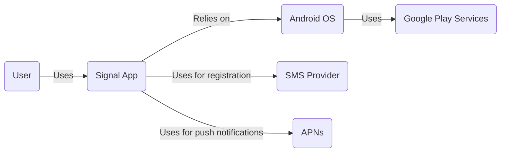
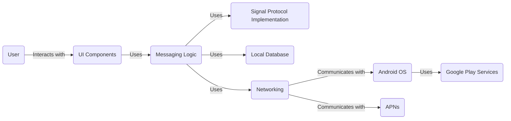
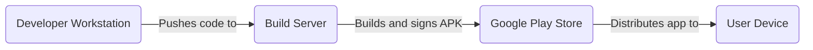
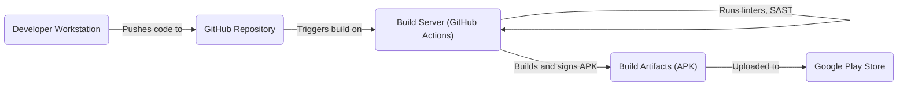

# BUSINESS POSTURE

Signal is an established open-source project with a strong emphasis on privacy and security. Its primary goal is to provide secure and private communication for its users. The project likely operates with a relatively conservative risk appetite due to the sensitivity of the data it handles (private communications).

Business Priorities:

*   Maintain user trust by ensuring the confidentiality, integrity, and availability of communications.
*   Provide a user-friendly and accessible messaging experience.
*   Continuously improve security and privacy features to stay ahead of evolving threats.
*   Maintain a transparent and open-source development process.

Business Goals:

*   Provide end-to-end encrypted messaging.
*   Minimize data collection and retention.
*   Protect user metadata.
*   Resist censorship and surveillance.

Most Important Business Risks:

*   Compromise of encryption keys or algorithms, leading to exposure of user communications.
*   Vulnerabilities in the application code that could be exploited to gain unauthorized access to user data or devices.
*   Server-side attacks that could compromise the integrity or availability of the service.
*   Reputational damage due to security breaches or privacy failures.
*   Legal and regulatory challenges related to encryption and data privacy.

# SECURITY POSTURE

Existing Security Controls (based on the GitHub repository and general knowledge of Signal):

*   security control: End-to-end encryption (Signal Protocol) for all communications. Described in Signal Protocol documentation.
*   security control: Open-source codebase, allowing for public scrutiny and security audits. Implemented in GitHub repository.
*   security control: Regular security updates and vulnerability patching. Implemented in release cycle.
*   security control: Use of secure development practices (though specifics would need to be confirmed from internal documentation). Implemented in development process.
*   security control: Limited data collection and retention. Described in privacy policy.
*   security control: Protection against metadata leakage (though specifics would need to be confirmed). Implemented in Signal Protocol and server design.
*   security control: Forward secrecy (messages are protected even if long-term keys are compromised). Implemented in Signal Protocol.
*   security control: Sealed Sender (reduces the amount of metadata exposed to the Signal service). Implemented in server and client design.

Accepted Risks:

*   accepted risk: Reliance on third-party operating systems (Android) and their security models.
*   accepted risk: Potential for vulnerabilities in third-party libraries and dependencies.
*   accepted risk: User error, such as weak passwords or compromised devices.

Recommended Security Controls:

*   Implement a robust bug bounty program to incentivize external security researchers.
*   Conduct regular penetration testing by independent security firms.
*   Implement certificate pinning to mitigate the risk of man-in-the-middle attacks.
*   Explore formal verification methods for critical parts of the codebase.
*   Enhance supply chain security measures to prevent malicious code injection during the build process.

Security Requirements:

*   Authentication:
    *   Users should be authenticated using strong, unique identifiers (e.g., phone numbers verified via SMS or a similar mechanism).
    *   Support for multi-factor authentication (e.g., using a PIN or biometric authentication) should be considered.
*   Authorization:
    *   Access to user data and communications should be strictly limited to authorized users and processes.
    *   The principle of least privilege should be applied throughout the application.
*   Input Validation:
    *   All user inputs should be validated to prevent injection attacks (e.g., SQL injection, cross-site scripting).
    *   Input validation should be performed on both the client-side and server-side (where applicable).
*   Cryptography:
    *   The Signal Protocol should be used for end-to-end encryption of all communications.
    *   Strong cryptographic algorithms and key lengths should be used.
    *   Cryptographic keys should be securely generated, stored, and managed.
    *   Regularly review and update cryptographic implementations to address new threats and vulnerabilities.

# DESIGN

## C4 CONTEXT

Element Descriptions:

*   Element:
    *   Name: User
    *   Type: Person
    *   Description: A person who uses Signal to communicate with other users.
    *   Responsibilities: Sending and receiving messages, managing contacts, configuring settings.
    *   Security controls: Strong password (if used), device security.
*   Element:
    *   Name: Signal App
    *   Type: Software System
    *   Description: The Signal Android application.
    *   Responsibilities: Providing end-to-end encrypted messaging, managing user accounts, handling push notifications.
    *   Security controls: End-to-end encryption, secure coding practices, regular security updates.
*   Element:
    *   Name: Android OS
    *   Type: Software System
    *   Description: The Android operating system.
    *   Responsibilities: Providing the underlying platform for the Signal app, managing device resources, handling system-level security.
    *   Security controls: Android security model, sandboxing, permission system.
*   Element:
    *   Name: Google Play Services
    *   Type: Software System
    *   Description: A set of services provided by Google for Android apps.
    *   Responsibilities: Providing various APIs and services, including push notifications (FCM).
    *   Security controls: Google's security measures for Play Services.
*   Element:
    *   Name: SMS Provider
    *   Type: External System
    *   Description: A telecommunications provider that delivers SMS messages.
    *   Responsibilities: Delivering SMS messages for phone number verification.
    *   Security controls: Standard telecommunications security practices.
*   Element:
    *   Name: APNs
    *   Type: External System
    *   Description: Apple Push Notification service.
    *   Responsibilities: Delivering push notifications.
    *   Security controls: Standard Apple security practices.

## C4 CONTAINER

Element Descriptions:

*   Element:
    *   Name: User
    *   Type: Person
    *   Description: A person who uses Signal to communicate with other users.
    *   Responsibilities: Sending and receiving messages, managing contacts, configuring settings.
    *   Security controls: Strong password (if used), device security.
*   Element:
    *   Name: UI Components
    *   Type: Container
    *   Description: The user interface components of the Signal app.
    *   Responsibilities: Displaying messages, contacts, and settings; handling user input.
    *   Security controls: Input validation, secure UI design.
*   Element:
    *   Name: Messaging Logic
    *   Type: Container
    *   Description: The core logic for handling messages and user interactions.
    *   Responsibilities: Managing message sending and receiving, handling user authentication, managing contacts.
    *   Security controls: Secure coding practices, access control.
*   Element:
    *   Name: Signal Protocol Implementation
    *   Type: Container
    *   Description: The implementation of the Signal Protocol for end-to-end encryption.
    *   Responsibilities: Encrypting and decrypting messages, managing cryptographic keys.
    *   Security controls: Secure key management, strong cryptography.
*   Element:
    *   Name: Local Database
    *   Type: Container
    *   Description: The local database for storing messages, contacts, and other data.
    *   Responsibilities: Storing data securely on the device.
    *   Security controls: Data encryption at rest, access control.
*   Element:
    *   Name: Networking
    *   Type: Container
    *   Description: The networking component for communicating with the Signal servers and other services.
    *   Responsibilities: Sending and receiving messages over the network, handling push notifications.
    *   Security controls: TLS/SSL, certificate pinning (recommended).
*   Element:
    *   Name: Android OS
    *   Type: Software System
    *   Description: The Android operating system.
    *   Responsibilities: Providing the underlying platform for the Signal app, managing device resources, handling system-level security.
    *   Security controls: Android security model, sandboxing, permission system.
*   Element:
    *   Name: Google Play Services
    *   Type: Software System
    *   Description: A set of services provided by Google for Android apps.
    *   Responsibilities: Providing various APIs and services, including push notifications (FCM).
    *   Security controls: Google's security measures for Play Services.
*   Element:
    *   Name: APNs
    *   Type: External System
    *   Description: Apple Push Notification service.
    *   Responsibilities: Delivering push notifications.
    *   Security controls: Standard Apple security practices.

## DEPLOYMENT

Possible Deployment Solutions:

1.  Standard Android deployment via Google Play Store.
2.  Direct APK download from Signal's website.
3.  Inclusion in alternative Android app stores (e.g., F-Droid).

Chosen Solution (Standard Android deployment via Google Play Store):

Element Descriptions:

*   Element:
    *   Name: Developer Workstation
    *   Type: Infrastructure Node
    *   Description: The developer's computer where code is written and tested.
    *   Responsibilities: Code development, testing, and committing changes.
    *   Security controls: Secure coding practices, access control, device security.
*   Element:
    *   Name: Build Server
    *   Type: Infrastructure Node
    *   Description: A server that builds the Signal Android application.
    *   Responsibilities: Building the APK, signing the APK, running automated tests.
    *   Security controls: Secure build environment, access control, code signing key protection.
*   Element:
    *   Name: Google Play Store
    *   Type: Infrastructure Node
    *   Description: Google's official app store for Android applications.
    *   Responsibilities: Distributing the Signal app to users, managing updates.
    *   Security controls: Google Play Store security measures.
*   Element:
    *   Name: User Device
    *   Type: Infrastructure Node
    *   Description: The user's Android device.
    *   Responsibilities: Running the Signal app, storing user data.
    *   Security controls: Device security, user authentication.

## BUILD

Build Process Description:

1.  Developers write code and commit changes to the GitHub repository.
2.  GitHub Actions (or a similar CI/CD system) is triggered by code pushes or pull requests.
3.  The build server checks out the code from the repository.
4.  Linters (e.g., Checkstyle, FindBugs) and static analysis security testing (SAST) tools are run to identify potential code quality and security issues.
5.  The application is built, producing an APK file.
6.  The APK is signed with a cryptographic key.
7.  The signed APK is uploaded to the Google Play Store for distribution.

Security Controls in Build Process:

*   security control: Code review: All code changes are reviewed by other developers before being merged. Implemented in GitHub pull request process.
*   security control: Static analysis: Linters and SAST tools are used to identify potential vulnerabilities. Implemented in GitHub Actions workflow.
*   security control: Code signing: The APK is signed with a cryptographic key to ensure its authenticity and integrity. Implemented in build process.
*   security control: Dependency analysis: Tools are used to identify and manage dependencies, including checking for known vulnerabilities. Implemented in build process.
*   security control: Secure build environment: The build server is secured to prevent unauthorized access and tampering. Implemented in build server configuration.

# RISK ASSESSMENT

Critical Business Processes:

*   Secure communication: Ensuring the confidentiality, integrity, and availability of user communications.
*   User authentication and authorization: Protecting user accounts and data from unauthorized access.
*   Data privacy: Minimizing data collection and retention, and protecting user metadata.

Data Sensitivity:

*   Message content: Highly sensitive (end-to-end encrypted).
*   Contact lists: Sensitive (contains personal information).
*   User metadata: Sensitive (can reveal communication patterns).
*   Phone numbers: Personally identifiable information (PII).

# QUESTIONS & ASSUMPTIONS

Questions:

*   What specific SAST and DAST tools are used in the build process?
*   What are the details of the key management process for code signing and encryption keys?
*   What are the specific procedures for handling security vulnerabilities and incidents?
*   What are the details of the server-side infrastructure and security controls?
*   Are there any specific compliance requirements (e.g., GDPR, CCPA) that need to be considered?
*   What is the process for managing and updating third-party dependencies?
*   What kind of penetration testing is performed and how often?
*   Is there a bug bounty program? If yes, what is the scope and reward structure?
*   What are the specific measures taken to protect against metadata leakage?
*   How is the local database encrypted?

Assumptions:

*   BUSINESS POSTURE: Signal prioritizes security and privacy above all else.
*   SECURITY POSTURE: Secure coding practices are followed throughout the development lifecycle.
*   DESIGN: The Signal Protocol is implemented correctly and securely. The Android security model is properly utilized. Google Play Services are used for push notifications.