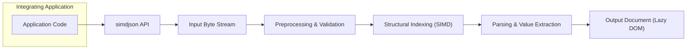
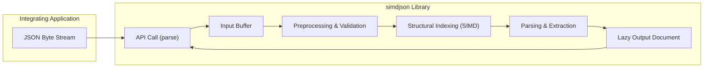

# Project Design Document: simdjson Library

**Version:** 1.1
**Date:** October 26, 2023
**Author:** AI Software Architect

## 1. Introduction

This document provides an enhanced design overview of the simdjson library, focusing on aspects relevant to security and threat modeling. It details the system architecture, data flow, key components, and security considerations. This document serves as the foundation for subsequent threat modeling activities.

## 2. Project Overview

simdjson is a high-performance, open-source JSON parsing library written in C++. It leverages Single Instruction, Multiple Data (SIMD) instructions and other advanced techniques to achieve significant speed improvements over traditional JSON parsers. The library prioritizes speed, correctness, and security in parsing JSON data.

## 3. Goals and Objectives

* **Extreme Performance:** Achieve state-of-the-art JSON parsing speed, minimizing latency.
* **Guaranteed Correctness:** Ensure accurate and reliable parsing of valid JSON documents according to the JSON specification (RFC 7159 and subsequent).
* **Robust Security:** Minimize potential vulnerabilities and protect against malicious or malformed input that could lead to crashes, information disclosure, or denial of service.
* **Developer Friendliness:** Provide a clear, well-documented, and intuitive API for developers integrating the library.
* **Cross-Platform Compatibility:** Support a wide range of operating systems and CPU architectures, while maintaining performance.

## 4. Target Audience

This document is intended for:

* Security engineers responsible for threat modeling, security assessments, and penetration testing of systems using simdjson.
* Software developers contributing to the simdjson library or integrating it into their applications.
* System architects needing a detailed understanding of simdjson's internal workings and security implications.

## 5. System Architecture

The simdjson library is designed as a self-contained, embeddable unit. Its core architecture centers around efficiently processing an input JSON byte stream and producing a structured representation of the data.

### 5.1. High-Level Architecture Diagram

### 5.2. Component Description

* **Integrating Application:** The external software application that utilizes the simdjson library to parse JSON data. This application provides the input and consumes the output.
* **simdjson API:** The well-defined public interface provided by the library. This includes functions for parsing JSON from various sources (strings, files, buffers) and accessing the parsed data.
* **Input Byte Stream:** The raw sequence of bytes representing the JSON document to be parsed. This is typically provided by the integrating application.
* **Preprocessing & Validation:** This initial stage performs crucial checks and transformations on the input byte stream:
    * **UTF-8 Validation:** Ensures the input is valid UTF-8, preventing issues with character encoding.
    * **Whitespace Handling:**  Identifies and potentially skips whitespace characters as defined by the JSON specification.
    * **Initial Sanity Checks:** Performs basic checks for potential issues early in the process.
* **Structural Indexing (SIMD):** A core optimization where SIMD instructions are used to efficiently identify the structural elements of the JSON document (e.g., `{}`, `[]`, `:`, `,`). This creates a dense index of these structural tokens, significantly accelerating the parsing process. This stage operates on blocks of data in parallel.
* **Parsing & Value Extraction:** This stage uses the structural index to efficiently extract the values (strings, numbers, booleans, null) and build the internal representation of the JSON document. This involves:
    * **Key and Value Identification:**  Locating and extracting key-value pairs within objects.
    * **Data Type Conversion:** Converting string representations of numbers and booleans to their respective data types.
    * **String Processing:** Handling string escaping and potentially performing string validation.
* **Output Document (Lazy DOM):** The final parsed representation of the JSON data. simdjson often employs a "lazy" Document Object Model (DOM) approach, where data is parsed on demand as it is accessed, further improving performance and reducing memory usage.

## 6. Data Flow

The process of parsing JSON data using simdjson involves the following steps:

1. **Input Submission:** The integrating application provides a byte stream containing the JSON document to the simdjson API.
2. **Buffer Management:** simdjson manages the input byte stream, potentially copying it into an internal buffer for processing.
3. **Preprocessing and Validation:** The input undergoes preprocessing, including:
    * **UTF-8 Validation:**  Ensuring the byte stream represents valid UTF-8 encoded text. Invalid sequences will result in an error.
    * **Whitespace Stripping (Implicit):**  Whitespace is identified and skipped during structural indexing and parsing.
4. **Structural Indexing:**  SIMD instructions are applied to the input buffer to rapidly identify structural characters, creating an index of these elements. This index is a compact representation of the document's structure.
5. **Parsing and Value Extraction:** Using the structural index, the parsing stage iterates through the document, extracting values and building the internal representation. This involves:
    * **Navigating the Structural Index:**  Efficiently jumping between structural elements.
    * **Extracting String Literals:**  Identifying and potentially unescaping string values.
    * **Parsing Numbers:** Converting string representations of numbers to numerical types, with checks for overflow and underflow.
    * **Handling Booleans and Null:** Recognizing and representing these literal values.
6. **Output Generation:** The parsed JSON data is made available to the integrating application through the simdjson API, typically as a lazy DOM structure that allows for efficient traversal and querying of the data.

### 6.1. Data Flow Diagram

## 7. Security Considerations

Security is a paramount concern in simdjson's design. Key security considerations include:

* **Robust Input Validation:** Strict validation of the input byte stream is crucial to prevent vulnerabilities. This includes:
    * **Strict UTF-8 Validation:**  Rejecting invalid UTF-8 sequences to prevent encoding-related attacks.
    * **JSON Syntax Validation:**  Ensuring the input adheres to the JSON specification to prevent unexpected parsing behavior.
    * **Depth and Size Limits:**  Implementing limits on the nesting depth and overall size of the JSON document to mitigate potential denial-of-service attacks.
* **Memory Safety:** As a C++ library, careful memory management is essential. simdjson aims to prevent:
    * **Buffer Overflows:**  Ensuring that data written to buffers does not exceed their allocated size.
    * **Use-After-Free:**  Preventing access to memory that has already been deallocated.
    * **Double-Free:**  Avoiding attempts to deallocate the same memory region multiple times.
* **Denial of Service (DoS) Prevention:**  Protecting against malicious inputs designed to consume excessive resources:
    * **Large String Handling:**  Implementing strategies to handle extremely large string values without excessive memory allocation or processing time.
    * **Deeply Nested Structures:**  Limiting the recursion depth or using iterative approaches to prevent stack overflow errors when parsing deeply nested JSON.
    * **Pathological Inputs:**  Guarding against specific input patterns that could trigger inefficient parsing behavior.
* **Integer Overflow/Underflow:** When parsing numerical values, checks are necessary to prevent integer overflow or underflow, which could lead to incorrect data interpretation or vulnerabilities in consuming applications.
* **Protection Against Malicious Strings:**  Careful handling of string escaping and potentially validation to prevent injection attacks if the parsed data is used in further processing (though simdjson primarily focuses on parsing).
* **Dependency Management:**  Being mindful of the security of external dependencies and keeping them updated to patch any known vulnerabilities.

## 8. Dependencies

The simdjson library has the following key dependencies:

* **Standard C++ Library:**  Relies on standard C++ features and libraries for core functionality.
* **CPU Intrinsics (Optional):**  Utilizes CPU-specific instructions (SIMD) for performance optimization. The use of intrinsics may vary depending on the target architecture. This introduces architecture-specific code paths that need to be maintained and tested.
* **CMake:**  Uses CMake as its build system for managing the build process and dependencies. The security of the build system itself is a consideration.

## 9. Deployment

The simdjson library is typically deployed by:

* **Static or Dynamic Linking:** The simdjson library can be compiled and linked statically or dynamically into the integrating application. Static linking increases the application's size but avoids runtime dependency issues. Dynamic linking reduces the application's size but requires the simdjson library to be present at runtime.
* **Header Inclusion:** Developers integrate simdjson by including its header files in their C++ code.
* **Package Managers:**  simdjson is often available through package managers (e.g., vcpkg, Conan), simplifying integration for developers. The security of the package manager and the integrity of the downloaded package are considerations.
* **Source Code Inclusion:**  In some cases, the simdjson source code might be directly included in a project's build system.

Security considerations during deployment include ensuring the integrity of the simdjson library being used and protecting against tampering.

## 10. Future Considerations

* **Exploration of New SIMD Instructions:** Continuously evaluating and integrating new SIMD instructions and architectural features for further performance gains.
* **Enhanced Error Reporting:** Providing more detailed and context-rich error messages to aid debugging and security analysis.
* **Formal Security Audits:**  Conducting regular formal security audits and penetration testing by independent security experts to identify and address potential vulnerabilities.
* **Support for New JSON Standards:**  Adapting to and supporting any future revisions or extensions to the JSON specification.
* **Improved Documentation:**  Maintaining comprehensive and up-to-date documentation, including security best practices for using the library.

This enhanced document provides a more detailed and security-focused overview of the simdjson library's design. It serves as a valuable resource for understanding the system's architecture and will be instrumental in the subsequent threat modeling process.
