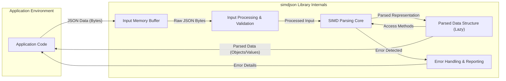

## Project Design Document: simdjson (Improved)

**1. Introduction**

This document provides an enhanced design overview of the `simdjson` project, a high-performance JSON parser library implemented in C++. It serves as the foundation for subsequent threat modeling activities by detailing the project's objectives, architecture, core components, data flow, and inherent security considerations.

**2. Goals and Objectives**

* **Primary Goal:** Achieve unparalleled speed in JSON parsing on standard hardware.
* **Key Objectives:**
    * **Extreme Performance:**  Maximize parsing throughput by exploiting Single Instruction, Multiple Data (SIMD) parallelism.
    * **Strict Correctness:**  Maintain full compliance with the JSON specification as defined by RFC 7159 and subsequent revisions.
    * **Robust Security:**  Minimize the attack surface and prevent vulnerabilities arising from processing untrusted JSON input.
    * **Usability:** Offer a relatively simple and intuitive Application Programming Interface (API) for seamless integration into diverse software projects.
    * **Cross-Platform Compatibility:**  Ensure broad compatibility across various operating systems and CPU architectures supporting relevant SIMD instruction sets.

**3. Architecture Overview**

`simdjson` is fundamentally a C++ library designed for efficient transformation of raw JSON text into structured data. Its architecture is conceptually layered:

* **Input Handling Layer:** Responsible for receiving and preparing the JSON data for processing.
* **Core Parsing Engine (SIMD-Optimized):** The central component performing the primary parsing logic using SIMD instructions.
* **Output Representation Layer:** Constructs the parsed JSON data in a usable format (e.g., a document tree or an event stream).
* **Error Management Layer:** Detects, handles, and reports errors encountered during the parsing process.
* **Language Bindings (Optional):** Enables access to `simdjson` functionality from other programming languages.
* **Build and Configuration System:** Manages the compilation and configuration of the library.

**4. Component Details**

* **Input Handling Layer:**
    * **Memory Buffers:** Accepts JSON data as a contiguous block of memory, typically represented by `std::string_view`, `absl::Span`, or raw memory pointers.
    * **File Input (Indirect):**  Relies on the calling application to load JSON data from files into memory buffers. `simdjson` itself doesn't perform direct file I/O.
    * **Streaming (Limited Scope):** While primarily designed for complete documents, some features might support processing chunks of data, but full streaming isn't the core focus.

* **Core Parsing Engine (SIMD-Optimized):**
    * **Structural Character Identification:**  Rapidly locates structural characters (`{`, `}`, `[`, `]`, `:`, `,`) within the input using SIMD instructions for parallel comparison.
    * **Token Extraction:**  Efficiently identifies and extracts tokens such as string literals, numbers, and boolean values.
    * **Syntax Validation:**  Verifies the structural correctness of the JSON document according to the JSON grammar.
    * **Dispatch and Control Flow:** Manages the parsing process based on the identified structural elements and token types.
    * **SIMD Instruction Set Specialization:**  Utilizes specific SIMD instruction sets (e.g., AVX2, AVX-512, SSE4.2, ARM NEON) based on CPU capabilities, with optimized code paths for each.

* **Output Representation Layer:**
    * **Lazy Parsing and On-Demand Materialization:** The default mode is lazy parsing, where the full JSON structure isn't immediately built. Parts are parsed and materialized only when accessed.
    * **Document Object Model (DOM)-like Interface:** Provides methods to navigate and access elements within the parsed JSON, offering a tree-like view of the data.
    * **Event-Based Interface (Potentially):** May offer interfaces for processing the JSON as a stream of parsing events (e.g., start object, key, value), though this is not the primary focus.

* **Error Management Layer:**
    * **Detailed Error Codes:**  Employs specific error codes to indicate various parsing failures (e.g., `bad_json_scalar`, `unexpected_token`).
    * **Exception Handling (Configurable):**  Allows the application to choose whether errors should result in exceptions being thrown or if error codes should be checked explicitly.
    * **Error Location Information:** Provides mechanisms to pinpoint the location (e.g., byte offset) of errors within the input JSON data.

* **Language Bindings:**
    * **Native C++ API:** The core functionality is exposed through a well-defined C++ API.
    * **Python Bindings (e.g., `pysimdjson`):** Enables Python programs to leverage `simdjson`'s performance.
    * **Java Bindings:** Facilitates integration with Java-based applications.
    * **Other Language Bindings:**  May include bindings for languages like Go, Rust, or others, depending on community contributions and project development.
    * **Foreign Function Interface (FFI) Layer:** Language bindings typically utilize FFI mechanisms to interact with the underlying C++ library.

* **Build and Configuration System:**
    * **CMake:**  The primary build system used for cross-platform compilation and configuration management.
    * **Compiler Requirements:**  Requires a C++ compiler with support for the targeted C++ standard and SIMD instruction sets.
    * **Configuration Options:**  Provides options to customize the build process, such as enabling or disabling specific SIMD instruction set support.

**5. Data Flow**

**Detailed Data Flow:**

1. **JSON Data Input:** The application provides the JSON data, typically as a byte array or a memory buffer, to the `simdjson` library.
2. **Input Buffering:** The `Input Memory Buffer` component receives and holds the raw JSON data in memory.
3. **Input Processing & Validation:** This stage performs initial processing on the input buffer, which might include basic validation checks and preparation for the parsing core.
4. **SIMD Parsing Core:** The core parsing engine, heavily leveraging SIMD instructions, analyzes the processed input to identify JSON structures, tokens, and values in parallel.
5. **Parsed Data Structure (Lazy):** The parsed information is used to build an internal representation of the JSON document. This is often done lazily, meaning parts of the structure are only created when they are accessed.
6. **Error Handling & Reporting:** If any errors are encountered during the parsing process (e.g., invalid syntax), the `Error Handling & Reporting` component captures the error details, including the type of error and its location in the input.
7. **Data Access:** The application can access the parsed JSON data through the library's API. When accessing elements, the lazy parsing mechanism might trigger further parsing on demand.
8. **Error Reporting:** If an error occurred, the application can retrieve detailed information about the error from the `Error Handling & Reporting` component.

**6. Security Considerations (Pre-Threat Modeling)**

This section outlines potential security vulnerabilities and attack vectors relevant to `simdjson`, forming the basis for detailed threat modeling.

* **Input Validation Vulnerabilities:**
    * **Malformed JSON Exploitation:**  Carefully crafted, syntactically invalid JSON could potentially trigger unexpected behavior, crashes, or resource exhaustion.
    * **Denial of Service via Large Documents:**  Parsing extremely large JSON documents could consume excessive memory and CPU resources, leading to denial of service.
    * **Stack Overflow from Deeply Nested Structures:**  JSON documents with excessive nesting of objects or arrays could exhaust the call stack, causing a crash.
    * **Integer Overflow/Underflow in Number Parsing:**  Parsing very large or very small numeric values could lead to integer overflow or underflow vulnerabilities if not handled correctly.
    * **Invalid UTF-8 Handling:** Incorrect handling of non-UTF-8 encoded input could lead to unexpected behavior or vulnerabilities.
* **Memory Safety Vulnerabilities (C++ Specific):**
    * **Buffer Overflows:**  Improper bounds checking during parsing could lead to buffer overflows, potentially allowing attackers to overwrite memory.
    * **Use-After-Free:**  Errors in memory management could result in use-after-free vulnerabilities, where freed memory is accessed.
    * **Double-Free:**  Incorrect memory management could lead to double-free vulnerabilities, causing crashes or potentially exploitable conditions.
* **Side-Channel Attack Potential:**
    * **Timing Attacks:**  Performance optimizations using SIMD might introduce observable timing differences based on the input data, potentially leaking information.
* **Denial of Service (Algorithmic Complexity):**
    * **Worst-Case Parsing Scenarios:**  Specific patterns in malicious JSON input could trigger worst-case performance in parsing algorithms, leading to resource exhaustion.
* **Language Binding Security:**
    * **FFI Vulnerabilities:**  Security flaws in the Foreign Function Interface layer could expose the underlying C++ library to vulnerabilities.
    * **Type Safety Issues:**  Incorrect handling of data types between the C++ core and the binding language could lead to vulnerabilities.
* **Supply Chain Risks:**
    * **Dependency Vulnerabilities:**  Vulnerabilities in the build system or external dependencies could compromise the security of `simdjson`.
* **Integer Handling Precision:**
    * **Loss of Precision:** Handling of very large integers might lead to loss of precision if not implemented carefully. This might not be a direct security vulnerability but could lead to incorrect data interpretation.

**7. Assumptions and Dependencies**

* **Primary Assumption:** Input JSON data is generally expected to be encoded in valid UTF-8.
* **Hardware Assumption:** The target hardware supports the SIMD instruction sets targeted by the build configuration for optimal performance.
* **Core Dependency:** Standard C++ Library (libc++ or libstdc++).
* **Build Dependency:** CMake (for build system management).
* **Compiler Dependency:** A modern C++ compiler with support for the required C++ standard and SIMD instruction sets.
* **Language Binding Dependencies:** Language-specific development tools and libraries (e.g., Python interpreter and development headers for Python bindings).

**8. Deployment Model**

`simdjson` is typically deployed as a dynamically or statically linked library integrated into other software applications.

* **Backend Services and APIs:**  Widely used in server-side applications and RESTful APIs for efficient JSON request and response processing.
* **Data Processing Pipelines:**  Integrated into data ingestion and processing pipelines for high-speed parsing of JSON data.
* **Command-Line Tools:**  Used as a core component in command-line utilities that manipulate or process JSON data.
* **Embedded Systems (with SIMD Support):**  Can be deployed on embedded systems where performance-critical JSON parsing is necessary and the hardware supports SIMD.
* **Web Browsers and Desktop Applications:**  Potentially used within web browsers or desktop applications for parsing JSON data received from web services or local files.

This improved design document provides a more comprehensive and detailed overview of the `simdjson` project, specifically tailored for effective threat modeling. It highlights key architectural components, data flow, and potential security considerations to facilitate a thorough security analysis.