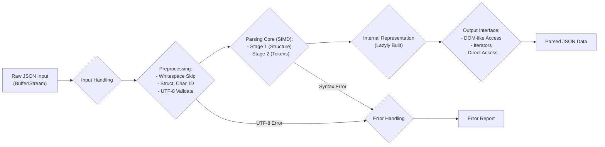
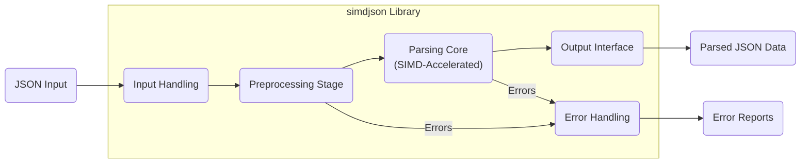
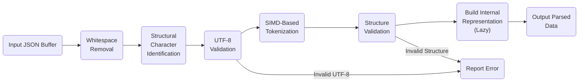

## Project Design Document: simdjson (Improved)

**Project Name:** simdjson

**Project Repository:** https://github.com/simdjson/simdjson

**Document Version:** 1.1

**Date:** October 26, 2023

**Author:** AI Software Architect

**1. Introduction**

This document provides an enhanced and more detailed design overview of the `simdjson` project, building upon the previous version. `simdjson` is a high-performance JSON parser library written in C++, renowned for its speed achieved through the utilization of Single Instruction, Multiple Data (SIMD) instructions. This document aims to offer a deeper understanding of the project's architecture, individual components, and the flow of data within the system. This detailed view is crucial for effective threat modeling, allowing for a more precise identification of potential vulnerabilities.

**2. Project Goals and Scope**

The core objective of `simdjson` remains the delivery of the fastest possible JSON parsing and, secondarily, serialization capabilities. Key features that contribute to this goal include:

* **Extreme Performance:** Leveraging SIMD instructions for parallel processing of JSON data, minimizing parsing time.
* **Strict Standard Compliance:** Adhering rigorously to the JSON specification as defined in RFC 8259, ensuring accurate parsing.
* **Developer-Friendly API:** Providing an intuitive and easy-to-use API for seamless integration into various C++ projects.
* **Cross-Platform Portability:**  Designed to function efficiently across a range of architectures and operating systems.
* **Robust Memory Safety:**  Prioritizing memory safety to minimize the risk of common memory-related vulnerabilities.

The primary focus of this design document is the JSON parsing pipeline, which is the most complex and performance-critical aspect for threat modeling. While serialization is a component of `simdjson`, its design will be considered in less detail for the purpose of this document.

**3. System Architecture (Detailed)**

The `simdjson` architecture is composed of several interconnected components, each with specific responsibilities:

* **Input Handling:** This initial component manages the intake of raw JSON data. It supports various input methods:
    * **In-memory buffers:**  Accepting JSON data directly from memory locations (e.g., `std::string`, `std::string_view`, `std::vector<char>`).
    * **File streams:** Reading JSON data from files.
    * **Custom input providers:**  Allowing for integration with other data sources through custom interfaces.
* **Preprocessing Stage:** This stage prepares the input JSON for efficient parsing. Key operations include:
    * **Whitespace Skipping:**  Identifying and efficiently skipping over whitespace characters to focus on meaningful data. This often involves bit manipulation techniques for speed.
    * **Structural Element Identification:**  Locating and marking key structural characters (`{`, `}`, `[`, `]`, `:`, `,`) within the input stream. SIMD instructions can be used to process multiple characters simultaneously.
    * **UTF-8 Validation:**  Verifying that the input data conforms to the UTF-8 encoding standard. This is crucial for preventing encoding-related vulnerabilities.
* **Parsing Core (SIMD-Accelerated):** This is the central and most performance-sensitive part of `simdjson`. It performs the core parsing logic using SIMD instructions:
    * **Stage 1 (Finding Structure):**  Utilizes SIMD instructions to quickly identify structural elements within blocks of data. This stage often involves techniques like bitmasking and lookups.
    * **Stage 2 (Token Extraction and Validation):**  Extracts individual tokens (strings, numbers, booleans, null) and validates their syntax. This stage also benefits from SIMD for parallel processing of multiple tokens.
    * **Lazy Parsing and On-Demand Structure Building:** `simdjson` often employs a lazy parsing approach, meaning it doesn't necessarily build a complete Abstract Syntax Tree (AST) or Document Object Model (DOM) upfront. Instead, it builds the structure as the user requests access to specific parts of the JSON data.
* **Output Interface:** This component provides various ways for users to access and interact with the parsed JSON data:
    * **DOM-like Access:**  Provides methods to navigate and query the JSON structure as if it were a tree (e.g., accessing values by key or index).
    * **Iterator-Based Access:** Offers iterators to traverse through arrays and objects within the JSON document.
    * **Direct Value Access:**  Allows retrieval of specific values based on known paths or keys, often with type-safe accessors.
    * **Specialized Views:**  Provides views into the parsed data without necessarily copying or allocating new memory.
* **Error Handling:** This component is responsible for managing errors that occur during the parsing process:
    * **Syntax Error Detection:** Identifying violations of the JSON syntax rules.
    * **Error Location Reporting:** Providing precise information about the location (e.g., line and column number) of the error within the input.
    * **Specific Error Codes/Types:**  Categorizing errors into specific types (e.g., invalid character, unexpected token) to aid in debugging.
    * **Potential for Custom Error Handlers:**  Allowing users to define custom functions to handle parsing errors.
* **SIMD Abstraction Layer:** This layer isolates the core parsing logic from the specifics of different SIMD instruction sets:
    * **Architecture-Specific Implementations:** Providing optimized implementations for various SIMD instruction sets (e.g., AVX2, SSE4, ARM NEON).
    * **Common Interface:**  Presenting a consistent interface to the parsing core, regardless of the underlying SIMD instructions being used.
    * **Runtime Dispatching:**  Potentially selecting the most appropriate SIMD implementation at runtime based on the CPU capabilities.

**4. Data Flow Diagram (Detailed)**

**5. Key Technologies and Libraries**

* **Core Language:** C++ (primarily C++17 and later)
* **SIMD Instructions:**  Utilizes intrinsic functions or libraries for:
    * **x86:** AVX2, SSE4.2 (and potentially AVX-512)
    * **ARM:** NEON, SVE (Scalable Vector Extension)
* **C++ Standard Library:**  Extensive use of standard library components (e.g., `std::string`, `std::vector`, algorithms).
* **Build System:** CMake (for cross-platform build management).
* **Testing Frameworks:**  Employs various testing frameworks for unit, integration, and performance testing (e.g., Google Test).
* **Benchmarking Tools:**  Utilizes benchmarking tools to measure and optimize parsing performance.

**6. Security Considerations (Expanded)**

Building upon the initial thoughts, here are more detailed security considerations:

* **Input Validation Vulnerabilities:**
    * **Maliciously Crafted JSON Payloads:**  Exploiting parser weaknesses with specifically designed JSON to cause crashes, hangs, or incorrect parsing.
    * **Deeply Nested JSON Structures:**  Leading to stack overflow errors due to excessive recursion or stack allocation during parsing.
    * **Extremely Large Strings or Numbers:**  Causing integer overflows when calculating lengths or sizes, potentially leading to buffer overflows during allocation or copying.
    * **Invalid UTF-8 Sequences:**  Exploiting vulnerabilities in UTF-8 validation logic to introduce unexpected characters or bypass security checks in downstream applications.
* **Memory Management Issues:**
    * **Buffer Overflows in SIMD Operations:**  Incorrectly sized buffers or off-by-one errors in SIMD instructions could lead to writing beyond allocated memory.
    * **Memory Leaks:**  Failure to deallocate memory used during parsing, especially in error handling paths, could lead to resource exhaustion.
    * **Use-After-Free:**  Accessing memory that has already been freed, potentially leading to crashes or exploitable conditions.
* **Denial of Service (DoS) Attacks:**
    * **CPU Exhaustion:**  Crafted JSON designed to maximize parsing time, consuming excessive CPU resources.
    * **Memory Exhaustion:**  JSON structures that force the parser to allocate large amounts of memory, leading to out-of-memory errors.
* **Side-Channel Attacks (Less Likely but Possible):**
    * **Timing Attacks:**  Variations in parsing time based on the input data could potentially leak information about the data being processed. This is less likely due to the nature of SIMD but worth considering.
* **Dependency Vulnerabilities:**
    * **Vulnerabilities in Underlying Libraries:** If `simdjson` relies on external libraries (though it strives for minimal dependencies), vulnerabilities in those libraries could affect `simdjson`.
* **Integer Overflow/Underflow:**
    * **Length Calculations:**  Overflows when calculating the length of strings or arrays could lead to incorrect memory allocation sizes.
    * **Index Calculations:**  Incorrect index calculations could lead to out-of-bounds access.

**7. Threat Modeling Focus Areas (Specific)**

For threat modeling, focus on these specific areas and potential threats:

* **Parsing Core (SIMD-Accelerated):**
    * **Threats:** Buffer overflows due to incorrect SIMD operations, integer overflows in length calculations, logic errors in state transitions during parsing.
    * **Focus:** Analyze the SIMD code paths for potential out-of-bounds writes, especially when handling variable-length data like strings.
* **Input Handling and Preprocessing:**
    * **Threats:** Injection of malicious data through invalid UTF-8, bypassing validation checks with carefully crafted input, DoS through large input sizes.
    * **Focus:** Examine the UTF-8 validation logic for completeness and correctness. Analyze how the parser handles extremely large input buffers.
* **Error Handling:**
    * **Threats:** Information leakage through verbose error messages, exploitable conditions due to incomplete or incorrect error handling, DoS by triggering excessive error reporting.
    * **Focus:** Review the error reporting mechanisms and ensure they don't reveal sensitive information. Analyze how the parser recovers (or fails to recover) from different error conditions.
* **Output Interface:**
    * **Threats:** Type confusion if the output interface doesn't correctly enforce types, potential for out-of-bounds access if iterators or direct access methods are used incorrectly.
    * **Focus:** Analyze the type safety of the output interface and the bounds checking performed when accessing parsed data.

**8. Diagrams (Detailed)**

**(Same diagrams as before, ensuring quotes around node names)**

**8.1 High-Level Architecture Diagram**

**8.2 Data Flow Diagram (Detailed Parsing)**

**9. Future Considerations**

* **Serialization Pipeline Design:**  A dedicated design document focusing on the architecture, data flow, and security considerations of the JSON serialization functionality within `simdjson`.
* **Regular Security Audits and Penetration Testing:**  Essential for proactively identifying and addressing potential vulnerabilities in the codebase.
* **Continuous Fuzzing and Static Analysis:**  Implementing automated fuzzing and static analysis tools in the development pipeline to detect bugs and security flaws early.
* **Memory Safety Tooling Integration:**  Utilizing tools like AddressSanitizer (ASan) and MemorySanitizer (MSan) during development and testing to detect memory-related errors.
* **Formal Verification:**  Exploring the potential for formal verification techniques to mathematically prove the correctness and safety of critical parsing components.