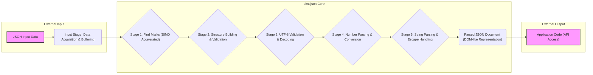

# Project Design Document: simdjson Library

**Project Name:** simdjson

**Project Repository:** [https://github.com/simdjson/simdjson](https://github.com/simdjson/simdjson)

**Document Version:** 1.1
**Date:** October 26, 2023
**Author:** Gemini (AI Expert in Software, Cloud and Cybersecurity Architecture)

## 1. Project Overview

### 1.1. Project Description

simdjson is a cutting-edge, high-performance JSON parser library meticulously crafted in C++.  It distinguishes itself by leveraging the power of Single Instruction Multiple Data (SIMD) instructions, enabling parsing speeds that dramatically outpace traditional JSON parsers.  Beyond speed, simdjson prioritizes correctness, strictly adhering to the JSON specification as defined by RFC 4627 and RFC 7159.  Its design philosophy centers around providing a seamless, drop-in replacement for existing JSON parsing solutions, particularly in performance-critical environments.  The library is engineered to be robust, secure, and exceptionally fast, making it ideal for applications where JSON processing is a significant bottleneck.

### 1.2. Project Goals

*   **Extreme Performance:**  To achieve unparalleled JSON parsing speed by maximizing the utilization of SIMD instructions and employing highly optimized algorithms. The goal is to be the fastest JSON parser available.
*   **Unwavering Correctness:**  To strictly and comprehensively adhere to the JSON specification (RFC 4627 and RFC 7159) ensuring 100% accurate parsing of all valid JSON documents.  This includes rigorous validation and error handling for invalid JSON.
*   **Effortless Usability:**  To provide a clean, intuitive, and user-friendly API that simplifies integration into existing C++ projects. The API should be well-documented and easy to learn.
*   **Broad Portability:**  To support a wide spectrum of platforms and architectures, including prevalent architectures like x86-64, ARM (including mobile and server variants), and potentially others where SIMD instruction sets are accessible.  This includes handling different endianness and compiler variations.
*   **Robust Security:**  To process JSON data with the highest level of security, proactively preventing common vulnerabilities such as buffer overflows, denial-of-service attacks, injection vulnerabilities, and other input-related security issues. Security is a paramount design consideration throughout the library.

### 1.3. Target Audience

*   Software developers and engineers who demand the absolute highest performance JSON parsing capabilities within their C++ applications.
*   Systems and applications where JSON data processing constitutes a significant performance bottleneck, impacting overall system responsiveness or throughput.
*   Applications dealing with massive volumes of JSON data, such as high-traffic web servers, real-time data analytics platforms, high-frequency trading systems, network appliances, and data ingestion pipelines.
*   Projects requiring low-latency JSON processing, such as game servers, embedded systems with real-time constraints, and high-performance networking applications.

## 2. Architecture Overview

### 2.1. High-Level Architecture Diagram

**Description:**

The simdjson architecture is meticulously designed as a pipelined process, optimizing for both speed and security. It can be conceptually divided into these key stages:

1.  **Input Stage: Data Acquisition & Buffering:** This stage is responsible for receiving the raw JSON data from various sources. It handles data acquisition, potentially from files, memory buffers, network streams, or other input mechanisms.  Crucially, it manages input buffering to optimize data flow into the parsing pipeline.  This stage is the first line of defense against potential input-related vulnerabilities.
2.  **simdjson Core (Parsing Stages):** This is the core parsing engine, composed of a series of pipelined stages, each heavily optimized for SIMD processing and designed for both speed and security:
    *   **Stage 1: Find Marks (SIMD Accelerated):** This initial stage is the performance powerhouse. It employs highly optimized SIMD instructions to rapidly scan the input JSON data, identifying key structural characters (marks) such as `{`, `}`, `[`, `]`, `:`, `,`, `"`, and escape characters (`\`).  This stage is critical for quickly locating the structural elements of the JSON document.  Careful SIMD implementation is essential to avoid potential vulnerabilities arising from incorrect SIMD logic.
    *   **Stage 2: Structure Building & Validation:**  This stage takes the marks identified in Stage 1 and constructs the structural hierarchy of the JSON document. It performs crucial syntax validation, ensuring the JSON is well-formed (e.g., balanced brackets, correct key-value pairs, valid JSON structure).  This stage helps to reject malformed JSON early in the process, preventing further processing of potentially malicious input.
    *   **Stage 3: UTF-8 Validation & Decoding:**  A critical security stage. This stage rigorously validates that all string content within the JSON document is correctly encoded in UTF-8.  Invalid UTF-8 sequences are detected and handled to prevent encoding-related vulnerabilities and ensure data integrity.  If necessary, UTF-8 decoding may also be performed in this stage.
    *   **Stage 4: Number Parsing & Conversion:**  This stage focuses on parsing numerical values embedded within the JSON. It converts string representations of numbers into appropriate numerical data types (integers, floating-point numbers).  Robust number parsing is essential to prevent vulnerabilities related to integer overflows, floating-point exceptions, or maliciously crafted number strings.
    *   **Stage 5: String Parsing & Escape Handling:**  This stage handles the parsing of string values within the JSON. It is responsible for correctly processing and interpreting escape sequences (e.g., `\n`, `\t`, `\uXXXX`) according to the JSON specification.  Proper escape handling is crucial to prevent injection vulnerabilities and ensure that strings are interpreted as intended.
3.  **Output Stage: API Access:**  The final stage delivers the parsed JSON document in a structured, readily accessible format.  simdjson typically provides a Document Object Model (DOM)-like API, allowing application code to easily navigate, query, and manipulate the parsed JSON data.  The API is designed to be safe and prevent unintended data corruption or security issues.

### 2.2. Component Diagram (Detailed Parsing Stages)

```mermaid
graph LR
    subgraph "Input Stage"
        IA["JSON Input Source (File, Buffer, Network)"] --> IB("Input Buffer Manager & Allocator");
    end
    subgraph "Stage 1: Find Marks (SIMD)"
        IB --> C1A("SIMD Mark Scanner (AVX2, SSE4.2, NEON)");
        C1A --> C1B("Mark Buffer (Mark Locations)");
    end
    subgraph "Stage 2: Structure Building & Validation"
        C1B --> C2A("Structural Validator & Syntax Checker");
        C2A --> C2B("Structural Metadata (Hierarchy)");
    end
    subgraph "Stage 3: UTF-8 Validation & Decoding"
        C2B --> C3A("UTF-8 Validator & Decoder");
        C3A --> C3B("Validation & Decoded String Results");
    end
    subgraph "Stage 4: Number Parsing & Conversion"
        C3B --> C4A("Number Parser (Integer & Floating-Point)");
        C4A --> C4B("Parsed Number Values");
    end
    subgraph "Stage 5: String Parsing & Escape Handling"
        C3B --> C5A("String Parser & Escape Decoder");
        C5A --> C5B("Parsed String Values");
    end
    subgraph "Output Stage"
        C2B --> OA("DOM Builder (Document Construction)");
        C4B --> OA;
        C5B --> OA;
        OA --> OB("Parsed JSON Document (DOM API)");
    end

    style IA fill:#ccf,stroke:#333,stroke-width:1px
    style IB fill:#ccf,stroke:#333,stroke-width:1px
    style C1A fill:#ccf,stroke:#333,stroke-width:1px
    style C1B fill:#ccf,stroke:#333,stroke-width:1px
    style C2A fill:#ccf,stroke:#333,stroke-width:1px
    style C2B fill:#ccf,stroke:#333,stroke-width:1px
    style C3A fill:#ccf,stroke:#333,stroke-width:1px
    style C3B fill:#ccf,stroke:#333,stroke-width:1px
    style C4A fill:#ccf,stroke:#333,stroke-width:1px
    style C4B fill:#ccf,stroke:#333,stroke-width:1px
    style C5A fill:#ccf,stroke:#333,stroke-width:1px
    style C5B fill:#ccf,stroke:#333,stroke-width:1px
    style OA fill:#ccf,stroke:#333,stroke-width:1px
    style OB fill:#ccf,stroke:#333,stroke-width:1px
```

**Component Descriptions:**

*   **Input Buffer Manager & Allocator ("IB"):**  This component is responsible for managing the input JSON data. It handles data acquisition from various sources (file I/O, memory buffers, network sockets, etc.). It also includes memory allocation and management for input buffers, potentially using custom allocators for performance optimization.  **Security Relevance:**  Proper buffer management is critical to prevent buffer overflows and memory exhaustion attacks.  Input validation might begin at this stage to reject excessively large inputs early.
*   **SIMD Mark Scanner ("C1A"):**  The core performance engine of simdjson. This component utilizes SIMD instruction sets (AVX2, SSE4.2, NEON, etc., depending on the target architecture) to perform parallel scanning of large blocks of input data. It efficiently identifies JSON structural characters (marks).  **Security Relevance:**  Correct SIMD implementation is crucial. Bugs in SIMD code could lead to incorrect parsing or even vulnerabilities.  The scanner must be robust against adversarial inputs designed to exploit potential weaknesses in SIMD logic.
*   **Mark Buffer ("C1B"):**  A temporary buffer that stores the locations (indices) of the structural characters identified by the "SIMD Mark Scanner". This buffer serves as input to the subsequent structure building stage.  **Security Relevance:**  The size and management of the mark buffer must be carefully considered to prevent buffer overflows.
*   **Structural Validator & Syntax Checker ("C2A"):**  This component analyzes the "Mark Buffer" to reconstruct the structural hierarchy of the JSON document. It performs rigorous validation of JSON syntax, ensuring well-formedness (balanced brackets, correct key-value pairs, valid JSON grammar).  **Security Relevance:**  This is a key stage for rejecting malformed or potentially malicious JSON inputs.  Robust syntax checking prevents further processing of invalid data, mitigating potential vulnerabilities that could arise from parsing incorrect JSON structures.  It should be resilient to various forms of syntax errors and adversarial attempts to bypass validation.
*   **Structural Metadata ("C2B"):**  Represents the extracted structural information of the JSON document. This includes the nesting of objects and arrays, boundaries of strings and numbers, and the overall hierarchical structure. This metadata is used by subsequent stages and the DOM builder.  **Security Relevance:**  The structural metadata must accurately represent the JSON structure. Errors in metadata generation could lead to incorrect parsing and potential vulnerabilities if downstream components rely on flawed structural information.
*   **UTF-8 Validator & Decoder ("C3A"):**  A critical security component. This module rigorously validates that string content within the JSON is correctly encoded in UTF-8. It detects and handles invalid UTF-8 byte sequences.  Optionally, it may also perform UTF-8 decoding if necessary for internal representation.  **Security Relevance:**  UTF-8 validation is paramount to prevent encoding-related vulnerabilities.  Failure to validate UTF-8 can lead to security issues in applications that process the parsed strings, including cross-site scripting (XSS) vulnerabilities if JSON data is used in web contexts.  It protects against malformed or maliciously crafted UTF-8 sequences that could exploit parsing logic.
*   **Validation & Decoded String Results ("C3B"):**  Stores the results of UTF-8 validation, indicating success or failure.  For valid strings, it may also store the decoded string representation.  Errors detected during validation are reported or handled appropriately.  **Security Relevance:**  Error reporting from the UTF-8 validator should be secure and not reveal sensitive information.  Error handling should prevent further processing of invalid strings.
*   **Number Parser ("C4A"):**  Responsible for parsing numerical values from the JSON input. It converts string representations of integers and floating-point numbers into their respective numerical data types.  **Security Relevance:**  Robust number parsing is essential to prevent vulnerabilities related to integer overflows, floating-point exceptions, or denial-of-service attacks caused by parsing extremely large or specially crafted numbers.  The parser should handle various number formats and edge cases securely.
*   **Parsed Number Values ("C4B"):**  Stores the parsed numerical values in their numerical data type representation.  **Security Relevance:**  The representation of parsed numbers should be chosen to prevent potential vulnerabilities like integer truncation or precision issues.
*   **String Parser & Escape Decoder ("C5A"):**  Parses string values from the JSON input, handling JSON escape sequences (e.g., `\n`, `\t`, `\uXXXX`). It decodes escape sequences to obtain the actual string content.  **Security Relevance:**  Correct and secure escape sequence handling is crucial to prevent injection vulnerabilities.  Improper handling of escape sequences could lead to misinterpretation of string content or allow attackers to inject malicious data.  The parser must be resilient to various escape sequence formats and potential attack vectors involving escape sequences.
*   **Parsed String Values ("C5B"):**  Stores the parsed string values after escape sequence decoding.  **Security Relevance:**  Parsed strings should be stored and handled securely to prevent unintended modifications or exposure of sensitive data.
*   **DOM Builder ("OA"):**  Constructs the final Document Object Model (DOM) representation of the parsed JSON document. It assembles the structural metadata, parsed numbers, and parsed strings into a hierarchical in-memory data structure that reflects the JSON document's structure.  **Security Relevance:**  The DOM builder must construct the DOM securely, preventing data corruption or vulnerabilities in the DOM structure itself.  Memory management during DOM construction is critical to avoid memory leaks or excessive memory consumption.
*   **Parsed JSON Document (DOM API) ("OB"):**  The final output of the parsing process. It provides an API for application code to access and query the parsed JSON data in a structured manner.  **Security Relevance:**  The DOM API should be designed to be secure and prevent API misuse that could lead to vulnerabilities.  API functions should be well-documented and designed to minimize the risk of errors or security flaws in applications using the library.

## 3. Data Flow

### 3.1. JSON Data Ingestion & Initial Validation

1.  **Input Source:** JSON data originates from an external source (e.g., file system, network socket, in-memory buffer, inter-process communication).
2.  **Input Buffer Acquisition:** The "Input Buffer Manager" acquires the JSON data from the source. This may involve reading data from a file, receiving data over a network connection, or accessing data from memory.
3.  **Initial Buffering & Allocation:** The "Input Buffer Manager" allocates and manages memory to buffer the incoming JSON data.  It may employ techniques like memory pooling or custom allocators for performance.
4.  **Preliminary Input Validation (Size Limits):**  As a first line of defense, the "Input Buffer Manager" may enforce limits on the size of the input JSON document to prevent denial-of-service attacks based on excessively large inputs.  This could involve rejecting documents exceeding a predefined size threshold.

### 3.2. Parsing Pipeline (Stage-by-Stage Processing)

1.  **Mark Scanning (Stage 1):**  The "Input Buffer Manager" provides chunks of the input data to the "SIMD Mark Scanner". This component, leveraging SIMD instructions, efficiently scans these chunks to identify JSON structural characters (marks).
2.  **Structure Building & Validation (Stage 2):** The "Structure Validator" receives the "Mark Buffer" from Stage 1. It analyzes the mark locations to reconstruct the JSON structure and performs comprehensive syntax validation to ensure the JSON is well-formed and conforms to the JSON specification.
3.  **UTF-8 Validation & Decoding (Stage 3):** The "UTF-8 Validator" processes string portions of the JSON data identified in Stage 2. It rigorously validates that these strings are correctly encoded in UTF-8. Invalid UTF-8 sequences are detected and handled.  Decoding of UTF-8 strings may also occur in this stage.
4.  **Number Parsing & Conversion (Stage 4):** The "Number Parser" extracts and parses numerical values from the JSON data. It converts string representations of numbers into appropriate numerical data types (integers, floating-point numbers), handling various number formats and potential edge cases.
5.  **String Parsing & Escape Handling (Stage 5):** The "String Parser" extracts and parses string values, handling JSON escape sequences. It decodes escape sequences to obtain the actual string content, ensuring correct interpretation of escaped characters.

### 3.3. Output Generation & API Access

1.  **DOM Construction:** The "DOM Builder" receives the structural metadata, parsed numbers, and parsed strings from the preceding parsing stages. It constructs an in-memory DOM representation of the JSON document, organizing the parsed data into a hierarchical structure.
2.  **DOM API Exposure:** The "Parsed JSON Document (DOM API)" component provides an API that application code can use to access and interact with the parsed JSON data. This API allows applications to navigate the DOM, query values, and process the parsed JSON content.

## 4. Technology Stack

*   **Core Programming Language:** C++ (Primarily modern C++, C++17 or later, to leverage features like move semantics, constexpr, etc. for performance and safety).
*   **SIMD Instruction Sets:**  Utilizes SIMD instruction sets for performance acceleration, including:
    *   AVX2 (Advanced Vector Extensions 2) - for high-performance x86-64 platforms.
    *   SSE4.2 (Streaming SIMD Extensions 4.2) - for broader x86-64 compatibility.
    *   ARM NEON - for ARM architectures (including mobile devices, embedded systems, and ARM servers).
    *   Potentially other SIMD instruction sets as needed for future architectures or performance optimization.
*   **Build System & Toolchain:**
    *   CMake (Cross-platform build system) - for managing the build process across different platforms and compilers.
    *   Modern C++ Compilers (e.g., GCC, Clang, MSVC) -  requiring compilers with good C++17 (or later) support and SIMD instruction set support.
*   **Testing Framework:**  Employs a robust C++ testing framework (e.g., Google Test, Catch2) for comprehensive unit testing, integration testing, and performance benchmarking.
*   **Memory Management:**  Primarily relies on standard C++ memory management practices (RAII, smart pointers, `new`, `delete`). Performance-critical sections may utilize custom allocators, memory pooling, or stack allocation to minimize dynamic memory allocation overhead.
*   **UTF-8 Handling:**  Leverages standard C++ string and character handling facilities, with specific, carefully implemented logic for robust and secure UTF-8 validation and processing.  May utilize platform-specific or optimized UTF-8 routines where available and beneficial.
*   **Compiler Requirements:** Requires a C++ compiler with strong C++17 (or later) support and support for the target SIMD instruction sets.  Specific compiler versions may be recommended for optimal performance and feature compatibility.

## 5. Security Considerations (Detailed)

This section provides a detailed examination of potential security considerations relevant to simdjson, forming a basis for comprehensive threat modeling.

### 5.1. Input Validation and Sanitization Vulnerabilities

*   **Malformed JSON Input:**
    *   **Threat:**  Processing syntactically invalid or malformed JSON input could lead to parser errors, crashes, unexpected behavior, or even exploitable vulnerabilities if error handling is insufficient.  Specifically crafted malformed JSON could trigger edge cases in the parsing logic.
    *   **Examples:** Unbalanced brackets (`{`, `[`), missing commas or colons, invalid data types, incorrect string formatting, trailing commas (depending on strictness).
    *   **Mitigation:**  Rigorous syntax validation in Stage 2 ("Structure Building & Validation") is crucial.  The parser must strictly adhere to the JSON specification and reject any input that deviates from it.  Robust error handling should prevent crashes and provide informative error messages without revealing sensitive information.
*   **Extremely Large JSON Documents:**
    *   **Threat:**  Processing excessively large JSON documents can lead to denial-of-service (DoS) attacks through memory exhaustion or excessive CPU consumption.  An attacker could provide a massive JSON file to overwhelm the parser's resources.
    *   **Examples:** JSON documents exceeding available memory, deeply nested structures consuming stack space, extremely long strings or arrays.
    *   **Mitigation:**  Implement input size limits in the "Input Buffer Manager" (Section 3.1).  Consider resource limits (memory and CPU time) during parsing.  Employ techniques like streaming parsing if possible to avoid loading the entire document into memory at once (though simdjson is primarily in-memory).
*   **Deeply Nested JSON Structures:**
    *   **Threat:**  Excessive nesting of objects and arrays can lead to stack overflows (if using recursive parsing techniques, which simdjson avoids) or performance degradation due to increased processing complexity.
    *   **Examples:**  JSON with hundreds or thousands of nested levels of objects or arrays.
    *   **Mitigation:**  simdjson's non-recursive, iterative approach mitigates stack overflow risks.  However, performance testing with deeply nested JSON is still important.  Consider imposing limits on nesting depth if necessary.
*   **Invalid UTF-8 Encoding in Strings:**
    *   **Threat:**  Failure to properly validate UTF-8 encoding in JSON strings can lead to various vulnerabilities, including:
        *   **Cross-Site Scripting (XSS):** If parsed JSON strings are used in web contexts without proper output encoding, invalid UTF-8 could be exploited to inject malicious scripts.
        *   **Data Corruption:**  Incorrect handling of invalid UTF-8 can lead to data corruption or misinterpretation of string content.
        *   **Security Bypass:**  In some cases, invalid UTF-8 sequences might be used to bypass security checks or filters that rely on UTF-8 validation.
    *   **Examples:**  Strings containing invalid UTF-8 byte sequences, overlong UTF-8 sequences, or surrogate characters used incorrectly.
    *   **Mitigation:**  Rigorous UTF-8 validation in Stage 3 ("UTF-8 Validation & Decoding") is paramount.  The "UTF-8 Validator" must strictly adhere to UTF-8 standards and reject or sanitize invalid sequences.  Consider using well-tested and robust UTF-8 validation libraries or algorithms.
*   **Number Parsing Vulnerabilities (Integer Overflows, Floating-Point Issues):**
    *   **Threat:**  Parsing extremely large or specially crafted numbers can lead to integer overflows, floating-point exceptions, or incorrect numerical results.  Attackers could exploit these issues to cause crashes, incorrect calculations, or unexpected behavior.
    *   **Examples:**  Extremely large integers exceeding the maximum representable integer value, numbers with excessive decimal places, numbers in exponential notation that could cause overflows.
    *   **Mitigation:**  Implement robust number parsing logic in Stage 4 ("Number Parsing & Conversion").  Use data types that can handle the expected range of JSON numbers.  Implement checks for potential overflows and handle them gracefully (e.g., by rejecting numbers outside the representable range or using arbitrary-precision arithmetic if necessary).  Be aware of potential floating-point precision limitations and edge cases.
*   **String Escape Sequence Handling Vulnerabilities (Injection Attacks):**
    *   **Threat:**  Incorrect or insecure handling of JSON string escape sequences can lead to injection vulnerabilities. If parsed strings are used in security-sensitive contexts (e.g., constructing database queries, system commands, or URLs), attackers could inject malicious code or commands through carefully crafted escape sequences.
    *   **Examples:**  Improperly handling escape sequences like `\n`, `\r`, `\t`, `\"`, `\\`, or Unicode escapes (`\uXXXX`).  For instance, if a parsed string is used to construct an SQL query, an attacker might inject SQL code through a malicious escape sequence.
    *   **Mitigation:**  Implement secure and correct escape sequence decoding in Stage 5 ("String Parsing & Escape Handling").  Strictly adhere to the JSON specification for escape sequences.  If parsed strings are used in security-sensitive contexts, perform further input validation and sanitization specific to those contexts (e.g., parameterized queries for SQL, proper URL encoding).

### 5.2. Memory Safety Vulnerabilities

*   **Buffer Overflows:**
    *   **Threat:**  Buffer overflows are a classic vulnerability in C/C++.  In simdjson, buffer overflows could occur in various parsing stages, especially during:
        *   **Input Buffering:** If input buffers are not sized and managed correctly.
        *   **Mark Buffer Management:** If the "Mark Buffer" overflows.
        *   **String Parsing:**  If string parsing logic does not correctly handle string lengths and escape sequences, leading to writing beyond buffer boundaries.
        *   **Number Parsing:**  Less likely, but potential if number parsing logic is flawed.
        *   **DOM Construction:**  If DOM node allocation or data copying during DOM building is not carefully managed.
    *   **Mitigation:**  Employ careful memory management practices throughout the library.  Use bounds checking, safe string handling functions, and consider using memory-safe containers where appropriate.  Rigorous testing and code reviews are essential to identify and eliminate potential buffer overflows.  Fuzz testing is highly recommended to uncover buffer overflow vulnerabilities.
*   **Memory Leaks:**
    *   **Threat:**  Memory leaks occur when dynamically allocated memory is not properly freed.  In a long-running application using simdjson, memory leaks can lead to gradual memory exhaustion and eventually application crashes or instability.
    *   **Mitigation:**  Employ RAII (Resource Acquisition Is Initialization) principles and smart pointers to ensure automatic memory management.  Carefully track all dynamic memory allocations and ensure that corresponding deallocations occur in all code paths, including error handling paths.  Use memory leak detection tools during development and testing.
*   **Denial of Service (Memory Exhaustion):**
    *   **Threat:**  Maliciously crafted JSON documents could be designed to consume excessive memory, leading to denial-of-service (DoS) attacks.  This could be achieved through deeply nested structures, extremely long strings or arrays, or other techniques that force the parser to allocate large amounts of memory.
    *   **Mitigation:**  Implement memory limits and resource controls.  Set limits on input document size, nesting depth, string lengths, and array sizes.  Monitor memory usage during parsing and implement mechanisms to abort parsing if memory consumption exceeds acceptable thresholds.  Consider using memory allocators with built-in limits or resource accounting.

### 5.3. API Security

*   **API Misuse:**
    *   **Threat:**  If the simdjson API is complex or poorly documented, developers might misuse it in ways that introduce security vulnerabilities into their applications.  For example, incorrect error handling, improper data validation after parsing, or misuse of API functions could lead to security flaws.
    *   **Mitigation:**  Design a simple, intuitive, and easy-to-use API.  Provide clear and comprehensive API documentation with examples and best practices.  Offer secure coding guidelines for using the API.  Consider providing API usage examples that demonstrate secure patterns.
*   **Error Handling in API:**
    *   **Threat:**  Insufficient or insecure error handling in the API can lead to vulnerabilities.  If error messages are too verbose, they might reveal sensitive information.  If errors are not properly propagated or handled by the application, it could lead to unexpected behavior or security flaws.
    *   **Mitigation:**  Design the API to provide clear and informative error codes or exceptions when parsing fails.  Error messages should be concise and avoid revealing sensitive information about the parsing process or internal data.  Provide guidance to developers on how to handle parsing errors securely in their applications.

### 5.4. Dependencies (Minimal, but Consider Build-Time Dependencies)

*   **External Dependencies:**
    *   **Threat:** While simdjson aims to be dependency-free at runtime, build-time dependencies (e.g., CMake, compiler toolchain) could potentially introduce vulnerabilities if those tools are compromised or contain security flaws.
    *   **Mitigation:**  Keep build-time dependencies to a minimum.  Use well-established and reputable build tools.  Regularly update build tools to their latest versions to patch known vulnerabilities.  Consider using static analysis tools to scan build scripts and build environments for potential security issues.

## 6. Deployment Model

simdjson is designed for deployment as a **library** to be integrated into other C++ applications.  It is not intended to be deployed as a standalone executable or service.

*   **Library Integration (Static or Dynamic Linking):**  Applications integrate simdjson by linking against the compiled library.  Both static and dynamic linking are typically supported, offering flexibility based on application requirements and deployment environments.
    *   **Static Linking:**  The simdjson library code is directly embedded into the application executable.  This can simplify deployment (no external library dependencies) and potentially offer slight performance advantages.
    *   **Dynamic Linking:**  The application links against a shared library version of simdjson.  This can reduce executable size, allow for library updates without recompiling the application, and facilitate code sharing across multiple applications.
*   **Deployment Environments:**  simdjson is designed to be deployable across a wide range of environments, including:
    *   **Server-Side Applications:**  Web servers, API gateways, backend services, data processing pipelines, etc. (Linux, Windows, macOS servers).
    *   **Desktop Applications:**  GUI applications, command-line tools (Windows, macOS, Linux desktops).
    *   **Mobile Applications:**  Android and iOS applications (ARM architectures).
    *   **Embedded Systems:**  Resource-constrained devices, IoT devices (ARM and other embedded architectures).
    *   **Cloud Environments:**  Deployment within cloud platforms (AWS, Azure, GCP) as part of serverless functions, containerized applications, or virtual machines.
*   **No Standalone Execution:**  simdjson does not provide a command-line interface or any mechanism for standalone execution.  It is purely a library component designed to be embedded within and utilized by other software.

## 7. Future Security Considerations & Ongoing Efforts

*   **Regular Security Audits:**  Conduct periodic security audits by experienced security professionals to identify potential vulnerabilities in the codebase and architecture.  Focus audits on areas identified as high-risk in threat modeling.
*   **Continuous Fuzzing:**  Implement continuous fuzz testing using fuzzing tools like AFL (American Fuzzy Lop), libFuzzer, or similar.  Fuzzing should be integrated into the CI/CD pipeline to automatically detect input-related vulnerabilities.  Target fuzzing efforts at all parsing stages, especially input handling, UTF-8 validation, number parsing, and string parsing.
*   **Static Analysis:**  Incorporate static analysis tools into the development process to automatically scan the codebase for potential security vulnerabilities, coding errors, and style violations.  Use tools that can detect buffer overflows, memory leaks, and other common C++ security issues.
*   **Vulnerability Disclosure Policy & Process:**  Establish a clear and public vulnerability disclosure policy and process.  Provide a secure channel for security researchers and users to report potential vulnerabilities.  Define a process for triaging, patching, and publicly disclosing vulnerabilities in a timely and responsible manner.
*   **Security Response Team (if applicable):**  For larger projects or organizations, consider establishing a dedicated security response team to handle vulnerability reports, coordinate security patches, and communicate security information to users.
*   **Dependency Monitoring (for build-time dependencies):**  Continuously monitor build-time dependencies for known vulnerabilities.  Use dependency scanning tools and regularly update build tools to their latest secure versions.
*   **Stay Informed on Security Research:**  Actively monitor security research and publications related to JSON parsing, C++ security, SIMD vulnerabilities, and general software security best practices.  Proactively adapt simdjson's design and implementation to address emerging threats and incorporate new security knowledge.
*   **Community Engagement:**  Engage with the open-source security community to solicit feedback, participate in security discussions, and collaborate on security improvements for simdjson.

This enhanced design document provides a more detailed and security-focused foundation for threat modeling and further development of the simdjson library.  The next step is to utilize this document to perform a thorough threat modeling exercise, identifying specific threats, attack vectors, and vulnerabilities, and then to develop and implement appropriate mitigation strategies and security controls.