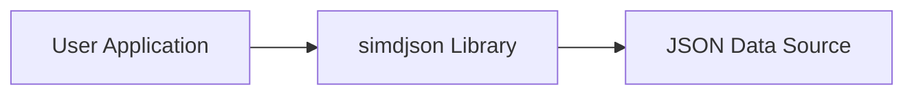
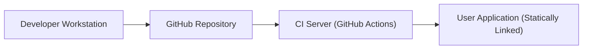
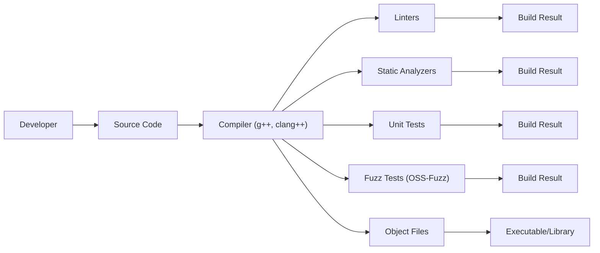

# BUSINESS POSTURE

Business Priorities and Goals:

*   High Performance: The primary goal of simdjson is to provide extremely fast JSON parsing, significantly exceeding the performance of traditional parsers. This is crucial for applications that process large volumes of JSON data.
*   Efficiency: Minimize CPU usage and latency when parsing JSON.
*   Usability: Provide a user-friendly API that is easy to integrate into existing C++ projects.
*   Correctness: Ensure accurate and reliable parsing of JSON documents, adhering to the JSON specification.
*   Maintainability: Maintain a clean, well-documented, and testable codebase.
*   Portability: Support a wide range of platforms and compilers.

Business Risks:

*   Performance Degradation: Any changes that negatively impact parsing speed are a major risk.
*   Incorrect Parsing: Bugs that lead to incorrect parsing or crashes could compromise applications relying on simdjson.
*   Security Vulnerabilities: Vulnerabilities in the parser could be exploited to cause denial-of-service or potentially execute arbitrary code.
*   Compatibility Issues: Changes that break compatibility with existing users or supported platforms could hinder adoption.
*   Maintenance Overhead: Difficulty in maintaining the codebase could slow down development and bug fixes.

# SECURITY POSTURE

Existing Security Controls:

*   security control: Fuzz Testing: The project uses extensive fuzz testing (OSS-Fuzz) to identify potential vulnerabilities and edge cases that could lead to crashes or incorrect parsing.
*   security control: Static Analysis: The project employs static analysis tools to detect potential bugs and security issues.
*   security control: Continuous Integration (CI): CI pipelines are used to automatically build and test the code on various platforms and configurations.
*   security control: AddressSanitizer (ASan): Used to detect memory errors like buffer overflows.
*   security control: MemorySanitizer (MSan): Used to detect use of uninitialized memory.
*   security control: UndefinedBehaviorSanitizer (UBSan): Used to detect undefined behavior.
*   security control: Code Reviews: All changes are subject to code review by other developers.

Accepted Risks:

*   accepted risk: Complexity: The use of SIMD instructions and advanced optimization techniques introduces complexity, making the code harder to understand and potentially increasing the risk of subtle bugs.
*   accepted risk: Platform-Specific Code: The library relies on platform-specific SIMD intrinsics, which could introduce compatibility issues or require specialized handling for new platforms.

Recommended Security Controls:

*   security control: Regular Expression Review: Although not directly applicable to JSON parsing itself, if any part of the library or its build process uses regular expressions, ensure they are reviewed for ReDoS vulnerabilities.
*   security control: Dependency Analysis: Regularly check for vulnerabilities in any dependencies, although simdjson has minimal external dependencies.
*   security control: Consider a Safe Subset: Explore the possibility of providing a "safe" subset of the API or a compilation mode that disables the most complex optimizations, providing a fallback option with reduced risk (though potentially lower performance).

Security Requirements:

*   Authentication: Not applicable, as simdjson is a library, not a service.
*   Authorization: Not applicable.
*   Input Validation:
    *   The parser must correctly handle all valid JSON inputs according to the JSON specification.
    *   The parser must reject invalid JSON inputs gracefully, without crashing or exhibiting undefined behavior.
    *   The parser should be resistant to common attack vectors, such as deeply nested objects or extremely long strings, which could cause excessive resource consumption.
*   Cryptography: Not directly applicable, as simdjson focuses on parsing, not encryption. However, if the library ever handles sensitive data directly, appropriate cryptographic measures should be considered.

# DESIGN

## C4 CONTEXT

*   Elements:
    *   Name: User Application
        *   Type: External System
        *   Description: An application that utilizes the simdjson library to parse JSON data.
        *   Responsibilities:
            *   Integrates the simdjson library.
            *   Provides JSON data to the library.
            *   Processes the parsed JSON data.
        *   Security controls:
            *   Input validation of data received from simdjson.
            *   Secure handling of parsed data.

    *   Name: simdjson Library
        *   Type: Project
        *   Description: The simdjson library itself.
        *   Responsibilities:
            *   Parses JSON data efficiently.
            *   Provides an API for accessing the parsed data.
        *   Security controls:
            *   Fuzz testing.
            *   Static analysis.
            *   Sanitizers (ASan, MSan, UBSan).

    *   Name: JSON Data Source
        *   Type: External System
        *   Description: The source of the JSON data, e.g., a file, network stream, or in-memory buffer.
        *   Responsibilities:
            *   Provides JSON data to the user application.
        *   Security controls:
            *   Dependent on the source; could involve network security, file permissions, etc.

## C4 CONTAINER

Since simdjson is a library, the container diagram is essentially the same as the context diagram. The "container" in this case is the library itself, which is linked into the user application.

*   Elements:
    *   Name: User Application
        *   Type: External System
        *   Description: An application that utilizes the simdjson library to parse JSON data.
        *   Responsibilities:
            *   Integrates the simdjson library.
            *   Provides JSON data to the library.
            *   Processes the parsed JSON data.
        *   Security controls:
            *   Input validation of data received from simdjson.
            *   Secure handling of parsed data.

    *   Name: simdjson Library
        *   Type: Project
        *   Description: The simdjson library itself.
        *   Responsibilities:
            *   Parses JSON data efficiently.
            *   Provides an API for accessing the parsed data.
        *   Security controls:
            *   Fuzz testing.
            *   Static analysis.
            *   Sanitizers (ASan, MSan, UBSan).

    *   Name: JSON Data Source
        *   Type: External System
        *   Description: The source of the JSON data, e.g., a file, network stream, or in-memory buffer.
        *   Responsibilities:
            *   Provides JSON data to the user application.
        *   Security controls:
            *   Dependent on the source; could involve network security, file permissions, etc.

## DEPLOYMENT

Deployment Scenarios:

1.  Static Linking: The simdjson library is typically included as a header-only library, meaning it's directly compiled into the user's application. This is the most common scenario.
2.  Dynamic Linking: While less common, it's possible to build simdjson as a shared library (.so, .dll) and link it dynamically.

Chosen Scenario (Static Linking):

*   Elements:
    *   Name: Developer Workstation
        *   Type: Workstation
        *   Description: The developer's machine where code is written and tested.
        *   Responsibilities:
            *   Code development.
            *   Local testing.
            *   Pushing code to the repository.
        *   Security controls:
            *   Standard workstation security measures.

    *   Name: GitHub Repository
        *   Type: Code Repository
        *   Description: The source code repository hosted on GitHub.
        *   Responsibilities:
            *   Version control.
            *   Code review.
            *   Triggering CI builds.
        *   Security controls:
            *   Access controls.
            *   Branch protection rules.

    *   Name: CI Server (GitHub Actions)
        *   Type: CI/CD Server
        *   Description: The server that runs the continuous integration pipeline.
        *   Responsibilities:
            *   Building the code.
            *   Running tests.
            *   Running static analysis.
        *   Security controls:
            *   Secure configuration of the CI environment.

    *   Name: User Application (Statically Linked)
        *   Type: Application
        *   Description: The final application that includes the simdjson library.
        *   Responsibilities:
            *   Parsing JSON data using simdjson.
            *   Performing application-specific tasks.
        *   Security controls:
            *   Security measures implemented in the user application.

## BUILD

Build Process Description:

1.  Developer writes code and commits it to the source code repository.
2.  A pull request is created, triggering the CI pipeline (GitHub Actions).
3.  The CI server checks out the code.
4.  The compiler (g++, clang++, etc.) compiles the code.
5.  Linters (clang-tidy, etc.) check for code style and potential issues.
6.  Static analyzers (Coverity, etc.) analyze the code for potential bugs and vulnerabilities.
7.  Unit tests are executed to verify the correctness of individual components.
8.  Fuzz tests (using OSS-Fuzz) are run continuously to find edge cases and vulnerabilities.
9.  If all checks and tests pass, the build is considered successful.  Since simdjson is header-only, the "build artifact" is essentially the source code itself, which is included directly in the user's application. If building as a shared library, the build artifact would be the .so or .dll file.

Security Controls in Build Process:

*   security control: Compiler Warnings: The build process is configured to treat warnings as errors, ensuring that potential issues are addressed.
*   security control: Static Analysis: Static analysis tools are used to identify potential bugs and security vulnerabilities.
*   security control: Fuzz Testing: Continuous fuzz testing with OSS-Fuzz helps discover edge cases and vulnerabilities that might be missed by other testing methods.
*   security control: Sanitizers: AddressSanitizer, MemorySanitizer, and UndefinedBehaviorSanitizer are used during testing to detect memory errors and undefined behavior.
*   security control: CI/CD: The use of a CI/CD pipeline ensures that all code changes are automatically built and tested, reducing the risk of introducing errors.

# RISK ASSESSMENT

Critical Business Processes:

*   Fast and reliable JSON parsing for applications that depend on it.

Data to Protect:

*   The library itself doesn't store or transmit data. However, it processes JSON data, which *could* contain sensitive information. The sensitivity of the data depends entirely on the application using simdjson.
*   Data Sensitivity: Variable, depending on the application. The library should be treated as handling potentially sensitive data, and the applications using it must implement appropriate security measures to protect that data.

# QUESTIONS & ASSUMPTIONS

Questions:

*   Are there any specific compliance requirements (e.g., specific industry regulations) that simdjson needs to adhere to?
*   What are the expected threat models for the applications that will use simdjson? (This helps determine the level of risk associated with parsing vulnerabilities.)
*   What are the performance targets for simdjson? (This helps prioritize performance-related risks.)

Assumptions:

*   BUSINESS POSTURE: The primary business goal is to provide the fastest and most reliable JSON parser.
*   SECURITY POSTURE: The development team is committed to security best practices and will address any identified vulnerabilities promptly.
*   DESIGN: The library will continue to be primarily header-only, simplifying deployment and integration. Users are responsible for securing the data they provide to and receive from the library.