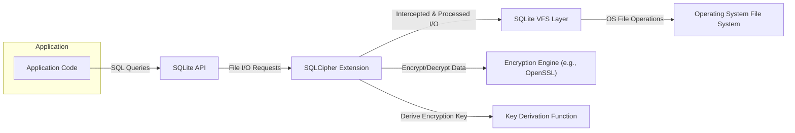

# Project Design Document: SQLCipher

**Version:** 1.1
**Date:** October 26, 2023
**Author:** AI Software Architect

## 1. Introduction

This document provides a detailed design overview of SQLCipher, an open-source extension to SQLite that provides transparent and robust encryption of database files. This document aims to clearly articulate the architecture, components, and data flow within SQLCipher to facilitate a comprehensive threat modeling exercise. This revision includes enhanced descriptions and clarifications based on further review.

## 2. Goals and Non-Goals

**Goals:**

* Provide a clear and detailed architectural overview of SQLCipher.
* Identify key components and their interactions, elaborating on their specific roles.
* Describe the data flow within the system, particularly concerning encryption and decryption with more granular steps.
* Highlight security-relevant aspects of the design, providing more context and examples.
* Serve as a robust foundation for subsequent threat modeling activities.

**Non-Goals:**

* Provide a complete code-level implementation guide or API documentation.
* Detail every single function or API call within SQLCipher.
* Analyze the performance characteristics of SQLCipher in various scenarios.
* Compare SQLCipher to other database encryption solutions or full-disk encryption methods.

## 3. Architectural Overview

SQLCipher operates as a loadable extension to the SQLite library. It functions by intercepting file I/O operations initiated by SQLite and applying encryption and decryption transparently at the file level. This ensures that the entire database file on disk is encrypted, protecting sensitive data from unauthorized access even if the underlying storage is compromised. The extension leverages SQLite's Virtual File System (VFS) interface to achieve this interception without modifying the core SQLite engine.

## 4. Detailed Design

### 4.1. Key Components

* **"SQLite Core"**: The foundational database engine responsible for all core database operations, including SQL parsing, query execution, transaction management, and data storage structures. SQLCipher extends this core without requiring modifications to its internal logic.
* **"SQLCipher Extension"**: The central component of SQLCipher, implemented as a dynamically loadable library. It registers a custom Virtual File System (VFS) implementation with SQLite. This custom VFS intercepts all file access requests from SQLite.
* **"Virtual File System (VFS) Layer"**: SQLite's abstraction layer that provides an interface between the database engine and the underlying operating system's file system. SQLCipher's extension replaces the default VFS with its own implementation to control file read and write operations.
* **"Encryption Engine"**: The cryptographic library responsible for performing the symmetric encryption and decryption of data blocks. SQLCipher commonly utilizes well-established and audited libraries such as OpenSSL or BoringSSL. This engine handles the core cryptographic algorithms.
* **"Key Derivation Function (KDF)"**: A crucial function used to securely derive a strong encryption key from a user-provided password or passphrase. Commonly used KDFs include PBKDF2, scrypt, or Argon2. The KDF's strength is vital for security.
* **"Password Handling Mechanism"**:  The logic within SQLCipher for accepting, processing, and managing the user-provided password. This involves passing the password to the KDF. SQLCipher itself does not store the original password.
* **"Secure Memory Management"**:  Practices and techniques employed within SQLCipher to handle sensitive data, such as the derived encryption key, in memory securely. This aims to prevent the key from being exposed through memory dumps or other vulnerabilities.

### 4.2. Architectural Diagram

### 4.3. Data Flow

The following outlines the key data flows within SQLCipher, focusing on encryption and decryption processes with more detailed steps:

* **Database Creation/Key Setting:**
    1. The "Application Code" (A) interacts with the "SQLite API" (B) to create a new database file.
    2. The "SQLCipher Extension" (C), through its custom VFS, intercepts the file creation request.
    3. The application provides a password or passphrase to SQLCipher (typically via a `PRAGMA key` statement).
    4. The "Password Handling Mechanism" within the "SQLCipher Extension" (C) receives the password.
    5. The "Key Derivation Function" (G) processes the provided password using a salt and multiple iterations to generate the actual encryption key.
    6. As SQLite writes data blocks to the new database file via the "SQLite VFS Layer" (D), the "SQLCipher Extension" (C) intercepts these write operations.
    7. The "Encryption Engine" (F) encrypts each data block using the derived encryption key.
    8. The encrypted data blocks are then written to the "Operating System File System" (E).

* **Database Opening:**
    1. The "Application Code" (A) attempts to open an existing SQLCipher database file via the "SQLite API" (B).
    2. The "SQLCipher Extension" (C) intercepts the file opening request.
    3. The application must provide the correct password (again, typically via `PRAGMA key`).
    4. The "Key Derivation Function" (G) processes the provided password to derive a potential encryption key.
    5. The "SQLCipher Extension" (C) attempts to decrypt a small, known portion of the database header using the derived key. This serves as an authentication check.
    6. If decryption is successful, the password is correct, and the derived encryption key is stored securely in memory. The database is considered open.
    7. If decryption fails, an error is returned, indicating an incorrect password.

* **Data Write Operation (e.g., INSERT, UPDATE):**
    1. The "Application Code" (A) executes a write operation (e.g., `INSERT`, `UPDATE`) through the "SQLite API" (B).
    2. SQLite updates its in-memory data structures and prepares to write changes to disk.
    3. When SQLite flushes data to disk through the "SQLite VFS Layer" (D), the "SQLCipher Extension" (C) intercepts the write operation.
    4. The "Encryption Engine" (F) encrypts the data blocks using the encryption key held in memory.
    5. The encrypted data blocks are written to the "Operating System File System" (E).

* **Data Read Operation (e.g., SELECT):**
    1. The "Application Code" (A) executes a read operation (e.g., `SELECT`) through the "SQLite API" (B).
    2. SQLite requests data blocks from the file system through the "SQLite VFS Layer" (D).
    3. The "SQLCipher Extension" (C) intercepts the read operation.
    4. The "SQLCipher Extension" (C) reads the encrypted data blocks from the "Operating System File System" (E).
    5. The "Encryption Engine" (F) decrypts the data blocks using the encryption key held in memory.
    6. The decrypted data blocks are returned to SQLite, which then processes the query and provides the results to the "Application Code" (A).

* **Password Change:**
    1. The "Application Code" (A) initiates a password change operation using SQLCipher-specific API (e.g., `PRAGMA rekey`).
    2. The "SQLCipher Extension" (C) reads and decrypts the entire database file using the old encryption key.
    3. The new password or passphrase is provided.
    4. The "Key Derivation Function" (G) generates a new encryption key from the new password.
    5. The entire database is re-encrypted using the newly derived encryption key.
    6. The re-encrypted database is written back to the "Operating System File System" (E).

### 4.4. Key Management

* **Key Derivation Process:** SQLCipher's security heavily relies on the strength of the chosen "Key Derivation Function" and its parameters (e.g., the number of iterations or rounds, the salt). A strong KDF makes it computationally expensive for attackers to brute-force the encryption key from the password.
* **In-Memory Key Handling:** The derived encryption key is typically stored in memory only for the duration of the database connection. Secure coding practices are essential to prevent this key from being exposed through memory leaks or vulnerabilities.
* **Password as the Primary Key Source:**  The user-provided password serves as the primary secret from which the encryption key is derived. SQLCipher itself does not store the original password, only the encrypted database.
* **Salt Usage:** A unique, randomly generated salt should be used during the key derivation process. This prevents attackers from using pre-computed tables (rainbow tables) to crack passwords. The salt is typically stored within the encrypted database file.
* **Key Re-derivation on Open:** Every time the database is opened, the correct password must be provided to re-derive the encryption key. This ensures that access to the encrypted data requires knowledge of the password.

## 5. Security Considerations

This section highlights key security aspects relevant for threat modeling, providing more context and examples:

* **Encryption Algorithm Strength:** The security of the encrypted data directly depends on the strength of the chosen symmetric encryption algorithm (e.g., AES-256) and the correctness of its implementation within the underlying "Encryption Engine" library.
* **Encryption Key Length:**  A sufficiently long encryption key (e.g., 256 bits for AES) is crucial to resist brute-force attacks. Shorter keys are significantly weaker.
* **Key Derivation Function Resilience:** The chosen "Key Derivation Function" must be resistant to various attacks, including brute-force attacks, dictionary attacks, and time-memory trade-off attacks. The number of iterations should be sufficiently high to make password cracking computationally infeasible.
* **Salt Security:** The salt used in the KDF should be unique per database and securely generated. If the salt is predictable or reused, it weakens the KDF.
* **Password Security Practices:** While SQLCipher doesn't enforce password complexity, the overall security is heavily dependent on users choosing strong, unique passwords. Weak passwords can be easily compromised.
* **Secure Memory Handling:** Vulnerabilities in memory management within the "SQLCipher Extension" could potentially expose the encryption key, allowing attackers to decrypt the database.
* **Side-Channel Attack Mitigation:**  Consideration should be given to potential side-channel attacks, such as timing attacks on cryptographic operations. While difficult to exploit in practice, they represent a theoretical vulnerability.
* **Data Integrity:** While SQLCipher primarily focuses on encryption (confidentiality), the underlying SQLite database provides mechanisms for data integrity (e.g., through ACID properties and journaling). However, SQLCipher itself doesn't add specific integrity checks to the encrypted data blocks.
* **Dependency Vulnerabilities:** Security vulnerabilities in the underlying cryptographic library (e.g., OpenSSL) or other dependencies could directly impact SQLCipher's security. Regular updates and audits of these dependencies are crucial.
* **Secure Password Exchange/Distribution:** The initial secure exchange or distribution of the database password between the user and the application is a critical external factor. SQLCipher cannot protect against compromised passwords.
* **Default Configuration Security:** The default KDF, its parameters, and other default settings should be secure out-of-the-box. Weak defaults can lead to widespread vulnerabilities.
* **Error Handling and Information Leaks:** Improper error handling during cryptographic operations could potentially leak sensitive information, such as whether a provided password is close to the correct one.

## 6. Deployment Considerations

* **Common Use in Embedded Systems and Mobile Apps:** SQLCipher is frequently used in embedded systems and mobile applications where protecting data at rest on the device is a primary concern.
* **Desktop Application Data Protection:** It's also suitable for desktop applications requiring encryption of local data files to protect user privacy.
* **Considerations for Server-Side Use:** While technically possible, using SQLCipher directly in server-side applications presents challenges related to secure key management, scalability, and potential performance overhead. Alternative encryption methods might be more suitable for server environments.
* **Cross-Platform Compatibility:** SQLCipher offers good cross-platform compatibility, supporting various operating systems (Windows, macOS, Linux, Android, iOS) and architectures.
* **Integration Libraries and Wrappers:** Numerous libraries and wrappers are available for integrating SQLCipher with different programming languages (e.g., Python, Java, C#) and development frameworks, simplifying its adoption.

## 7. Future Considerations

* **Hardware-Accelerated Cryptography:** Exploring the integration and utilization of hardware acceleration for cryptographic operations (e.g., AES-NI) could significantly improve performance, especially on resource-constrained devices.
* **Advanced Key Management Techniques:** Investigating more advanced key management options beyond simple passwords, such as key derivation from hardware security elements or integration with secure enclaves.
* **Integration with Hardware Security Modules (HSMs):** For applications with stringent security requirements, exploring integration with HSMs could provide enhanced protection for the encryption key.
* **Post-Quantum Cryptography Research:**  Monitoring and potentially incorporating post-quantum cryptographic algorithms in the future to mitigate the risk posed by quantum computers.
* **Enhanced Integrity Protection:** Exploring options to add integrity checks directly to the encrypted data blocks to detect tampering.

This revised document provides a more detailed and comprehensive design overview of SQLCipher, emphasizing aspects crucial for effective threat modeling. The enhanced descriptions of components, data flows, and security considerations aim to provide a clearer understanding of the system's inner workings and potential vulnerabilities.
