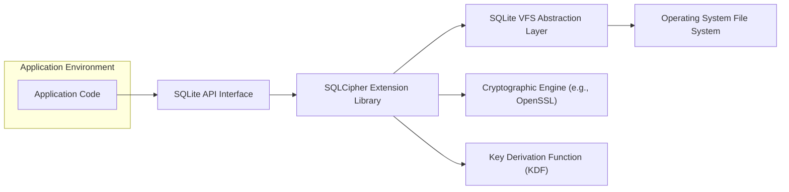

# Project Design Document: SQLCipher

**Version:** 1.1
**Date:** October 26, 2023
**Author:** AI Software Architect

## 1. Introduction

This document provides an enhanced and detailed design overview of SQLCipher, an open-source extension to SQLite that provides transparent and robust encryption of database files. This document is specifically crafted to clearly articulate the architecture, components, and data flow within SQLCipher to facilitate a comprehensive threat modeling exercise. The information presented here aims to provide a solid understanding of the system's inner workings from a security perspective.

## 2. Goals and Non-Goals

**Goals:**

* Provide a clear and detailed architectural overview of SQLCipher, suitable for threat modeling.
* Identify key components and their interactions, emphasizing security-relevant interfaces.
* Describe the data flow within the system, with a focus on encryption and decryption processes and key handling.
* Highlight security-relevant aspects of the design, including potential vulnerabilities and attack vectors.
* Serve as a robust foundation for subsequent threat modeling activities, enabling identification of threats and mitigation strategies.

**Non-Goals:**

* Provide a complete, line-by-line code-level implementation guide.
* Detail every single function or API call within SQLCipher.
* Analyze the performance characteristics and optimization strategies of SQLCipher.
* Compare SQLCipher to other database encryption solutions or evaluate its suitability for specific use cases beyond its core function.

## 3. Architectural Overview

SQLCipher functions as a dynamically loadable extension to the core SQLite library. Its primary function is to intercept file input/output (I/O) operations initiated by SQLite and transparently apply encryption to data being written to disk and decryption to data being read from disk. This ensures that the entire database file is encrypted at rest, protecting sensitive information even if the underlying storage is compromised.

## 4. Detailed Design

### 4.1. Key Components

* **"SQLite Core"**: The foundational database engine responsible for core data management functionalities like storage, retrieval, and query processing. SQLCipher extends this core without altering its fundamental operational logic.
* **"SQLCipher Extension"**: The central component of SQLCipher, implemented as a dynamically loadable library. It hooks into SQLite's Virtual File System (VFS) layer to manage encryption and decryption.
* **"Virtual File System (VFS) Layer"**: SQLite's abstraction layer that provides an interface between the database engine and the underlying operating system's file system. SQLCipher's extension operates within this layer, intercepting file read and write requests.
* **"Encryption Engine"**: The cryptographic library responsible for performing the actual encryption and decryption algorithms. SQLCipher commonly utilizes well-established and audited libraries such as OpenSSL or BoringSSL.
* **"Key Derivation Function (KDF)"**: A crucial function used to securely derive a strong encryption key from a user-provided password (or passphrase). Common KDFs employed include PBKDF2, scrypt, or Argon2, known for their resistance to brute-force attacks.
* **"Password Handling Mechanism"**: The methods and logic for setting, changing, and managing the user-provided password that serves as the basis for the encryption key. This involves secure input and handling of the password.
* **"Memory Management for Sensitive Data"**:  The strategies and techniques employed to handle sensitive data, particularly the derived encryption key, within the application's memory. This aims to prevent unauthorized access or leakage of the key.

### 4.2. Architectural Diagram

### 4.3. Data Flow with Encryption Focus

The following details the data flow within SQLCipher, specifically emphasizing the encryption and decryption processes and key management, which are critical for threat modeling:

* **"Database Creation and Key Initialization"**:
    * The application interacts with the SQLite API (B) to initiate the creation of a new database.
    * The SQLCipher Extension (C) intercepts this operation via the VFS layer (D).
    * The application provides a user-defined password (or key material) to SQLCipher.
    * The Key Derivation Function (G) processes the provided password, potentially using a salt, to generate the actual encryption key.
    * This derived encryption key is then used by the Encryption Engine (F) to encrypt the database file as it is created and written to the storage medium through the VFS layer (D) and the OS file system (E).

* **"Database Opening and Key Derivation"**:
    * When an application attempts to open an existing SQLCipher database, the SQLCipher Extension (C) intercepts the file opening request.
    * The application *must* provide the correct password associated with the database.
    * The provided password is fed into the same Key Derivation Function (G) (with the original salt, if used) to re-derive the encryption key.
    * SQLCipher uses this derived key to attempt decryption of a header portion of the database file. Successful decryption verifies the correctness of the provided password and the derived key.
    * If verification is successful, the database is opened, and the derived encryption key is securely held in memory for subsequent operations.

* **"Data Write Operation (Encryption)"**:
    * When the application performs a write operation (e.g., INSERT, UPDATE) through the SQLite API (B), SQLite writes the data to its internal buffers.
    * As SQLite attempts to flush these data blocks to disk via the VFS layer (D), the SQLCipher Extension (C) intercepts the write operation.
    * The Encryption Engine (F) encrypts the data blocks using the derived encryption key currently held in memory.
    * The encrypted data is then written to the file system (E).

* **"Data Read Operation (Decryption)"**:
    * When the application requests data (e.g., SELECT) through the SQLite API (B), SQLite initiates a read operation from the file system via the VFS layer (D).
    * The SQLCipher Extension (C) intercepts this read operation.
    * The Encryption Engine (F) decrypts the requested data blocks from the file using the encryption key held in memory.
    * The decrypted data is then passed back to SQLite, which subsequently provides it to the requesting application.

* **"Password Change and Re-encryption"**:
    * When an application initiates a password change operation (using SQLCipher-specific API calls), the following occurs:
    * SQLCipher reads and decrypts the entire database file using the *old* encryption key.
    * The application provides the *new* password.
    * The Key Derivation Function (G) generates a *new* encryption key from the new password.
    * The entire database is then re-encrypted using this new key and written back to disk, overwriting the old encrypted data.

### 4.4. Key Management Details

* **"Robust Key Derivation"**: SQLCipher's security heavily relies on the strength of the Key Derivation Function (KDF). The KDF transforms the user-provided password into a cryptographically strong encryption key. The choice of KDF algorithm and its parameters (e.g., number of iterations or rounds, salt length) are critical for resisting brute-force and dictionary attacks.
* **"Secure In-Memory Key Storage"**: The derived encryption key is typically stored in the application's memory for the duration of the database connection. Secure memory management practices are essential to prevent unauthorized access or leakage of this sensitive key material.
* **"No Persistent Password Storage"**: SQLCipher itself does not store the original user-provided password persistently. The security model relies on the user remembering and correctly providing the password each time the database is opened.
* **"Key Re-derivation on Database Open"**:  Each time the database is opened, the user must provide the correct password, which is then used to re-derive the encryption key. This ensures that the key is not stored persistently and reduces the risk of key compromise.

## 5. Security Considerations for Threat Modeling

This section outlines key security considerations relevant for identifying potential threats and vulnerabilities during a threat modeling exercise:

* **"Strength of Encryption Algorithm"**: The security of the encrypted data directly depends on the chosen encryption algorithm (e.g., AES-256) and the correctness of its implementation within the underlying cryptographic library. *Potential Threat: Use of weak or outdated algorithms could lead to easier decryption.*
* **"Encryption Key Length"**: A sufficiently long encryption key is crucial for resisting brute-force attacks. *Potential Threat: Insufficient key length makes brute-force attacks feasible.*
* **"Key Derivation Function Resilience"**: The KDF must be resistant to various attacks, including brute-force, dictionary attacks, and rainbow table attacks. The number of iterations (or work factor) is a critical parameter. *Potential Threat: Weak KDF parameters allow attackers to efficiently guess the encryption key.*
* **"Salt Usage in KDF"**: The use of a unique, randomly generated salt during key derivation is essential to prevent pre-computation attacks like rainbow tables. *Potential Threat: Lack of salt or a predictable salt weakens the KDF.*
* **"Password Complexity and Entropy"**: While SQLCipher doesn't enforce password complexity, the overall security is heavily influenced by the strength (entropy) of the user-provided password. *Potential Threat: Weak or easily guessable passwords compromise the entire encryption scheme.*
* **"Memory Protection of Encryption Key"**: Vulnerabilities in memory management within the application or SQLCipher could lead to the encryption key being exposed through memory dumps or other attacks. *Potential Threat: Key leakage allows for immediate decryption of the database.*
* **"Susceptibility to Side-Channel Attacks"**: Consider potential side-channel attacks (e.g., timing attacks, power analysis) on the cryptographic operations performed by the Encryption Engine. *Potential Threat: Attackers might infer information about the key or plaintext by observing execution characteristics.*
* **"Integrity Protection Mechanisms"**: While SQLCipher focuses on encryption, the underlying SQLite database provides mechanisms for data integrity. However, tampering with the encrypted file might be detectable but not preventable by SQLCipher itself. *Potential Threat: Malicious modification of the encrypted database file.*
* **"Security of Underlying Cryptographic Dependencies"**: Security vulnerabilities in the underlying cryptographic library (e.g., OpenSSL, BoringSSL) could directly impact SQLCipher's security. Regular updates and vetting of these libraries are crucial. *Potential Threat: Exploiting vulnerabilities in the crypto library to bypass encryption.*
* **"Secure Password Exchange and Distribution"**: The initial secure exchange or distribution of the database password between the user and the application is a critical external factor. SQLCipher itself cannot solve vulnerabilities in this process. *Potential Threat: Interception or compromise of the password during transmission.*
* **"Security of Default Settings"**: The default KDF algorithm and its parameters should be set to secure values out-of-the-box. *Potential Threat: Insecure default settings leave users vulnerable if they don't configure them properly.*
* **"Error Handling and Information Disclosure"**: Improper error handling during cryptographic operations could inadvertently leak sensitive information. *Potential Threat: Error messages revealing details about the encryption process or key.*

## 6. Deployment Considerations

* **"Embedded Systems and Mobile Applications"**: SQLCipher is frequently used in resource-constrained environments like embedded systems and mobile apps to provide data-at-rest encryption for locally stored data.
* **"Desktop Applications Storing Sensitive User Data"**: Desktop applications that need to protect user data, such as password managers or personal finance software, can leverage SQLCipher.
* **"Client-Side Encryption in Web Applications"**: While less common for direct server-side database encryption due to key management complexities, SQLCipher can be used for client-side encryption before data is transmitted to a server.
* **"Platform and Language Support"**: SQLCipher boasts broad support across various operating systems (Windows, macOS, Linux, Android, iOS) and programming languages through wrappers and bindings.
* **"Integration Complexity"**: Integrating SQLCipher typically involves linking the extension library and managing the password securely within the application's lifecycle.

## 7. Future Considerations

* **"Exploration of Hardware-Accelerated Cryptography"**: Investigating the use of hardware acceleration for cryptographic operations could significantly improve performance, especially on devices with dedicated crypto engines.
* **"Advanced Key Management Techniques"**: Exploring more sophisticated key management options beyond simple passwords, such as key derivation from hardware security elements or integration with secure enclaves.
* **"Integration with Hardware Security Modules (HSMs)"**: For applications requiring the highest levels of security, integration with HSMs could provide enhanced protection for the encryption key.
* **"Consideration of Post-Quantum Cryptography"**:  Future development might involve researching and potentially integrating post-quantum cryptographic algorithms to mitigate threats from future quantum computers.

This improved document provides a more detailed and security-focused design overview of SQLCipher, specifically tailored for threat modeling activities. The enhanced descriptions of components, data flows, and the expanded security considerations offer a more robust foundation for identifying potential vulnerabilities and designing effective security mitigations.