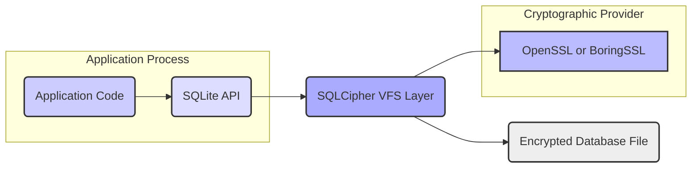
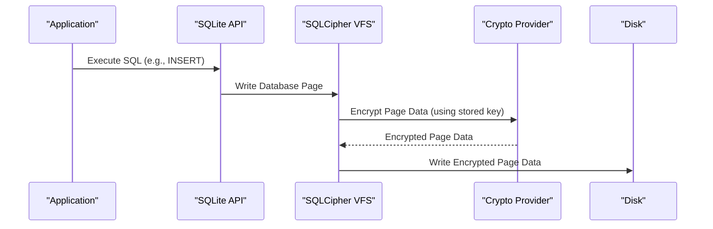
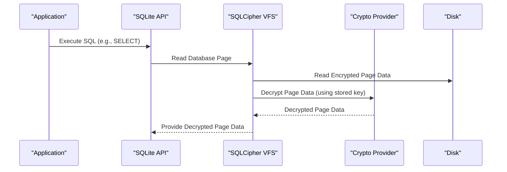

## Project Design Document: SQLCipher

**Document Version:** 1.1
**Date:** October 26, 2023
**Author:** AI Software Architect

### 1. Project Overview

SQLCipher is an open-source extension to the SQLite library, providing transparent and robust encryption of database files. It ensures the confidentiality of data at rest by encrypting all information stored within the database file using industry-standard cryptographic algorithms. This design document details the architecture, key components, and data flow of SQLCipher, serving as a foundation for subsequent threat modeling and security analysis.

### 2. Goals

* To provide seamless, full-database encryption for SQLite databases without requiring significant application code changes.
* To leverage well-established and rigorously tested cryptographic libraries such as OpenSSL or BoringSSL to ensure security and reliability.
* To offer a straightforward API for integrating encryption capabilities into applications that utilize SQLite.
* To minimize the performance impact of encryption while maintaining a high level of security.
* To achieve broad cross-platform compatibility, supporting various operating systems and architectures.

### 3. Non-Goals

* To offer built-in, comprehensive key management infrastructure. SQLCipher focuses on the encryption layer; key generation, storage, exchange, and rotation are the responsibility of the integrating application.
* To implement fine-grained access control mechanisms or row-level encryption within the database. SQLCipher's encryption operates at the database file level.
* To provide protection against advanced memory forensics or sophisticated side-channel attacks beyond the scope of standard encryption practices.
* To develop novel or proprietary cryptographic algorithms. SQLCipher relies on established and widely reviewed cryptographic primitives from trusted libraries.

### 4. Target Audience

This document is primarily intended for:

* Security engineers tasked with performing threat modeling, security assessments, and penetration testing of systems employing SQLCipher.
* Software developers who are integrating SQLCipher into their applications and need to understand its architecture and security implications.
* System architects designing and evaluating systems that utilize encrypted SQLite databases as a storage mechanism.

### 5. Architectural Overview

SQLCipher functions as a Virtual File System (VFS) layer interposed between the application's interaction with the standard SQLite API and the underlying file system. This architectural choice enables transparent encryption and decryption operations on database pages as they are read from and written to disk.



**Key Architectural Components:**

* **"Application Code"**: The software application that interacts with the SQLite database using standard SQLite library calls.
* **"SQLite API"**: The standard programming interface provided by the core SQLite library for database operations.
* **"SQLCipher VFS Layer"**: The central component of SQLCipher. It intercepts file input/output requests from SQLite, performing encryption before writing to disk and decryption after reading from disk.
* **"Cryptographic Provider" (OpenSSL or BoringSSL)**: Provides the underlying cryptographic algorithms, such as AES, hashing functions, and random number generators, used by SQLCipher.
* **"Encrypted Database File"**: The physical file stored on disk, containing the database data in an encrypted format.

### 6. Component Details

This section provides a more detailed look at the key components within the SQLCipher architecture.

* **"SQLCipher Core (VFS Implementation)"**:
    * **"Encryption/Decryption Engine"**:  This module handles the core cryptographic operations. It encrypts database pages before they are written to disk and decrypts them after they are read. It typically uses the Advanced Encryption Standard (AES) in a chosen mode of operation (e.g., CBC, CTR, or AEAD modes like XTS).
    * **"Key Derivation Function (KDF) Interface"**: Manages the process of deriving the actual encryption key from a user-provided password or passphrase. It utilizes robust KDFs like PBKDF2 (Password-Based Key Derivation Function 2) with a salt to enhance security against brute-force attacks. The salt is typically stored within the encrypted database header.
    * **"Page Management"**: Responsible for intercepting SQLite's page read and write requests. It ensures that encryption and decryption are applied to individual database pages as they are moved between memory and disk. This includes handling the database page cache.
    * **"Header Processing"**: Manages the encrypted database header, which stores essential metadata such as the salt for the KDF, the iteration count used in the KDF, and potentially other encryption parameters.
* **"Key Derivation Function (KDF)"**:
    * Implements algorithms like PBKDF2, which take a password, a salt, and an iteration count as input to produce a strong cryptographic key.
    * The salt is a random value unique to the database, preventing attackers from using pre-computed rainbow tables.
    * The iteration count determines the computational cost of the KDF, making brute-force attacks more time-consuming.
* **"Cryptographic Library (OpenSSL or BoringSSL)"**:
    * Provides the foundational cryptographic building blocks used by SQLCipher.
    * Includes implementations of:
        * **"Symmetric Encryption Algorithms"**: Primarily AES with various key sizes (e.g., 128-bit, 256-bit) and modes of operation.
        * **"Cryptographic Hash Functions"**: Used within the KDF (e.g., SHA-256, SHA-512).
        * **"Random Number Generation"**: Used for generating salts and potentially initialization vectors (IVs).
* **"SQLite Core"**:
    * The underlying database management system that SQLCipher extends.
    * Operates without direct knowledge of the encryption process occurring at the VFS layer. It interacts with the encrypted database file as if it were a standard, unencrypted SQLite database.

### 7. Data Flow

The following diagrams illustrate the flow of data during key operations within SQLCipher.

#### 7.1. Database Initialization and Key Setting

```mermaid
sequenceDiagram
    participant "Application"
    participant "SQLite API"
    participant "SQLCipher VFS"
    participant "Crypto Provider"

    "Application"->>"SQLite API": Open Database Connection
    "Application"->>"SQLite API": PRAGMA key = 'user_password';"
    "SQLite API"->>"SQLCipher VFS": Set Key Request ('user_password')
    "SQLCipher VFS"->>"Crypto Provider": Derive Key (KDF with Salt from Header)
    "Crypto Provider"-->>"SQLCipher VFS": Encryption Key
    "SQLCipher VFS"->>"SQLCipher VFS": Store Encryption Key in Memory
```

#### 7.2. Write Operation



#### 7.3. Read Operation



### 8. Security Considerations

This section outlines crucial security aspects that are relevant for threat modeling and security analysis.

* **"Encryption Algorithm and Mode"**: SQLCipher's security relies on the strength of the chosen symmetric encryption algorithm (typically AES) and its mode of operation. The mode of operation impacts performance and security properties (e.g., resistance to specific attacks). AEAD (Authenticated Encryption with Associated Data) modes offer integrity protection in addition to confidentiality.
* **"Key Derivation Strength"**: The robustness of the KDF (e.g., PBKDF2) is paramount. Factors like the salt's randomness and length, and the iteration count, directly influence the resistance against brute-force attacks on the encryption key.
* **"Key Management by the Application"**:  SQLCipher delegates key management to the integrating application. This includes:
    * Securely obtaining the user's password or key material.
    * Protecting the key while it's in memory.
    * Implementing secure key storage mechanisms if the key needs to be persisted.
    * Handling key rotation and changes securely.
* **"Salt Management"**: The salt used in the KDF should be generated using a cryptographically secure random number generator and stored securely within the encrypted database header. Its uniqueness per database is essential.
* **"Initialization Vector (IV) Handling"**: For modes of operation like CBC or CTR, the proper generation and handling of IVs are critical to avoid security vulnerabilities. SQLCipher typically manages IV generation internally when using appropriate modes.
* **"Memory Security"**: While SQLCipher encrypts data at rest, decrypted data resides in memory when the database is in use. Applications should consider potential risks associated with memory dumping or unauthorized memory access.
* **"Side-Channel Attack Resistance"**: Standard encryption provides limited protection against side-channel attacks (e.g., timing attacks, power analysis). Mitigation of these attacks may require specific platform-level or cryptographic library-level countermeasures.
* **"Brute-Force Attack Mitigation"**: A strong user-provided password or key, combined with a robust KDF with a high iteration count, is crucial for mitigating brute-force attacks against the encryption key.
* **"Downgrade Attack Prevention"**: Applications should enforce the use of strong encryption parameters and prevent the possibility of downgrading to weaker or no encryption.
* **"Cryptographic Library Dependencies"**: The security of SQLCipher is intrinsically linked to the security of the underlying cryptographic library (OpenSSL or BoringSSL). Keeping these libraries updated is vital to address any discovered vulnerabilities.
* **"Database Integrity"**: While SQLCipher primarily focuses on confidentiality, the integrity of the encrypted database file is also a concern. Consider mechanisms to detect unauthorized modifications to the encrypted file.

### 9. Deployment Considerations

* **"Library Linking"**: SQLCipher is typically integrated into an application by linking the SQLCipher library instead of the standard SQLite library.
* **"Platform Compatibility"**: SQLCipher is designed to be cross-platform compatible, supporting various operating systems, including Windows, macOS, Linux, Android, and iOS.
* **"Key Provisioning"**: The encryption key is usually provided programmatically through the SQLite API using the `PRAGMA key` command. Applications need to determine a secure method for obtaining and providing this key.
* **"Performance Overhead"**: Encryption and decryption operations introduce some performance overhead compared to using unencrypted SQLite databases. The extent of the overhead depends on factors such as the chosen encryption algorithm, the key derivation parameters, and the hardware.
* **"Configuration Options"**: SQLCipher offers configuration options, such as specifying the KDF algorithm, the number of KDF iterations, and the cipher mode, allowing for customization based on security and performance requirements.

### 10. Future Considerations

* **"Exploration of Modern AEAD Ciphers"**: Investigating and potentially integrating more modern Authenticated Encryption with Associated Data (AEAD) ciphers for enhanced security and performance.
* **"Improved Key Management Guidance"**: Providing more detailed guidance and best practices for applications to implement secure key management strategies in conjunction with SQLCipher.
* **"Integration with Hardware Security Modules (HSMs)"**: Exploring options for integrating with HSMs to provide more secure storage and management of encryption keys.
* **"Memory Protection Techniques"**: Researching and potentially incorporating techniques to mitigate the risk of sensitive data being exposed in memory.
* **"Standardized Key Exchange Mechanisms"**: Investigating standardized methods for securely exchanging encryption keys between different parts of an application or system.

This improved design document provides a more detailed and comprehensive overview of SQLCipher's architecture, components, data flow, and security considerations. It serves as a more robust foundation for threat modeling and security analysis activities.