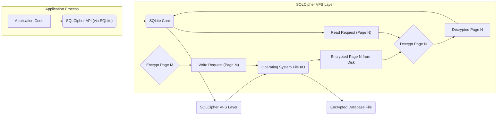
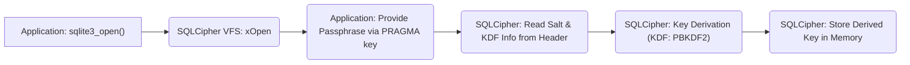
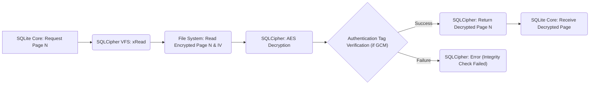
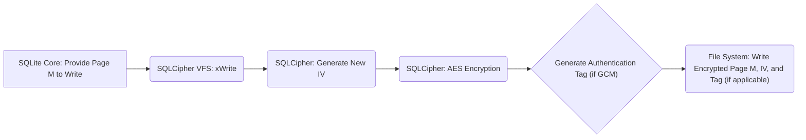

## Project Design Document: SQLCipher (Improved)

**1. Introduction**

This document provides an enhanced and more detailed design overview of the SQLCipher project, an open-source extension to SQLite providing transparent and robust encryption of database files. This revised document aims to offer a more comprehensive understanding of SQLCipher's architecture, components, and functionalities, specifically tailored for subsequent threat modeling activities. It emphasizes security-relevant aspects and potential attack surfaces.

**2. Project Overview**

SQLCipher is a software library that augments the standard SQLite library with encryption capabilities. It operates by encrypting the entire SQLite database file, including all tables, indices, and temporary files, using the Advanced Encryption Standard (AES) algorithm. The primary goal of SQLCipher is to provide a developer-friendly and secure method for protecting sensitive data stored within SQLite databases. It aims for transparency, minimizing the need for application-level encryption logic.

**3. Goals and Objectives**

* **Enhanced Data Confidentiality:**  Provide a strong defense against unauthorized access to sensitive data stored in SQLite databases at rest.
* **Transparent Encryption Implementation:** Minimize the impact on application code by integrating encryption seamlessly at the storage layer.
* **Robust Cryptographic Foundation:** Utilize industry-standard and well-vetted cryptographic algorithms (AES) with configurable key sizes and secure key derivation functions.
* **Maintain SQLite Compatibility:** Preserve compatibility with the standard SQLite API and features, allowing for easy integration into existing SQLite-based applications.
* **Facilitate Security Audits and Analysis:** Offer a clear and understandable codebase to enable thorough security reviews and vulnerability assessments.
* **Configurable Security Parameters:** Allow developers to adjust security parameters like key derivation iterations and cipher modes to meet specific security requirements.

**4. Architecture and Design**

**4.1. High-Level Architecture**

SQLCipher's architecture centers around intercepting SQLite's file system interactions and applying encryption and decryption on a page-by-page basis. Key components involved are:

* **SQLite Core:** The foundational database engine responsible for SQL parsing, query execution, and data management. SQLCipher extends its functionality.
* **SQLCipher Virtual File System (VFS) Layer:** This custom VFS implementation acts as an intermediary between the SQLite core and the underlying operating system's file I/O. It's the core of SQLCipher's encryption mechanism.
* **Key Derivation Function (KDF):**  A crucial component responsible for securely transforming a user-provided passphrase into a strong encryption key. The default is PBKDF2 with configurable iterations and salt.
* **Cipher Implementation (AES):** The actual implementation of the AES encryption and decryption algorithms. SQLCipher typically uses AES in CBC mode, but other modes like CTR or GCM might be available or configurable.
* **Page-Based Encryption/Decryption:** SQLCipher operates on database pages, encrypting them before writing to disk and decrypting them upon reading.

**4.2. Component Details**

* **SQLite Core:** Remains largely unmodified. SQLCipher's integration is primarily through the VFS interface.
* **SQLCipher Virtual File System (VFS) Layer:**
    * **VFS Overrides:**  Provides custom implementations for SQLite's file access functions like `xOpen`, `xRead`, `xWrite`, `xSync`, etc.
    * **Page Management:**  Handles the buffering, encryption, and decryption of individual database pages.
    * **Key Handling:** Stores and retrieves the encryption key during database sessions. The key is typically derived from the passphrase provided when the database connection is opened.
    * **Header Management:**  Manages the database header, which contains metadata such as the salt used for key derivation, the KDF algorithm identifier, and potentially cipher mode information.
    * **Initialization Vector (IV) Generation and Handling:**  Generates and manages IVs for each page encryption to ensure semantic security. The IV is typically stored alongside the encrypted page data.
* **Key Derivation Function (KDF):**
    * **PBKDF2 (Password-Based Key Derivation Function 2):** The default KDF. It applies a pseudorandom function (like HMAC-SHA1 or HMAC-SHA256) repeatedly to the passphrase along with a salt.
        * **Salt:** A random value stored in the database header, unique to each database, preventing rainbow table attacks.
        * **Iterations:** A configurable number of repetitions of the pseudorandom function, increasing the computational cost for attackers trying to brute-force the passphrase. Higher iterations provide stronger protection but increase the time taken to open the database.
    * **Custom KDF Support:** SQLCipher allows for the implementation and use of custom KDFs, providing flexibility for advanced use cases.
* **Cipher Implementation (AES):**
    * **AES (Advanced Encryption Standard):** A symmetric block cipher used for encrypting and decrypting database pages.
    * **Cipher Mode:** Typically uses CBC (Cipher Block Chaining) mode, where each block of plaintext is XORed with the previous ciphertext block before encryption. This requires a unique IV for each page. Other modes like CTR (Counter) or GCM (Galois/Counter Mode) might be supported or configurable in different SQLCipher builds or versions. GCM provides authenticated encryption, offering both confidentiality and integrity.
    * **Key Size:** Supports different AES key sizes, commonly 128-bit or 256-bit. 256-bit keys offer a higher security margin.
* **Page Structure (Encrypted):**  An encrypted database page typically contains:
    * **Initialization Vector (IV):** A unique, randomly generated value used for the encryption of that specific page.
    * **Encrypted Page Data:** The actual encrypted content of the database page.
    * **Authentication Tag (if using an authenticated mode like GCM):** A cryptographic checksum used to verify the integrity and authenticity of the encrypted page.

**4.3. Data Flow (Detailed)**

**4.3.1. Database Opening and Key Derivation:**

1. The application attempts to open an SQLCipher database file using standard SQLite API calls.
2. SQLCipher's custom VFS intercepts the `xOpen` request.
3. The application provides a passphrase (or a raw key, if configured).
4. SQLCipher reads the salt and KDF algorithm information from the database header (if the database exists).
5. The KDF (e.g., PBKDF2) uses the provided passphrase, the salt from the header, and the configured number of iterations to derive the encryption key.
6. The derived encryption key is stored securely in memory for the duration of the database connection.

**4.3.2. Read Operation (Page Level):**

1. The SQLite core requests a specific database page from the VFS layer.
2. SQLCipher's VFS intercepts the `xRead` request.
3. SQLCipher reads the encrypted page data and the associated IV from the database file on disk.
4. The appropriate decryption algorithm (AES) and cipher mode are selected.
5. The page is decrypted using the stored encryption key and the retrieved IV.
6. (If using an authenticated mode) The authentication tag is verified to ensure the page hasn't been tampered with.
7. The decrypted page is returned to the SQLite core.

**4.3.3. Write Operation (Page Level):**

1. The SQLite core provides a modified database page to the VFS layer for writing.
2. SQLCipher's VFS intercepts the `xWrite` request.
3. A new, unique IV is generated for the page.
4. The page is encrypted using the stored encryption key, the chosen cipher mode, and the newly generated IV.
5. (If using an authenticated mode) An authentication tag is generated for the encrypted page.
6. The encrypted page data (including the IV and authentication tag, if applicable) is written to the database file on disk.

**4.4. Key Management (Detailed)**

* **Passphrase-Based Key Derivation (Primary Method):**  The most common and recommended approach. The security relies heavily on the strength of the passphrase and the KDF parameters (salt and iterations).
* **Raw Key Provision:**  Allows the application to directly provide the encryption key as a binary string. This bypasses the KDF and requires the application to handle key generation and secure storage. This method offers more control but increases the application's security responsibility.
* **Key Re-keying:**  SQLCipher provides a `PRAGMA rekey` command to change the encryption key of an existing database. This involves decrypting the entire database with the old key and re-encrypting it with the new key. This operation can be time-consuming for large databases.
* **In-Memory Key Storage:** The derived or provided encryption key is typically held in memory for the duration of the database connection. This makes the key vulnerable to memory dumping or process inspection if the application's security is compromised.

**4.5. Integration Points**

SQLCipher is integrated into applications by replacing the standard SQLite library with the SQLCipher library. Applications interact with the database using the standard SQLite API. SQLCipher-specific pragmas are used to set the encryption key (e.g., `PRAGMA key = 'your_secret_passphrase';`).

**5. Security Considerations (Expanded for Threat Modeling)**

* **Key Management Vulnerabilities:**
    * **Weak Passphrases:**  Susceptible to brute-force and dictionary attacks.
    * **Hardcoded Passphrases:**  Easily discovered by reverse engineering.
    * **Insecure Storage of Passphrases:** Storing passphrases in plain text or easily reversible formats.
    * **Key Leakage:**  Accidental exposure of the key through logging, error messages, or memory dumps.
* **KDF Weaknesses:**
    * **Insufficient Iterations:**  Making brute-force attacks on the passphrase feasible.
    * **Predictable or Missing Salt:**  Allowing for precomputation attacks (rainbow tables).
* **Cryptographic Algorithm and Mode Weaknesses:**
    * **Using Weak or Outdated Ciphers:**  While AES is strong, improper implementation or use of weak modes could introduce vulnerabilities.
    * **Incorrect IV Handling:**  Reusing IVs with CBC mode can lead to information leakage. Predictable IVs can also be problematic.
    * **Lack of Authenticated Encryption:**  Without authentication (like AES-GCM), the integrity of the encrypted data is not guaranteed, making it susceptible to tampering.
* **Side-Channel Attacks:**
    * **Timing Attacks:**  Analyzing the time taken for encryption/decryption operations to infer information about the key or data.
    * **Power Analysis Attacks:**  Monitoring the power consumption of the device during cryptographic operations.
* **Memory Security:**
    * **Memory Dumps:**  Attackers gaining access to memory dumps could potentially extract the encryption key.
    * **Process Injection:**  Malicious code injected into the application process could access the key in memory.
* **Implementation Flaws:**
    * **Bugs in SQLCipher's Encryption Logic:**  Potential vulnerabilities in the implementation of the encryption or decryption routines.
    * **Vulnerabilities in Dependencies:**  Security flaws in the underlying SQLite core or cryptographic libraries used by SQLCipher.
* **Downgrade Attacks:**  An attacker might try to force the use of weaker encryption settings or disable encryption altogether.
* **Cold Boot Attacks:**  If the encryption key remains in memory after a system shutdown, it might be recoverable through a cold boot attack.

**6. Deployment Considerations**

* **Library Linking:**  SQLCipher needs to be linked with the application, either statically or dynamically.
* **Platform Compatibility:** Ensure SQLCipher is available and compatible with the target operating systems and architectures.
* **Performance Impact:** Encryption and decryption operations introduce overhead. Consider the performance implications for read and write operations, especially for large databases or frequent access.
* **Key Provisioning Mechanism:**  Develop a secure method for providing the encryption key to the application at runtime, avoiding hardcoding or insecure storage.

**7. Future Considerations**

* **Exploring Modern Authenticated Encryption Modes:**  Transitioning to modes like AES-GCM by default for enhanced security (confidentiality and integrity).
* **Hardware-Accelerated Cryptography:**  Leveraging hardware acceleration for cryptographic operations to improve performance and reduce power consumption.
* **Enhanced Key Management Options:**  Investigating integration with secure key stores or hardware security modules (HSMs).
* **Regular Security Audits and Penetration Testing:**  Conducting periodic security assessments by independent experts to identify and address potential vulnerabilities.
* **Support for Pluggable Cipher Implementations:**  Allowing users to choose different cryptographic libraries or algorithms.

This improved design document provides a more detailed and security-focused overview of SQLCipher, specifically tailored for threat modeling. It highlights key components, data flow, and potential security considerations, enabling a more comprehensive analysis of potential threats and vulnerabilities.