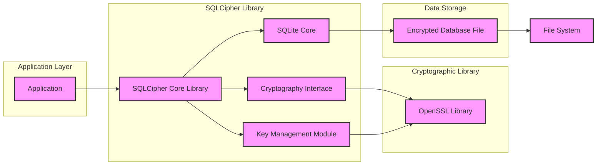
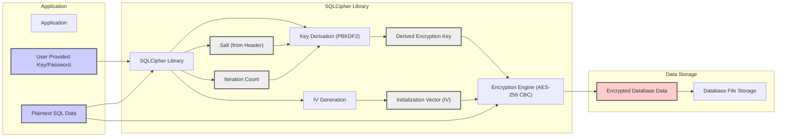

# Project Design Document: SQLCipher

**Project Name:** SQLCipher

**Project Repository:** [https://github.com/sqlcipher/sqlcipher](https://github.com/sqlcipher/sqlcipher)

**Document Version:** 1.1
**Date:** 2023-10-27
**Author:** AI Software Architect

## 1. Introduction

This document provides an enhanced design overview of SQLCipher, an open-source extension to SQLite that provides transparent and robust 256-bit AES encryption of database files. Building upon version 1.0, this document further details the system architecture, data flow, and security considerations to serve as a more comprehensive basis for threat modeling and security analysis. It aims to provide a deeper understanding of the system's inner workings and potential vulnerabilities.

## 2. Project Overview

SQLCipher extends SQLite to offer transparent, file-level encryption. It is designed for ease of integration, requiring minimal code changes for applications already using SQLite.  SQLCipher's core strength lies in its use of industry-standard cryptographic algorithms, primarily AES-256 in CBC mode, and robust key derivation using PBKDF2.  It leverages the well-vetted OpenSSL library for cryptographic primitives, ensuring a foundation built on established and scrutinized code.

**Key Features (Enhanced):**

*   **Transparent Encryption:** Seamlessly encrypts and decrypts database files, minimizing application-level changes. Applications interact with SQLCipher as they would with standard SQLite.
*   **Strong Encryption:** Employs AES-256 encryption in CBC mode, a widely recognized and robust symmetric encryption standard.
*   **Open Source & Auditable:**  Being open-source (BSD licensed) allows for public scrutiny, community contributions, and independent security audits, enhancing trust and security.
*   **Cross-Platform Compatibility:** Supports a wide range of operating systems and architectures where SQLite and OpenSSL are available, ensuring broad applicability.
*   **Password-Based Key Derivation (PBKDF2):** Securely derives encryption keys from user-provided passwords using PBKDF2, incorporating salting and iteration counts to resist brute-force attacks.
*   **Database File Format Compatibility:** Maintains compatibility with the standard SQLite database file format at a logical level, while encrypting the physical file contents.
*   **SQL API Extensions:** Provides SQL extensions for key management operations like `PRAGMA key`, `PRAGMA rekey`, and `PRAGMA cipher_migrate`, offering programmatic control over encryption settings.

## 3. System Architecture

The architecture remains fundamentally the same as described in version 1.0, but this section provides more detail and context.

**Components Description (Enhanced):**

*   **Application ("Application"):**  The application layer interacts with SQLCipher through standard SQLite APIs. It is crucial for the application to:
    *   **Securely handle and provide the encryption key:** This is often a password, but could also be a key derived from other sources. Secure input mechanisms and storage (if applicable) are paramount.
    *   **Implement robust authentication and authorization:** SQLCipher only encrypts data; access control is the application's responsibility.
    *   **Manage the lifecycle of the database connection:**  Properly closing database connections is important for resource management and potentially key management within SQLCipher.

*   **SQLCipher Core Library ("SQLCipher Core Library"):**  This is the core encryption wrapper around SQLite. Key enhancements and responsibilities include:
    *   **Cipher Initialization:**  Handles the initialization of the AES-256 cipher with the derived key and Initialization Vector (IV).
    *   **Page-Level Encryption/Decryption:** SQLCipher operates at the SQLite page level (typically 1KB or 4KB). Each page read from disk is decrypted, and each page written to disk is encrypted. This page-level approach provides granular encryption and minimizes performance overhead compared to encrypting the entire file in memory.
    *   **Header Management:**  SQLCipher modifies the SQLite database header to store metadata related to encryption, including the salt for PBKDF2 and potentially cipher algorithm identifiers. This header is also encrypted.
    *   **API Extensions:** Provides pragmas like `PRAGMA key`, `PRAGMA rekey`, and `PRAGMA cipher_migrate` to manage encryption keys and perform key changes programmatically.

*   **SQLite Core ("SQLite Core"):**  Remains the unmodified, standard SQLite engine. SQLCipher's transparency means SQLite is unaware of the encryption layer. It interacts with data as if it were plaintext, while SQLCipher handles the encryption/decryption behind the scenes.

*   **Key Management Module ("Key Management Module"):**  Critical for security. Key responsibilities are expanded:
    *   **PBKDF2 Key Derivation:**  Implements PBKDF2 using parameters like salt (typically read from the database header or generated on database creation), iteration count, and hash algorithm (SHA-512 is commonly used).  *The strength of the encryption heavily relies on sufficiently high iteration counts and a unique, randomly generated salt.*
    *   **Salt Generation and Storage:** Generates a random salt during database creation and securely stores it within the encrypted database header.
    *   **In-Memory Key Handling:** Manages the derived encryption key in memory for the duration of the database connection. *This in-memory key is a critical security consideration.*
    *   **Key Rekeying (`PRAGMA rekey`):**  Implements the `PRAGMA rekey` functionality, allowing for changing the encryption key of an existing database. This process involves decrypting and re-encrypting the entire database with the new key.
    *   **Initialization Vector (IV) Generation:**  Generates unique and unpredictable IVs for each page encryption operation.  *Proper IV generation is crucial for CBC mode security.*  Typically, IVs are derived from the page number or a counter to ensure uniqueness and avoid repetition.

*   **Cryptography Interface ("Cryptography Interface"):**  Provides an abstraction layer, primarily interacting with OpenSSL.  Key functions include:
    *   **AES-256 CBC Encryption/Decryption:**  Implements the core AES-256 CBC encryption and decryption routines.
    *   **PBKDF2 Implementation:**  Provides the PBKDF2 key derivation function.
    *   **Random Number Generation:**  Utilizes OpenSSL's random number generator for salt and IV generation. *The quality of the random number generator is vital for security.*
    *   **Hashing Algorithms (SHA-512, etc.):**  Provides hashing algorithms used within PBKDF2 and potentially for other internal security operations.

*   **OpenSSL Library ("OpenSSL Library"):**  The foundational cryptographic library.  *Regularly updating OpenSSL is crucial to address security vulnerabilities.* SQLCipher relies on OpenSSL for:
    *   AES-256 CBC cipher implementation.
    *   PBKDF2 key derivation.
    *   SHA hashing algorithms.
    *   Random number generation.

*   **Encrypted Database File ("Encrypted Database File"):**  The SQLite database file on disk, fully encrypted.  *Even metadata and indexes are encrypted.*  The file is only accessible and usable through SQLCipher with the correct key.

*   **File System ("File System"):**  The underlying file system. SQLCipher interacts with it through standard file I/O operations. *File system permissions and security are still relevant for protecting the encrypted database file from unauthorized access at the OS level.*

## 4. Data Flow Diagram (Encryption Process)

This diagram is enhanced to show the IV generation and salt usage more explicitly.

**Data Flow Description (Encryption - Enhanced):**

1.  **Plaintext Data Input ("Plaintext SQL Data"):** Application provides data to be written to the database.
2.  **Key Input ("User Provided Key/Password"):** Application provides the user key/password.
3.  **Salt Retrieval ("Salt (from Header)"):** SQLCipher retrieves the salt from the database header (or generates a new one if creating a new database).
4.  **Iteration Count Retrieval ("Iteration Count"):** SQLCipher uses a predefined or configurable iteration count for PBKDF2.
5.  **Key Derivation ("Key Derivation (PBKDF2)"):** PBKDF2 uses the user key/password, salt, and iteration count to derive the encryption key.
6.  **Derived Key Output ("Derived Encryption Key"):** The strong encryption key is generated.
7.  **IV Generation ("IV Generation"):** SQLCipher generates a unique IV for the current page being encrypted, often based on the page number or a counter.
8.  **IV Output ("Initialization Vector (IV)"):** The generated IV is ready for use.
9.  **Encryption ("Encryption Engine (AES-256 CBC)"):** The plaintext data (page) is encrypted using AES-256 CBC with the derived key and the generated IV.
10. **Encrypted Data Output ("Encrypted Database Data"):** The encrypted page data is produced.
11. **Database File Storage ("Database File Storage"):** The encrypted page is written to the database file.

## 5. Security Considerations (Enhanced and Expanded)

This section provides a more detailed and structured breakdown of security considerations.

*   **Encryption Algorithm & Mode:**
    *   **AES-256 CBC:** While robust, CBC mode requires careful IV management.  *Improper IV handling is a classic vulnerability.* SQLCipher's page-level IV generation is crucial here.
    *   **Algorithm Choice:** AES-256 is currently considered secure. Future cryptographic advancements might necessitate considering algorithm agility and potential upgrades.

*   **Key Derivation Function (PBKDF2) Parameters:**
    *   **Iteration Count:**  *The most critical parameter for PBKDF2 security.*  Insufficient iteration counts drastically reduce brute-force resistance.  Default values should be reviewed and increased based on current security recommendations and hardware capabilities.  Higher iteration counts increase CPU usage during database opening.
    *   **Salt:**  *Must be unique and randomly generated for each database.* SQLCipher handles salt generation and storage in the header.
    *   **Hash Algorithm:** SHA-512 is a strong choice.  The hash algorithm should be resistant to collision attacks.

*   **Key Management (Detailed):**
    *   **Password Security:**  *The weakest link in password-based encryption.*  SQLCipher's security is fundamentally limited by user password strength.  Applications should enforce strong password policies and consider multi-factor authentication where appropriate.
    *   **In-Memory Key Storage Vulnerability:**  The derived key in memory is susceptible to memory dumping, cold boot attacks, and malware that can access process memory.  *This is an inherent risk of in-memory key management.*  Mitigations include:
        *   **Memory Protection:** OS-level memory protection mechanisms can limit access to process memory.
        *   **Short-Lived Keys:**  Minimizing the time the key is held in memory reduces the window of opportunity for attacks. However, frequent key re-derivation can impact performance.
        *   **Hardware Security Modules (HSMs) or Secure Enclaves (Future Consideration):**  For highly sensitive applications, exploring integration with HSMs or secure enclaves to store and manage keys outside of application memory could be considered in future SQLCipher enhancements.
    *   **Key Exchange/Distribution:** Password-based key exchange is inherently insecure if passwords are transmitted or stored insecurely.  *Out-of-band key exchange or pre-shared keys are more secure alternatives for certain use cases, but SQLCipher primarily focuses on password-based scenarios.*
    *   **Key Rotation (`PRAGMA rekey`):**  `PRAGMA rekey` provides a mechanism for changing the encryption key.  Regular key rotation is a security best practice, especially if there's a suspicion of key compromise.  The rekeying process itself needs to be secure and atomic to prevent data corruption.

*   **OpenSSL Dependency (Detailed):**
    *   **Vulnerability Management:**  *Critical dependency.*  Organizations using SQLCipher must have a robust process for monitoring OpenSSL security advisories and promptly updating OpenSSL libraries used by SQLCipher and applications.
    *   **Supply Chain Security:**  Ensure the integrity of the OpenSSL library being used.  Use official sources and verify checksums to prevent supply chain attacks.

*   **Initialization Vector (IV) Management (Detailed):**
    *   **Uniqueness and Randomness:**  *Absolutely essential for CBC mode security.*  IVs must be unique for each page encryption.  SQLCipher's page-number or counter-based IV generation is a common and generally secure approach, *assuming the page number/counter is handled correctly and doesn't repeat.*
    *   **Predictable IVs:**  Using predictable or repeating IVs completely breaks CBC mode encryption, allowing attackers to decrypt data and potentially inject malicious content.

*   **Side-Channel Attacks (Expanded):**
    *   **Timing Attacks:**  Cryptographic operations can sometimes leak information through timing variations.  While AES is generally resistant, specific implementations or hardware might introduce vulnerabilities.  *Consider timing attack resistance, especially in high-security contexts.*
    *   **Power Analysis Attacks:**  In embedded systems or hardware security modules, power consumption variations during cryptographic operations can leak information.  Less relevant for typical software deployments of SQLCipher but important in specialized hardware environments.

*   **Integrity Protection (Expanded):**
    *   **Lack of Native Integrity Checks:** SQLCipher primarily focuses on confidentiality.  It does not inherently provide data integrity verification like HMAC or digital signatures.  *Tampering with the encrypted database file might not be immediately detected by SQLCipher itself.*
    *   **SQLite Integrity Checks:** SQLite has its own integrity checks (`PRAGMA integrity_check`), but these operate on the *decrypted* data.  They will detect corruption introduced *after* decryption, but not necessarily malicious modifications to the *encrypted* file.
    *   **Application-Level Integrity:**  For applications requiring strong data integrity, consider implementing application-level integrity checks, such as:
        *   **HMAC:** Calculate an HMAC over critical data and store it separately or within the database. Verify the HMAC on data retrieval.
        *   **Digital Signatures:**  Digitally sign critical data to ensure authenticity and integrity.

*   **Authentication and Authorization (Application Level - Emphasized):**
    *   *SQLCipher provides encryption, not access control.*  Robust authentication and authorization are *entirely the responsibility of the application*.  Threat modeling must thoroughly analyze application-level access control mechanisms.
    *   **Authentication Methods:**  Consider strong authentication methods beyond simple passwords, such as multi-factor authentication, biometrics, or certificate-based authentication.
    *   **Authorization Policies:**  Implement granular authorization policies to control user access to specific data and operations within the database.

*   **Error Handling and Information Disclosure (Expanded):**
    *   **Error Messages:**  *Carefully review error messages generated by SQLCipher and the application.*  Verbose error messages might inadvertently disclose sensitive information about the database structure, encryption settings, or internal states.
    *   **Exception Handling:**  Ensure proper exception handling to prevent sensitive data from being logged or displayed in error outputs.  Log errors securely and avoid exposing encryption-related details in logs accessible to unauthorized parties.

*   **Vulnerability Management and Updates (Emphasized):**
    *   *Proactive Monitoring:**  Actively monitor security advisories for SQLCipher, OpenSSL, and SQLite.
    *   **Timely Updates:**  Establish a process for promptly applying security updates to SQLCipher, OpenSSL, SQLite, and the application itself.
    *   **Dependency Management:**  Use dependency management tools to track and update dependencies effectively.

*   **Deployment Considerations (New Section):**
    *   **Secure Key/Password Input:**  Use secure input methods for passwords (e.g., avoiding command-line arguments, using secure prompts).
    *   **Secure Storage of Initial Key (If Applicable):**  If the key is not derived from a user password but is pre-shared or generated, ensure its secure storage and distribution.  Consider secrets management systems.
    *   **Secure Communication Channels:**  If the application interacts with the database over a network, use encrypted communication channels (e.g., TLS/SSL) to protect the key and data in transit.
    *   **File System Permissions:**  Set appropriate file system permissions on the encrypted database file to restrict access to authorized users and processes at the OS level.

## 6. Assumptions and Constraints (Refined)

*   **Assumption:** Application developers understand and implement secure coding practices, especially regarding password handling, input validation, and error handling.
*   **Assumption:** Users are educated about the importance of strong passwords and secure password management practices.
*   **Constraint:** Performance overhead is inherent due to encryption and decryption.  Performance impact should be tested and considered during application design.  *Iteration count in PBKDF2 directly impacts performance.*
*   **Constraint:** Reliance on OpenSSL introduces a dependency and necessitates ongoing vulnerability management for OpenSSL.
*   **Constraint:** In-memory key storage is a fundamental design choice in SQLCipher, introducing inherent risks that need to be mitigated through other security measures.
*   **Constraint:** SQLCipher's encryption is file-level.  It does not protect data in memory during application processing or in temporary files created by SQLite or the application (though SQLite's temporary files are typically also within the same directory and thus encrypted by SQLCipher's file-level encryption).

## 7. Threat Modeling Focus Areas (Refined and Prioritized)

Based on the enhanced security considerations, the threat modeling should prioritize these areas:

1.  **Key Management Security (Highest Priority):**
    *   PBKDF2 parameter strength (iteration count, salt generation).
    *   In-memory key protection and vulnerability to memory compromise.
    *   Key rotation mechanisms and security of the rekeying process.
    *   Secure initial key/password input and handling.

2.  **Password Strength and User Education:**
    *   Effectiveness of password policies and user education in promoting strong passwords.
    *   Risk of weak passwords compromising encryption.

3.  **OpenSSL Vulnerability Management:**
    *   Process for monitoring, patching, and updating OpenSSL.
    *   Impact of OpenSSL vulnerabilities on SQLCipher security.

4.  **Application-Level Authentication and Authorization:**
    *   Robustness of application's access control mechanisms.
    *   Prevention of unauthorized access to the database even with encryption.

5.  **Error Handling and Information Disclosure:**
    *   Risk of sensitive information leakage through error messages and logs.
    *   Secure error handling practices in the application and SQLCipher integration.

6.  **Integrity Protection (If Required):**
    *   Need for application-level integrity checks (HMAC, digital signatures).
    *   Mitigation of data tampering risks.

7.  **Side-Channel Attack Analysis (Context Dependent):**
    *   Relevance and risk of side-channel attacks in the specific deployment environment.
    *   Potential mitigations if side-channel attacks are a concern.

8.  **Deployment Security:**
    *   Secure configuration of the deployment environment.
    *   File system permissions, secure communication channels, and secure key storage during deployment.

## 8. Conclusion

This enhanced design document provides a more detailed and comprehensive understanding of SQLCipher's architecture and security considerations. By focusing threat modeling efforts on the prioritized areas, particularly key management and application-level security, organizations can effectively assess and mitigate risks associated with using SQLCipher.  Regular review and updates of this document are essential to reflect evolving security landscapes and project developments.  This document serves as a more robust foundation for building secure applications using SQLCipher.