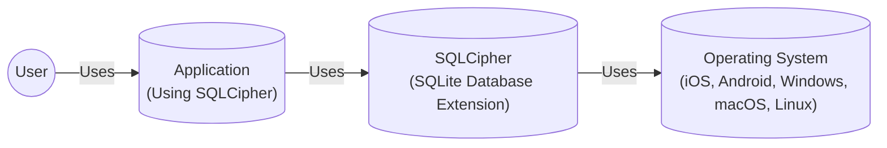
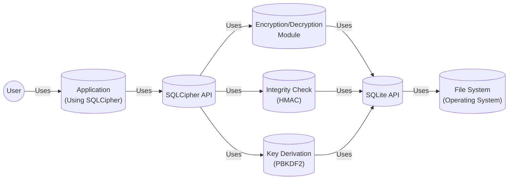
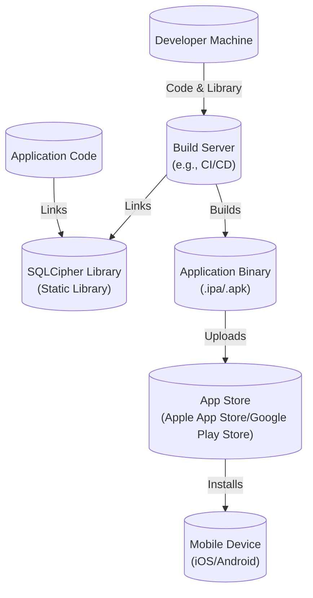
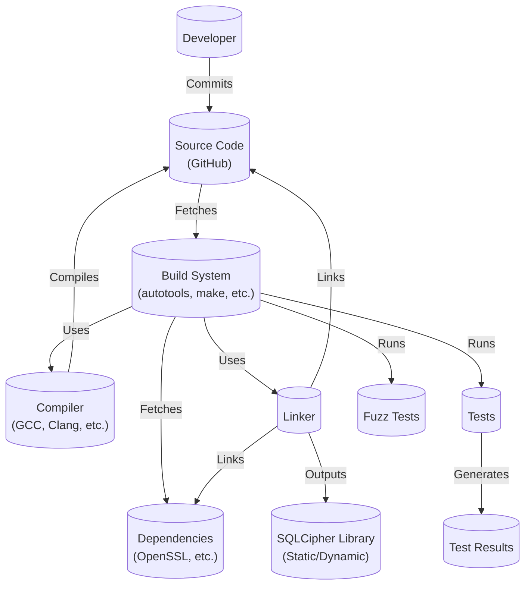

# BUSINESS POSTURE

SQLCipher is an open-source extension to SQLite that provides transparent 256-bit AES encryption of database files. It's used to protect sensitive data stored in SQLite databases, particularly in mobile applications and embedded systems.

Priorities and Goals:

*   Provide robust, transparent database encryption.
*   Maintain compatibility with standard SQLite API.
*   Minimize performance overhead.
*   Ensure cross-platform compatibility.
*   Maintain a strong open-source community.
*   Provide commercial support and licensing options.

Business Risks:

*   Compromise of encryption keys: If the encryption keys are compromised, the entire database is vulnerable.
*   Vulnerabilities in the encryption implementation: Bugs or weaknesses in the cryptographic algorithms or their implementation could allow attackers to bypass the encryption.
*   Performance bottlenecks: Poorly optimized encryption can significantly slow down database operations, impacting application performance.
*   Compatibility issues: Changes to SQLite or the underlying operating system could break compatibility, requiring significant maintenance effort.
*   Supply chain attacks: Compromise of the build process or dependencies could introduce malicious code into SQLCipher.
*   Lack of adoption: If developers don't trust or adopt SQLCipher, its impact and sustainability are limited.
*   Legal and compliance issues: Failure to comply with relevant data protection regulations (e.g., GDPR, HIPAA) when using SQLCipher could lead to legal penalties.

# SECURITY POSTURE

Existing Security Controls:

*   security control: 256-bit AES encryption: SQLCipher uses 256-bit AES in CBC mode for database encryption. (Implemented in the core encryption module)
*   security control: PBKDF2 key derivation: Password-Based Key Derivation Function 2 (PBKDF2) is used to derive encryption keys from user-provided passwords. (Implemented in the key derivation module)
*   security control: HMAC for integrity: Hashed Message Authentication Code (HMAC) is used to ensure data integrity and prevent tampering. (Implemented in the integrity check module)
*   security control: Random number generation: Secure random number generators are used for key generation and initialization vectors. (Implemented using platform-specific APIs)
*   security control: Code reviews: The project likely undergoes code reviews to identify and fix potential security vulnerabilities. (Mentioned in community guidelines and contribution process)
*   security control: Community scrutiny: Being open-source, SQLCipher benefits from scrutiny by the security community, helping to identify and address vulnerabilities. (Implicit in the open-source nature of the project)
*   security control: Fuzz testing: SQLCipher uses fuzz testing to improve security. (Described in test/fuzz directory)

Accepted Risks:

*   accepted risk: Side-channel attacks: SQLCipher may be vulnerable to side-channel attacks (e.g., timing attacks, power analysis) that could leak information about the encryption keys or data. Mitigation is complex and may impact performance.
*   accepted risk: Key management: Secure key management is ultimately the responsibility of the application using SQLCipher. SQLCipher itself does not provide a key management solution.
*   accepted risk: Brute-force attacks: If a weak password is used, the database may be vulnerable to brute-force or dictionary attacks.

Recommended Security Controls:

*   security control: Implement countermeasures against side-channel attacks where feasible, prioritizing those with minimal performance impact.
*   security control: Provide comprehensive documentation and guidance on secure key management best practices for developers using SQLCipher.
*   security control: Integrate with hardware security modules (HSMs) or secure enclaves where available to enhance key protection.
*   security control: Regularly perform security audits and penetration testing by independent experts.
*   security control: Implement a robust vulnerability disclosure program to encourage responsible reporting of security issues.
*   security control: Explore the use of authenticated encryption modes (e.g., AES-GCM) to provide both confidentiality and integrity with improved performance.

Security Requirements:

*   Authentication:
    *   SQLCipher relies on a passphrase provided by the application to unlock the database. There is no built-in user authentication mechanism beyond this.
    *   Requirement: The application using SQLCipher must securely manage the passphrase, preventing unauthorized access.

*   Authorization:
    *   SQLCipher itself does not implement authorization mechanisms. Authorization is handled by the application logic using standard SQLite permissions or custom access control mechanisms.
    *   Requirement: The application must implement appropriate authorization controls to restrict access to sensitive data within the database.

*   Input Validation:
    *   SQLCipher does not perform input validation beyond what is inherent in SQLite. SQL injection vulnerabilities are possible if the application does not properly sanitize user inputs.
    *   Requirement: The application using SQLCipher must implement robust input validation and parameterized queries to prevent SQL injection attacks.

*   Cryptography:
    *   SQLCipher uses 256-bit AES encryption in CBC mode with PBKDF2 for key derivation and HMAC for integrity checks.
    *   Requirement: The cryptographic algorithms and parameters must be kept up-to-date with industry best practices.
    *   Requirement: The implementation must be regularly reviewed for potential vulnerabilities.
    *   Requirement: Random number generation must use cryptographically secure sources.

# DESIGN

## C4 CONTEXT

Element Descriptions:

*   Element:
    *   Name: User
    *   Type: Person
    *   Description: A person interacting with an application that uses SQLCipher.
    *   Responsibilities: Provides input to the application, views data from the application.
    *   Security controls: None (relies on application-level security).

*   Element:
    *   Name: Application
    *   Type: Software System
    *   Description: A software application that uses SQLCipher to store data securely.
    *   Responsibilities: Manages user interactions, processes data, interacts with SQLCipher to store and retrieve data.
    *   Security controls: Input validation, parameterized queries, secure key management, authentication, authorization.

*   Element:
    *   Name: SQLCipher
    *   Type: Software System (Library)
    *   Description: An open-source extension to SQLite that provides transparent database encryption.
    *   Responsibilities: Encrypts and decrypts data written to and read from the database, manages encryption keys (derived from passphrase), ensures data integrity.
    *   Security controls: 256-bit AES encryption, PBKDF2 key derivation, HMAC integrity checks, secure random number generation.

*   Element:
    *   Name: Operating System
    *   Type: Software System
    *   Description: The underlying operating system on which the application and SQLCipher run.
    *   Responsibilities: Provides file system access, memory management, cryptographic primitives (random number generation, etc.).
    *   Security controls: OS-level security features (e.g., ASLR, DEP), file system permissions.

## C4 CONTAINER

Since SQLCipher is a library, the container diagram is essentially an extension of the context diagram.

Element Descriptions:

*   Element:
    *   Name: User
    *   Type: Person
    *   Description: A person interacting with an application that uses SQLCipher.
    *   Responsibilities: Provides input to the application, views data from the application.
    *   Security controls: None (relies on application-level security).

*   Element:
    *   Name: Application
    *   Type: Software System
    *   Description: A software application that uses SQLCipher to store data securely.
    *   Responsibilities: Manages user interactions, processes data, interacts with SQLCipher to store and retrieve data.
    *   Security controls: Input validation, parameterized queries, secure key management, authentication, authorization.

*   Element:
    *   Name: SQLCipher API
    *   Type: API
    *   Description: The interface through which the application interacts with SQLCipher.  Provides functions for opening, closing, reading, and writing to encrypted databases.
    *   Responsibilities: Exposes SQLCipher functionality to the application.
    *   Security controls: API-level access controls (if any).

*   Element:
    *   Name: Encryption/Decryption Module
    *   Type: Component
    *   Description: Handles the encryption and decryption of data using AES-256.
    *   Responsibilities: Encrypts data before writing to disk, decrypts data after reading from disk.
    *   Security controls: AES-256 encryption.

*   Element:
    *   Name: Key Derivation (PBKDF2)
    *   Type: Component
    *   Description: Derives encryption keys from the user-provided passphrase using PBKDF2.
    *   Responsibilities: Generates secure encryption keys from passwords.
    *   Security controls: PBKDF2 with a high iteration count.

*   Element:
    *   Name: Integrity Check (HMAC)
    *   Type: Component
    *   Description: Calculates and verifies HMACs to ensure data integrity.
    *   Responsibilities: Detects tampering or corruption of the database file.
    *   Security controls: HMAC-SHA256 (or similar).

*   Element:
    *   Name: SQLite API
    *   Type: API
    *   Description: The standard SQLite API, modified by SQLCipher to intercept read/write operations.
    *   Responsibilities: Provides database management functions (creating tables, inserting data, querying data).
    *   Security controls: Standard SQLite security features.

*   Element:
    *   Name: File System
    *   Type: Software System (Operating System)
    *   Description: The underlying file system provided by the operating system.
    *   Responsibilities: Stores the encrypted database file.
    *   Security controls: OS-level file system permissions.

## DEPLOYMENT

SQLCipher is a library, and its deployment is tied to the application that uses it. There are several deployment scenarios:

1.  **Mobile Application (iOS/Android):** The SQLCipher library is typically statically linked into the application binary. The application is then distributed through the respective app stores.
2.  **Desktop Application (Windows, macOS, Linux):** SQLCipher can be statically linked or dynamically linked (as a DLL or shared object). The application, along with any required SQLCipher libraries, is packaged and distributed to users.
3.  **Embedded Systems:** SQLCipher is often cross-compiled and statically linked into the embedded application. The entire firmware image is then deployed to the device.
4.  **Server-side Applications:** While less common, SQLCipher can be used in server-side applications.  It would be linked (statically or dynamically) with the server application and deployed to the server environment.

We'll describe the Mobile Application (iOS/Android) scenario in detail:

Element Descriptions:

*   Element:
    *   Name: Developer Machine
    *   Type: Infrastructure Node
    *   Description: The developer's workstation where the application code and SQLCipher library are integrated.
    *   Responsibilities: Code development, testing, initial build.
    *   Security controls: Development environment security best practices.

*   Element:
    *   Name: Build Server (e.g., CI/CD)
    *   Type: Infrastructure Node
    *   Description: A server that automates the build process, potentially including code signing and testing.
    *   Responsibilities: Builds the application binary, runs tests, signs the application.
    *   Security controls: Secure build environment, access controls, code signing key protection.

*   Element:
    *   Name: App Store (Apple App Store/Google Play Store)
    *   Type: Infrastructure Node
    *   Description: The platform through which the application is distributed to users.
    *   Responsibilities: Hosts the application binary, manages updates, handles installation on user devices.
    *   Security controls: App store security review process, code signing verification.

*   Element:
    *   Name: Mobile Device (iOS/Android)
    *   Type: Infrastructure Node
    *   Description: The user's mobile device where the application is installed.
    *   Responsibilities: Runs the application, stores the encrypted database.
    *   Security controls: OS-level security features (sandboxing, data protection), device passcode/biometrics.

*   Element:
    *   Name: SQLCipher Library (Static Library)
    *   Type: Software Component
    *   Description: The compiled SQLCipher library, statically linked into the application.
    *   Responsibilities: Provides encryption/decryption functionality.
    *   Security controls: See previous sections.

*   Element:
    *   Name: Application Code
    *   Type: Software Component
    *   Description: The source code of the mobile application.
    *   Responsibilities: Implements application logic, interacts with SQLCipher.
    *   Security controls: See previous sections.

*   Element:
    *   Name: Application Binary (.ipa/.apk)
    *   Type: Software Artifact
    *   Description: The compiled and packaged application, ready for distribution.
    *   Responsibilities: Contains the application code and the linked SQLCipher library.
    *   Security controls: Code signing.

## BUILD

The build process for SQLCipher varies depending on the target platform and build system. A common approach involves using a combination of autotools, makefiles, and platform-specific build tools (e.g., Xcode for iOS, Android NDK for Android).

Security Controls in the Build Process:

*   security control: Dependency Management: SQLCipher relies on external dependencies (e.g., OpenSSL for cryptography). The build process should ensure that these dependencies are up-to-date and free of known vulnerabilities. Using a package manager and verifying checksums/signatures is crucial.
*   security control: Secure Build Environment: The build environment (whether a developer's machine or a CI/CD server) should be secured to prevent unauthorized access or modification of the build process.
*   security control: Compiler Warnings and Errors: The build process should be configured to treat warnings as errors, ensuring that potential code quality issues are addressed.
*   security control: Static Analysis: Static analysis tools (e.g., linters, SAST scanners) should be integrated into the build process to identify potential security vulnerabilities in the code.
*   security control: Dynamic Analysis: Dynamic analysis tools (e.g., fuzzers) are used to test SQLCipher for vulnerabilities by providing unexpected inputs.
*   security control: Code Signing: The compiled SQLCipher library (especially for distribution) should be code-signed to ensure its authenticity and integrity.
*   security control: Reproducible Builds: Aim for reproducible builds, where the same source code and build environment consistently produce the same binary output. This helps verify that the build process has not been tampered with.
*   security control: Supply Chain Security: Use Software Bill of Materials (SBOM) to track all components and dependencies.

# RISK ASSESSMENT

Critical Business Processes:

*   Protecting user data stored in SQLite databases.
*   Maintaining the integrity and confidentiality of sensitive information.
*   Ensuring the availability and performance of applications using SQLCipher.
*   Maintaining the reputation and trust of SQLCipher as a secure solution.

Data Sensitivity:

*   The data stored in SQLCipher-protected databases is considered highly sensitive. The sensitivity level depends on the specific application using SQLCipher, but it can range from personally identifiable information (PII) to financial data, health records, or other confidential information. The data sensitivity is determined by the application using SQLCipher, not by SQLCipher itself.

# QUESTIONS & ASSUMPTIONS

Questions:

*   Are there any specific compliance requirements (e.g., GDPR, HIPAA, PCI DSS) that need to be considered for applications using SQLCipher?
*   What is the expected threat model for applications using SQLCipher (e.g., targeted attacks, opportunistic attacks)?
*   What are the performance requirements for applications using SQLCipher?
*   What key management solutions are typically used in conjunction with SQLCipher?
*   What level of support and maintenance is provided for SQLCipher?
*   What is process of reporting security vulnerabilities?

Assumptions:

*   BUSINESS POSTURE: The primary goal is to provide strong, transparent database encryption with minimal performance overhead.
*   SECURITY POSTURE: Secure key management is the responsibility of the application using SQLCipher.
*   DESIGN: SQLCipher is primarily used as a statically linked library in mobile and embedded applications.
*   DESIGN: The build process uses standard tools and practices, with a focus on security.
*   DESIGN: Developers using SQLCipher are responsible for implementing proper input validation and authorization mechanisms within their applications.