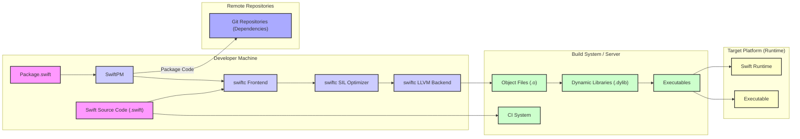

## Project Design Document: Swift Programming Language (Improved)

**1. Introduction**

*   **1.1 Purpose:** This document provides a detailed architectural overview of the Swift programming language project, focusing on aspects relevant to threat modeling. It outlines the key components, their interactions, data flows, and trust boundaries within the system. This document serves as a foundation for identifying potential security vulnerabilities and designing mitigation strategies.
*   **1.2 Scope:** This document covers the core components of the Swift project, including the compiler frontend and backend, standard library, package manager, and runtime environment. It also addresses the development and contribution processes, highlighting potential security implications. The focus is on the logical architecture and key interactions, not low-level implementation details.
*   **1.3 Audience:** This document is intended for security engineers, software architects, developers, and anyone involved in the threat modeling process for the Swift project. It assumes a basic understanding of software development principles.

**2. System Overview**

*   **2.1 High-Level Description:** The Swift project is an open-source initiative focused on the development and maintenance of the Swift programming language. It aims to provide a safe, fast, and expressive language suitable for a wide range of applications. The project encompasses the compiler, essential libraries, and tools necessary for developing and running Swift code.
*   **2.2 Key Goals (Security Focused):**
    *   **Memory Safety:** Prevent common memory-related errors like buffer overflows and dangling pointers.
    *   **Type Safety:** Enforce strong typing to reduce runtime errors and potential vulnerabilities.
    *   **Sandboxing Capabilities:** Enable the development of secure and isolated applications.
    *   **Secure Dependency Management:** Ensure the integrity and trustworthiness of external packages.
    *   **Robust Error Handling:** Provide mechanisms for graceful error recovery and prevent information leakage.
*   **2.3 Architectural Principles (Security Focused):**
    *   **Principle of Least Privilege:** Components should only have the necessary permissions and access.
    *   **Defense in Depth:** Implement multiple layers of security controls.
    *   **Secure Defaults:**  Default configurations should be secure.
    *   **Input Validation:**  Rigorous validation of all external inputs.
    *   **Code Review and Testing:**  Employ thorough code review and testing practices to identify vulnerabilities.

**3. Key Components**

*   **3.1 Swift Compiler (`swiftc`):**
    *   **Description:** The central component responsible for translating human-readable Swift source code into executable machine code. It involves a multi-stage process.
    *   **Functionality:**
        *   **Lexing:** Converts the source code into a stream of tokens.
        *   **Parsing:**  Constructs an Abstract Syntax Tree (AST) from the tokens, representing the program's structure.
        *   **Semantic Analysis:** Performs type checking, resolves symbols, and ensures the program adheres to the language's rules.
        *   **SIL Generation:** Translates the AST into Swift Intermediate Language (SIL), a high-level intermediate representation.
        *   **SIL Optimization:** Applies Swift-specific optimizations to the SIL code.
        *   **LLVM IR Generation:** Converts the optimized SIL into LLVM Intermediate Representation, a lower-level IR.
        *   **LLVM Optimization:** Leverages LLVM's optimization passes for further performance improvements.
        *   **Code Generation:**  Generates machine code for the target platform.
    *   **Sub-components:**
        *   **Frontend (Parser, Type Checker, Semantic Analyzer):** Responsible for understanding the Swift code.
        *   **SIL Optimizer:**  Optimizes the Swift-specific intermediate representation.
        *   **LLVM Backend (IR Generator, Optimizer, Code Generator):**  Leverages the LLVM infrastructure for lower-level compilation tasks.
    *   **Trust Boundaries:** The compiler operates on developer-provided source code. The frontend must carefully validate this input to prevent malicious code from influencing the compilation process. The boundary between the Swift-specific parts and the LLVM backend is also a potential trust boundary.
*   **3.2 Swift Standard Library:**
    *   **Description:** Provides fundamental data types, collections, and functions essential for writing Swift programs. It aims to be both performant and secure.
    *   **Functionality:**
        *   Basic data types (e.g., `"Int"`, `"String"`, `"Bool"`).
        *   Collection types (e.g., `"Array"`, `"Dictionary"`, `"Set"`).
        *   Fundamental algorithms and utilities (e.g., sorting, searching).
        *   Protocols for defining common interfaces and behaviors.
        *   Low-level system interfaces.
    *   **Implementation:** Primarily written in Swift, with performance-critical or platform-specific parts potentially implemented in C or C++.
    *   **Trust Boundaries:** The standard library is generally trusted code. However, vulnerabilities within it can have widespread impact. Interactions with external systems or data through the standard library require careful consideration.
*   **3.3 Swift Package Manager (SwiftPM):**
    *   **Description:** A tool for managing dependencies and building Swift projects. It plays a crucial role in the security of the software supply chain.
    *   **Functionality:**
        *   **Dependency Resolution:**  Analyzes `Package.swift` files to determine project dependencies.
        *   **Package Downloading:** Fetches package source code from remote Git repositories.
        *   **Build System Integration:**  Integrates with the Swift compiler to build dependencies and the main project.
        *   **Version Management:**  Handles package versions and compatibility constraints.
        *   **Checksum Verification:**  Verifies the integrity of downloaded packages using checksums.
    *   **Data Sources:** Reads `"Package.swift"` manifest files, interacts with remote Git repositories, and potentially package registries.
    *   **Trust Boundaries:**  SwiftPM interacts with external, potentially untrusted, package repositories. The integrity of downloaded packages and the security of the Git repositories are critical. The `"Package.swift"` file itself is developer-provided input.
*   **3.4 Swift Runtime:**
    *   **Description:** A set of libraries and support code required to execute Swift programs. It manages memory, handles errors, and provides essential runtime services.
    *   **Functionality:**
        *   **Memory Management (ARC):**  Automatic Reference Counting to manage object lifetimes.
        *   **Dynamic Dispatch:**  Mechanism for selecting the correct method implementation at runtime.
        *   **Reflection:**  Ability to inspect and manipulate types and objects at runtime.
        *   **Error Handling:**  Provides mechanisms for throwing and catching errors.
        *   **Concurrency Support:**  Integration with Grand Central Dispatch (GCD) or other concurrency models.
        *   **Platform Abstraction:**  Provides an interface to interact with the underlying operating system.
    *   **Platform Specificity:** The runtime has platform-specific implementations to interact with the kernel and system libraries.
    *   **Trust Boundaries:** The runtime is generally trusted. However, vulnerabilities in the runtime can lead to serious security issues, as all Swift code relies on it. Interactions with the operating system are also a potential area for vulnerabilities.
*   **3.5 Development Tools:**
    *   **Description:** A suite of tools that aid in the development, debugging, and analysis of Swift applications.
    *   **Examples:**
        *   **Swift REPL:**  Interactive environment for executing Swift code.
        *   **SourceKit-LSP:** Provides language server protocol support for IDE features.
        *   **Swift Format:**  Code formatting tool.
        *   **SwiftLint:**  Linter for enforcing coding style and conventions.
        *   **LLDB (Debugger):**  Used for debugging Swift applications.
    *   **Trust Boundaries:** Development tools operate on developer machines and interact with project files. Vulnerabilities in these tools could compromise the developer's environment or introduce malicious code into the project.
*   **3.6 Community Infrastructure:**
    *   **Description:** The infrastructure supporting the open-source development and contribution process for Swift.
    *   **Components:**
        *   **GitHub Repositories:** Hosting the source code, issue tracking, and pull requests. Security measures include access controls, branch protection rules, and vulnerability scanning.
        *   **Swift Forums:**  Platform for discussions and community support. Moderation and reporting mechanisms are important for security.
        *   **Continuous Integration (CI) Systems:** Automated building and testing of code changes. Security involves securing the CI pipelines and preventing malicious code injection.
        *   **Issue Tracker:**  For reporting and managing bugs and feature requests. Proper handling of security-sensitive issues is crucial.
        *   **Contribution Process:**  Guidelines and procedures for contributing code, including code review requirements and security checks.
    *   **Trust Boundaries:** The community infrastructure involves interactions with external contributors. Security measures are necessary to prevent malicious contributions and maintain the integrity of the codebase.

**4. Data Flow Diagram (Detailed)**

*   **Description:** This diagram provides a more detailed view of the data flow, particularly within the compilation process.
*   **Key Flows:**
    *   Swift source code is processed by the compiler frontend.
    *   SwiftPM manages external dependencies.
    *   The compiler proceeds through SIL optimization and LLVM backend stages.
    *   Build artifacts are generated and linked.
    *   The runtime environment executes the final executable.

**5. Security Considerations (Detailed)**

*   **Compiler Security:**
    *   **Frontend Vulnerabilities:**  Buffer overflows or format string bugs in the parser could be exploited by crafting malicious source code. Type confusion issues in the type checker could lead to incorrect code generation.
    *   **Backend Vulnerabilities:**  Bugs in the SIL optimizer or LLVM backend could lead to the generation of insecure machine code, such as code that bypasses security checks or introduces memory corruption.
    *   **Supply Chain Attacks:**  Compromise of the compiler build process or dependencies could lead to the distribution of a backdoored compiler.
*   **Standard Library Security:**
    *   **Memory Safety Issues:**  Bugs in standard library functions could lead to buffer overflows, use-after-free vulnerabilities, or other memory corruption issues.
    *   **Input Validation Failures:**  Standard library functions that handle external input (e.g., file I/O, network operations) must perform thorough validation to prevent injection attacks or other vulnerabilities.
    *   **Cryptographic Weaknesses:**  If the standard library provides cryptographic primitives, they must be implemented correctly and securely.
*   **Package Manager Security:**
    *   **Dependency Confusion:** Attackers could publish malicious packages with the same name as legitimate internal packages, leading developers to inadvertently include them in their projects.
    *   **Typosquatting:**  Attackers could register package names that are similar to popular packages, hoping that developers will make typos and download the malicious package.
    *   **Compromised Repositories:** If a package repository is compromised, attackers could inject malicious code into existing packages.
    *   **Insecure Download Protocols:**  Using insecure protocols like HTTP for downloading packages could allow man-in-the-middle attacks.
    *   **Lack of Integrity Checks:**  Insufficient or missing checksum verification could allow attackers to distribute tampered packages.
*   **Runtime Security:**
    *   **Memory Safety Issues in ARC:**  Bugs in the ARC implementation could lead to memory leaks or use-after-free vulnerabilities.
    *   **Exploitable Reflection Mechanisms:**  Uncontrolled use of reflection could allow attackers to bypass security restrictions or manipulate object state.
    *   **Vulnerabilities in Dynamic Dispatch:**  If not implemented carefully, dynamic dispatch mechanisms could be exploited to execute arbitrary code.
    *   **Concurrency Issues:**  Race conditions or other concurrency bugs in the runtime could lead to exploitable vulnerabilities.
    *   **Operating System Interaction Vulnerabilities:**  Bugs in the runtime's interaction with the operating system could be exploited to gain unauthorized access or escalate privileges.
*   **Development Tool Security:**
    *   **Code Injection:** Vulnerabilities in IDE plugins or build tools could allow attackers to inject malicious code into the build process.
    *   **Exposure of Sensitive Information:**  Development tools might inadvertently expose sensitive information, such as API keys or credentials.
    *   **Local Privilege Escalation:**  Vulnerabilities in development tools running with elevated privileges could allow attackers to gain control of the developer's machine.
*   **Community Infrastructure Security:**
    *   **Compromised Accounts:**  Attackers could gain access to developer accounts on GitHub or other platforms and push malicious code.
    *   **Malicious Pull Requests:**  Attackers could submit pull requests containing malicious code. Thorough code review is essential to prevent this.
    *   **Vulnerabilities in CI/CD Pipelines:**  Attackers could exploit vulnerabilities in the CI/CD system to inject malicious code into builds or releases.
    *   **Social Engineering:**  Attackers could use social engineering tactics to trick developers into introducing vulnerabilities.

**6. Deployment Environment**

*   **Target Platforms:** (Same as before, but with security implications) The diverse range of target platforms means that security considerations must be tailored to each environment. For example, sandboxing capabilities are more critical on mobile platforms.
*   **Execution Models:** (Same as before, but with security implications) Server-side Swift deployments require careful attention to web security best practices. Embedded systems may have limited resources for security measures.

**7. Technologies Used**

*   **Programming Languages:** (Same as before) The security properties of these underlying languages can also impact the overall security of Swift.
*   **Compiler Infrastructure:** LLVM's security is also a factor.
*   **Build System:** The security of the build system is crucial for preventing supply chain attacks.
*   **Version Control:** Git's security features help maintain code integrity.
*   **Continuous Integration:** The security of the CI system is paramount.

**8. Future Considerations (Security Focused)**

*   Further development of memory safety features and tools.
*   Enhanced static analysis and fuzzing efforts to identify vulnerabilities.
*   Improved tooling for secure dependency management.
*   Formal verification of critical components.
*   Regular security audits and penetration testing.
*   Community engagement in security vulnerability reporting and disclosure.

This improved document provides a more detailed and security-focused architectural overview of the Swift project, suitable for in-depth threat modeling activities.