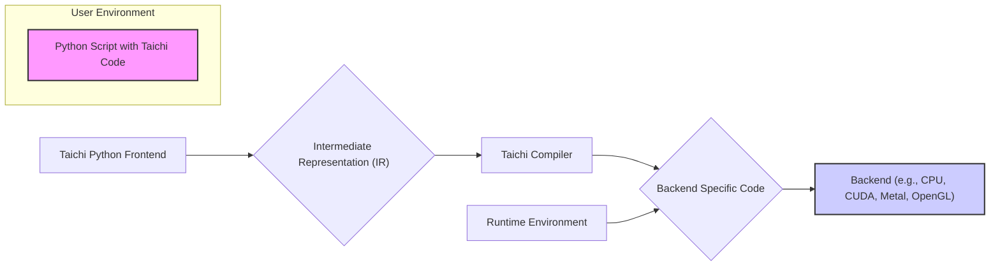
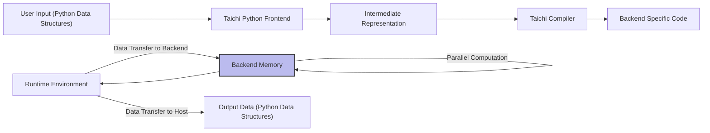

# Project Design Document: Taichi Programming Language

**Version:** 1.1
**Date:** October 26, 2023
**Prepared By:** Gemini (AI Language Model)

## 1. Introduction

This document provides a detailed design overview of the Taichi programming language project, as represented by the GitHub repository [https://github.com/taichi-dev/taichi](https://github.com/taichi-dev/taichi). The primary purpose of this document is to serve as a solid foundation for subsequent threat modeling activities. It comprehensively outlines the key components, their interactions, and the overall architecture of the Taichi system. This document is intended for a broad audience including developers, security analysts, system architects, and anyone seeking a deep understanding of the design and security aspects of Taichi.

## 2. Project Goals and Scope

The overarching goal of the Taichi project is to empower developers with a high-performance, embedded domain-specific language tailored for parallel computation, with a strong emphasis on graphics, machine learning, and scientific computing applications. Key aspects within the scope of this design document include:

*   The syntax and semantic rules of the Taichi language itself.
*   The various stages and functionalities of the Taichi compiler.
*   The architecture and responsibilities of the Taichi runtime environment.
*   The mechanisms for interacting with diverse backend execution platforms (e.g., CPU with different instruction sets, NVIDIA CUDA GPUs, Apple Metal GPUs, OpenGL, Vulkan, and WebGPU).
*   The design and functionality of the Python frontend interface that users primarily interact with.
*   The interfaces and methods for integrating Taichi with external libraries and existing software systems.

Aspects explicitly excluded from the scope of this document are:

*   Fine-grained performance benchmarks, micro-optimizations, and detailed performance tuning strategies.
*   Specific implementation details of user-level applications built using Taichi.
*   The internal workings and security posture of third-party libraries that Taichi integrates with, beyond the integration points themselves.

## 3. High-Level Overview

Taichi can be conceptually decomposed into the following major, interacting components:

*   **Python Frontend:** This serves as the primary point of interaction for users. Developers write Taichi code seamlessly embedded within standard Python scripts. This provides a familiar and flexible environment for Taichi development.
*   **Taichi Compiler:** This crucial component takes the Taichi code embedded within Python and performs a multi-stage compilation process to translate it into efficient executable code suitable for various target backends.
*   **Runtime Environment:** This component is responsible for managing the execution of the compiled Taichi code. Its duties include memory allocation and management, scheduling parallel tasks, and facilitating communication with the underlying backend.
*   **Backends:** These represent the diverse set of underlying execution platforms where the compiled Taichi code ultimately runs. Examples include CPUs utilizing various instruction set architectures (ISAs), NVIDIA GPUs via CUDA, Apple GPUs via Metal, and graphics APIs like OpenGL, Vulkan, and WebGPU.
*   **Standard Library:**  This provides a collection of pre-built, optimized functions and data structures that address common parallel computing patterns and tasks, simplifying development.
*   **Foreign Function Interface (FFI):** Mechanisms that enable Taichi to interact with external libraries written in languages like C and C++, expanding its capabilities and allowing integration with existing ecosystems.

## 4. System Architecture

The following diagram provides a visual representation of the high-level architecture of the Taichi system and the relationships between its core components:

**Detailed Component Descriptions:**

*   **Python Script with Taichi Code:**  This is where the user's application logic resides. Developers utilize standard Python syntax, embedding special Taichi constructs like kernel definitions (`@ti.kernel`) and field declarations (`ti.field`) to define parallel computations.
*   **Taichi Python Frontend:** This component acts as the bridge between the Python environment and the Taichi compiler. Its responsibilities include:
    *   Parsing the Python code to identify Taichi-specific constructs.
    *   Performing static analysis and type checking on the Taichi code.
    *   Translating the Taichi code into a language-agnostic **Intermediate Representation (IR)**.
*   **Intermediate Representation (IR):** This is a crucial internal representation of the Taichi program. It's designed to be independent of both the source language (Python) and the target backend, facilitating optimization and the generation of code for diverse platforms.
*   **Taichi Compiler:** This is the core of the Taichi system. It takes the IR as input and performs a series of complex operations:
    *   **Optimization Passes:** Applying various optimization techniques to improve the performance and efficiency of the generated code (e.g., loop unrolling, vectorization).
    *   **Backend Code Generation:** Translating the optimized IR into low-level code specific to the chosen target backend. This involves selecting appropriate instructions, managing memory layouts according to backend constraints, and handling API calls.
*   **Backend Specific Code:** This is the output of the compiler – executable code tailored for the specific characteristics of the target execution platform. Examples include:
    *   Machine code with SIMD instructions (SSE, AVX) for CPUs.
    *   PTX or CUDA C++ code for NVIDIA GPUs.
    *   Metal Shading Language for Apple GPUs.
    *   GLSL or SPIR-V for OpenGL and Vulkan.
    *   WGSL for WebGPU.
*   **Runtime Environment:** This component manages the execution lifecycle of the compiled Taichi code on the target backend. Its key responsibilities include:
    *   **Memory Management:** Allocating, deallocating, and managing memory on the target backend (CPU or GPU memory). This includes handling data transfers between the host and device.
    *   **Task Scheduling and Synchronization:** Orchestrating the execution of parallel tasks and ensuring proper synchronization between them.
    *   **Backend Communication:** Interacting with the underlying backend drivers and APIs to launch kernels and manage resources.
    *   **Error Handling:** Detecting and managing runtime errors and exceptions that may occur during execution.

## 5. Data Flow

The following diagram illustrates the typical flow of data within the Taichi system, from user input to the final output:

**Detailed Data Flow Description:**

1. **User Input (Python Data Structures):** The user provides input data to the Taichi program primarily through standard Python data structures such as lists, NumPy arrays, or custom data classes.
2. **Taichi Python Frontend:** The frontend takes the Python data and performs the necessary marshaling and conversion to make it accessible to the Taichi kernels. This might involve copying data to memory regions accessible by the backend.
3. **Intermediate Representation:** The data structures and the operations to be performed on them are represented in the language-agnostic IR. This representation captures the logical flow of data and computations.
4. **Taichi Compiler:** The compiler analyzes the data flow within the IR to perform optimizations and generate efficient code for the target backend. This includes determining data access patterns and optimizing memory access.
5. **Backend Specific Code:** The generated code contains instructions for loading, storing, and manipulating data within the backend's memory architecture.
6. **Runtime Environment & Backend Memory:** The runtime environment manages the transfer of input data from the host system's memory to the backend's memory (e.g., GPU's global memory).
7. **Parallel Computation:** The compiled code executes on the backend, performing parallel computations on the data residing in the backend's memory. This is where the core processing of the Taichi program occurs.
8. **Output Data (Python Data Structures):** Once the computations are complete, the runtime environment manages the transfer of the result data back from the backend's memory to Python data structures in the host system's memory, making the results accessible to the user in the Python environment.

## 6. Key Technologies and Components

*   **Primary Programming Languages:** Python (for the user-facing frontend and scripting), C++ (for the core compiler, runtime environment, and backend implementations), and potentially backend-specific languages (e.g., CUDA C++ for CUDA backend, Metal Shading Language for Metal backend, GLSL for OpenGL backend).
*   **Compiler Infrastructure:** LLVM (Low-Level Virtual Machine) is utilized as a backend for some target architectures, providing a robust framework for code generation and optimization.
*   **Backend APIs:** Taichi interacts with various low-level APIs depending on the target backend, including:
    *   CUDA Driver API (for NVIDIA GPUs)
    *   Metal API (for Apple GPUs)
    *   OpenGL API
    *   Vulkan API
    *   WebGPU API
    *   CPU intrinsics (e.g., SSE, AVX instructions for optimized CPU execution).
*   **Memory Management:** Taichi employs custom memory allocators and sophisticated memory management strategies tailored to the specific requirements and constraints of different backends (e.g., managing GPU memory pools, handling data transfers efficiently).
*   **Parallelism Mechanisms:** Taichi leverages various parallelism techniques, including:
    *   Thread-based parallelism (for CPU backends).
    *   SIMD (Single Instruction, Multiple Data) instructions for vectorized operations.
    *   GPU kernel execution (launching massively parallel computations on GPUs).
*   **Build System:** CMake is used as the primary build system for managing the compilation and linking of the Taichi project across different platforms.
*   **Testing Framework:** A comprehensive testing framework is crucial for ensuring the correctness and stability of Taichi. This likely involves a combination of Python-based unit and integration tests, as well as backend-specific tests to validate the generated code on different hardware.

## 7. Security Considerations (Detailed for Threat Modeling)

This section expands on the initial security considerations, providing more specific examples of potential threats and vulnerabilities to guide the threat modeling process.

*   **Input Validation Vulnerabilities:**
    *   **Malicious Input Data:**  If user-provided Python data is not properly validated before being used in Taichi kernels, it could lead to out-of-bounds memory access, buffer overflows, or unexpected behavior on the backend, potentially causing crashes or even allowing for arbitrary code execution in vulnerable scenarios.
    *   **Taichi Code Injection:** While the primary user base is developers, if Taichi were to dynamically compile and execute code based on external input without proper sanitization, it could be vulnerable to code injection attacks.
*   **Compiler Security Risks:**
    *   **Compiler Bugs Leading to Vulnerable Code:** Bugs in the Taichi compiler could result in the generation of incorrect or vulnerable backend code, such as code with buffer overflows, use-after-free errors, or incorrect memory management.
    *   **Malicious IR Exploitation:** If an attacker could somehow influence the Intermediate Representation fed to the compiler (unlikely in typical scenarios but worth considering), they might be able to craft malicious IR that causes the compiler to crash, generate incorrect code, or even execute arbitrary code during the compilation process.
*   **Runtime Environment Vulnerabilities:**
    *   **Memory Management Errors:**  Bugs in the runtime's memory management routines could lead to memory corruption, buffer overflows, use-after-free vulnerabilities, or double-free errors on the backend.
    *   **Improper Error Handling:** Insufficient or incorrect error handling could lead to information leaks (e.g., exposing memory contents in error messages) or denial-of-service conditions.
    *   **Insecure Backend Communication:** If the communication channels between the runtime and the backend drivers are not properly secured, they could be vulnerable to eavesdropping or tampering.
*   **Backend Security Dependencies:**
    *   **Vulnerabilities in Backend Drivers/APIs:** Taichi relies on the security of the underlying backend drivers and APIs. Vulnerabilities in these components could be indirectly exploitable through Taichi.
    *   **Backend-Specific Code Generation Errors:** Errors in the backend-specific code generation logic could introduce vulnerabilities that are specific to certain hardware or API versions.
*   **Dependency Management Risks:**
    *   **Compromised Third-Party Libraries:**  Taichi depends on third-party libraries like LLVM. If these dependencies are compromised (e.g., through supply chain attacks), it could introduce vulnerabilities into the Taichi system.
    *   **Outdated Dependencies with Known Vulnerabilities:** Using outdated versions of dependencies with known security vulnerabilities could expose Taichi to those risks.
*   **Access Control and Isolation:**
    *   **Lack of Isolation in Shared Environments:** In environments where multiple users or processes share the same hardware resources (e.g., a shared GPU), insufficient isolation could allow one user's Taichi code to interfere with or access the data of another.
*   **Side-Channel Attack Potential:**
    *   **Timing Attacks:**  Information about sensitive data or algorithms could potentially be leaked by observing the execution time of Taichi kernels.
    *   **Power Analysis Attacks:** In certain hardware contexts, analyzing the power consumption of the device during Taichi execution could reveal information about the computations being performed.

## 8. Future Considerations and Extensibility

*   **Expanding Backend Support:**  Continuously adding support for new and emerging hardware architectures and graphics APIs (e.g., newer GPU architectures, specialized accelerators).
*   **Advanced Compiler Optimizations:** Implementing more sophisticated compiler optimization techniques, such as auto-tuning, advanced loop transformations, and better utilization of hardware-specific features.
*   **Enhanced Debugging and Profiling Tools:** Developing more user-friendly and powerful tools for debugging and profiling Taichi code, making it easier to identify and resolve performance bottlenecks and errors.
*   **Improved Interoperability:** Enhancing interoperability with other programming languages and frameworks commonly used in scientific computing and machine learning.
*   **Features for Secure and Trusted Execution:** Exploring and implementing features that enable secure execution of Taichi code in untrusted environments, potentially leveraging hardware security features or sandboxing techniques.

## 9. Conclusion

This document provides a comprehensive design overview of the Taichi programming language project, detailing its architecture, components, and data flow. It significantly expands on the initial security considerations, offering a more detailed perspective for effective threat modeling. This information is crucial for identifying potential attack surfaces, understanding associated risks, and developing appropriate security mitigation strategies to ensure the robustness and security of the Taichi ecosystem.