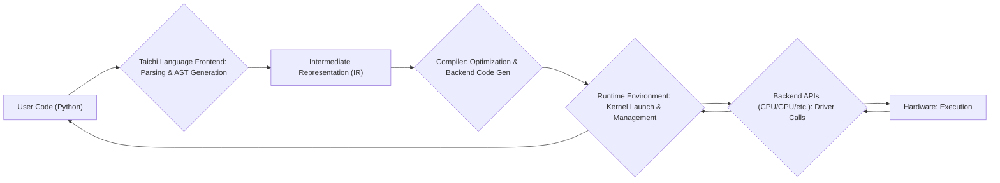

# Project Design Document: Taichi

**Version:** 1.1
**Date:** October 26, 2023
**Author:** AI Software Architect

## 1. Introduction

This document provides a detailed design overview of the Taichi project, an embedded domain-specific language (DSL) and compiler for high-performance, parallel computation. This document aims to clearly articulate the system's architecture, components, and data flow, serving as a foundation for subsequent threat modeling activities. This revision includes more detailed explanations of key components and potential security considerations.

## 2. Goals

*   Provide a comprehensive and detailed description of the Taichi project's architecture and key components.
*   Illustrate the data flow within the system with enhanced clarity.
*   Identify potential areas of interest for security analysis and threat modeling with more specific examples.
*   Serve as a reference for developers and security analysts, facilitating a deeper understanding of the system.

## 3. Project Overview

Taichi is designed to simplify the development of high-performance computational kernels, particularly for tasks that can be parallelized and executed on various hardware backends (e.g., CPUs, GPUs). It allows users to write Python-like code that is then compiled and optimized for the target hardware. The core idea is to abstract away the complexities of low-level parallel programming, enabling researchers and developers to focus on the computational logic and achieve significant performance gains.

## 4. System Architecture

The Taichi system can be broadly divided into the following key components:

*   **Taichi Language Frontend:** This is the user-facing part of Taichi, where users write their computational kernels using a Python-embedded DSL. It includes:
    *   **Lexical Analysis and Parsing:**  Processing the Taichi code to understand its structure and syntax.
    *   **Abstract Syntax Tree (AST) Generation:** Creating a tree representation of the code's structure.
    *   **Semantic Analysis:** Checking the code for type errors, variable declarations, and other semantic rules.
    *   **Integration with Python's Syntax and Semantics:**  Handling the interaction between Python code and embedded Taichi code blocks.
    *   **Mechanisms for defining Taichi kernels and data structures:**  Providing decorators and syntax for defining parallelizable functions and multi-dimensional arrays (fields).
*   **Intermediate Representation (IR):**  The Taichi frontend translates the user's code into one or more intermediate representations. This IR is a platform-independent representation of the computation, allowing for optimizations and backend-specific code generation. Different IR levels might exist (e.g., a high-level, architecture-agnostic IR and a lower-level, more backend-specific IR).
*   **Compiler:** The compiler is responsible for transforming the IR into executable code for the target backend. This involves several stages:
    *   **High-Level Optimization Passes:** Applying optimizations on the architecture-agnostic IR, such as loop fusion, dead code elimination, and constant folding.
    *   **Lowering to Backend-Specific IR:** Transforming the high-level IR into a representation closer to the target hardware's instruction set.
    *   **Backend Code Generation:** Generating low-level code specific to the chosen hardware backend. This might involve:
        *   **LLVM IR Generation (for CPUs):**  Generating LLVM Intermediate Representation, which is then further compiled by LLVM.
        *   **CUDA/SPIR-V Generation (for GPUs):** Generating code in NVIDIA's CUDA or the Standard Portable Intermediate Representation for Parallel Computation (SPIR-V).
        *   **OpenGL/Vulkan/Metal Shader Generation:** Generating shader code for graphics APIs.
    *   **Register Allocation:** Assigning variables to hardware registers for efficient access.
    *   **Instruction Scheduling:** Ordering instructions to maximize hardware utilization.
*   **Runtime Environment:** The runtime environment manages the execution of the compiled Taichi kernels. This includes:
    *   **Memory Management for Taichi data structures:** Allocating and deallocating memory for fields (multi-dimensional arrays) on the target device.
    *   **Synchronization and scheduling of parallel tasks:** Managing the execution of parallel loops and other parallel constructs, ensuring data consistency.
    *   **Interaction with the underlying hardware backend:**  Using backend-specific APIs to launch kernels and manage device resources.
    *   **Providing APIs for launching kernels and transferring data between the host (Python) and the device:**  Functions to copy data to and from the GPU or other accelerators.
    *   **Error Handling:** Managing and reporting errors that occur during kernel execution.
*   **Backend APIs:** These are the interfaces to the specific hardware backends that Taichi supports. Examples include:
    *   **CPU Backend:** Utilizing multi-threading (e.g., using `std::thread` or similar) and SIMD instructions (e.g., using intrinsics or compiler auto-vectorization).
    *   **CUDA Backend (for NVIDIA GPUs):** Interacting with the NVIDIA CUDA Driver API.
    *   **OpenGL/Vulkan Backend (for graphics-oriented computation):** Utilizing OpenGL or Vulkan API calls for compute shaders.
    *   **Metal Backend (for Apple GPUs):** Interacting with Apple's Metal framework.
    *   **Other potential backends (e.g., WebGPU):**  Interfaces for emerging hardware acceleration standards.
*   **User Code/Scripts (Python):** This is the surrounding Python code that utilizes the Taichi library. It defines data, calls Taichi kernels, and processes the results. This includes setting up the Taichi environment, defining fields, and launching computations.
*   **External Libraries:** Taichi may depend on external libraries for certain functionalities. Examples include:
    *   **LLVM:** Used for code generation in the CPU backend.
    *   **CUDA Toolkit:** Required for the CUDA backend.
    *   Graphics driver libraries (OpenGL, Vulkan, Metal).

## 5. Data Flow

The typical data flow within a Taichi application can be described as follows:

Detailed breakdown of the data flow:

*   **User Interaction:** The user writes Python code that includes Taichi kernel definitions and calls, along with data initialization and result processing.
*   **Frontend Processing:** The Taichi Language Frontend parses the Taichi code embedded within the Python script, performs semantic analysis, and generates an Abstract Syntax Tree (AST).
*   **IR Generation:** The frontend translates the AST into one or more levels of Intermediate Representation (IR).
*   **Compilation:** The Compiler takes the IR and performs various optimization passes. It then generates backend-specific code based on the target hardware.
*   **Runtime Management:** When a Taichi kernel is invoked from the Python code, the Runtime Environment takes over. It manages memory allocation on the target device and schedules the kernel for execution.
*   **Backend Execution:** The Runtime Environment interacts with the appropriate Backend API (e.g., CUDA driver, OpenGL calls) to launch the compiled code on the Hardware. This involves sending commands and data to the device.
*   **Data Transfer:** Data is transferred between the host memory (managed by Python) and the device memory (managed by the backend) as needed. This can happen explicitly through API calls or implicitly managed by the Taichi runtime.
*   **Result Retrieval:** Results from the Taichi kernel execution are transferred back to the host memory and made available to the Python code for further processing or visualization.

## 6. Security Considerations (More Detailed)

Building upon the initial thoughts, here are more specific security considerations based on the architecture:

*   **Code Injection Vulnerabilities:**
    *   **Unsanitized Input in Kernel Generation:** If user-provided input (e.g., array sizes, loop bounds) is directly used in generating the Taichi kernel code or the compilation commands without proper validation, it could lead to the injection of malicious code.
    *   **Exploiting Python Integration:**  Vulnerabilities in the way Taichi integrates with Python could allow attackers to inject malicious Python code that interacts with the Taichi runtime in unintended ways.
*   **Compiler Vulnerabilities:**
    *   **Bugs Leading to Unsafe Code Generation:**  Errors in the compiler's optimization passes or backend code generation could result in the creation of executable code with memory safety issues (e.g., buffer overflows) or other vulnerabilities.
    *   **Backdoor Insertion:**  In a compromised development environment, an attacker could potentially inject malicious code into the compiler itself, leading to the generation of backdoored Taichi kernels.
*   **Runtime Vulnerabilities:**
    *   **Memory Management Errors:** Bugs in the Taichi runtime's memory allocation or deallocation logic could lead to memory corruption vulnerabilities.
    *   **Race Conditions and Synchronization Issues:**  Improper synchronization in the parallel execution of kernels could lead to data corruption or unexpected behavior that could be exploited.
    *   **Improper Handling of Device Resources:**  Vulnerabilities in how the runtime manages device resources (e.g., GPU memory) could lead to resource exhaustion or denial-of-service.
*   **Backend Vulnerabilities:**
    *   **Exploiting Driver Bugs:**  Taichi relies on the underlying hardware drivers. Vulnerabilities in these drivers could be exploited through carefully crafted Taichi kernels.
    *   **API Misuse:** Incorrect usage of the backend APIs by the Taichi runtime could lead to security issues.
*   **Dependency Vulnerabilities:**
    *   **Third-Party Library Exploits:** Vulnerabilities in external libraries like LLVM or the CUDA Toolkit could be exploited if Taichi doesn't use secure versions or if the integration is flawed.
*   **Data Security:**
    *   **Lack of Encryption for Sensitive Data:** If Taichi is used to process sensitive data, the lack of encryption during computation or data transfer could expose it to unauthorized access.
    *   **Data Leaks through Side Channels:** Depending on the hardware and the nature of the computation, side-channel attacks (e.g., timing attacks) might be a concern for sensitive data.
*   **Resource Exhaustion and Denial of Service:**
    *   **Maliciously Crafted Kernels:**  Users could create Taichi kernels that intentionally consume excessive CPU, GPU, or memory resources, leading to denial-of-service.
    *   **Exploiting Compilation Process:**  Attackers might try to trigger computationally expensive compilation steps to overload the system.
*   **Supply Chain Security:**
    *   **Compromised Distribution Channels:**  Ensuring the integrity of the Taichi installation packages and dependencies is crucial to prevent the distribution of compromised versions.

## 7. Deployment Model

Taichi is primarily deployed as a Python library installable via `pip`. Users typically integrate it into their existing Python projects. The deployment involves:

*   **Installation:** Users install the Taichi package using `pip install taichi`. This downloads the necessary binaries and Python bindings.
*   **Backend Configuration:** Users can configure the desired hardware backend (CPU, CUDA, OpenGL, etc.) either through environment variables or within their Python code.
*   **Just-In-Time (JIT) Compilation:** Taichi employs JIT compilation. When a Taichi kernel is first invoked, it is compiled for the target backend. The compiled kernel is often cached for subsequent calls.
*   **Integration with Python Environment:** Taichi seamlessly integrates with the Python environment, allowing users to define Taichi kernels within Python scripts and interact with Taichi data structures using familiar Python syntax.
*   **Dependency Management:** The `pip` installation process handles the installation of necessary dependencies like LLVM (for the CPU backend) or CUDA Toolkit (if the CUDA backend is selected).

## 8. Future Considerations

*   **WebAssembly Support:**  Compiling Taichi kernels to WebAssembly would enable execution in web browsers. This introduces new security considerations related to the browser's security sandbox, cross-origin policies, and potential vulnerabilities in the WebAssembly runtime.
*   **Cloud Integration:**  As Taichi is increasingly used in cloud environments (e.g., on virtual machines with GPUs), security considerations related to cloud deployments become more important. This includes access control to cloud resources, secure storage of data, and network security.
*   **Extended Backend Support:** Adding support for new hardware backends (e.g., specialized AI accelerators) will require careful consideration of the security characteristics of those platforms and the potential for new vulnerabilities.
*   **Formal Verification of Compiler:**  Exploring formal verification techniques for the Taichi compiler could help ensure the correctness and security of the generated code.
*   **Security Audits and Penetration Testing:**  Regular security audits and penetration testing are crucial for identifying and addressing potential vulnerabilities in the Taichi project.

This revised document provides a more detailed and comprehensive understanding of the Taichi project's architecture, data flow, and security considerations, serving as a stronger foundation for subsequent threat modeling activities.