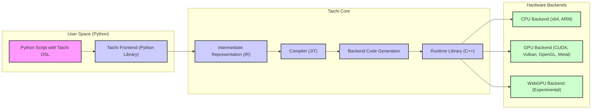
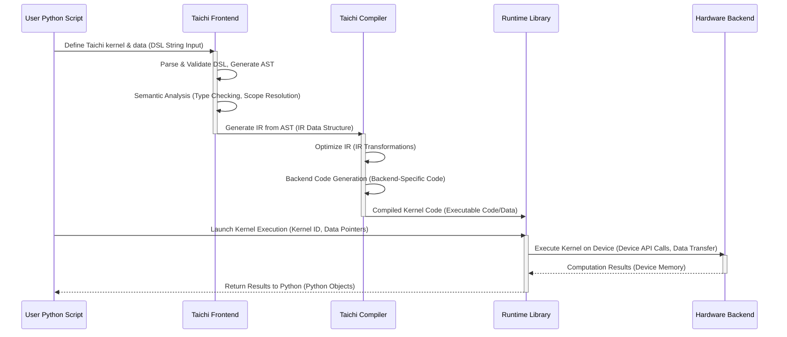

# Project Design Document: Taichi Programming Language (Improved)

**Project Name:** Taichi

**Project Repository:** [https://github.com/taichi-dev/taichi](https://github.com/taichi-dev/taichi)

**Document Version:** 1.1
**Date:** 2023-10-27
**Author:** AI Software Architect

## 1. Introduction

This document provides an enhanced and more detailed design overview of the Taichi programming language project, building upon the previous version. Taichi is a domain-specific language (DSL) embedded in Python, engineered for high-performance computing workloads, particularly in domains like computer graphics, machine learning, and scientific simulations. It empowers users to author performance-critical computational kernels using Python syntax, which are subsequently compiled and executed with high efficiency across diverse hardware backends, including CPUs and GPUs.

The primary purpose of this document is to serve as a robust foundation for comprehensive threat modeling and security analysis of the Taichi project. It meticulously outlines the system's architecture, delineating key components, data flow pathways, and the underlying technology stack. This detailed exposition is crucial for identifying potential areas of security concern and vulnerability within the Taichi ecosystem.

## 2. Project Overview

Taichi's core objective is to democratize high-performance parallel computing by mitigating the complexities typically associated with it. By seamlessly integrating a DSL within the familiar Python environment, Taichi offers an accessible and user-friendly interface for expressing intricate algorithms. Simultaneously, it leverages sophisticated just-in-time (JIT) compilation techniques and hardware-specific optimizations to achieve performance levels that rival native code execution.

**Key Features:** (No changes from previous version, listed for completeness)

*   **Embedded DSL in Python:**  Provides a familiar Python syntax for defining computational kernels, lowering the barrier to entry for users.
*   **Automatic Parallelization:**  Intelligently handles parallelization strategies and memory management behind the scenes, abstracting away complexities for developers targeting parallel architectures.
*   **Multi-Backend Support:**  Offers broad hardware compatibility with support for various backends including CPU (x64, ARM), GPU (CUDA, Vulkan, OpenGL, Metal), and experimental browser backends (WebGPU), ensuring portability and adaptability.
*   **Just-In-Time (JIT) Compilation:** Compiles Taichi kernels dynamically at runtime, enabling optimizations tailored to the specific target hardware environment and runtime conditions.
*   **Gradient Computation (AutoDiff):**  Natively supports automatic differentiation, a critical feature for machine learning and optimization algorithms, simplifying the development of differentiable programs.
*   **Data-Oriented Programming:**  Promotes a data-oriented programming paradigm, encouraging efficient memory access patterns and maximizing parallel execution efficiency, leading to performance gains.

## 3. System Architecture

The Taichi architecture is structured into distinct layers, each with specific responsibilities, facilitating modularity and maintainability.

**3.1. High-Level Architecture Diagram**

**(Diagram remains the same, visually representing the layered architecture)**

**3.2. Component Description (Enhanced)**

*   **A. Python Script with Taichi DSL:**  This represents the entry point for Taichi programs. Users write Python code, embedding Taichi DSL constructs to define computational kernels and manage data. This script leverages the Taichi Frontend library to interact with the Taichi core.  *From a security perspective, this is the initial point of user input and potential code injection if the frontend is not robust.*

*   **B. Taichi Frontend (Python Library):**  This Python library serves as the crucial interface between user code and the Taichi core.  Its responsibilities are expanded upon below for clarity:
    *   **DSL Parsing and Validation:**  Not just parsing, but also rigorously validating the Taichi DSL syntax to ensure correctness and prevent unexpected behavior. *This validation step is critical for preventing malformed DSL from reaching the compiler and potentially causing issues.*
    *   **Abstract Syntax Tree (AST) Generation:**  Creates a structured AST representation of the Taichi kernel, facilitating further processing.
    *   **Semantic Analysis:** Performs semantic analysis on the AST to check for type correctness, variable scope, and other language-level rules. *Semantic analysis is important for catching errors early and ensuring the DSL code is meaningful and well-formed.*
    *   **Initial IR Generation:**  Transforms the validated AST into Taichi's platform-agnostic Intermediate Representation (IR).
    *   **API for User Interaction:** Provides a well-defined Python API for users to define fields (data containers), kernels (computational functions), specify data types, configure backend preferences, and control kernel execution. *The API itself should be designed securely to prevent misuse or unintended access to internal functionalities.*
    *   **Error Reporting:**  Handles error reporting during parsing, semantic analysis, and IR generation, providing informative feedback to the user. *Clear and informative error messages are important for debugging and can also help prevent users from inadvertently introducing security vulnerabilities due to misunderstandings.*

*   **C. Intermediate Representation (IR):** Taichi's IR is a crucial abstraction layer. It's a language-agnostic representation of the computation, designed for optimization and backend portability.  Key aspects of the IR include:
    *   **Static Single Assignment (SSA) Form:**  Internally, the IR likely uses SSA form to simplify analysis and optimization passes. *SSA form is beneficial for compiler optimizations and can also aid in security analysis by making data flow more explicit.*
    *   **Data Type Information:**  The IR explicitly represents data types (integers, floats, vectors, matrices) and memory layouts, crucial for efficient code generation.
    *   **Control Flow Graph (CFG):**  The IR represents control flow (loops, branches) in a structured manner using a CFG. *Understanding the CFG is important for security analysis, especially when considering control flow hijacking vulnerabilities.*
    *   **Hardware Abstraction:**  The IR is designed to be independent of specific hardware architectures, allowing the compiler to target different backends from the same IR.

*   **D. Compiler (JIT):** The Taichi compiler is the core transformation engine. Its responsibilities are further detailed:
    *   **IR Optimization Passes:**  Applies a series of optimization passes to the IR to enhance performance. These passes may include:
        *   **Loop Unrolling and Vectorization:**  Optimizing loops for parallel execution and SIMD instructions.
        *   **Memory Access Optimization:**  Improving data locality and reducing memory bandwidth requirements.
        *   **Common Subexpression Elimination:**  Removing redundant computations.
        *   **Dead Code Elimination:**  Removing unused code.
        *   *These optimizations, while improving performance, must be implemented correctly to avoid introducing vulnerabilities such as buffer overflows or incorrect data handling.*
    *   **Backend Selection and Configuration:**  Determines the target backend based on user-specified settings, system availability, and potentially runtime hardware detection.
    *   **Code Generation:**  Translates the optimized IR into low-level, backend-specific code. This involves:
        *   **Instruction Selection:**  Mapping IR operations to target machine instructions or API calls.
        *   **Register Allocation:**  Assigning variables to registers for efficient execution.
        *   **Memory Layout and Management for Backend:**  Generating code to manage memory on the target backend (CPU or GPU).
        *   *Code generation is a complex process and a potential source of vulnerabilities if not implemented carefully. Incorrect code generation could lead to memory corruption, privilege escalation, or other security issues.*
    *   **Just-In-Time (JIT) Compilation Management:**  Handles the JIT compilation process, including caching compiled kernels for reuse and managing compilation overhead. *JIT compilation itself can introduce security considerations, such as the potential for JIT spraying attacks if not properly managed.*

*   **E. Backend Code Generation:**  This is a specialized module within the compiler, responsible for the final stage of code translation.  Each backend (CPU, CUDA, Vulkan, etc.) has its own code generator tailored to its specific instruction set and API. *The backend code generators are critical components from a security perspective, as they directly produce the executable code that runs on the hardware.*

*   **F. Runtime Library (C++):** The Taichi Runtime Library is the foundation for executing compiled Taichi kernels. Its responsibilities are expanded for clarity:
    *   **Memory Management and Allocation:**  Provides APIs for allocating and managing memory for Taichi fields and data structures on the target device (CPU or GPU). This includes:
        *   **Device Memory Allocation:**  Allocating memory on the GPU or CPU as needed.
        *   **Memory Pooling and Caching:**  Potentially using memory pooling techniques to optimize allocation and deallocation overhead.
        *   *Memory management is a critical area for security. Bugs in memory allocation or deallocation can lead to memory leaks, buffer overflows, and other vulnerabilities.*
    *   **Kernel Launch and Execution Management:**  Handles the process of loading compiled kernel code onto the target device and launching kernel execution. This includes:
        *   **Kernel Loading and Linking:**  Loading the compiled code (e.g., PTX for CUDA, SPIR-V for Vulkan) into the runtime environment.
        *   **Thread and Process Management:**  Managing threads or processes for parallel kernel execution.
        *   **Scheduling and Dispatching Kernels:**  Scheduling and dispatching kernels to the hardware for execution.
    *   **Synchronization Primitives:**  Provides synchronization mechanisms (e.g., mutexes, barriers, atomics) for coordinating parallel execution within kernels and between CPU and GPU. *Incorrect synchronization can lead to race conditions and other concurrency vulnerabilities.*
    *   **Error Handling and Exception Management:**  Handles runtime errors and exceptions that may occur during kernel execution. *Robust error handling is important for preventing crashes and providing informative error messages, which can be helpful for security debugging.*
    *   **Interfacing with Backend APIs:**  Provides a consistent and abstracted interface for interacting with the underlying hardware backend APIs (CUDA API, Vulkan API, etc.), hiding backend-specific details from the higher layers. *This abstraction layer should be carefully designed to prevent vulnerabilities arising from direct backend API misuse.*
    *   **Data Transfer Management (CPU-GPU):**  Handles data transfers between CPU and GPU memory when necessary. *Data transfer operations can be performance bottlenecks and potential points of vulnerability if not handled securely and efficiently.*

*   **G. CPU Backend (x64, ARM):**  This backend executes Taichi kernels on CPUs. It leverages:
    *   **Native Machine Code Generation:**  Generates native machine code (x86-64, ARM) for efficient CPU execution.
    *   **Multi-threading and SIMD:**  Utilizes multi-threading and SIMD (Single Instruction, Multiple Data) instructions (e.g., SSE, AVX on x86, NEON on ARM) for parallel processing on CPUs.
    *   **Operating System API Interaction:**  Interacts with the operating system's threading and memory management APIs.

*   **H. GPU Backend (CUDA, Vulkan, OpenGL, Metal):** These backends target GPUs for massively parallel computation. Each backend utilizes its respective API:
    *   **CUDA Backend:**  Uses NVIDIA's CUDA API and generates PTX (Parallel Thread Execution) code for NVIDIA GPUs.
    *   **Vulkan Backend:**  Uses the cross-platform Vulkan API and generates SPIR-V (Standard Portable Intermediate Representation) shaders.
    *   **OpenGL Backend:**  Uses the OpenGL API and generates GLSL (OpenGL Shading Language) shaders. *OpenGL is generally considered a legacy API compared to Vulkan and Metal, and might have different security characteristics.*
    *   **Metal Backend:**  Uses Apple's Metal API and generates Metal Shading Language (MSL) shaders for Apple GPUs.
    *   *GPU backends introduce complexities related to GPU driver security, shader compilation, and memory management on the GPU device.*

*   **I. WebGPU Backend (Experimental):**  This experimental backend aims to enable Taichi execution within web browsers. It leverages:
    *   **WebGPU API:**  Uses the emerging WebGPU standard API for accessing GPU capabilities from web browsers.
    *   **WebAssembly (Wasm) and JavaScript:**  Potentially involves compiling parts of the runtime or generated code to WebAssembly for browser execution, with JavaScript as the interface layer.
    *   **Browser Security Sandbox:**  Operates within the browser's security sandbox, which imposes restrictions on access to system resources. *WebGPU backend security is heavily reliant on the browser's security model and the WebGPU API implementation itself.*

## 4. Data Flow (Enhanced)

The data flow description is enhanced to highlight data transformations and potential security-relevant points.

**(Sequence diagram is enhanced to show internal steps within components)**

1.  **Kernel and Data Definition (DSL String Input):** The user provides Taichi kernel definitions and data structures as strings embedded within Python code. *This string input is the initial untrusted data from a security perspective.*
2.  **IR Generation (IR Data Structure):** The Taichi Frontend parses, validates, and performs semantic analysis on the DSL, converting it into a structured IR data structure. *Validation and semantic analysis are crucial security steps here.*
3.  **Compilation and Optimization (IR Transformations, Backend-Specific Code):** The Taichi Compiler optimizes the IR through various transformations and then generates backend-specific code. *Compiler optimizations and code generation must be secure to prevent vulnerabilities.*
4.  **Kernel Loading (Executable Code/Data):** The compiled kernel code (which could be machine code, shaders, etc.) is loaded into the Runtime Library. *The integrity of the compiled code is important.*
5.  **Kernel Launch (Kernel ID, Data Pointers):** When the user invokes a kernel, the Runtime Library receives a kernel identifier and pointers to data. *Proper handling of kernel IDs and data pointers is essential to prevent unauthorized access or manipulation.*
6.  **Kernel Execution (Device API Calls, Data Transfer):** The Runtime Library interacts with the Hardware Backend, making device API calls and transferring data to the device for kernel execution. *Interactions with backend APIs and data transfers are potential areas for vulnerabilities.*
7.  **Result Retrieval (Device Memory):** The Hardware Backend performs the computation and stores results in device memory.
8.  **Return to Python (Python Objects):** The Runtime Library retrieves results from device memory and returns them to the user's Python script as Python objects. *Data returned to Python should be handled securely, especially if it's sensitive.*

## 5. Technology Stack (Detailed)

The technology stack is expanded to provide more specific versions and details where relevant.

*   **Programming Languages:**
    *   **Python (3.7+ recommended):** Frontend DSL, user interface, scripting. *Python version compatibility is important for dependency management and potential security fixes in Python itself.*
    *   **C++ (C++17 or later):** Core Runtime Library, Compiler components, Backend implementations. *C++ version influences language features and compiler optimizations, potentially impacting security.*
    *   **LLVM (version 10+ recommended):** Used in the compiler toolchain for IR manipulation and code generation (potentially via MLIR in newer versions). *LLVM version is critical as it's a major dependency and its security vulnerabilities could affect Taichi.*
    *   **CUDA C/C++ (CUDA Toolkit 11+ recommended):** GPU kernel implementation for CUDA backend. *CUDA Toolkit version impacts driver compatibility and available features, including security updates.*
    *   **SPIR-V (Vulkan SDK):** Intermediate representation for Vulkan shaders, generated by compilers like `glslangValidator` (part of Vulkan SDK). *Vulkan SDK version is important for API compatibility and security fixes in the SDK components.*
    *   **GLSL/HLSL (OpenGL/Metal SDKs):** Shading languages for OpenGL and Metal backends, compiled by driver-provided compilers. *Driver versions and shader compiler security are relevant for these backends.*
    *   **WebAssembly/JavaScript (WebGPU API in Browsers):** For WebGPU backend execution in browsers. *Browser versions and WebGPU API implementations are crucial for WebGPU backend security.*

*   **Libraries and Frameworks:**
    *   **LLVM/MLIR:** Compiler infrastructure. *Using MLIR (Multi-Level Intermediate Representation) in newer Taichi versions is a significant architectural change and its security implications should be considered.*
    *   **CUDA Toolkit (NVIDIA CUDA Toolkit):** For CUDA backend development, including `nvcc` compiler, CUDA runtime library, etc.
    *   **Vulkan SDK (LunarG Vulkan SDK or platform-specific SDKs):** For Vulkan backend development, including Vulkan loader, validation layers, and tools.
    *   **OpenGL/Metal SDKs (Platform-specific):** Operating system-provided SDKs for OpenGL and Metal development.
    *   **WebGPU API (Browser-provided):** Web API for accessing GPU capabilities in web browsers.
    *   **NumPy (version X+ recommended):** Used for numerical operations and data handling in Python frontend. *NumPy version and its dependencies should be considered for security vulnerabilities.*
    *   **Other Python Libraries:** Potentially other Python dependencies for testing, build scripts, etc. (e.g., `pytest`, `cmake`, `setuptools`). *All Python dependencies should be tracked and their security vulnerabilities managed.*

*   **Build System:**
    *   **CMake (version 3.15+ recommended):** Cross-platform build system for compiling C++ components. *CMake version can impact build security and feature availability.*
    *   **Python's `setuptools`:** For packaging and distributing the Python frontend library.

## 6. Deployment Model (Clarified)

The deployment model is clarified with more details on dependencies and environment considerations.

Taichi is primarily distributed as a Python package installable via `pip`.  Deployment involves ensuring the necessary runtime dependencies are met in the target environment.

**Typical Deployment Scenario (Detailed):**

1.  **Dependency Installation:** Before installing Taichi, users may need to install system-level dependencies, such as:
    *   **GPU Drivers:**  For GPU backends (NVIDIA drivers for CUDA, platform-specific drivers for Vulkan, OpenGL, Metal). *Outdated or vulnerable GPU drivers can be a significant security risk.*
    *   **Vulkan Runtime Libraries (if using Vulkan backend):**  May need to be installed separately on some systems.
    *   **LLVM Runtime Libraries (potentially):**  Depending on the Taichi build and backend configuration.
2.  **Installation:** User installs Taichi using `pip install taichi`. This downloads and installs the Taichi Python package and its Python dependencies.
3.  **Environment Configuration (Optional but Recommended):**
    *   **Backend Selection:** Users can configure the desired backend (CPU, CUDA, Vulkan, etc.) via environment variables or Taichi API calls. *Incorrect backend configuration might lead to unexpected behavior or performance issues, but generally not direct security vulnerabilities.*
    *   **Logging and Debugging:**  Taichi provides logging and debugging options that can be configured. *Logging configurations should be reviewed from a security perspective to avoid leaking sensitive information.*
4.  **Development and Execution:** User develops and executes Python scripts that utilize the Taichi library. Taichi kernels are compiled and run on the configured backend.
5.  **Distribution (Optional):** Applications built with Taichi can be packaged and distributed. Distribution should consider:
    *   **Bundling Dependencies:**  For easier deployment, consider bundling necessary runtime libraries (e.g., redistributable CUDA libraries, Vulkan runtime). *Bundling dependencies requires careful management to ensure up-to-date and secure versions are included.*
    *   **Installation Instructions:**  Provide clear instructions on how to install system-level dependencies and Taichi itself.

**Cloud Deployment:** In cloud environments, deployment often involves using pre-configured virtual machine images or containers that include necessary drivers and libraries. Cloud deployments may also introduce additional security considerations related to cloud platform security, access control, and data isolation.

## 7. Security Considerations (Detailed and Categorized)

This section provides a more detailed and categorized overview of potential security considerations, enhancing the initial assessment.

**7.1. Input Validation and Code Injection Vulnerabilities:**

*   **Python Frontend DSL Parsing:**  Vulnerabilities in the Taichi Frontend's DSL parser could allow malicious DSL code to be injected, potentially leading to:
    *   **Arbitrary Code Execution:**  If the parser is compromised, crafted DSL could execute arbitrary Python code or manipulate the Taichi runtime environment.
    *   **Denial of Service (DoS):**  Malicious DSL could crash the parser or consume excessive resources.
*   **Unsafe Deserialization (if applicable):** If Taichi uses deserialization of user-provided data (e.g., loading kernels from files), vulnerabilities in deserialization libraries could be exploited.

**7.2. Compiler and Code Generation Vulnerabilities:**

*   **Compiler Bugs:**  Bugs in the Taichi compiler, especially in optimization passes or backend code generation, could lead to:
    *   **Memory Corruption:**  Incorrect code generation could result in buffer overflows, out-of-bounds access, or other memory safety violations.
    *   **Incorrect Computation:**  Compiler bugs could lead to incorrect or unpredictable program behavior, which might have security implications in certain applications.
    *   **Privilege Escalation (less likely but possible):** In highly specific scenarios, compiler bugs could potentially be exploited for privilege escalation if the compiled code interacts with system resources in unexpected ways.
*   **JIT Spraying (Mitigation Required):**  If JIT compilation is not properly managed, it could be vulnerable to JIT spraying attacks, where attackers attempt to place malicious code in JIT-compiled memory regions. *Address Space Layout Randomization (ASLR) and other JIT hardening techniques are crucial mitigations.*

**7.3. Runtime Library Vulnerabilities:**

*   **Memory Management Errors:**  Bugs in the Runtime Library's memory management (allocation, deallocation, garbage collection if applicable) could lead to:
    *   **Memory Leaks:**  Resource exhaustion and potential DoS.
    *   **Use-After-Free:**  Memory corruption and potential arbitrary code execution.
    *   **Double-Free:**  Memory corruption and potential crashes or exploits.
*   **Concurrency and Synchronization Issues:**  Race conditions or deadlocks in the Runtime Library's synchronization primitives could lead to:
    *   **Data Corruption:**  Inconsistent or corrupted data due to unsynchronized access.
    *   **Deadlocks and DoS:**  Program hangs or crashes due to synchronization failures.
*   **Backend API Misuse:**  Incorrect or insecure usage of backend APIs (CUDA, Vulkan, etc.) in the Runtime Library could introduce vulnerabilities specific to those APIs.

**7.4. Backend and Driver Vulnerabilities:**

*   **GPU Driver Vulnerabilities:**  Security vulnerabilities in GPU drivers (especially proprietary drivers like NVIDIA's) could be exploited through Taichi if Taichi interacts with the driver in a way that triggers the vulnerability. *Keeping GPU drivers updated is crucial.*
*   **Shader Vulnerabilities (GPU Backends):**  Vulnerabilities in shader compilers or the way shaders are executed on GPUs could be exploited. *Shader validation and secure shader compilation practices are important.*
*   **Operating System and Hardware Vulnerabilities:**  Underlying operating system or hardware vulnerabilities could indirectly affect Taichi's security if exploited in conjunction with Taichi functionality.

**7.5. Dependency Vulnerabilities:**

*   **Third-Party Libraries:**  Taichi relies on numerous third-party libraries (LLVM, CUDA Toolkit, Vulkan SDK, NumPy, etc.). Vulnerabilities in these dependencies could directly or indirectly impact Taichi. *Regular dependency scanning and updates are essential.*
*   **Build Toolchain Vulnerabilities:**  Vulnerabilities in build tools (CMake, compilers) could potentially compromise the build process and introduce vulnerabilities into the Taichi binaries.

**7.6. WebGPU Backend Specific Security:**

*   **Browser Security Sandbox Escapes:**  Vulnerabilities in the WebGPU API implementation or browser security sandbox could potentially be exploited to escape the sandbox and gain access to system resources. *Browser security is paramount for the WebGPU backend.*
*   **Cross-Site Scripting (XSS) and Related Web Security Issues:**  If Taichi WebGPU applications are integrated into web pages, they could be vulnerable to web-based attacks like XSS if not properly secured.

This enhanced design document provides a more comprehensive and detailed foundation for threat modeling. The categorized security considerations highlight key areas that require further investigation and analysis during the threat modeling process. This document will be used as input for subsequent security activities.