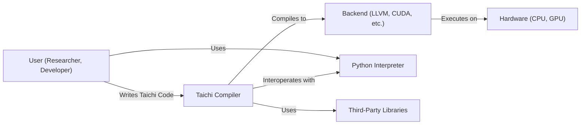
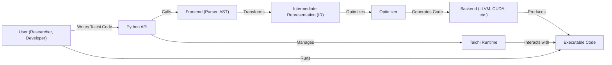
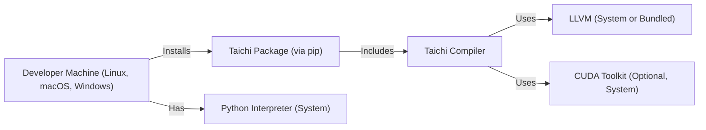
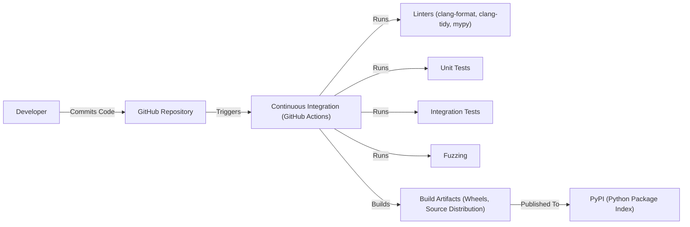

Okay, let's create a design document for the Taichi project, focusing on aspects relevant for threat modeling.

# BUSINESS POSTURE

Taichi is an open-source, high-performance, parallel programming language embedded in Python, designed for easy-to-write, portable, and fast-to-run computer graphics, physics simulation, and numerical computation.  It appears to be targeted at researchers, hobbyists, and potentially professionals in fields requiring high-performance computing.  The project's success hinges on adoption by this community, ease of use, and demonstrable performance advantages.

Business Priorities:

*   Ease of Use:  The language should be easy to learn and use, especially for those familiar with Python.  This is crucial for adoption.
*   Performance:  Taichi must deliver significant performance improvements over standard Python for computationally intensive tasks.
*   Portability:  The language should be runnable across various hardware platforms (CPUs, GPUs) and operating systems.
*   Community Growth:  A thriving open-source community is essential for long-term maintenance, development, and support.
*   Extensibility: The ability to integrate with other libraries and tools is important for practical use.

Business Goals:

*   Become a leading language for high-performance computing in the graphics and simulation domains.
*   Attract a large and active user and contributor base.
*   Provide a viable alternative to more complex or less performant solutions.

Most Important Business Risks:

*   Lack of Adoption: If the language is too difficult to use, or doesn't offer sufficient performance benefits, it won't be adopted.
*   Competition: Other languages and frameworks (e.g., CUDA, OpenCL, Numba) compete in the same space.
*   Security Vulnerabilities:  As a language that compiles to native code, security vulnerabilities could lead to exploits, damaging the project's reputation and potentially harming users. This is a *critical* risk.
*   Maintainability:  If the codebase becomes too complex or lacks sufficient contributors, maintaining and evolving the language will become difficult.
*   Portability Issues:  Failure to support key hardware platforms or operating systems will limit adoption.

# SECURITY POSTURE

Existing Security Controls:

*   security control: Code Reviews: The GitHub repository indicates the use of pull requests, suggesting that code reviews are part of the development process. (Inferred from standard GitHub practices).
*   security control: Testing: The presence of a `tests` directory suggests the existence of unit and/or integration tests. (Observed in the repository structure).
*   security control: Static Analysis: Some use of linters (like `clang-format`, `clang-tidy`, `mypy`) is apparent from the CI configuration, providing basic static analysis. (Observed in `.github/workflows`).
*   security control: Fuzzing: The presence of a `fuzz` directory and related CI configurations indicates that fuzzing is used to test the robustness of the compiler. (Observed in the repository structure and `.github/workflows`).

Accepted Risks:

*   accepted risk: Reliance on Third-Party Libraries: Taichi depends on external libraries (e.g., LLVM, Python libraries), inheriting any vulnerabilities they may have. This is a common and generally accepted risk, but it needs to be managed.
*   accepted risk: Complexity of Compiler Security: Ensuring the security of a compiler that generates native code is inherently complex. There's an accepted risk that undiscovered vulnerabilities may exist.

Recommended Security Controls (High Priority):

*   security control: Dynamic Analysis: Integrate dynamic analysis tools (e.g., AddressSanitizer, MemorySanitizer) into the CI pipeline to detect memory errors and other runtime issues.
*   security control: Dependency Management: Implement a robust dependency management system to track and update third-party libraries, minimizing the risk of known vulnerabilities. Tools like Dependabot (for GitHub) can help automate this.
*   security control: Security Training: Provide security training to core contributors, focusing on secure coding practices for C++ and compiler development.
*   security control: Threat Modeling: Conduct regular threat modeling exercises to identify and prioritize potential security vulnerabilities.
*   security control: Vulnerability Disclosure Program: Establish a clear process for reporting and handling security vulnerabilities discovered by external researchers.

Security Requirements:

*   Authentication: Not directly applicable to the core language itself, but relevant for any associated services (e.g., package management, if implemented).
*   Authorization: Not directly applicable to the core language itself.
*   Input Validation: *Critically important*. The compiler must rigorously validate all input (Taichi source code) to prevent code injection vulnerabilities and other exploits. This includes handling malformed input gracefully and preventing buffer overflows.
*   Cryptography: Not directly a core requirement of the language, but may be relevant for specific applications built using Taichi. If cryptographic functions are provided, they must be implemented securely using well-vetted libraries.
*   Memory Safety: The compiler and generated code must be free from memory safety vulnerabilities (e.g., buffer overflows, use-after-free errors). This is crucial for preventing exploits.

# DESIGN

## C4 CONTEXT

C4 Context Element Descriptions:

*   Element:
    *   Name: User (Researcher, Developer)
    *   Type: Person
    *   Description: A person who writes and uses Taichi code for high-performance computing tasks.
    *   Responsibilities: Writing Taichi code, running compiled programs, interacting with Python.
    *   Security controls: None directly, relies on the security of the Taichi compiler and runtime.

*   Element:
    *   Name: Taichi Compiler
    *   Type: Software System
    *   Description: The core component of the Taichi project, responsible for compiling Taichi code into executable code.
    *   Responsibilities: Parsing Taichi code, performing optimizations, generating code for different backends.
    *   Security controls: Input validation, static analysis, fuzzing, code reviews.

*   Element:
    *   Name: Backend (LLVM, CUDA, etc.)
    *   Type: Software System
    *   Description: The underlying infrastructure that Taichi uses to generate and execute code.
    *   Responsibilities: Providing low-level code generation and execution capabilities.
    *   Security controls: Relies on the security of the chosen backend (e.g., LLVM's security).

*   Element:
    *   Name: Hardware (CPU, GPU)
    *   Type: Hardware
    *   Description: The physical hardware on which the compiled Taichi code runs.
    *   Responsibilities: Executing the compiled code.
    *   Security controls: Hardware-level security features (e.g., memory protection).

*   Element:
    *   Name: Python Interpreter
    *   Type: Software System
    *   Description: The standard Python interpreter, used to run the Python code that embeds Taichi.
    *   Responsibilities: Executing Python code, interacting with the Taichi runtime.
    *   Security controls: Relies on the security of the Python interpreter.

*   Element:
    *   Name: Third-Party Libraries
    *   Type: Software System
    *   Description: External libraries used by Taichi (e.g., LLVM, Python libraries).
    *   Responsibilities: Providing specific functionalities required by Taichi.
    *   Security controls: Dependency management, vulnerability scanning.

## C4 CONTAINER

C4 Container Element Descriptions:

*   Element:
    *   Name: User (Researcher, Developer)
    *   Type: Person
    *   Description: A person who writes and uses Taichi code.
    *   Responsibilities: Writing Taichi code, running compiled programs.
    *   Security controls: None directly.

*   Element:
    *   Name: Python API
    *   Type: Container (Library)
    *   Description: The interface through which users interact with Taichi from Python.
    *   Responsibilities: Providing functions to define kernels, allocate memory, and launch computations.
    *   Security controls: Input validation (to a limited extent, primarily relies on the frontend).

*   Element:
    *   Name: Frontend (Parser, AST)
    *   Type: Container (Component)
    *   Description: Parses Taichi source code and constructs an Abstract Syntax Tree (AST).
    *   Responsibilities: Lexical analysis, parsing, semantic analysis, AST generation.
    *   Security controls: *Critical*: Input validation to prevent code injection and other parsing-related vulnerabilities.

*   Element:
    *   Name: Intermediate Representation (IR)
    *   Type: Container (Data)
    *   Description: A platform-independent representation of the Taichi program.
    *   Responsibilities: Representing the program in a form suitable for optimization and code generation.
    *   Security controls: None directly (data structure).

*   Element:
    *   Name: Optimizer
    *   Type: Container (Component)
    *   Description: Performs various optimizations on the IR to improve performance.
    *   Responsibilities: Applying optimization passes (e.g., loop unrolling, common subexpression elimination).
    *   Security controls: Must ensure that optimizations do not introduce security vulnerabilities.

*   Element:
    *   Name: Backend (LLVM, CUDA, etc.)
    *   Type: Container (External System)
    *   Description: Generates machine code for the target platform.
    *   Responsibilities: Translating the IR into executable code.
    *   Security controls: Relies on the security of the chosen backend.

*   Element:
    *   Name: Executable Code
    *   Type: Container (Executable)
    *   Description: The compiled Taichi program, ready to be executed.
    *   Responsibilities: Performing the computations defined in the Taichi code.
    *   Security controls: Depends on the security of the entire compilation process.

*   Element:
    *   Name: Taichi Runtime
    *   Type: Container (Library)
    *   Description: Manages the execution of Taichi kernels and interacts with the underlying hardware.
    *   Responsibilities: Memory management, kernel launching, synchronization.
    *   Security controls: Must handle memory safely and prevent race conditions.

## DEPLOYMENT

Possible Deployment Solutions:

1.  Local Machine: Users build and install Taichi directly on their machines.
2.  Cloud VM: Users deploy Taichi on a virtual machine in a cloud environment (e.g., AWS EC2, Google Compute Engine).
3.  Containerized Environment: Taichi could be packaged and deployed within a Docker container.
4.  Cloud-based Jupyter Notebook: Taichi could be used within a cloud-based Jupyter notebook environment (e.g., Google Colab).

Chosen Solution (for detailed description): Local Machine

Deployment Element Descriptions:

*   Element:
    *   Name: Developer Machine (Linux, macOS, Windows)
    *   Type: Infrastructure Node
    *   Description: The user's local machine where Taichi is installed and used.
    *   Responsibilities: Providing the environment for building and running Taichi programs.
    *   Security controls: Operating system security features, user account controls.

*   Element:
    *   Name: Taichi Package (via pip)
    *   Type: Software
    *   Description: The Taichi package, typically installed using `pip`.
    *   Responsibilities: Providing the Taichi compiler, runtime, and Python API.
    *   Security controls: Package signing (if used by `pip`), integrity checks.

*   Element:
    *   Name: Taichi Compiler
    *   Type: Software
    *   Description: The core Taichi compiler.
    *   Responsibilities: Compiling Taichi code.
    *   Security controls: As described in previous sections.

*   Element:
    *   Name: LLVM Package (System or Bundled)
    *   Type: Software
    *   Description: The LLVM compiler infrastructure, either installed system-wide or bundled with Taichi.
    *   Responsibilities: Providing code generation capabilities.
    *   Security controls: Relies on the security of LLVM.

*   Element:
    *   Name: CUDA Toolkit (Optional, System)
    *   Type: Software
    *   Description: The CUDA Toolkit, required for GPU support, typically installed system-wide.
    *   Responsibilities: Providing GPU code generation and runtime support.
    *   Security controls: Relies on the security of the CUDA Toolkit.

*   Element:
    *   Name: Python Interpreter (System)
    *   Type: Software
    *   Description: The system-wide Python interpreter.
    *   Responsibilities: Running Python code that uses Taichi.
    *   Security controls: Relies on the security of the Python interpreter.

## BUILD

Build Process Description:

1.  Developers commit code to the GitHub repository.
2.  GitHub Actions triggers the Continuous Integration (CI) pipeline.
3.  The CI pipeline runs various checks:
    *   Linters (clang-format, clang-tidy, mypy) for code style and static analysis.
    *   Unit tests to verify individual components.
    *   Integration tests to verify interactions between components.
    *   Fuzzing to test the compiler's robustness against malformed input.
4.  If all checks pass, the CI pipeline builds the Taichi package (wheels and source distribution).
5.  The build artifacts are published to PyPI (Python Package Index).

Security Controls in Build Process:

*   security control: Code Reviews: Enforced through GitHub's pull request mechanism.
*   security control: Static Analysis: Linters (clang-format, clang-tidy, mypy) provide basic static analysis.
*   security control: Automated Testing: Unit tests, integration tests, and fuzzing help identify bugs and vulnerabilities.
*   security control: CI/CD Pipeline: GitHub Actions provides a controlled and automated build environment.

# RISK ASSESSMENT

Critical Business Processes to Protect:

*   The compilation process: Ensuring that the compiler is secure and does not introduce vulnerabilities into the generated code.
*   The Taichi runtime: Protecting the runtime environment from exploits that could compromise user systems.
*   The integrity of the Taichi package: Preventing malicious modifications to the package distributed through PyPI.

Data to Protect and Sensitivity:

*   Taichi source code (written by users): Sensitivity varies depending on the application. Could range from non-sensitive (e.g., public research code) to highly sensitive (e.g., proprietary algorithms). The *compiler itself* should not leak or mishandle this code, regardless of its sensitivity.
*   Compiled code: Contains the logic of the user's program and may need to be protected depending on the application.
*   Intermediate Representation (IR): Internal data structure used by the compiler. Not directly exposed to users, but its integrity is crucial for the security of the compilation process.
*   User data processed by Taichi programs: This is entirely dependent on the specific application. Taichi itself should provide mechanisms (e.g., memory safety) to help users protect their data, but the ultimate responsibility lies with the user.

# QUESTIONS & ASSUMPTIONS

Questions:

*   What is the specific threat model for Taichi? (e.g., Who are the potential attackers? What are their motivations and capabilities?)
*   Are there any plans to develop a formal security policy or vulnerability disclosure program?
*   What level of security assurance is desired for Taichi? (e.g., Is formal verification being considered?)
*   What are the specific security requirements for any future extensions or features (e.g., a package manager)?
*   How are third-party dependencies managed and updated? Is there a process for tracking and addressing vulnerabilities in these dependencies?
*   What is the process for handling security-related bug reports?

Assumptions:

*   BUSINESS POSTURE: The primary users of Taichi are researchers and developers who are somewhat technically savvy.
*   BUSINESS POSTURE: Performance and ease of use are prioritized over absolute security. However, reasonable security measures are expected.
*   SECURITY POSTURE: The development team is aware of basic security principles and follows common secure coding practices.
*   SECURITY POSTURE: The project relies on the security of underlying components like LLVM and the Python interpreter.
*   DESIGN: The provided repository structure and CI configuration are representative of the current development practices.
*   DESIGN: The primary distribution method is through `pip` and PyPI.
*   DESIGN: Users are responsible for securing their own development and deployment environments.