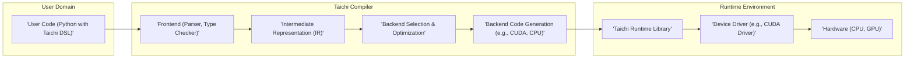

## Project Design Document: Taichi Programming Language (Improved)

**1. Introduction**

This document provides an enhanced architectural overview of the Taichi programming language project (https://github.com/taichi-dev/taichi). This document is specifically designed to serve as a robust foundation for subsequent threat modeling activities. It meticulously outlines the key components, data flows, and interactions within the Taichi ecosystem, providing the necessary context for identifying potential security vulnerabilities. This document is intended for security engineers, developers, and anyone involved in the security assessment of Taichi.

**2. Goals and Objectives**

The primary goals of the Taichi project are to:

*   Provide a high-performance, embedded language for parallel computing, particularly targeting graphics and scientific simulations.
*   Offer a Python-embedded domain-specific language (DSL) that simplifies the development of parallel algorithms.
*   Enable cross-platform execution on various hardware backends, including CPUs (x64, ARM), GPUs (CUDA, Vulkan, OpenGL, Metal), and potentially specialized accelerators.
*   Maintain an open-source and community-driven development model, fostering transparency and collaboration.
*   Provide a user-friendly experience with intuitive syntax, comprehensive documentation, and helpful error messages.

**3. High-Level Architecture**

The Taichi architecture can be broadly divided into the following key stages, illustrating the journey of user code from conception to execution:

**4. Key Components**

This section details the core components of the Taichi system, highlighting their functionalities and potential security relevance:

*   **User Code (Python with Taichi DSL):**
    *   This is the initial stage where users define their parallel computations using Python and Taichi's specific syntax (e.g., decorators like `@ti.kernel`, data structures like `ti.field`).
    *   Potential security concerns here involve the complexity of the DSL and the potential for users to introduce logic errors that could be exploited.

*   **Frontend (Parser, Type Checker):**
    *   This component is responsible for analyzing the user's Python code containing Taichi DSL. It verifies the syntax and ensures that the types used are consistent and valid according to Taichi's rules.
    *   Security considerations include the robustness of the parser against malformed input and the thoroughness of type checking to prevent unexpected behavior. Vulnerabilities here could allow for code injection or bypasses of intended security measures.

*   **Intermediate Representation (IR):**
    *   This is a crucial internal representation of the Taichi program, designed to be platform-independent. It allows for various optimizations and transformations before the final code generation. Multiple IR stages might exist within the compilation pipeline.
    *   Security concerns revolve around the integrity of the IR. If the IR can be manipulated, it could lead to the generation of unintended or malicious code.

*   **Backend Selection & Optimization:**
    *   This component determines the target hardware (CPU, GPU, etc.) based on user configuration or automatic detection. It then applies backend-specific optimizations to the IR to maximize performance on the chosen hardware.
    *   Security considerations include ensuring that optimizations do not introduce vulnerabilities (e.g., buffer overflows) and that the selection process is secure and cannot be influenced by malicious actors to target specific, potentially vulnerable backends.

*   **Backend Code Generation:**
    *   This component translates the optimized IR into low-level code specific to the target backend. For example, it generates CUDA C++ code for NVIDIA GPUs or LLVM IR for CPUs. This involves managing memory allocation, thread synchronization, and other low-level details.
    *   Security is paramount here. Vulnerabilities in the code generation process could lead to exploitable flaws in the generated code, such as buffer overflows, use-after-free errors, or incorrect memory access.

*   **Taichi Runtime Library:**
    *   This library provides the necessary runtime support for executing Taichi programs. It handles device initialization, memory management on the target device, launching kernels, data transfer between the host (CPU) and the device (GPU), and synchronization between threads or processes.
    *   Security concerns include the secure management of device memory, preventing unauthorized access or modification of data, and ensuring the integrity of kernel launches and data transfers.

*   **Device Driver:**
    *   This is the software provided by the hardware vendor (e.g., NVIDIA CUDA driver, operating system graphics drivers) that allows the Taichi runtime to communicate with and control the underlying hardware.
    *   Security vulnerabilities in the device drivers themselves are a concern, as Taichi relies on their correct and secure operation.

*   **Hardware (CPU, GPU):**
    *   This is the physical hardware where the parallel computations are ultimately executed.
    *   While Taichi doesn't directly control hardware security features, the security of the underlying hardware can impact the overall security of Taichi applications.

*   **Build System (CMake):**
    *   Used to manage the compilation and linking of the Taichi library and its dependencies. It defines how the various components of Taichi are built and integrated.
    *   Security considerations involve ensuring the integrity of the build process and preventing the introduction of malicious code during compilation.

*   **Package Manager Integration (pip):**
    *   Allows users to easily install and manage Taichi as a Python package using `pip`.
    *   Security concerns relate to the potential for supply chain attacks if the Taichi package on PyPI is compromised.

*   **External Dependencies:**
    *   Taichi relies on various external libraries for its functionality:
        *   LLVM: For CPU backend code generation and optimization. Potential vulnerabilities in LLVM could impact Taichi.
        *   CUDA Toolkit: For NVIDIA GPU backend support. Security vulnerabilities in the CUDA Toolkit are a concern.
        *   Vulkan SDK: For Vulkan backend support. Security vulnerabilities in the Vulkan SDK could affect Taichi.
        *   OpenGL/Metal: For respective GPU backend support. Security vulnerabilities in these drivers/libraries are relevant.
        *   Python: The host language for the Taichi DSL. Security vulnerabilities in the Python interpreter could have implications.
        *   NumPy: For numerical operations and data handling. Security vulnerabilities in NumPy could be a concern.
        *   Other potential dependencies for specific features or backends. The security posture of all dependencies needs to be considered.

**5. Data Flow**

The typical data flow within a Taichi program execution, from user input to output, is critical for understanding potential attack vectors:

```mermaid
graph LR
    subgraph "User Domain"
        A["'User Defines Data & Kernels in Python'"]
    end
    subgraph "Compilation Phase"
        B["'Taichi Frontend Parses & Type Checks'"]
        C["'Generates Intermediate Representation (IR)'"]
        D["'Backend Selection & Optimization'"]
        E["'Backend Code Generation'"]
    end
    subgraph "Runtime Execution"
        F["'Python Calls Taichi Kernel'"]
        G["'Taichi Runtime Manages Device Allocation'"]
        H["'Data Transfer (Host to Device)'"]
        I["'Kernel Execution on Device'"]
        J["'Data Transfer (Device to Host)'"]
        K["'Results Returned to Python'"]
    end

    A --> B
    B --> C
    C --> D
    D --> E
    E --> F
    F --> G
    G --> H
    H --> I
    I --> J
    J --> K
```

**Detailed Data Flow Description with Security Considerations:**

1. **User Defines Data & Kernels in Python:** The user writes Python code, defining Taichi fields (data structures) and kernels (parallel functions) using the Taichi DSL. Potential for introducing vulnerabilities through insecure coding practices or reliance on untrusted input.
2. **Taichi Frontend Parses & Type Checks:** The Taichi frontend analyzes the Python code, specifically the Taichi DSL constructs, ensuring syntactic and semantic correctness. Vulnerabilities in the parser could allow for the injection of malicious code. Inadequate type checking could lead to unexpected behavior and potential exploits.
3. **Generates Intermediate Representation (IR):** The frontend translates the Taichi DSL into a platform-independent intermediate representation. Manipulation of the IR could lead to the generation of malicious code.
4. **Backend Selection & Optimization:** Based on the target hardware, the compiler selects the appropriate backend and applies optimizations to the IR. A compromised backend selection process could force execution on a vulnerable backend. Optimizations themselves could introduce vulnerabilities if not carefully implemented.
5. **Backend Code Generation:** The optimized IR is translated into low-level code (e.g., CUDA C++, LLVM IR) for the target device. This is a critical stage where vulnerabilities like buffer overflows or incorrect memory access can be introduced in the generated code.
6. **Python Calls Taichi Kernel:** When the user calls a Taichi kernel from their Python code, the Taichi runtime is invoked. The parameters passed to the kernel need to be validated to prevent unexpected behavior or exploits.
7. **Taichi Runtime Manages Device Allocation:** The runtime ensures that the necessary memory is allocated on the target device (CPU or GPU). Improper memory management could lead to vulnerabilities like use-after-free.
8. **Data Transfer (Host to Device):** Input data required by the kernel is transferred from the host memory (where the Python interpreter runs) to the device memory. Insecure data transfer mechanisms could expose data in transit.
9. **Kernel Execution on Device:** The compiled kernel is launched and executed in parallel on the target hardware. Vulnerabilities in the generated kernel code can be exploited during execution.
10. **Data Transfer (Device to Host):** After execution, the results are transferred back from the device memory to the host memory. Similar to host-to-device transfer, insecure mechanisms could expose data.
11. **Results Returned to Python:** The results of the kernel execution are made available to the user's Python code. The integrity of the returned results should be ensured.

**6. Security Considerations**

This section provides a more structured overview of potential security concerns, categorized for clarity:

*   **Code Injection Vulnerabilities:**
    *   Within the Taichi DSL parsing and processing.
    *   Through manipulation of the Intermediate Representation (IR).
    *   In the backend code generation process, leading to the creation of exploitable native code.

*   **Supply Chain Risks:**
    *   Compromise of external dependencies (LLVM, CUDA Toolkit, Vulkan SDK, etc.).
    *   Vulnerabilities in the build system (CMake) allowing for the injection of malicious code during compilation.
    *   Compromise of the Python Package Index (PyPI) leading to the distribution of malicious Taichi packages.

*   **Memory Safety Issues:**
    *   Buffer overflows in generated code or runtime library.
    *   Use-after-free vulnerabilities in memory management.
    *   Incorrect memory access or out-of-bounds access on the target device.

*   **Data Security and Integrity:**
    *   Exposure of sensitive data during transfer between host and device.
    *   Unauthorized access or modification of data in device memory.
    *   Lack of data validation leading to unexpected behavior or exploits.

*   **Denial of Service (DoS):**
    *   Maliciously crafted Taichi programs consuming excessive resources on the target device.
    *   Exploiting vulnerabilities to crash the runtime environment or device drivers.

*   **Side-Channel Attacks:**
    *   Potential for information leakage through timing variations or other side channels during kernel execution, especially relevant in security-sensitive applications.

*   **Build and Deployment Security:**
    *   Insecure configuration of the build environment.
    *   Lack of integrity checks for distributed binaries.

*   **Host Operating System and Driver Security:**
    *   Reliance on the security of the underlying operating system and device drivers. Vulnerabilities in these components can impact Taichi's security.

**7. Deployment Model**

Understanding how Taichi is deployed helps identify potential attack surfaces:

*   **Local Development Environments:** Developers install Taichi on their personal machines. Security risks here primarily involve the developer's own system security.
*   **High-Performance Computing (HPC) Clusters:** Taichi is deployed on shared infrastructure. Security concerns include access control, data security in a multi-tenant environment, and the potential for lateral movement.
*   **Cloud Environments (AWS, Azure, GCP):** Taichi leverages cloud-based resources. Security considerations involve the security of the cloud platform itself, access management, and data protection in the cloud.
*   **Embedded Systems (Potential Future):** Deployment on resource-constrained devices introduces unique security challenges related to limited resources and potential physical access.

**8. Future Considerations**

Future developments in Taichi could introduce new security considerations:

*   **WebAssembly Backend:**  Enabling Taichi execution in web browsers introduces web security concerns, such as sandboxing and cross-site scripting.
*   **Specialized Hardware Support:**  Supporting new hardware may require integrating with new and potentially less mature drivers and SDKs, which could have unknown security vulnerabilities.
*   **Enhanced Security Features:**  Any future security features implemented in Taichi itself will need careful design and implementation to avoid introducing new vulnerabilities.
*   **Networking Capabilities:** If Taichi gains networking capabilities, this will significantly expand the attack surface and introduce new security challenges.

This improved design document provides a more detailed and security-focused overview of the Taichi project architecture. It highlights potential security concerns within each component and stage of the data flow, serving as a valuable resource for subsequent threat modeling activities.
