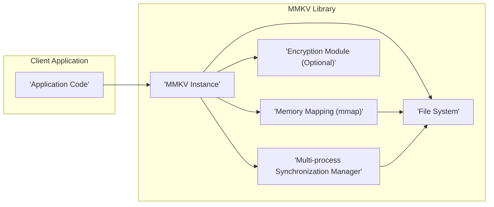
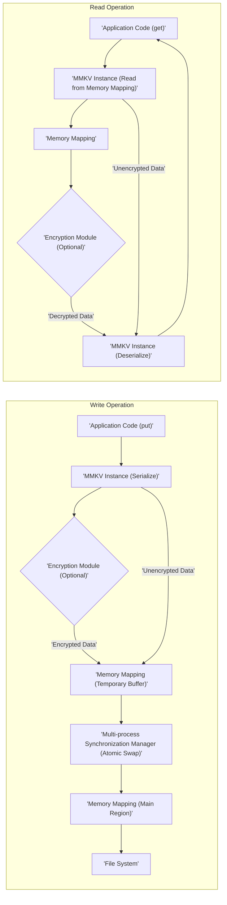

## Project Design Document: MMKV Library (Improved)

**1. Introduction**

This document provides an enhanced design overview of the MMKV library, an efficient, small mobile key-value storage framework developed by Tencent. This document is specifically tailored to serve as a robust foundation for subsequent threat modeling activities. It meticulously outlines the architecture, components, data flow, and critical security considerations of MMKV to facilitate a comprehensive security analysis.

**2. Project Overview**

MMKV is engineered as a high-performance, persistent key-value store primarily targeting mobile platforms (Android, iOS, macOS, Windows, and WebAssembly). Its core design leverages memory mapping (mmap) to achieve exceptionally fast read and write operations. Key characteristics include:

*   High-speed data access facilitated by mmap.
*   Guaranteed atomic writes ensuring data integrity.
*   Optional encryption support for safeguarding sensitive data at rest.
*   Robust multi-process concurrency support for shared data access.
*   Minimal footprint and low operational overhead.

**3. System Architecture**

The fundamental architecture of MMKV centers around mapping a file directly into memory. This memory mapping technique allows for direct memory access to the stored data, significantly boosting performance compared to traditional file input/output methods.

**3.1. Component Diagram (Mermaid)**

**3.2. Component Descriptions**

*   **Application Code:** The user-developed application that integrates and utilizes the MMKV library for persistent data storage.
*   **MMKV Instance:** The central object provided by the library. It orchestrates the underlying memory mapping operations, file interactions, encryption processes (if enabled), and multi-process synchronization.
*   **Memory Mapping (mmap):** The operating system mechanism employed by MMKV to create a direct mapping between a file's content and the process's virtual address space. This enables direct memory reads and writes to the persistent data.
*   **File System:** The underlying file system where MMKV persists its data files. Each MMKV instance typically corresponds to a dedicated file on the file system.
*   **Encryption Module (Optional):** An optional component within MMKV that provides encryption and decryption of data before it is written to or read from the file system. This protects sensitive data at rest.
*   **Multi-process Synchronization Manager:**  This component manages the mechanisms used to ensure data consistency and prevent corruption when multiple processes access the same MMKV instance concurrently. This typically involves file locking or other inter-process communication primitives.

**4. Data Flow**

The following details the typical data flow for both write and read operations within the MMKV library.

**4.1. Write Operation**

*   The application code invokes a `put` method on the `MMKV Instance`, providing a key and a value to be stored.
*   The `MMKV Instance` serializes the provided key and value into a byte stream.
*   If encryption is enabled for this instance, the serialized data is passed to the `Encryption Module` for encryption.
*   The serialized (and potentially encrypted) data is written to a temporary buffer within the memory-mapped region.
*   The `MMKV Instance` utilizes atomic operations (managed by the `Multi-process Synchronization Manager`) to ensure the temporary buffer is safely and atomically swapped with the main data region in the memory-mapped file. This prevents data corruption in case of interruptions.
*   The operating system asynchronously synchronizes the changes in the memory-mapped region back to the physical file on the `File System`.

**4.2. Read Operation**

*   The application code calls a `get` method on the `MMKV Instance`, specifying the key of the data to be retrieved.
*   The `MMKV Instance` directly reads the data associated with the given key from the `Memory Mapping`.
*   If encryption is enabled, the retrieved data is passed to the `Encryption Module` for decryption.
*   The `MMKV Instance` deserializes the (potentially decrypted) data back into its original format.
*   The deserialized value is then returned to the calling application code.

**4.3. Data Flow Diagram (Mermaid)**

**5. Security Considerations**

This section details critical security aspects and potential areas of concern relevant to the MMKV library. These considerations are crucial for effective threat modeling.

*   **Data at Rest Encryption:** MMKV offers optional encryption, relying on a user-provided key. The security strength is directly tied to the chosen encryption algorithm and the robustness of the key management strategy implemented by the integrating application.
    *   **Threat:** Weak encryption algorithms or insecure key storage could lead to unauthorized data decryption.
*   **File System Permissions:** The security of MMKV data files is fundamentally dependent on the underlying file system permissions. Inadequate permissions can expose data to unauthorized access or modification by other processes or users.
    *   **Threat:**  World-readable or writable MMKV files could allow malicious applications to read or tamper with stored data.
*   **Memory Mapping Security:** While mmap offers performance advantages, it implies that sensitive data resides directly within the process's memory space. This makes it potentially vulnerable to memory dumping or other memory inspection techniques if encryption is not employed or is compromised.
    *   **Threat:**  Malware or debugging tools could potentially extract sensitive data from the process's memory.
*   **Multi-process Concurrency Vulnerabilities:** Although MMKV incorporates mechanisms for multi-process synchronization, flaws in these mechanisms could lead to race conditions or data corruption if not implemented and managed correctly.
    *   **Threat:**  Race conditions could lead to inconsistent data states or denial of service.
*   **Key Management Security:** If encryption is enabled, the security of the encryption key is paramount. Storing the key insecurely (e.g., hardcoded in the application, stored in shared preferences without proper protection) effectively nullifies the benefits of encryption.
    *   **Threat:**  Compromised encryption keys allow attackers to decrypt and access sensitive data.
*   **Input Validation and Deserialization:** While MMKV primarily stores and retrieves data, vulnerabilities in the serialization and deserialization processes could be exploited if malicious or crafted data is introduced.
    *   **Threat:**  Deserialization vulnerabilities could potentially lead to remote code execution or denial of service.
*   **Platform Security Dependencies:** The overall security posture of MMKV is inherently linked to the security of the underlying operating system and platform. Vulnerabilities in the OS or platform can indirectly impact the security of MMKV.
    *   **Threat:** OS-level vulnerabilities could be exploited to bypass MMKV's security measures.
*   **Integrity Protection:** While atomic writes are mentioned, the document lacks explicit details on mechanisms to detect data corruption or tampering outside of concurrent access scenarios.
    *   **Threat:**  Bit flips or other forms of data corruption on the storage medium might go undetected.

**6. Assumptions and Constraints**

*   It is assumed that the application integrating MMKV is responsible for implementing user authentication and authorization. MMKV itself does not provide these functionalities.
*   The security of the encryption key, when encryption is used, is the sole responsibility of the application developer. MMKV provides the encryption mechanism but not secure key storage or management.
*   The underlying file system is assumed to be functioning correctly and providing the expected level of security and integrity.
*   This design document primarily focuses on the core logical functionality of MMKV and does not delve into highly specific platform-dependent implementation details.

**7. Out of Scope**

The following aspects are explicitly excluded from the scope of this design document:

*   In-depth implementation details of the memory mapping or specific synchronization primitives used by MMKV.
*   Detailed performance benchmarking and optimization strategies employed within MMKV.
*   Specific platform-dependent integrations or adaptations of MMKV (e.g., intricate details of Android SharedPreferences integration).
*   The design and security architecture of the application that utilizes the MMKV library.
*   Comprehensive cryptographic analysis of the specific encryption algorithms supported by MMKV.

This improved design document provides a more detailed and security-focused overview of the MMKV library's architecture and data flow. The enhanced security considerations section aims to provide a clearer understanding of potential threats and vulnerabilities, making it a more effective resource for subsequent threat modeling activities.
