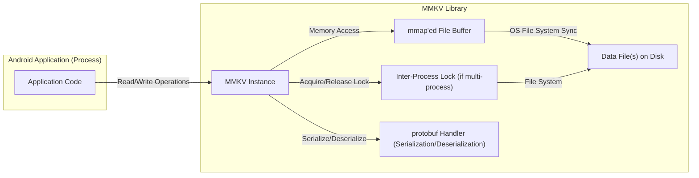

# Project Design Document: MMKV

**Version:** 1.1
**Date:** October 26, 2023
**Prepared By:** Gemini (AI Language Model)

## 1. Project Overview

This document details the design of the MMKV library, a high-performance, lightweight key-value storage framework developed by Tencent, primarily for mobile platforms (Android, iOS - though this document focuses on Android). MMKV leverages memory mapping (mmap) for efficient data access and is designed for scenarios requiring fast and reliable persistent storage. This document aims to provide a comprehensive understanding of MMKV's architecture and components, specifically for the purpose of threat modeling.

## 2. Goals and Objectives

The primary goals of MMKV are:

* **Exceptional Performance:** Achieve rapid read and write operations for key-value data through memory mapping.
* **Minimal Memory Overhead:** Maintain a small memory footprint, crucial for resource-constrained mobile devices.
* **Process Safety and Consistency:** Guarantee data integrity and consistency when accessed concurrently by multiple processes.
* **Developer Friendliness:** Offer a straightforward and intuitive API for seamless integration into applications.
* **Robust Data Persistence:** Ensure reliable data persistence across application sessions and device reboots.

## 3. Target Audience

This document is primarily intended for:

* **Security Engineers:** To facilitate thorough threat modeling and security assessments of applications using MMKV.
* **Software Developers:** To gain a deeper understanding of MMKV's internal mechanisms for effective usage and debugging.
* **System Architects:** To evaluate MMKV's suitability and integration points within larger system architectures.

## 4. System Architecture

MMKV's core architecture relies on memory mapping files into process address spaces for direct data access. The following diagram illustrates the key components and their interactions:

**Component Descriptions:**

* **Android Application (Process):** The application code that interacts with the MMKV library to store and retrieve key-value data. This represents the primary user of MMKV.
* **MMKV Instance:** The central object provided by the MMKV library. It manages the mmap'ed file, serialization, and concurrency control. Each instance typically maps to a specific data file.
* **mmap'ed File Buffer:** A region of virtual memory within the application's process that is directly mapped to the content of the data file on disk. This allows for direct memory reads and writes to persist data.
* **Data File(s) on Disk:** The persistent storage location for MMKV data. Data is stored in binary format, typically using Protocol Buffers. Multiple files might be used for optimization or larger datasets.
* **Inter-Process Lock (if multi-process):** A mechanism (e.g., `flock` on Linux/Android) used to ensure exclusive access to the data file when multiple processes are using the same MMKV instance, preventing data corruption.
* **protobuf Handler (Serialization/Deserialization):**  The component responsible for converting in-memory data structures into a binary format for storage (serialization) and vice-versa (deserialization) using Protocol Buffers.

## 5. Data Flow and Security Implications

Understanding the data flow is crucial for identifying potential security vulnerabilities.

**Write Operation:**

1. **Application Request:** The application initiates a write operation by calling a `put()` method on the MMKV instance, providing a key and a value.
2. **Serialization:** The MMKV library uses the protobuf handler to serialize the provided value into a binary representation. *Potential security concern: Vulnerabilities in the protobuf serialization logic could be exploited.*
3. **Write to mmap Buffer:** The serialized data is written directly into the mmap'ed file buffer at an offset determined by the key. *Potential security concern: If the process is compromised, this memory region could be manipulated.*
4. **Operating System Synchronization:** The operating system periodically synchronizes the changes in the mmap'ed buffer back to the underlying data file on disk. MMKV can also trigger a `msync()` call to force immediate synchronization. *Potential security concern: Data might be lost if the application crashes before synchronization, though MMKV's design minimizes this risk.*
5. **Inter-Process Locking (if applicable):** If multiple processes are involved, the MMKV instance acquires an inter-process lock before writing to ensure exclusive access and prevent race conditions. *Potential security concern:  A malicious process could potentially hold the lock indefinitely, leading to a denial-of-service for other processes.*

**Read Operation:**

1. **Application Request:** The application requests data by calling a `get()` method on the MMKV instance with a specific key.
2. **Read from mmap Buffer:** The MMKV library directly reads the data corresponding to the key from the mmap'ed file buffer. *Potential security concern: If the process is compromised, an attacker could read sensitive data from this memory region.*
3. **Deserialization:** The protobuf handler deserializes the binary data read from the buffer back into the original data structure. *Potential security concern: Vulnerabilities in the protobuf deserialization logic could be exploited, potentially leading to crashes or unexpected behavior.*
4. **Return Data:** The deserialized data is returned to the application.

**Multi-Process Access:**

1. **Lock Acquisition:** When a process attempts to write to a multi-process MMKV instance, it first attempts to acquire the inter-process lock.
2. **Exclusive Access:** Only one process can hold the lock at a time, ensuring that write operations are atomic and prevent data corruption.
3. **Data Consistency:**  The mmap mechanism, combined with the locking, ensures that all processes eventually see a consistent view of the data. *Potential security concern: The security of the inter-process lock mechanism itself is critical. Weaknesses in the implementation could be exploited.*

## 6. Key Components and Security Considerations

* **MMKV Core Class:**
    * **Functionality:** Manages the lifecycle of the mmap'ed file, handles key-to-offset mapping, and provides the primary API for data access.
    * **Security Considerations:** Vulnerabilities in this core logic could lead to data corruption, unauthorized access, or denial of service. Proper input validation and memory management are crucial.
* **mmap Implementation:**
    * **Functionality:** Leverages the operating system's memory mapping capabilities to map file regions into memory.
    * **Security Considerations:** While mmap itself is a system-level feature, improper handling of the mapped memory region could expose data to other processes (though OS protections limit this). The security relies heavily on the underlying OS security model.
* **File Management:**
    * **Functionality:** Creates, opens, and manages the underlying data files on the file system. Handles file locking for multi-process access.
    * **Security Considerations:**  Permissions on the data files are critical. If file permissions are too permissive, other applications or malicious actors could directly modify the data. The robustness of the file locking mechanism is paramount for multi-process security.
* **Inter-Process Communication (IPC) Handler:**
    * **Functionality:** Implements the mechanism for coordinating access to the MMKV instance when used by multiple processes. This typically involves file-based locking (e.g., `flock`).
    * **Security Considerations:** The security of the chosen IPC mechanism is vital. File locking relies on the operating system's implementation. Improper lock handling can lead to deadlocks or race conditions. A malicious process might try to interfere with the locking mechanism.
* **protobuf Integration:**
    * **Functionality:** Handles the serialization and deserialization of data using Google's Protocol Buffers.
    * **Security Considerations:**  Vulnerabilities in the protobuf library itself could be exploited. Care must be taken to use a secure and up-to-date version of the library. Malformed or malicious serialized data could potentially cause crashes or unexpected behavior during deserialization.

## 7. Security Considerations (Detailed)

This section outlines potential security threats and vulnerabilities associated with MMKV.

* **Data Confidentiality:**
    * **Plaintext Storage:** Data is typically stored in plaintext within the data files on disk. If sensitive information is stored, it is vulnerable to unauthorized access if the device is compromised or if backups are not properly secured. *Mitigation: Encryption at rest should be implemented at a higher level if sensitive data is stored.*
    * **Memory Exposure:** While the mmap'ed buffer resides in the application's memory space, a compromised process or a process with sufficient privileges could potentially access this memory region and read sensitive data. *Mitigation: Rely on operating system level memory protection and avoid storing highly sensitive data in MMKV without additional encryption.*
* **Data Integrity:**
    * **File Corruption:** Unexpected application termination or system crashes during write operations could potentially lead to data corruption, although MMKV's design with `msync()` minimizes this risk. *Mitigation: Implement robust error handling and consider backup strategies.*
    * **Race Conditions (Multi-Process):** If the inter-process locking mechanism is flawed or improperly implemented, race conditions could occur, leading to inconsistent or corrupted data. *Mitigation: Thoroughly test the multi-process implementation and rely on well-established locking mechanisms.*
    * **Malicious Modification:** If file permissions are weak, a malicious application or attacker could directly modify the MMKV data files, leading to data corruption or injection of malicious data. *Mitigation: Ensure appropriate file system permissions are set to restrict access to the data files.*
* **Availability:**
    * **Denial of Service (Multi-Process Locking):** A malicious process could intentionally acquire and hold the inter-process lock indefinitely, preventing other processes from accessing the MMKV instance. *Mitigation: Implement timeouts or mechanisms to detect and break deadlocks.*
    * **Disk Space Exhaustion:** If the device runs out of storage space, MMKV will be unable to write new data. *Mitigation: Monitor storage space and implement appropriate error handling.*
* **Authorization and Access Control:**
    * **Lack of Granular Control:** MMKV itself does not provide fine-grained access control mechanisms. Any application with the correct file system permissions can access the MMKV data files. *Mitigation: Rely on the operating system's file system permissions for access control.*
* **Inter-Process Communication Security:**
    * **Weaknesses in Locking Mechanism:** Vulnerabilities in the underlying file locking mechanism (e.g., race conditions in lock acquisition) could be exploited. *Mitigation: Rely on the operating system's well-vetted locking mechanisms and ensure proper usage.*
* **Serialization/Deserialization Vulnerabilities:**
    * **protobuf Vulnerabilities:**  Bugs or vulnerabilities in the protobuf library could be exploited if malformed data is encountered during deserialization. *Mitigation: Use the latest stable version of the protobuf library and be aware of any reported vulnerabilities.*
    * **Deserialization of Untrusted Data:** If the source of the data being deserialized is not trusted, vulnerabilities in the deserialization process could be exploited to execute arbitrary code. *Mitigation:  While MMKV primarily handles local data, consider the potential for data being influenced by external sources.*

## 8. Deployment Considerations and Security Best Practices

* **File Permissions:** Ensure that the MMKV data files have appropriate permissions, restricting access only to the intended application(s).
* **Encryption:** For sensitive data, implement encryption at a higher level using mechanisms like Android's EncryptedSharedPreferences or full-disk encryption.
* **Secure Protobuf Usage:** Use the latest stable version of the protobuf library and be aware of any security advisories.
* **Multi-Process Synchronization:** Carefully manage the sharing of MMKV instances across multiple processes and thoroughly test the inter-process locking implementation.
* **Regular Updates:** Keep the MMKV library updated to benefit from bug fixes and security patches.
* **Input Validation (at Application Level):** While MMKV handles serialization, the application should still perform input validation before storing data to prevent unexpected data formats.

## 9. Future Considerations

* **Built-in Encryption:**  Adding optional built-in encryption support within MMKV could simplify the process of securing sensitive data.
* **More Sophisticated IPC Mechanisms:** Exploring more robust and potentially more secure IPC mechanisms beyond basic file locking.
* **Auditing and Logging:**  Implementing mechanisms to log access to MMKV data for auditing purposes.

This improved design document provides a more detailed and security-focused overview of the MMKV library, intended to facilitate effective threat modeling and secure development practices.
