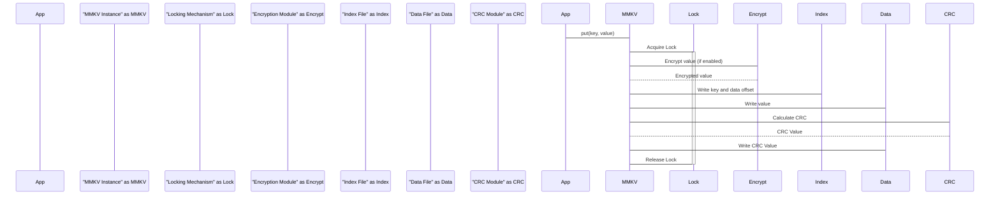
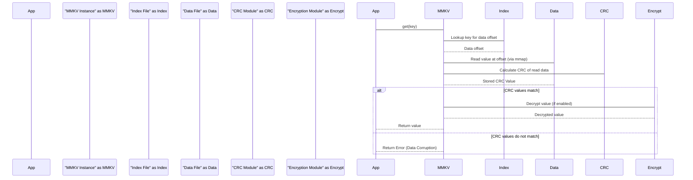

# Project Design Document: MMKV Library

**Version:** 1.1
**Date:** October 26, 2023
**Author:** AI Software Architect

## 1. Project Overview

This document details the design of the MMKV library, a high-performance, mobile-first key-value storage framework developed by Tencent. MMKV leverages memory mapping (mmap) for efficient data access and persistence, making it suitable for applications requiring fast and concurrent data handling on platforms like Android and iOS. This design document serves as a foundation for understanding MMKV's internal workings and is specifically intended for use in threat modeling activities.

## 2. Goals and Objectives

The primary goal of this document is to provide a comprehensive and detailed description of the MMKV library's architecture and functionality, specifically tailored for security analysis. The objectives are:

*   Clearly define the core components and their interactions within the MMKV library.
*   Illustrate the data flow during both read and write operations, highlighting potential security implications.
*   Thoroughly identify and discuss key security considerations and potential attack surfaces.
*   Provide visual representations of the system architecture and data flow to aid understanding.
*   Serve as a definitive reference for security engineers and developers conducting threat modeling exercises on systems utilizing MMKV.

## 3. Target Audience

This document is intended for individuals and teams involved in the security and development of applications using the MMKV library:

*   Security engineers responsible for threat modeling, security assessments, and penetration testing.
*   Software developers integrating and utilizing the MMKV library in their applications.
*   Software architects needing a deep understanding of MMKV's internal mechanisms.
*   Security auditors reviewing the security posture of applications employing MMKV.

## 4. System Architecture

MMKV's architecture is centered around memory-mapping files to enable direct memory access for persistent data storage. The key components are:

*   **"MMKV Instance":** The primary interface through which applications interact with the library. Each instance represents an isolated key-value store.
*   **"mmap Interface":** The core operating system mechanism used to map the content of the data and index files directly into the process's virtual address space. This allows file access with memory-like performance.
*   **"Data File":** The underlying file on the disk where the actual key-value data is persistently stored.
*   **"Index File":** A separate file containing an index of the keys and their corresponding offsets within the "Data File". This enables efficient key lookups.
*   **"CRC Module":**  Responsible for calculating and verifying Cyclic Redundancy Checks to ensure data integrity and detect corruption.
*   **"Locking Mechanism":**  A system-level mechanism (e.g., file locks) used to synchronize access to the "Data File" and "Index File", ensuring thread and process safety during concurrent operations.
*   **"Encryption Module (Optional)":** An optional component that provides encryption and decryption of the data stored in the "Data File" to protect sensitive information at rest.

```mermaid
graph LR
    subgraph "Application Process"
        A["Application Code"] --> B("MMKV Instance");
    end
    B --> C{"mmap Interface"};
    C --> D["Data File"];
    C --> E["Index File"];
    B --> F["Locking Mechanism"];
    B --> G["Encryption Module (Optional)"];
    B -- "Read Data Offset" --> E;
    B -- "Write Data" --> D;
    B -- "Read Data" --> D;

    style A fill:#f9f,stroke:#333,stroke-width:2px
    style B fill:#ccf,stroke:#333,stroke-width:2px
    style C fill:#ddf,stroke:#333,stroke-width:2px
    style D fill:#eee,stroke:#333,stroke-width:2px
    style E fill:#eee,stroke:#333,stroke-width:2px
    style F fill:#aaf,stroke:#333,stroke-width:2px
    style G fill:#aaf,stroke:#333,stroke-width:2px

    linkStyle 0,1,2,3,4,5,6,7,8,9 stroke:#333, stroke-width: 2px;
```

## 5. Data Flow

### 5.1. Write Operation

The process of writing data to MMKV involves the following steps:

1. The application initiates a write operation by calling a `put()` method on the "MMKV Instance" with a key and a value.
2. The "MMKV Instance" engages the "Locking Mechanism" to acquire an exclusive lock on the relevant files, preventing concurrent modifications.
3. If encryption is enabled, the value is passed to the "Encryption Module" for encryption using the configured encryption key.
4. The "MMKV Instance" determines the appropriate offset within the "Data File" where the new key-value pair will be stored. This might involve appending to the file or reusing space from deleted entries.
5. The key and the calculated offset of the value within the "Data File" are written to the "Index File". This update allows for quick retrieval during read operations.
6. The (potentially encrypted) value is written to the "Data File" at the determined offset.
7. The "CRC Module" calculates a checksum for the written data, and this CRC value is also stored in the "Data File" to ensure data integrity.
8. The "mmap Interface" ensures that the changes made in memory are eventually synchronized and persisted to the underlying "Data File" and "Index File" on disk.
9. The "Locking Mechanism" releases the lock, allowing other operations to proceed.



### 5.2. Read Operation

Reading data from MMKV follows these steps:

1. The application requests data by calling a `get()` method on the "MMKV Instance" with a specific key.
2. The "MMKV Instance" consults the "Index File" to locate the offset of the value associated with the provided key within the "Data File".
3. Using the "mmap Interface" and the retrieved offset, the "MMKV Instance" reads the data from the "Data File".
4. The "CRC Module" verifies the integrity of the read data by comparing the stored CRC value with a newly calculated CRC. If they don't match, a data corruption error is indicated.
5. If encryption is enabled, the retrieved data is passed to the "Encryption Module" for decryption using the appropriate key.
6. The decrypted (or original) value is returned to the application.



## 6. Security Considerations

The following security aspects are crucial when considering the MMKV library:

*   **Data at Rest Encryption:** MMKV's optional encryption protects data when the device is off or the application is not running.
    *   **Threats:** Unauthorized access to the device's file system could expose data if encryption is not enabled or if the encryption key is compromised. Weak encryption algorithms or poor key management practices can also undermine this protection.
    *   **Mitigations:** Employ strong encryption algorithms and ensure secure storage and handling of the encryption key.
*   **Data Integrity:** The "CRC Module" helps detect accidental data corruption.
    *   **Threats:** While CRC detects accidental errors, it is not cryptographically secure and will not prevent malicious modification of data. An attacker with write access to the files could modify data and recalculate the CRC.
    *   **Mitigations:** Rely on file system permissions and other security measures to prevent unauthorized write access. Consider using more robust integrity checks if necessary.
*   **Multi-Process Concurrency:** The "Locking Mechanism" ensures data consistency when accessed by multiple processes.
    *   **Threats:** Vulnerabilities in the locking mechanism or improper implementation could lead to race conditions, data corruption, or denial of service.
    *   **Mitigations:** Ensure the underlying locking mechanism provided by the operating system is robust and that MMKV's implementation correctly utilizes it.
*   **File Permissions:** The security of the "Data File" and "Index File" heavily depends on the underlying file system permissions.
    *   **Threats:** If the files are readable or writable by unauthorized processes or users, data confidentiality and integrity can be compromised.
    *   **Mitigations:**  Ensure that the application sets appropriate file permissions to restrict access to authorized processes only.
*   **Memory Mapping Security:** While mmap provides performance benefits, it also means the data is directly accessible in the process's memory space.
    *   **Threats:** Memory dumps, memory corruption vulnerabilities, or other processes with the ability to read the application's memory could expose sensitive data.
    *   **Mitigations:** Employ memory protection techniques and be aware of potential vulnerabilities that could allow memory access.
*   **Key Management:** The security of the encryption key is paramount for protecting encrypted data. MMKV relies on the application to securely manage and provide this key.
    *   **Threats:** Storing the encryption key insecurely (e.g., hardcoded in the application, stored in shared preferences without encryption) completely negates the benefits of encryption.
    *   **Mitigations:** Utilize secure key storage mechanisms provided by the operating system or dedicated key management libraries. Avoid storing keys directly in application code.
*   **Input Validation (Application Responsibility):** While MMKV itself doesn't perform input validation, the application using it must.
    *   **Threats:**  Storing maliciously crafted data could potentially lead to unexpected behavior or vulnerabilities when the data is later read and processed by the application.
    *   **Mitigations:** Implement robust input validation and sanitization within the application before storing data in MMKV.

## 7. Deployment Model

MMKV is typically deployed as a library directly integrated into an application's codebase. Each application instance manages its own isolated MMKV instances and associated data files.

*   **Mobile Applications (Android/iOS):** This is the primary use case. Data files are generally stored within the application's private storage directory.
*   **Desktop Applications (macOS/Windows):** MMKV can also be used in desktop environments, with data files residing in application-specific data directories.

## 8. Assumptions and Constraints

*   This design document assumes that the underlying operating system provides a secure and reliable file system and process isolation mechanisms.
*   The security of data at rest encryption is entirely dependent on the strength of the chosen encryption algorithm and the secure management of the encryption key by the integrating application.
*   This document focuses on the core MMKV library and does not cover security considerations related to specific application implementations or integrations.
*   The performance characteristics of MMKV are influenced by the underlying hardware and operating system.

## 9. Future Considerations

*   **Enhanced Encryption Algorithm Support:** Exploring and potentially integrating support for more modern and robust encryption algorithms.
*   **Secure Key Derivation Functions:** Providing recommendations or built-in mechanisms for deriving encryption keys from user credentials or other secure sources.
*   **Auditing and Logging Capabilities:**  Adding features to log access attempts or modifications to MMKV data for security auditing purposes.
*   **Finer-Grained Access Control:** Investigating potential mechanisms for more granular control over access to specific data within an MMKV instance (though this might be better handled at the application level).
*   **Integration with Hardware Security Modules (HSMs):** Exploring the possibility of integrating with HSMs for more secure key storage and cryptographic operations.

This improved design document provides a more detailed and security-focused overview of the MMKV library, making it a more effective resource for threat modeling and security analysis.