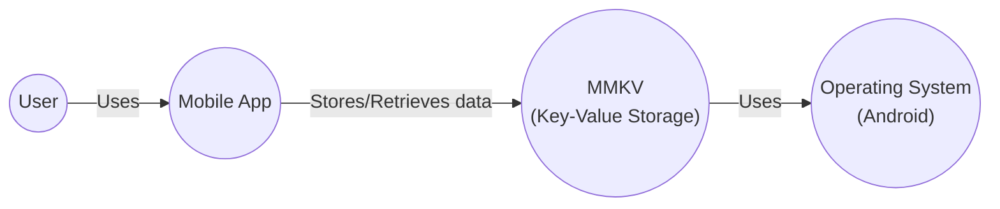
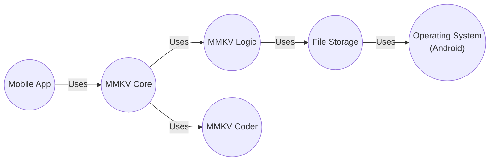
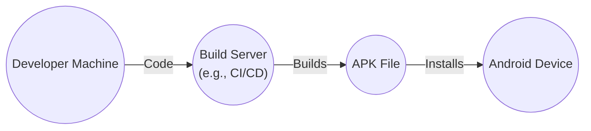
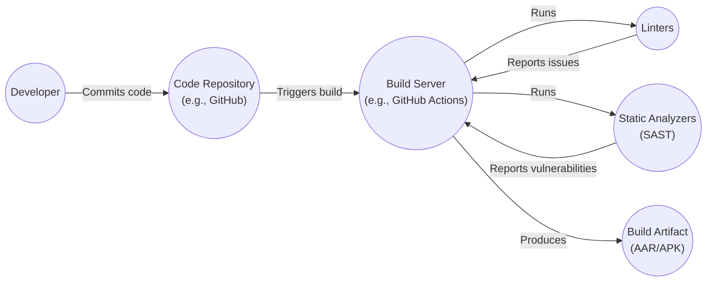

# BUSINESS POSTURE

Business Priorities and Goals:

*   Provide a highly performant and reliable key-value storage solution.
*   Offer a lightweight alternative to SharedPreferences on Android.
*   Enable efficient data persistence and retrieval for mobile applications.
*   Minimize storage overhead and improve application responsiveness.
*   Support cross-process data access and synchronization.

Most Important Business Risks:

*   Data corruption or loss due to storage failures or unexpected application termination.
*   Performance bottlenecks impacting application responsiveness and user experience.
*   Security vulnerabilities exposing sensitive data to unauthorized access or modification.
*   Compatibility issues with different Android versions or device configurations.
*   Concurrency issues leading to data inconsistencies in multi-process scenarios.

# SECURITY POSTURE

Existing Security Controls:

*   security control: Data encryption using AES for sensitive data (configurable). Implemented in MMKV.
*   security control: CRC32 checksum for data integrity verification. Implemented in MMKV.
*   security control: Process locking mechanism to ensure data consistency in multi-process access. Implemented in MMKV.
*   security control: mmap based memory management. Implemented in MMKV.

Accepted Risks:

*   accepted risk: The library does not provide built-in protection against physical device compromise or root access.
*   accepted risk: The library's encryption relies on user-provided keys, and key management is the responsibility of the application.

Recommended Security Controls:

*   security control: Implement a secure key derivation function (KDF) for generating encryption keys from user passwords or other secrets.
*   security control: Consider using the Android Keystore system for storing encryption keys securely.
*   security control: Provide options for data validation and sanitization to prevent injection attacks.
*   security control: Regularly audit the codebase for potential security vulnerabilities and follow secure coding practices.

Security Requirements:

*   Authentication:
    *   Not directly applicable, as MMKV is a storage library and not an authentication service. Authentication is the responsibility of the application using MMKV.
*   Authorization:
    *   Access control to MMKV data should be managed by the application using it. MMKV itself provides process-level locking for concurrent access control.
*   Input Validation:
    *   Applications should validate and sanitize data before storing it in MMKV to prevent potential vulnerabilities like injection attacks.
*   Cryptography:
    *   MMKV should use strong cryptographic algorithms (AES) for data encryption when configured.
    *   Key management should be handled securely, preferably using the Android Keystore system.
    *   CRC32 is used for integrity checks.

# DESIGN

## C4 CONTEXT

Context Diagram Element List:

*   Element:
    *   Name: User
    *   Type: Person
    *   Description: The user of the mobile application.
    *   Responsibilities: Interacts with the mobile application.
    *   Security controls: Relies on the security controls implemented by the mobile application and the operating system.

*   Element:
    *   Name: Mobile App
    *   Type: Software System
    *   Description: The mobile application that utilizes MMKV for key-value storage.
    *   Responsibilities: Provides application functionality to the user, manages data persistence using MMKV.
    *   Security controls: Implements application-level security controls, including data validation, secure key management, and access control.

*   Element:
    *   Name: MMKV (Key-Value Storage)
    *   Type: Software System
    *   Description: The MMKV library providing fast and efficient key-value storage.
    *   Responsibilities: Stores and retrieves data, handles data encryption (if configured), ensures data integrity, manages inter-process communication.
    *   Security controls: Data encryption (AES), CRC32 checksum, process locking.

*   Element:
    *   Name: Operating System (Android)
    *   Type: Software System
    *   Description: The Android operating system.
    *   Responsibilities: Provides the underlying platform for the application and MMKV, manages memory, file system, and inter-process communication.
    *   Security controls: Android security model, sandboxing, permission system.

## C4 CONTAINER

Container Diagram Element List:

*   Element:
    *   Name: Mobile App
    *   Type: Container
    *   Description: The mobile application that utilizes MMKV for key-value storage.
    *   Responsibilities: Provides application functionality to the user, manages data persistence using MMKV.
    *   Security controls: Implements application-level security controls, including data validation, secure key management, and access control.

*   Element:
    *   Name: MMKV Core
    *   Type: Container
    *   Description: The main interface for interacting with MMKV.
    *   Responsibilities: Provides API for reading, writing, and deleting data. Handles initialization and configuration.
    *   Security controls: Enforces access control through process locking.

*   Element:
    *   Name: MMKV Logic
    *   Type: Container
    *   Description: Implements the core logic of MMKV.
    *   Responsibilities: Manages memory mapping, handles data serialization and deserialization, performs CRC32 checks.
    *   Security controls: Implements CRC32 checksum for data integrity.

*   Element:
    *   Name: MMKV Coder
    *   Type: Container
    *   Description: Handles encoding and decoding of data.
    *   Responsibilities: Serializes and deserializes data to/from byte arrays.
    *   Security controls: None directly, relies on the security of the data types being encoded.

*   Element:
    *   Name: File Storage
    *   Type: Container
    *   Description: Manages the underlying file storage.
    *   Responsibilities: Reads and writes data to the file system, manages file locking.
    *   Security controls: Relies on the operating system's file system security.

*   Element:
    *   Name: Operating System (Android)
    *   Type: Container
    *   Description: The Android operating system.
    *   Responsibilities: Provides the underlying platform for the application and MMKV, manages memory, file system, and inter-process communication.
    *   Security controls: Android security model, sandboxing, permission system.

## DEPLOYMENT

Possible deployment solutions:

1.  Embedded within the Android application (APK).
2.  Distributed as a separate library (AAR) and integrated into the application during the build process.

Chosen solution: Embedded within the Android application (APK).

Deployment Diagram Element List:

*   Element:
    *   Name: Developer Machine
    *   Type: Node
    *   Description: The developer's workstation where the code is written and compiled.
    *   Responsibilities: Code development, testing, and building.
    *   Security controls: Standard development environment security practices.

*   Element:
    *   Name: Build Server (e.g., CI/CD)
    *   Type: Node
    *   Description: The server that automates the build process.
    *   Responsibilities: Compiles the code, runs tests, and creates the APK file.
    *   Security controls: Secure build environment, access control, code signing.

*   Element:
    *   Name: APK File
    *   Type: Node
    *   Description: The Android application package file.
    *   Responsibilities: Contains the compiled application code, resources, and the MMKV library.
    *   Security controls: Code signing, integrity checks.

*   Element:
    *   Name: Android Device
    *   Type: Node
    *   Description: The mobile device where the application is installed and run.
    *   Responsibilities: Runs the application and provides the runtime environment for MMKV.
    *   Security controls: Android operating system security features, sandboxing, permission system.

## BUILD

Build Process Description:

1.  Developer commits code changes to the code repository (e.g., GitHub).
2.  The code repository triggers a build on the build server (e.g., GitHub Actions, Jenkins).
3.  The build server checks out the code.
4.  The build server runs linters to check for code style and potential errors.
5.  The build server runs static analyzers (SAST) to identify potential security vulnerabilities.
6.  If linters or static analyzers report any issues, the build fails, and the developer is notified.
7.  If all checks pass, the build server compiles the code and creates the build artifact (AAR or APK).
8.  The build artifact is ready for deployment.

Security Controls in Build Process:

*   security control: Code repository access control: Restricting access to the code repository to authorized developers.
*   security control: Build server security: Ensuring the build server is secure and protected from unauthorized access.
*   security control: Linters: Enforcing code style and identifying potential errors.
*   security control: Static analyzers (SAST): Scanning the code for potential security vulnerabilities.
*   security control: Dependency analysis: Checking for known vulnerabilities in third-party libraries.
*   security control: Code signing: Digitally signing the build artifact to ensure its integrity and authenticity.

# RISK ASSESSMENT

Critical Business Processes:

*   Mobile application functionality relying on persistent data storage.
*   User experience related to application responsiveness and data loading speed.
*   Data synchronization between multiple processes within the application.

Data Sensitivity:

*   The sensitivity of the data stored using MMKV depends on the application using it. MMKV can store any type of data, from non-sensitive configuration settings to highly sensitive user data.
*   Applications should classify the data they store and apply appropriate security measures, such as encryption for sensitive data.

# QUESTIONS & ASSUMPTIONS

Questions:

*   What specific types of data will be stored using MMKV in different applications?
*   What are the specific performance requirements for data access (read/write operations)?
*   Are there any specific regulatory compliance requirements related to data storage?
*   What is the expected lifespan of the data stored in MMKV?
*   What level of data loss is acceptable in case of unexpected failures?

Assumptions:

*   BUSINESS POSTURE: The primary goal is to provide a fast and reliable key-value storage solution for Android applications.
*   SECURITY POSTURE: The application using MMKV is responsible for managing the security of the data it stores, including key management and access control. MMKV provides basic security features like encryption and process locking, but it's not a comprehensive security solution.
*   DESIGN: MMKV is embedded within the Android application and relies on the Android operating system's security features for underlying protection. The build process includes security checks like static analysis.