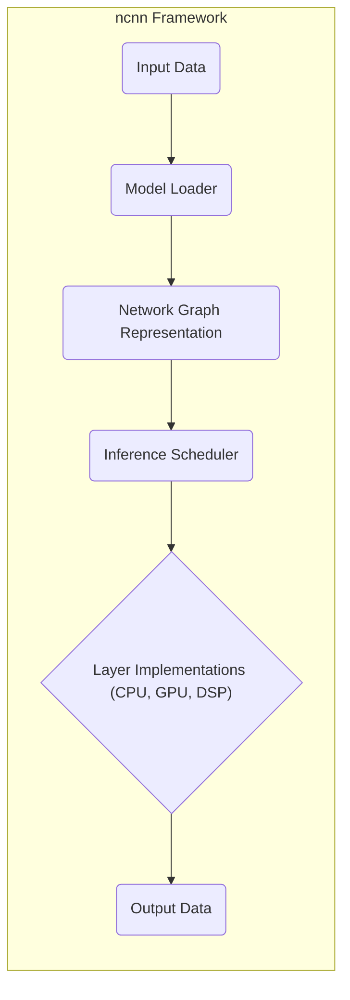
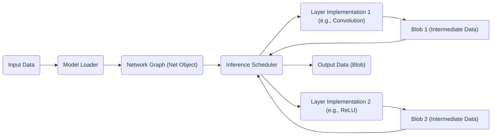
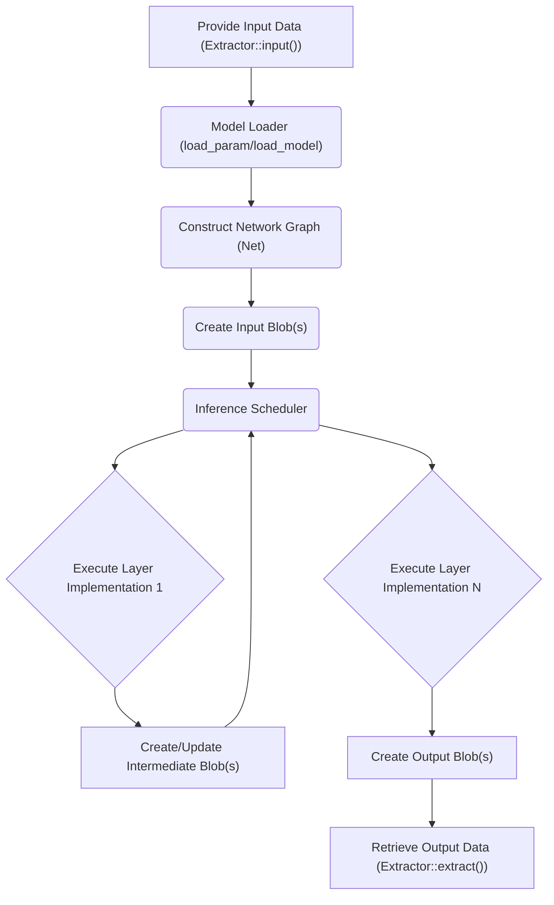

# Project Design Document: ncnn - A High-Performance Neural Network Inference Framework

**Version:** 1.1
**Date:** October 26, 2023
**Author:** AI Architecture Expert

## 1. Introduction

This document provides an enhanced design overview of the ncnn project, a high-performance neural network inference framework developed by Tencent. This document aims to provide a more detailed and refined understanding of the system's architecture, components, and data flow, serving as a robust foundation for subsequent threat modeling activities.

## 2. Goals

The primary goals of this design document are to:

* Clearly and comprehensively articulate the architecture and key components of the ncnn framework.
* Detail the data flow within the system, from initial input to final output, including intermediate transformations.
* Identify key interfaces and interactions between components with greater specificity.
* Provide sufficient and nuanced detail to facilitate effective and targeted threat modeling.
* Strictly adhere to the specified formatting requirements (markdown, mermaid with quoted node names, lists instead of tables).

## 3. System Overview

ncnn is a carefully engineered C++ library designed for efficient and performant inference of deep learning models across diverse platforms, ranging from resource-constrained mobile and embedded devices to desktop environments. Its core strengths lie in its optimization for speed, minimal memory footprint, and broad platform compatibility.

Key characteristics of ncnn include:

* **Exceptional Performance:** Achieves high inference speeds with a focus on low latency and minimal resource consumption.
* **Broad Cross-Platform Support:**  Runs seamlessly on Android, iOS, Linux, macOS, and Windows operating systems.
* **Versatile Backend Support:**  Dynamically leverages hardware acceleration through CPU (x86, ARM with various instruction set extensions), GPU (OpenGL, Vulkan, Metal, CUDA), and DSP units.
* **Flexible Model Format Support:**  Ingests and processes models from popular training frameworks via formats like ONNX, TensorFlow (via conversion), and Caffe.
* **Highly Extensible Architecture:**  Designed to allow developers to introduce custom operators and layer implementations, tailoring the framework to specific needs.

A high-level representation of the system's operation is illustrated below:

## 4. Detailed Design

This section provides a more granular description of the major components within the ncnn framework and their respective functionalities.

### 4.1. Core Components

* **Model Loader:**
    * **Functionality:**  Parses and loads pre-trained neural network model definitions and weights from various serialized formats (e.g., `.param` text-based definition, `.bin` binary weights, ONNX `.pb` protobuf).
    * **Key Responsibilities:** Validates the structural integrity of the model definition, verifies the consistency between the definition and the weights, and constructs an in-memory representation of the network graph.
    * **Interaction:** Receives model files as input and outputs a `Net` object representing the network graph.
* **Network Graph Representation (Net):**
    * **Functionality:** Represents the loaded neural network as a directed acyclic graph (DAG) of interconnected layers.
    * **Key Attributes:** Stores detailed information about each layer, including its specific type (e.g., convolution, pooling, activation), input and output connections to other layers, and layer-specific parameters (e.g., kernel size, stride).
    * **Interaction:** Created by the `Model Loader` and used by the `Inference Scheduler` to orchestrate the execution of the network.
* **Inference Scheduler:**
    * **Functionality:**  Determines the optimal sequence for executing the individual layers within the `Network Graph`.
    * **Key Responsibilities:** Analyzes layer dependencies to ensure correct execution order, optimizes the execution plan based on the target backend and available resources (e.g., number of threads, GPU availability), and manages the allocation and deallocation of temporary data buffers (Blobs).
    * **Interaction:** Receives the `Network Graph` and `Option` settings as input and drives the execution of `Layer Implementations`.
* **Layer Implementations:**
    * **Functionality:** Contains highly optimized implementations of various standard neural network layers (e.g., convolutional layers, pooling layers, activation functions, fully connected layers).
    * **Key Characteristics:** Provides specialized implementations tailored for different hardware backends (CPU with SIMD instructions, GPU using compute shaders, DSP units). Each implementation performs the forward pass computation specific to its layer type and target hardware.
    * **Interaction:**  Invoked by the `Inference Scheduler` and operates on input `Blob` data, producing output `Blob` data.
* **Memory Manager (Allocator):**
    * **Functionality:**  Handles the allocation and efficient management of memory required for storing intermediate data tensors (Blobs) during the inference process.
    * **Key Strategies:** Employs memory pooling and other optimization techniques to minimize memory fragmentation and reduce allocation overhead. Allows for custom allocator implementations.
    * **Interaction:** Used by the `Inference Scheduler` and `Layer Implementations` to allocate and deallocate memory for Blobs.
* **Blob:**
    * **Functionality:** Represents the fundamental data container within ncnn, holding multi-dimensional data tensors that flow between the layers of the network.
    * **Key Attributes:** Stores the actual numerical data of the tensor along with metadata such as dimensions (width, height, channels), data type (e.g., float32, int8), and memory layout.
    * **Interaction:**  Serves as the input and output data structure for `Layer Implementations`.
* **Option:**
    * **Functionality:** A configuration object that allows users to customize various aspects of the inference process.
    * **Key Parameters:** Controls settings such as the number of threads to use for parallel execution, the preferred hardware backend (CPU, GPU, DSP), optimization levels (e.g., enabling or disabling specific optimizations), and memory allocation strategies.
    * **Interaction:**  Passed to the `Inference Scheduler` to guide its operation.

### 4.2. Key Interfaces and Interactions

* **Model Loading Interface:**
    * **Specifics:** Functions like `ncnn::Net::load_param()` and `ncnn::Net::load_model()` provide the primary entry points for loading models from file paths or memory buffers. Different overloads handle various model formats.
    * **Purpose:**  Abstracts the complexities of parsing different model formats, providing a unified way to load models.
* **Inference Interface:**
    * **Specifics:** The `ncnn::Extractor` class provides the core interface for running inference. Methods like `input()` to set input data and `extract()` to execute the network and retrieve output blobs.
    * **Purpose:** Encapsulates the inference process, allowing users to execute the loaded model with specific input data.
* **Layer API:**
    * **Specifics:**  Defines abstract base classes (e.g., `ncnn::Layer`) that concrete layer implementations must inherit from. Key virtual methods include `load_param()`, `load_model()`, and `forward()`.
    * **Purpose:**  Provides a standardized interface for implementing new layers and ensures compatibility with the ncnn framework.
* **Blob API:**
    * **Specifics:** The `ncnn::Mat` class (derived from `Blob`) offers methods for accessing and manipulating the underlying data, including methods to get and set individual elements, reshape the tensor, and query its properties (dimensions, data type).
    * **Purpose:** Provides a type-safe and convenient way to interact with the data tensors.
* **Allocator Interface:**
    * **Specifics:**  Uses abstract allocator classes (e.g., `ncnn::Allocator`) with methods like `allocate()` and `deallocate()`. Users can provide custom allocators by implementing these interfaces.
    * **Purpose:**  Allows for customization of memory management strategies to suit specific deployment environments.

The interaction between these components during a typical inference operation can be visualized with more detail:

## 5. Data Flow

The detailed data flow during an inference operation within ncnn involves a series of transformations and data movements between components:

1. **Input Data Provision:** The user provides the input data, which could be image pixels, sensor readings, or other numerical data, to the ncnn framework, typically through the `Extractor::input()` method.
2. **Model Loading and Parsing:** The `Model Loader` reads the model definition (e.g., `.param`) and weights (e.g., `.bin`) files from storage or memory. It parses this information to understand the network's structure and parameters.
3. **Network Graph Construction:** Based on the parsed model definition, the `Model Loader` constructs an in-memory representation of the neural network as a `Network Graph` (the `Net` object). This graph defines the sequence of layers and their connections.
4. **Input Blob Creation:** The user-provided input data is then wrapped into one or more `Blob` objects. The dimensions and data type of these input blobs must match the expected input of the first layer in the network.
5. **Inference Scheduling and Planning:** The `Inference Scheduler` receives the `Network Graph` and `Option` settings. It analyzes the graph to determine the order in which layers need to be executed, taking into account dependencies between layers. It also optimizes the execution plan based on the target backend and available resources.
6. **Iterative Layer Execution:** The `Inference Scheduler` iterates through the planned execution order. For each layer:
    * It identifies the input `Blob` objects required by the current layer.
    * It invokes the appropriate `Layer Implementation` based on the layer type and the selected backend (CPU, GPU, or DSP).
    * The `Layer Implementation` performs its specific computation on the input `Blob` data.
    * The output of the layer is written into one or more output `Blob` objects.
7. **Intermediate Blob Management:** The `Memory Manager` handles the allocation of memory for the intermediate `Blob` objects created during layer execution. It also manages the deallocation of these blobs when they are no longer needed, optimizing memory usage.
8. **Data Transfer Between Layers:** Data flows between layers through the `Blob` objects. A layer reads its input data from the output `Blob` of the preceding layer(s) and writes its output to a new `Blob` that will serve as input for subsequent layers.
9. **Output Blob Generation:** The final layer(s) in the network produce the output `Blob` objects. These blobs contain the final inference results.
10. **Output Data Retrieval:** The user retrieves the output data from the output `Blob` objects, typically through the `Extractor::extract()` method.

This data flow can be visualized as a more detailed flowchart:

## 6. Security Considerations (Detailed)

Building upon the preliminary considerations, here are more specific security aspects relevant to the ncnn architecture:

* **Model Integrity and Authenticity:**
    * **Threat:** Malicious actors could tamper with the model files (`.param`, `.bin`) to inject backdoors, cause misclassification, or leak sensitive information.
    * **Considerations:**  Lack of built-in mechanisms for verifying the integrity or authenticity of loaded models. Reliance on external mechanisms for ensuring model provenance.
* **Input Validation and Sanitization:**
    * **Threat:**  Processing maliciously crafted input data could lead to buffer overflows, crashes, or unexpected behavior within layer implementations.
    * **Considerations:**  The extent of input validation performed by ncnn needs careful examination. Potential vulnerabilities might exist in how input data is handled by specific layer implementations.
* **Memory Safety in Layer Implementations:**
    * **Threat:**  Bugs in the C++ layer implementations (especially those involving pointer arithmetic or manual memory management) could lead to memory corruption vulnerabilities (e.g., buffer overflows, use-after-free).
    * **Considerations:**  Requires thorough code review and potentially static/dynamic analysis of layer implementations, particularly those contributed by third parties or implementing custom operations.
* **API Security and Access Control:**
    * **Threat:** If ncnn is integrated into a larger system or exposed as a service, vulnerabilities in its API could be exploited to gain unauthorized access or control.
    * **Considerations:**  Evaluate the security of the ncnn API, especially if it handles sensitive data or allows for configuration changes.
* **Third-Party Dependencies:**
    * **Threat:**  Vulnerabilities in third-party libraries used by ncnn (e.g., for image decoding or linear algebra) could be exploited.
    * **Considerations:**  Maintain an inventory of dependencies and regularly update them to patch known vulnerabilities.
* **Hardware Backend Security:**
    * **Threat:**  Vulnerabilities in hardware drivers or firmware associated with the selected backend (GPU, DSP) could be exploited during inference.
    * **Considerations:**  The security of the underlying hardware and its drivers is largely outside the scope of ncnn but should be considered in the overall system security assessment.
* **Data Confidentiality During Inference:**
    * **Threat:** Sensitive input data or intermediate results might be exposed if not handled securely in memory or during transfer between components.
    * **Considerations:**  Evaluate if sensitive data is processed and whether appropriate measures (e.g., memory scrubbing, secure memory allocation) are in place.

## 7. Deployment Considerations

ncnn's design facilitates deployment in various scenarios, each with its own security implications:

* **Mobile Devices (Android, iOS):**
    * **Considerations:**  Model files are often bundled with the application, making them potentially accessible to reverse engineering. Input data might originate from untrusted sources (e.g., user input, network).
* **Embedded Systems:**
    * **Considerations:**  Resource constraints might limit the ability to implement robust security measures. Physical access to the device could pose a threat.
* **Desktop Applications:**
    * **Considerations:**  Similar to mobile, model files can be accessible. The application's security context and user privileges are important.
* **Server-Side Inference (Less Common):**
    * **Considerations:**  If used server-side, standard web application security practices apply (e.g., input validation, authentication, authorization). Network security becomes a significant factor.

## 8. Future Considerations

Future development directions could introduce new security considerations:

* **Model Encryption and Secure Enclaves:**  Exploring mechanisms to encrypt model files and perform inference within secure enclaves could enhance model confidentiality and integrity.
* **Federated Learning Support:**  If ncnn integrates with federated learning, securing the aggregation of model updates becomes crucial.
* **Formal Verification of Layer Implementations:**  Applying formal methods to verify the correctness and safety of critical layer implementations could reduce the risk of memory safety vulnerabilities.
* **Improved Threat Detection and Mitigation:**  Integrating mechanisms to detect and potentially mitigate runtime attacks.

This enhanced design document provides a more detailed and nuanced understanding of the ncnn project, offering a stronger foundation for comprehensive threat modeling and security analysis.