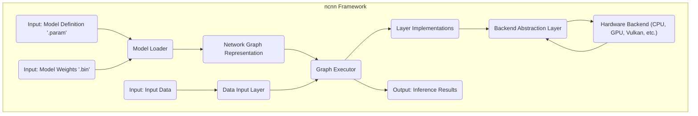
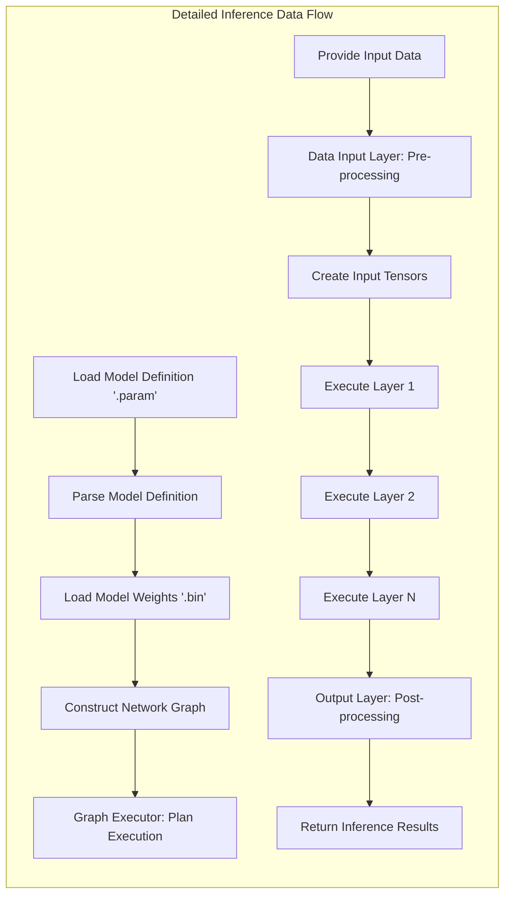

# Project Design Document: ncnn - High-Performance Neural Network Inference Framework

**Version:** 1.1
**Date:** October 26, 2023
**Author:** AI Architecture Expert

## 1. Introduction

This document provides an enhanced architectural design of the ncnn project, a high-performance neural network inference framework developed by Tencent. This revised document aims to offer a more detailed and comprehensive understanding of the system's components, data flow, and key functionalities, building upon the previous version. It will serve as a robust foundation for subsequent threat modeling activities.

## 2. Goals

*   Clearly and comprehensively define the architecture of the ncnn framework.
*   Identify the key components and elucidate their interactions with greater detail.
*   Describe the data flow within the system, emphasizing data transformations and pathways.
*   Provide sufficient and specific detail for effective and targeted threat modeling.
*   Serve as an authoritative reference for developers, security analysts, and stakeholders.

## 3. Scope

This document covers the core architecture of the ncnn inference framework with an increased level of detail. It includes:

*   The main components of the framework and their specific responsibilities.
*   The detailed process of loading and executing neural network models, including intermediate steps.
*   The intricate interactions between different modules and data structures.
*   The supported hardware backends and the abstraction mechanisms involved.

This document still does not cover:

*   The specific implementation details of individual layers or the mathematical algorithms they employ.
*   The training process of neural network models, which is outside the scope of inference.
*   The internal workings of the ncnn converter tools used to prepare models for ncnn.
*   Specific use cases or applications built on top of ncnn, focusing instead on the framework itself.

## 4. Architectural Overview

ncnn is designed as a highly modular and extensible framework optimized for efficient neural network inference across diverse platforms and hardware backends. The core of ncnn is implemented in C++ to achieve high performance.

## 5. Detailed Design

### 5.1. Key Components

*   **Model Loader:**
    *   **Responsibility:**  Parses and loads the neural network model definition from the `.param` file and the model weights from the `.bin` file.
    *   **Functionality:**
        *   Reads and interprets the protobuf-based `.param` file, which describes the network structure (layers, connections, parameters).
        *   Reads the binary `.bin` file containing the trained weights for each layer.
        *   Performs validation checks to ensure the model definition and weights are consistent and valid.
        *   Constructs the in-memory `Network Graph Representation`.
        *   Handles potential errors during file reading or parsing.

*   **Network Graph Representation:**
    *   **Responsibility:** Stores the complete structure of the neural network in memory.
    *   **Functionality:**
        *   Represents the network as a directed acyclic graph (DAG) where nodes represent layers and edges represent the flow of data (tensors).
        *   Contains detailed information about each layer, including its type, parameters (e.g., kernel size, stride), input and output connections, and associated weight data.
        *   Provides methods for traversing and querying the graph structure.

*   **Graph Executor:**
    *   **Responsibility:** Manages the execution of the neural network graph to perform inference.
    *   **Functionality:**
        *   Analyzes the `Network Graph Representation` to determine the optimal order of layer execution, considering dependencies between layers.
        *   Allocates and manages memory for intermediate tensors (the output of each layer).
        *   Dispatches the execution of individual layers to the appropriate `Layer Implementations`.
        *   Handles synchronization and data transfer between layers.
        *   Manages the overall inference process flow.

*   **Layer Implementations:**
    *   **Responsibility:** Contains the concrete implementations of various neural network layer types (e.g., convolution, pooling, activation, fully connected).
    *   **Functionality:**
        *   Each layer type has one or more implementations optimized for different hardware backends.
        *   Performs the core computation of the layer, transforming input tensors into output tensors according to the layer's parameters and algorithm.
        *   Utilizes optimized routines and libraries provided by the underlying hardware backend.
        *   Handles input and output tensor management.

*   **Backend Abstraction Layer:**
    *   **Responsibility:** Provides an abstraction layer that decouples the core framework from specific hardware architectures and their associated APIs.
    *   **Functionality:**
        *   Defines a set of interfaces that `Layer Implementations` can use to interact with hardware backends.
        *   Provides concrete implementations of these interfaces for each supported backend (e.g., CPU, GPU via different APIs like Vulkan, OpenGL, CUDA).
        *   Handles the translation of generic layer operations into backend-specific calls.
        *   Allows ncnn to be extended to support new hardware backends without modifying the core framework.

*   **Hardware Backend (CPU, GPU, Vulkan, OpenGL, CUDA, etc.):**
    *   **Responsibility:** Represents the specific hardware and its associated software libraries used to perform the actual computations.
    *   **Functionality:**
        *   **CPU Backend:** Utilizes standard CPU instructions and potentially optimized libraries like BLAS (Basic Linear Algebra Subprograms).
        *   **GPU Backends (Vulkan, OpenGL, CUDA):** Leverage the parallel processing capabilities of GPUs through their respective APIs and compute kernels.
        *   Provides low-level functions for tensor operations, memory management, and synchronization.

*   **Data Input Layer:**
    *   **Responsibility:** Handles the initial input data provided to the neural network for inference.
    *   **Functionality:**
        *   Receives input data, which can be in various formats (e.g., images, numerical arrays).
        *   May perform pre-processing steps on the input data, such as:
            *   Normalization (scaling pixel values to a specific range).
            *   Resizing (adjusting the dimensions of input images).
            *   Format conversion (e.g., changing color channels).
        *   Creates the initial input tensors for the network.

*   **Output Layer:**
    *   **Responsibility:** Collects and processes the output tensors generated by the final layer(s) of the network.
    *   **Functionality:**
        *   Receives the output tensors from the last executed layer.
        *   May perform post-processing steps on the output data, such as:
            *   Scaling or normalization.
            *   Applying thresholds to classification results.
            *   Decoding object detection bounding boxes.
        *   Presents the final inference results in a user-friendly format.

### 5.2. Data Flow

The detailed data flow within ncnn during an inference operation is as follows:

1. **Model Loading and Parsing:** The `Model Loader` reads the `.param` and `.bin` files from storage. The `.param` file is parsed to understand the network structure, and the `.bin` file provides the weights.
2. **Graph Construction in Memory:** Based on the parsed information, the `Model Loader` constructs the `Network Graph Representation` in memory, linking layers and their parameters.
3. **Input Data Preparation:** The application provides input data to the `Data Input Layer`. This layer may perform necessary pre-processing on the input.
4. **Tensor Creation:** The `Data Input Layer` creates initial tensors from the input data, which will be fed into the first layer of the network.
5. **Execution Planning and Scheduling:** The `Graph Executor` analyzes the `Network Graph Representation` to determine the order in which layers need to be executed, respecting data dependencies.
6. **Iterative Layer Execution:**
    *   The `Graph Executor` iterates through the scheduled layers.
    *   For each layer:
        *   It retrieves the input tensors from the output of preceding layers or the `Data Input Layer`.
        *   It selects the appropriate `Layer Implementation` based on the layer type and the configured or available hardware backend.
        *   The `Backend Abstraction Layer` is invoked to execute the layer's computation on the chosen `Hardware Backend`. This involves translating generic operations into backend-specific calls.
        *   The `Hardware Backend` performs the actual computation, generating output tensors.
        *   The output tensors are stored in memory for use by subsequent layers.
7. **Output Processing:** The `Output Layer` receives the output tensors from the final layer(s). It may perform post-processing on these tensors.
8. **Result Delivery:** The `Output Layer` provides the final inference results back to the application.

### 5.3. Hardware Backend Interaction Details

The `Backend Abstraction Layer` plays a crucial role in enabling ncnn's cross-platform capabilities.

*   **Interface Definition:** The `Backend Abstraction Layer` defines abstract interfaces for common tensor operations (e.g., convolution, matrix multiplication, activation functions). These interfaces are independent of any specific hardware.
*   **Backend Implementations:** For each supported `Hardware Backend` (CPU, GPU with different APIs), there is a concrete implementation of these interfaces. These implementations utilize the specific libraries and capabilities of the backend (e.g., cuDNN for CUDA, Metal Performance Shaders for Metal).
*   **Dynamic Dispatch:** At runtime, when the `Graph Executor` needs to execute a layer, it interacts with the `Backend Abstraction Layer`. The abstraction layer then dynamically dispatches the call to the appropriate backend implementation based on the current configuration or available hardware.
*   **Extensibility:** This design allows for easy addition of new hardware backends by implementing the required interfaces in the `Backend Abstraction Layer`.

### 5.4. Memory Management Strategies

Efficient memory management is critical for ncnn's performance, especially on resource-constrained devices.

*   **Tensor Allocation and Deallocation:** ncnn manages the allocation and deallocation of memory for tensors (multi-dimensional arrays that hold data).
*   **Memory Pools:**  To reduce the overhead of frequent allocation and deallocation, ncnn often uses memory pools. These pools pre-allocate chunks of memory that can be quickly assigned and released.
*   **Scratch Buffers:** For intermediate computations within layers, ncnn may use temporary "scratch" buffers that are allocated and deallocated as needed.
*   **Backend-Specific Memory Management:** The `Backend Abstraction Layer` handles memory management in a way that is appropriate for the underlying hardware backend (e.g., using GPU memory allocation functions for GPU backends).
*   **Memory Reuse:** The framework attempts to reuse memory buffers for different tensors when their lifetimes do not overlap, minimizing memory footprint.

## 6. Security Considerations (Enhanced)

This section provides a more detailed overview of potential security considerations, building upon the preliminary assessment.

*   **Model Integrity and Authenticity:**
    *   **Threat:** Malicious actors could tamper with the `.param` or `.bin` files, injecting malicious layers or altering weights to cause incorrect or harmful behavior.
    *   **Considerations:** Implement mechanisms to verify the integrity and authenticity of model files, such as digital signatures or checksums. Ensure secure storage and transmission of model files.
*   **Input Data Validation and Sanitization:**
    *   **Threat:**  Providing maliciously crafted input data could exploit vulnerabilities in layer implementations (e.g., buffer overflows) or lead to unexpected behavior.
    *   **Considerations:** Implement robust input validation and sanitization checks at the `Data Input Layer` to ensure data conforms to expected formats and ranges.
*   **Memory Safety Vulnerabilities:**
    *   **Threat:** As ncnn is written in C++, it is susceptible to memory safety issues like buffer overflows, use-after-free errors, and dangling pointers, which could lead to crashes or arbitrary code execution.
    *   **Considerations:** Employ secure coding practices, utilize memory safety tools (e.g., AddressSanitizer, MemorySanitizer), and conduct thorough code reviews and static analysis.
*   **Hardware Backend Security:**
    *   **Threat:** Vulnerabilities in the underlying hardware drivers or libraries (e.g., GPU drivers) could be exploited through ncnn by crafting specific inputs or triggering certain layer operations.
    *   **Considerations:** Stay updated with security advisories for hardware drivers and libraries. Consider sandboxing or isolating the ncnn process to limit the impact of potential backend vulnerabilities.
*   **API Security (if exposed):**
    *   **Threat:** If ncnn is exposed as a library or service, vulnerabilities in its API could allow unauthorized access, manipulation of inference parameters, or denial-of-service attacks.
    *   **Considerations:** Implement proper authentication and authorization mechanisms for the API. Validate API inputs thoroughly. Follow secure API design principles.
*   **Dependency Security:**
    *   **Threat:** Vulnerabilities in third-party libraries used by ncnn (e.g., protobuf) could introduce security risks.
    *   **Considerations:** Regularly audit and update dependencies to their latest secure versions. Use dependency scanning tools to identify known vulnerabilities.
*   **Side-Channel Attacks:**
    *   **Threat:**  Information about the model or input data could potentially be leaked through side channels like timing variations or power consumption during inference.
    *   **Considerations:** While difficult to fully mitigate, be aware of this potential threat, especially in security-sensitive applications. Consider techniques like constant-time algorithms where applicable.

## 7. Deployment Considerations

ncnn's versatility allows for deployment in various scenarios, each with its own security implications.

*   **Mobile Devices (Android, iOS):**
    *   **Security Considerations:** Model files might be stored on potentially insecure storage. Applications might be vulnerable to reverse engineering. Secure storage and code obfuscation techniques may be necessary.
*   **Embedded Systems:**
    *   **Security Considerations:** Physical access to the device could allow for tampering. Resource constraints might limit the ability to implement complex security measures. Secure boot and firmware integrity checks are important.
*   **Desktop and Server Environments:**
    *   **Security Considerations:**  While generally more secure, server environments are still susceptible to network attacks and unauthorized access. Proper access controls and network security measures are crucial.

## 8. Future Considerations

*   Enhanced security features, such as built-in model verification and encryption.
*   Further hardening of layer implementations against potential exploits.
*   Improved tooling for security analysis and vulnerability detection.
*   Exploration of techniques for mitigating side-channel attacks.

This enhanced design document provides a more detailed and comprehensive understanding of the ncnn framework's architecture, serving as a valuable resource for in-depth threat modeling and security analysis.