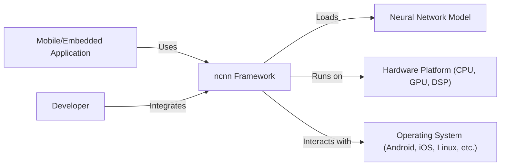
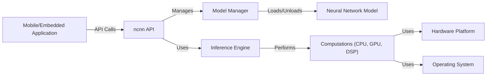
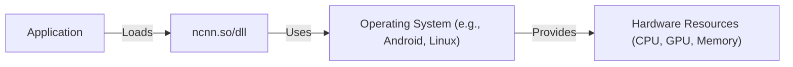
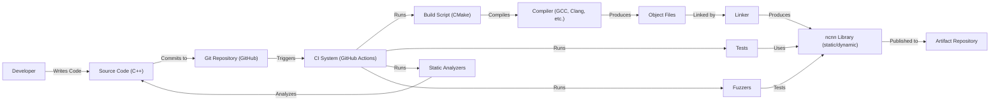

# BUSINESS POSTURE

Business Priorities and Goals:

*   Provide a high-performance, lightweight neural network inference framework optimized for mobile and embedded platforms.
*   Enable developers to easily deploy deep learning models on resource-constrained devices.
*   Support a wide range of hardware platforms and operating systems.
*   Offer a user-friendly API and comprehensive documentation.
*   Maintain a small footprint and minimal dependencies.
*   Foster an active open-source community and encourage contributions.
*   Fast time to market for developers integrating AI into their applications.

Business Risks:

*   Inaccurate or unreliable inference results could lead to application malfunctions or incorrect decisions.
*   Vulnerabilities in the framework could be exploited to compromise device security or user data.
*   Lack of support for specific hardware or software platforms could limit adoption.
*   Performance bottlenecks could hinder the usability of the framework on target devices.
*   Competition from other inference frameworks could reduce market share.
*   Difficulty in keeping up with the rapid pace of advancements in deep learning.

# SECURITY POSTURE

Existing Security Controls:

*   security control: Code reviews are performed to identify and address potential security issues. (Mentioned in contribution guidelines and observed in pull requests).
*   security control: Static analysis tools are used to detect potential vulnerabilities. (Implied by the project's focus on performance and reliability, and common practice in C++ development).
*   security control: Fuzzing is employed to test the robustness of the framework against unexpected inputs. (Mentioned in the documentation and observed in the repository).
*   security control: The framework is designed to minimize external dependencies, reducing the attack surface. (Observed in the project structure and build system).
*   security control: Regular updates and bug fixes are released to address identified vulnerabilities. (Observed in the release history).

Accepted Risks:

*   accepted risk: The framework relies on the security of the underlying operating system and hardware platform.
*   accepted risk: The framework does not provide built-in encryption for models or data. Users are responsible for implementing appropriate security measures if needed.
*   accepted risk: The framework is primarily designed for inference, not training. Security considerations related to model training are outside the scope of the project.

Recommended Security Controls:

*   security control: Implement a comprehensive security testing program, including penetration testing and dynamic analysis.
*   security control: Develop a security vulnerability disclosure policy and establish a process for handling reported vulnerabilities.
*   security control: Provide clear documentation on security best practices for using the framework, including input validation and data sanitization.
*   security control: Consider adding support for secure enclaves or trusted execution environments (TEEs) to protect sensitive models and data.
*   security control: Integrate Software Bill of Materials (SBOM) generation to improve supply chain security.

Security Requirements:

*   Authentication: Not directly applicable, as ncnn is an inference framework, not a service requiring authentication.
*   Authorization: Not directly applicable, as ncnn is an inference framework. Access control is managed by the application using ncnn.
*   Input Validation:
    *   The framework should validate the input tensor data to ensure it conforms to the expected format and range.
    *   The framework should handle invalid or malicious input gracefully, without crashing or exposing vulnerabilities.
    *   The framework should validate model parameters and structure to prevent loading of corrupted or malicious models.
*   Cryptography:
    *   While ncnn itself doesn't handle encryption, it should be compatible with applications that use encryption for model and data protection.
    *   If model or data encryption is used, ncnn should be able to work with decrypted data without introducing vulnerabilities.
*   General:
    *   The framework should follow secure coding practices to minimize the risk of vulnerabilities.
    *   The framework should be regularly tested for security vulnerabilities.
    *   The framework should have a secure supply chain.

# DESIGN

## C4 CONTEXT

Element Descriptions:

*   Element:
    *   Name: User
    *   Type: Person
    *   Description: Represents a mobile or embedded application that utilizes the ncnn framework for neural network inference.
    *   Responsibilities: Interacts with the ncnn framework through its API to perform inference tasks.
    *   Security controls: Implements application-level security measures, such as input validation and data sanitization.

*   Element:
    *   Name: ncnn
    *   Type: Software System
    *   Description: The ncnn neural network inference framework.
    *   Responsibilities: Loads and executes neural network models, performs inference calculations, provides API for integration with applications.
    *   Security controls: Code reviews, static analysis, fuzzing, minimal dependencies, regular updates.

*   Element:
    *   Name: Model
    *   Type: Data
    *   Description: Represents a trained neural network model in a format supported by ncnn.
    *   Responsibilities: Provides the structure and parameters for the neural network.
    *   Security controls: Integrity checks, potentially signing or verification mechanisms (responsibility of the application using ncnn).

*   Element:
    *   Name: Hardware
    *   Type: Hardware
    *   Description: The underlying hardware platform (CPU, GPU, DSP) on which ncnn runs.
    *   Responsibilities: Executes the computational operations required for inference.
    *   Security controls: Hardware-level security features, such as secure boot and memory protection (responsibility of the hardware vendor and OS).

*   Element:
    *   Name: OS
    *   Type: Software System
    *   Description: The operating system (Android, iOS, Linux, etc.) that provides the runtime environment for ncnn.
    *   Responsibilities: Manages system resources, provides APIs for hardware access, and enforces security policies.
    *   Security controls: OS-level security features, such as sandboxing, access control, and regular security updates (responsibility of the OS vendor).

*   Element:
    *   Name: Developer
    *   Type: Person
    *   Description: The developer who integrates the ncnn framework into their application.
    *   Responsibilities: Writes code to load models, prepare input data, and perform inference using the ncnn API.
    *   Security controls: Follows secure coding practices, performs security testing, and keeps the ncnn framework up to date.

## C4 CONTAINER

Element Descriptions:

*   Element:
    *   Name: User
    *   Type: Person
    *   Description: Represents a mobile or embedded application.
    *   Responsibilities: Makes API calls to the ncnn framework.
    *   Security controls: Application-level security.

*   Element:
    *   Name: ncnn API
    *   Type: API
    *   Description: The public interface of the ncnn framework.
    *   Responsibilities: Provides functions for loading models, preparing input, performing inference, and retrieving results.
    *   Security controls: Input validation, error handling.

*   Element:
    *   Name: Model Manager
    *   Type: Component
    *   Description: Responsible for loading and unloading neural network models.
    *   Responsibilities: Parses model files, allocates memory, and manages model resources.
    *   Security controls: Model integrity checks, resource limits.

*   Element:
    *   Name: Inference Engine
    *   Type: Component
    *   Description: The core component that performs the inference calculations.
    *   Responsibilities: Executes the neural network operations, optimizes performance, and manages memory.
    *   Security controls: Input validation, overflow/underflow checks.

*   Element:
    *   Name: Model
    *   Type: Data
    *   Description: The neural network model data.
    *   Responsibilities: Stores the network structure and parameters.
    *   Security controls: Integrity checks (external to ncnn).

*   Element:
    *   Name: Computations
    *   Type: Component
    *   Description: Abstraction for the different computation backends (CPU, GPU, DSP).
    *   Responsibilities: Executes the low-level mathematical operations.
    *   Security controls: Depends on the specific backend implementation.

*   Element:
    *   Name: Hardware
    *   Type: Hardware
    *   Description: The underlying hardware.
    *   Responsibilities: Performs the actual computations.
    *   Security controls: Hardware-level security.

*   Element:
    *   Name: OS
    *   Type: Software System
    *   Description: The operating system.
    *   Responsibilities: Provides system resources and APIs.
    *   Security controls: OS-level security.

## DEPLOYMENT

Possible deployment solutions:

1.  Static linking: ncnn is compiled directly into the application executable.
2.  Dynamic linking: ncnn is compiled as a shared library (e.g., .so, .dll) that is loaded at runtime.
3.  Embedded system deployment: ncnn is integrated into a custom firmware image for a specific embedded device.

Chosen solution (Dynamic Linking):

Element Descriptions:

*   Element:
    *   Name: Application
    *   Type: Software
    *   Description: The mobile or embedded application that uses ncnn.
    *   Responsibilities: Calls ncnn API functions.
    *   Security controls: Application-level security.

*   Element:
    *   Name: ncnn.so/dll
    *   Type: Shared Library
    *   Description: The ncnn framework compiled as a dynamic library.
    *   Responsibilities: Provides the ncnn functionality.
    *   Security controls: Code reviews, static analysis, fuzzing.

*   Element:
    *   Name: Operating System
    *   Type: Software System
    *   Description: The OS (e.g., Android, Linux).
    *   Responsibilities: Manages system resources and provides APIs.
    *   Security controls: OS-level security.

*   Element:
    *   Name: Hardware Resources
    *   Type: Hardware
    *   Description: CPU, GPU, memory, etc.
    *   Responsibilities: Executes the computations.
    *   Security controls: Hardware-level security.

## BUILD

Build Process Description:

1.  Developers write and commit C++ code to the GitHub repository.
2.  GitHub Actions (CI system) is triggered by commits and pull requests.
3.  The CI system executes a build script (CMake).
4.  CMake configures the build process and invokes the compiler (GCC, Clang, etc.).
5.  The compiler compiles the source code into object files.
6.  The linker links the object files to create the ncnn library (static or dynamic).
7.  The CI system runs unit tests and integration tests using the built library.
8.  Static analysis tools (e.g., linters, code analyzers) are run on the source code to detect potential issues.
9.  Fuzzers are used to test the library with a wide range of inputs to identify potential vulnerabilities.
10. The built library and other artifacts are published to an artifact repository.

Security Controls in Build Process:

*   security control: CI/CD pipeline (GitHub Actions) automates the build and testing process, ensuring consistency and repeatability.
*   security control: Static analysis tools are used to identify potential code quality and security issues.
*   security control: Fuzzing is used to test the robustness of the library against unexpected inputs.
*   security control: Unit and integration tests are run to verify the functionality and correctness of the code.
*   security control: CMake build system manages dependencies and ensures a consistent build environment.

# RISK ASSESSMENT

Critical Business Processes:

*   Providing accurate and reliable neural network inference on mobile and embedded devices.
*   Enabling developers to easily integrate AI into their applications.
*   Maintaining the performance and efficiency of the framework.

Data to Protect:

*   Neural network models (potentially sensitive, depending on the application). Sensitivity: Medium to High.
*   Input data to the models (potentially sensitive, depending on the application). Sensitivity: Medium to High.
*   Inference results (potentially sensitive, depending on the application). Sensitivity: Medium to High.
*   Source code of the framework. Sensitivity: Low (it's open source).
*   Build artifacts. Sensitivity: Low.

# QUESTIONS & ASSUMPTIONS

Questions:

*   Are there any specific compliance requirements (e.g., GDPR, HIPAA) that need to be considered?
*   What are the specific target hardware platforms and operating systems?
*   What is the expected level of security expertise of the developers using the framework?
*   Are there any plans to support model encryption or secure enclaves in the future?
*   What is the process for handling security vulnerabilities reported by external researchers?
*   What level of assurance is required for model integrity?

Assumptions:

*   BUSINESS POSTURE: The primary goal is to provide a high-performance, lightweight inference framework, with security being a secondary but important consideration.
*   BUSINESS POSTURE: The project has a moderate risk appetite, balancing the need for innovation and rapid development with the need for security.
*   SECURITY POSTURE: Developers using ncnn are responsible for securing their applications and data, including model and data encryption if needed.
*   SECURITY POSTURE: The underlying operating system and hardware platform provide a baseline level of security.
*   DESIGN: The framework will be primarily used for inference, not training.
*   DESIGN: The framework will be deployed on a variety of mobile and embedded devices.
*   DESIGN: The build process will be automated using a CI/CD pipeline.
*   DESIGN: The framework will be primarily used with pre-trained models.