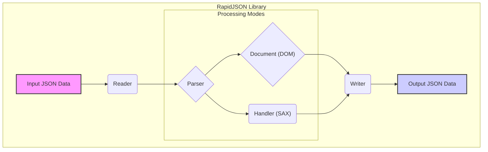
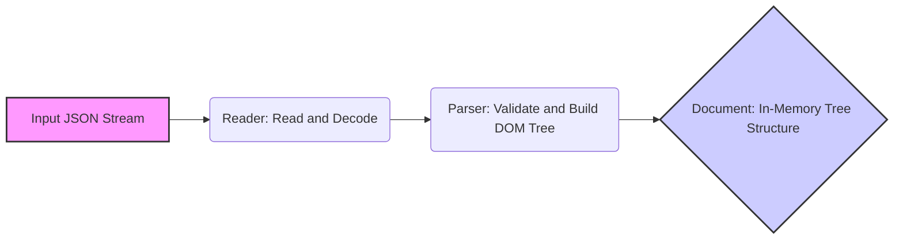
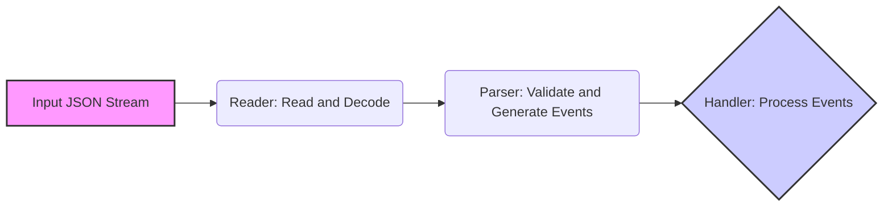
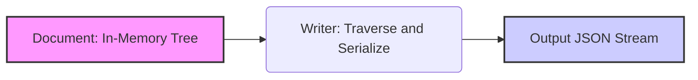
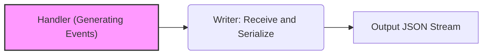

# Project Design Document: RapidJSON

**Version:** 1.1
**Date:** October 26, 2023
**Author:** Gemini (AI Language Model)

## 1. Introduction

This document provides an enhanced and detailed design overview of the RapidJSON library, an open-source C++ library renowned for its performance in parsing and generating JSON. This document is specifically crafted to serve as a robust foundation for subsequent threat modeling activities, offering a clear and in-depth understanding of the library's architecture, individual components, and the flow of data through them.

## 2. Goals

* Deliver a more granular and comprehensive architectural overview of RapidJSON, highlighting different processing modes.
* Provide detailed descriptions of key components, emphasizing potential security vulnerabilities within each.
* Clearly illustrate the data flow during both DOM and SAX-based JSON parsing and generation.
* Explicitly identify and categorize potential areas of security concern, directly relevant for threat modeling exercises.
* Serve as a definitive reference for security assessments, penetration testing, and vulnerability analysis.

## 3. Non-Goals

* This document will not delve into the intricate implementation details of specific algorithms employed within RapidJSON's internal workings.
* Performance benchmarks, optimization strategies, and comparative performance analyses with other JSON libraries are outside the scope.
* Detailed, line-by-line code-level analysis of the RapidJSON source code is not included.
* The historical evolution of the project, its development lifecycle, and contribution patterns are not covered here.

## 4. Architectural Overview

RapidJSON's architecture is designed for both speed and flexibility in handling JSON. It operates primarily in memory, offering two distinct approaches for processing JSON data: a Document Object Model (DOM) and a Simple API for XML (SAX)-like event-driven interface.

**Key Architectural Concepts:**

* **Reader:** The initial stage responsible for ingesting the raw JSON input, which is typically a string or a stream of characters. It handles character encoding.
* **Parser:** The central engine that analyzes the input stream based on the formal JSON syntax rules and constructs an internal representation of the data, either as a DOM or by triggering SAX events.
* **Document (DOM):** Represents the parsed JSON data as a modifiable, tree-like structure held in memory. This allows for random access and manipulation of the JSON elements.
* **Handler (SAX):** An interface defining a set of callback methods. The parser invokes these methods as it encounters different elements within the JSON data stream, enabling stream-based processing without needing to build the entire DOM in memory.
* **Writer:** The final stage responsible for serializing the in-memory representation (either the DOM or data provided through SAX events) back into a well-formed JSON string or stream.

## 5. Key Components

This section provides a more detailed examination of the core components within the RapidJSON library, with a specific focus on potential security implications.

* **`rapidjson::Reader`:**
    * **Functionality:** Consumes the raw JSON input stream. Manages character encoding conversion (typically UTF-8, but supports others). Provides methods for reading characters and managing the input buffer.
    * **Security Considerations:**
        * **Buffer Overflows:** If the `Reader` does not adequately validate the size of the input stream or the length of individual tokens, it could be susceptible to buffer overflows when handling exceptionally large or malformed JSON. An attacker could potentially provide an oversized input to overwrite adjacent memory.
        * **Encoding Issues:** Incorrect handling of character encodings could lead to vulnerabilities. For example, failing to properly handle multi-byte characters in UTF-8 could lead to misinterpretation of the input or vulnerabilities in downstream processing.
        * **Denial of Service:**  Repeatedly providing inputs with invalid encoding or extremely long strings could potentially lead to excessive resource consumption and denial of service.

* **`rapidjson::Parser`:**
    * **Functionality:** The core component that implements the JSON parsing logic. It uses a state machine to validate the JSON syntax and build the internal representation (DOM) or trigger SAX events. Detects and reports syntax errors.
    * **Security Considerations:**
        * **Parsing Logic Bugs:** Complex parsing logic can harbor subtle bugs. Maliciously crafted JSON inputs could exploit these bugs, leading to crashes, infinite loops, or unexpected program behavior. For example, deeply nested JSON structures could potentially cause stack overflows.
        * **Integer Overflows:** Calculations related to the size or number of elements during parsing could be vulnerable to integer overflows. This could lead to incorrect memory allocation or other unexpected behavior.
        * **State Machine Vulnerabilities:** Flaws in the parser's state machine could allow an attacker to provide input that puts the parser into an invalid state, potentially leading to exploitable conditions.
        * **Resource Exhaustion:**  JSON documents with extremely deep nesting or a very large number of elements could consume excessive memory or processing time, leading to denial-of-service attacks.

* **`rapidjson::Document`:**
    * **Functionality:** Represents the parsed JSON data as a Document Object Model (DOM). Stores JSON values (objects, arrays, strings, numbers, booleans, null) in a hierarchical tree-like structure in memory. Provides methods for accessing, modifying, and querying the JSON data.
    * **Security Considerations:**
        * **Memory Management Issues:** Incorrect memory management within the `Document`, such as memory leaks or use-after-free vulnerabilities, could be exploited by attackers to gain control of the application or cause it to crash. For instance, failing to properly deallocate memory after removing elements could lead to memory exhaustion.
        * **Uncontrolled Recursion:** If the `Document`'s internal structure becomes excessively deep due to malicious input, operations that recursively traverse the structure could lead to stack overflows.
        * **Data Integrity:**  While not a direct vulnerability in RapidJSON itself, improper handling of the `Document` by the application using it could lead to data integrity issues.

* **`rapidjson::Value`:**
    * **Functionality:** Represents a single JSON value within the `Document`. Stores the type and data of the JSON value.
    * **Security Considerations:**
        * **Type Confusion:**  If the type of a `Value` is not correctly handled, it could lead to type confusion vulnerabilities in the application logic that uses RapidJSON.
        * **String Handling:**  Improper handling of string values, especially those containing escape sequences or unusual characters, could lead to vulnerabilities if these values are later used in other contexts (e.g., constructing SQL queries).

* **`rapidjson::Writer`:**
    * **Functionality:** Responsible for generating JSON output from the internal representation (DOM) or from SAX events. Handles formatting options (pretty printing, indentation) and performs escaping of special characters according to JSON rules.
    * **Security Considerations:**
        * **Injection Vulnerabilities:**  If the `Writer` does not correctly escape special characters when generating JSON output, it could lead to injection vulnerabilities in applications that consume this output. For example, if user-controlled data is included in the JSON without proper escaping and this JSON is used to construct a SQL query, it could lead to SQL injection.
        * **Format String Vulnerabilities:** Although less likely in this context, if the `Writer` uses format strings incorrectly with user-controlled data, it could potentially lead to format string vulnerabilities.
        * **Denial of Service:**  Generating extremely large JSON outputs could consume excessive resources and lead to denial of service.

* **`rapidjson::Handler` (SAX Interface):**
    * **Functionality:** An abstract interface with methods that are called by the `Parser` as it encounters different JSON tokens. Allows for custom, event-driven processing of JSON data.
    * **Security Considerations:**
        * **Application-Specific Vulnerabilities:** The security of the SAX interface heavily relies on the implementation of the `Handler` by the consuming application. Vulnerabilities in the `Handler` implementation are outside the scope of RapidJSON itself. For example, a poorly implemented handler might be vulnerable to buffer overflows when processing large string values.
        * **State Management Issues:** If the `Handler` maintains its own state, errors in state management could lead to unexpected behavior or vulnerabilities.

* **Allocators:**
    * **Functionality:** RapidJSON uses allocators for managing memory. By default, it uses the standard C++ allocator, but custom allocators can be provided.
    * **Security Considerations:**
        * **Custom Allocator Vulnerabilities:** If a custom allocator is used, vulnerabilities within that allocator (e.g., incorrect memory allocation or deallocation) could lead to memory corruption or other security issues.

## 6. Data Flow

The data flow within RapidJSON is distinct depending on whether the DOM or SAX interface is utilized for processing.

### 6.1. DOM Parsing Data Flow

**Detailed Steps:**

1. **Input JSON Stream:** The raw JSON data enters the library, typically as a string or an input stream.
2. **Reader: Read and Decode:** The `Reader` component reads the input stream character by character and performs character decoding based on the detected or specified encoding. This stage is crucial for handling different character sets and ensuring correct interpretation of the input.
3. **Parser: Validate and Build DOM Tree:** The `Parser` takes the decoded character stream from the `Reader`. It then validates the stream against the JSON syntax rules. If the syntax is valid, the `Parser` constructs the `Document` object in memory, building a tree-like structure representing the JSON data.
4. **Document: In-Memory Tree Structure:** The `Document` object holds the complete parsed JSON data in a hierarchical structure. This allows for random access and modification of the JSON elements.

### 6.2. SAX Parsing Data Flow

**Detailed Steps:**

1. **Input JSON Stream:** The raw JSON data enters the library.
2. **Reader: Read and Decode:**  Similar to DOM parsing, the `Reader` reads and decodes the input stream.
3. **Parser: Validate and Generate Events:** The `Parser` validates the JSON syntax. Instead of building a DOM, it generates a sequence of events as it encounters different JSON tokens (e.g., start object, key, string value).
4. **Handler: Process Events:** The provided `Handler` implementation receives these events from the `Parser` and processes them. This allows for custom logic to be applied to the JSON data without needing to store the entire structure in memory.

### 6.3. JSON Generation (from DOM) Data Flow

**Detailed Steps:**

1. **Document: In-Memory Tree:** The `Writer` starts with the in-memory `Document` object.
2. **Writer: Traverse and Serialize:** The `Writer` traverses the `Document`'s tree structure. For each node in the tree, it serializes the corresponding JSON element (object, array, value) into the output stream, applying necessary escaping and formatting.
3. **Output JSON Stream:** The final JSON output is generated as a string or output stream.

### 6.4. JSON Generation (from SAX Events) Data Flow

**Detailed Steps:**

1. **Handler (Generating Events):** An external entity (or a custom `Handler` implementation) generates SAX-like events representing the JSON structure to be created.
2. **Writer: Receive and Serialize:** The `Writer` receives these events. As each event is received, the `Writer` serializes the corresponding JSON element into the output stream.
3. **Output JSON Stream:** The final JSON output is generated.

## 7. Security Considerations for Threat Modeling

This section categorizes and details potential security vulnerabilities within RapidJSON, providing a structured approach for threat modeling.

* **Input Validation Vulnerabilities:**
    * **Malicious Payloads:**  The `Reader` and `Parser` are susceptible to maliciously crafted JSON payloads designed to exploit parsing logic errors, cause resource exhaustion, or trigger unexpected behavior. Examples include deeply nested objects/arrays leading to stack overflows, or extremely long strings causing buffer overflows during processing.
    * **Large Input Sizes:**  Providing excessively large JSON inputs can lead to denial-of-service by exhausting memory or CPU resources. Threat models should consider the maximum expected input size and the library's ability to handle it gracefully.
    * **Encoding Issues:**  Inputs with invalid or unexpected character encodings can lead to misinterpretation of data or vulnerabilities in subsequent processing. Threat models should consider the supported encodings and potential attack vectors involving encoding manipulation.

* **Parsing Logic Vulnerabilities:**
    * **Buffer Overflows:** Bugs within the `Parser`'s logic when handling specific JSON structures or value types could lead to buffer overflows. Threat models should analyze how different JSON constructs are parsed and identify potential overflow scenarios.
    * **Integer Overflows:** Calculations related to sizes and lengths during parsing could be vulnerable to integer overflows, leading to incorrect memory allocation or other unexpected behavior. Threat models should examine arithmetic operations within the parser.
    * **State Machine Exploitation:**  Flaws in the `Parser`'s state machine could allow attackers to craft inputs that force the parser into an invalid state, potentially leading to exploitable conditions. Threat models should analyze the parser's state transitions and identify potential vulnerabilities.
    * **Resource Exhaustion (Parsing):**  Complex or deeply nested JSON structures can consume significant processing time and memory during parsing, potentially leading to denial-of-service. Threat models should consider the complexity limits of the parser.

* **DOM Manipulation Vulnerabilities:**
    * **Memory Corruption:** Incorrect manipulation of the `Document`'s internal data structures can lead to memory corruption vulnerabilities. Threat models should analyze how the `Document`'s data structures are managed and identify potential corruption scenarios.
    * **Use-After-Free:** Bugs in memory management within the `Document` could result in use-after-free vulnerabilities. Threat models should focus on the allocation and deallocation of memory within the `Document`.
    * **Uncontrolled Recursion (DOM):**  Maliciously crafted JSON leading to deeply nested `Document` structures can cause stack overflows in operations that recursively traverse the DOM.

* **SAX Handler Vulnerabilities:**
    * **Application-Specific Issues:**  Vulnerabilities in custom `Handler` implementations are a significant concern when using the SAX interface. Threat models must consider the security implications of the specific `Handler` implementation being used.
    * **State Management Issues (Handler):** If the `Handler` maintains its own state, vulnerabilities can arise from errors in managing that state.

* **Output Generation Vulnerabilities:**
    * **Injection Vulnerabilities:** Incorrect or insufficient escaping of special characters by the `Writer` can lead to injection vulnerabilities (e.g., SQL injection, cross-site scripting) in applications that consume the generated JSON. Threat models should analyze the escaping mechanisms used by the `Writer`.
    * **Resource Exhaustion (Generation):** Generating extremely large JSON outputs can consume excessive resources.

* **Dependency Vulnerabilities:**
    * While RapidJSON has minimal dependencies, it's important to consider the security of the standard C++ library being used.

* **Build System and Configuration Vulnerabilities:**
    *  Vulnerabilities in the build system or insecure default configuration settings could weaken the overall security of applications using RapidJSON.

## 8. Dependencies

RapidJSON has minimal external dependencies, primarily relying on the standard C++ library.

* **Standard C++ Library:** Provides core functionalities like memory allocation (`new`, `delete`), string manipulation (`std::string`), and input/output operations (`iostream`).

## 9. Deployment

RapidJSON is typically deployed as a header-only library. This means the source code is included directly into the projects that utilize it during compilation. This simplifies deployment but also implies that any vulnerabilities within RapidJSON become inherent vulnerabilities in the applications that incorporate it.

## 10. Future Considerations

* In-depth static analysis and fuzzing of the RapidJSON codebase can help uncover potential bugs and security vulnerabilities that are not immediately apparent through manual review.
* Regular security audits and code reviews by security experts are essential for maintaining the security posture of the library.
* Exploring mitigations for potential denial-of-service attacks related to large input sizes and complex JSON structures could be beneficial.

This enhanced design document provides a more detailed and security-focused overview of RapidJSON, making it a more effective tool for threat modeling activities. By understanding the nuances of its architecture, components, and data flow, security professionals can better identify potential attack vectors and develop appropriate mitigation strategies.