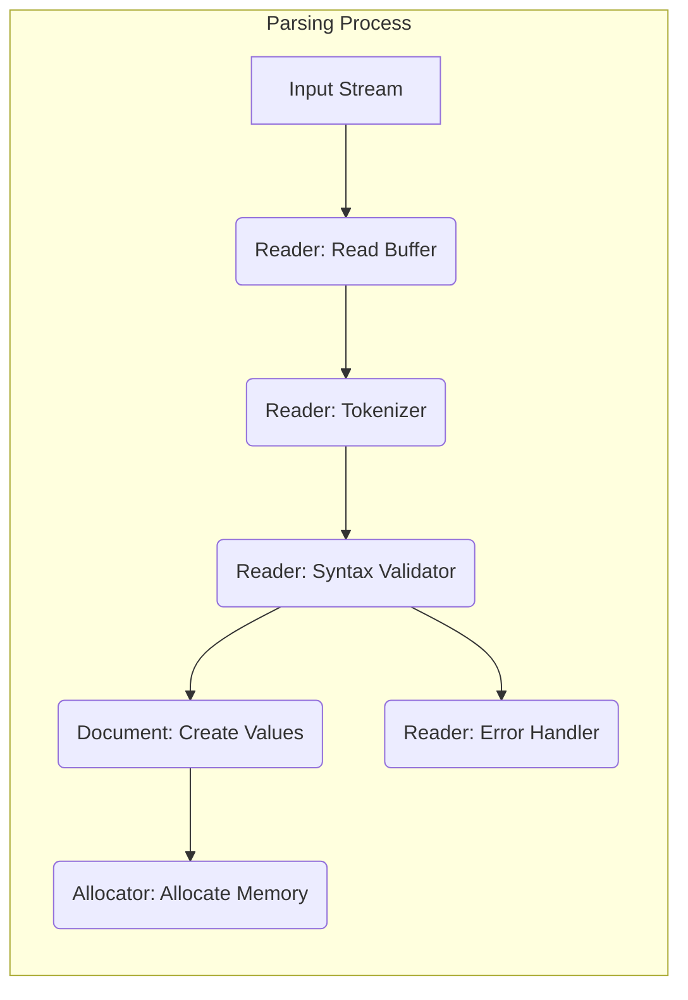
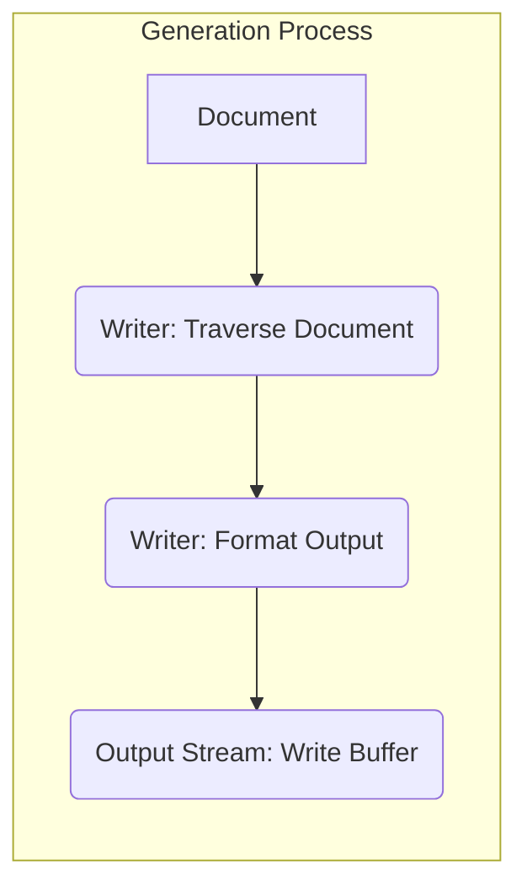

# Project Design Document: RapidJSON Library - Enhanced for Threat Modeling

**Version:** 1.1
**Date:** October 26, 2023
**Author:** AI Software Architect

## 1. Introduction

This document provides an enhanced design overview of the RapidJSON library, a C++ library for parsing and generating JSON. This version is specifically tailored to facilitate threat modeling by providing a deeper understanding of the library's architecture, data flow, and potential attack surfaces.

## 2. Goals and Objectives

The primary goals of RapidJSON are:

*   **Performance:** To provide high-speed JSON parsing and generation.
*   **Standards Compliance:** To strictly adhere to the JSON standard (RFC 8259).
*   **Ease of Use:** To offer a simple and intuitive API for developers.
*   **Memory Efficiency:** To minimize memory usage during parsing and generation.
*   **Security:** To provide a robust and secure JSON processing library.

## 3. Architectural Overview

RapidJSON's architecture revolves around several key components that interact to parse and generate JSON data. Understanding these interactions is crucial for identifying potential vulnerabilities.

*   **Document:** The root object representing the JSON document. It manages memory and provides access to the parsed data.
*   **Value:** Represents individual JSON values (object, array, string, number, boolean, null). It's a tagged union holding the value's type and data.
*   **Allocator:** Responsible for memory management within the `Document`. Custom allocators can be provided.
*   **Reader:** Parses JSON input, validating syntax and constructing the `Document`.
*   **Writer:** Generates JSON output from a `Document` to a stream.
*   **Stream:** An abstraction for input and output sources (strings, files, etc.).
*   **Encoding:** Handles different character encodings (UTF-8, UTF-16, UTF-32).

The parsing process is driven by the `Reader`, which pulls data from the `Stream`. The generation process is driven by the `Writer`, which pushes data to the `Stream`. The `Document` acts as the intermediary, holding the parsed representation.

## 4. Component Details

### 4.1. Document

*   **Responsibilities:**
    *   Central container for the parsed JSON structure.
    *   Manages the lifetime of `Value` objects through its `Allocator`.
    *   Provides methods for querying and manipulating the JSON data.
    *   Offers access to the root `Value` of the JSON document.
*   **Key Classes/Structures:**
    *   `GenericDocument`: Templated on character type and allocator.
    *   Internal data structures to store `Value` objects, often using contiguous memory blocks managed by the `Allocator`.

### 4.2. Value

*   **Responsibilities:**
    *   Represents a single JSON entity.
    *   Stores the JSON value's type (e.g., `kObjectType`, `kStringType`).
    *   Holds the actual data based on its type (e.g., a pointer to a string, an integer value).
    *   Provides methods to access and interpret the stored data.
*   **Key Classes/Structures:**
    *   `GenericValue`: Templated on character type and allocator.
    *   Internal members to store type information and the value itself (using unions or variant types).

### 4.3. Allocator

*   **Responsibilities:**
    *   Provides an interface for allocating and deallocating memory for the `Document` and its `Value` objects.
    *   Allows customization of memory management strategies, potentially impacting performance and security.
*   **Key Classes/Structures:**
    *   `MemoryPoolAllocator`: Default allocator using a memory pool for efficiency.
    *   Custom allocators can be implemented by inheriting from the `Allocator` concept. Security vulnerabilities could arise from poorly implemented custom allocators.

### 4.4. Reader

*   **Responsibilities:**
    *   Reads raw character data from the input `Stream`.
    *   Tokenizes the input stream, identifying JSON elements (e.g., `{`, `}`, `"key"`, `123`).
    *   Validates the sequence of tokens against the JSON grammar.
    *   Constructs the `Document` by creating `Value` objects based on the parsed tokens.
    *   Handles different character encodings specified or detected in the input.
    *   Reports syntax errors encountered during parsing.
*   **Key Classes/Structures:**
    *   `GenericReader`: Templated on character type and encoding.
    *   Internal state machine to manage the parsing process.
    *   Input buffer to hold data read from the `Stream`.
    *   Error reporting mechanism, potentially including error codes and locations.
    *   Logic for handling escape sequences within strings.
    *   Logic for parsing numbers, including integers and floating-point values.

### 4.5. Writer

*   **Responsibilities:**
    *   Traverses the `Document` structure.
    *   Generates the JSON string representation of the `Document`.
    *   Writes the generated JSON to the output `Stream`.
    *   Handles different character encodings for the output.
    *   Provides options for formatting the output (e.g., pretty printing).
*   **Key Classes/Structures:**
    *   `GenericWriter`: Templated on character type and encoding.
    *   Output buffer to accumulate the generated JSON string.
    *   Formatting logic to insert whitespace and indentation.
    *   Logic for escaping special characters in strings.

### 4.6. Stream

*   **Responsibilities:**
    *   Provides an abstract interface for reading input and writing output.
    *   Hides the underlying data source or destination.
    *   Supports various sources like strings, files, and custom buffers.
*   **Key Classes/Structures:**
    *   `StringStream`: Operates on in-memory strings.
    *   `FileReadStream`, `FileWriteStream`: Interact with file systems.
    *   Users can implement custom streams by adhering to the `Stream` interface. Security implications can arise from how custom streams handle data.

## 5. Data Flow

### 5.1. Parsing Data Flow

*   The `Reader` reads chunks of data from the `Input Stream` into its internal buffer (`Reader: Read Buffer`).
*   The `Tokenizer` analyzes the buffer, breaking it down into JSON tokens (`Reader: Tokenizer`).
*   The `Syntax Validator` checks if the sequence of tokens conforms to the JSON grammar (`Reader: Syntax Validator`).
*   Valid tokens trigger the creation of `Value` objects within the `Document` (`Document: Create Values`).
*   The `Document` requests memory from the `Allocator` to store these `Value` objects (`Allocator: Allocate Memory`).
*   If syntax errors are detected, the `Error Handler` is invoked (`Reader: Error Handler`).

### 5.2. Generation Data Flow

*   The `Writer` starts by traversing the `Document` structure (`Writer: Traverse Document`).
*   Based on the `Document`'s `Value` objects, the `Writer` formats the JSON output string (`Writer: Format Output`).
*   The formatted output is then written to the `Output Stream` (`Output Stream: Write Buffer`).

## 6. Security Considerations

*   **Input Validation Robustness:** The `Reader`'s input validation is critical. Weaknesses here can lead to various vulnerabilities.
    *   **Boundary Conditions:** Handling of maximum string lengths, array sizes, and object nesting depths.
    *   **Type Coercion:** How the parser handles unexpected data types.
    *   **Unicode Handling:** Correct processing of different Unicode characters and potential for encoding-related issues.
*   **Memory Management Security:** The `Allocator`'s role in memory safety is paramount.
    *   **Custom Allocator Risks:** User-provided allocators might have vulnerabilities like double-frees or memory leaks.
    *   **Resource Exhaustion:**  Maliciously crafted JSON could cause excessive memory allocation, leading to denial of service.
*   **Stack Overflow Prevention:** Deeply nested JSON structures can exhaust the call stack during parsing.
    *   **Recursion Limits:**  The parser's implementation should have safeguards against excessive recursion.
*   **Integer Overflow/Underflow:** Handling of large numerical values needs to prevent overflows or underflows that could lead to unexpected behavior.
*   **Encoding Vulnerabilities:** Incorrect handling of character encodings can lead to security issues.
    *   **UTF-8 Validation:** Ensuring input UTF-8 is valid to prevent injection attacks or unexpected behavior.
    *   **Encoding Conversion Errors:** Errors during conversion between different encodings.
*   **Denial of Service (DoS) Attacks:**
    *   **Large Input:** Processing extremely large JSON documents can consume excessive CPU and memory.
    *   **Complex Structures:**  Deeply nested or highly interconnected objects/arrays can strain parsing resources.
*   **Error Handling and Information Disclosure:** How the library handles and reports errors.
    *   **Verbose Error Messages:**  Error messages might reveal internal implementation details that could be exploited.
    *   **Uncaught Exceptions:**  Unhandled exceptions could lead to crashes or unexpected behavior.

## 7. Dependencies

*   RapidJSON has minimal external dependencies, primarily relying on standard C++ library features. This reduces the attack surface compared to libraries with numerous dependencies.

## 8. Deployment Considerations

*   RapidJSON is typically deployed as a header-only library, meaning the source code is included directly in the client application during compilation.
*   This deployment model implies that any vulnerabilities in RapidJSON directly impact the security of the applications that use it.
*   Care must be taken to use the correct version of the library and to stay updated with security patches.

## 9. Potential Vulnerabilities (For Threat Modeling)

This section provides a more granular list of potential vulnerabilities to consider during threat modeling exercises:

*   **Parsing Vulnerabilities:**
    *   **Integer Overflow in String Length Calculation:** During parsing of long strings, an integer overflow could occur when calculating the required buffer size, leading to a heap buffer overflow.
    *   **Stack Exhaustion due to Deeply Nested Objects/Arrays:**  Parsing excessively nested JSON structures could lead to stack overflow due to recursive function calls.
    *   **Heap Overflow when Parsing Large Numbers:**  Parsing very large numerical values might lead to a heap buffer overflow if the allocated buffer is insufficient.
    *   **Incorrect Handling of Escape Sequences:**  Vulnerabilities related to how the parser handles backslash-escaped characters in strings.
    *   **Billion Laughs Attack (XML Entity Expansion Equivalent):** While JSON doesn't have entities, deeply nested and repeated structures could lead to excessive memory consumption.
    *   **UTF-8 Validation Bypass:**  If the UTF-8 validation is weak, it might be possible to inject invalid UTF-8 sequences that could be interpreted differently by downstream systems.
*   **Memory Management Vulnerabilities:**
    *   **Double-Free Vulnerability in Custom Allocator:** If a user-provided allocator has a double-free bug, it could be triggered during parsing or document manipulation.
    *   **Memory Leak in Error Handling Paths:**  If error handling logic doesn't properly release allocated memory, it could lead to memory leaks.
*   **DoS Vulnerabilities:**
    *   **Uncontrolled Memory Allocation:**  Crafted JSON could force the library to allocate an excessive amount of memory, leading to a denial of service.
    *   **CPU Exhaustion due to Complex Parsing:**  Certain JSON structures might be computationally expensive to parse, leading to CPU exhaustion.
*   **Configuration Vulnerabilities:**
    *   **Insecure Default Limits:** If default limits for nesting depth or string length are too high, they might be exploited for DoS.

## 10. Mitigation Strategies

*   **Strict Input Validation:** Implement robust checks for all input data, including string lengths, array sizes, nesting depths, and numerical ranges.
*   **Safe Memory Management:** Use secure memory allocation practices and consider using memory-safe allocators.
*   **Recursion Limits:** Implement limits on recursion depth during parsing to prevent stack overflows.
*   **Integer Overflow Checks:**  Perform checks for integer overflows when handling numerical values and buffer sizes.
*   **Proper Encoding Handling:**  Strictly validate input encoding and handle encoding conversions carefully.
*   **Rate Limiting and Resource Controls:**  In applications processing external JSON, consider implementing rate limiting and resource controls to mitigate DoS attacks.
*   **Regular Security Audits:** Conduct regular security audits and penetration testing to identify potential vulnerabilities.
*   **Stay Updated:** Keep the RapidJSON library updated to the latest version to benefit from bug fixes and security patches.

## 11. Future Considerations

*   Explore integration of fuzzing techniques into the development process to identify potential vulnerabilities.
*   Consider providing more granular control over parsing limits and resource usage.
*   Investigate static analysis tools to identify potential security flaws in the codebase.

This enhanced design document provides a more detailed and security-focused overview of the RapidJSON library. It should serve as a valuable resource for conducting thorough threat modeling and implementing appropriate security measures.