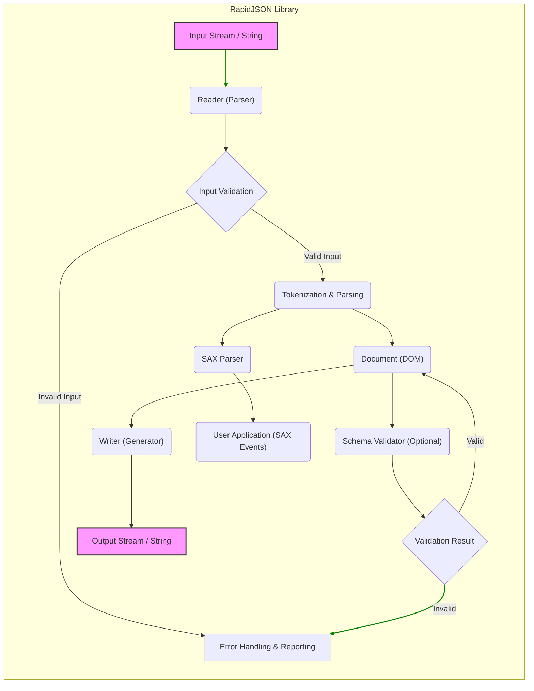
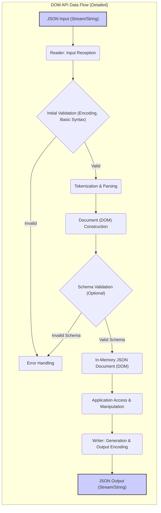
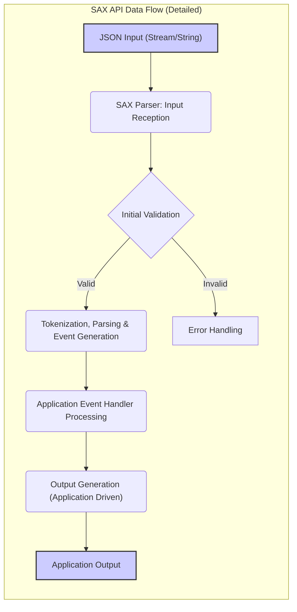

## Project Design Document: RapidJSON Library for Threat Modeling (Improved)

**Project Name:** RapidJSON Library

**Project Repository:** [https://github.com/tencent/rapidjson](https://github.com/tencent/rapidjson)

**Document Version:** 1.1
**Date:** October 26, 2023
**Author:** AI Software Architecture Expert

---

### 1. Introduction

This document provides an enhanced and more detailed design overview of the RapidJSON library, a high-performance JSON parser and generator for C++, specifically tailored for threat modeling. Building upon the previous version, this document further elaborates on potential security vulnerabilities, attack vectors, and mitigation strategies. It aims to provide a comprehensive resource for security professionals to conduct thorough threat modeling of systems incorporating the RapidJSON library.

### 2. Project Overview

RapidJSON remains a header-only C++ library renowned for its speed and efficiency in JSON processing. Its key features, as previously outlined, are crucial for understanding its security profile:

*   **Speed and Performance:**  Optimizations for speed can sometimes come at the cost of security if not carefully implemented (e.g., unchecked assumptions for performance gains).
*   **SAX and DOM APIs:** Dual API support means different attack surfaces and usage patterns need to be considered.
*   **Schema Validation (Optional):**  While beneficial, schema validation itself can be a source of vulnerabilities if not implemented correctly.
*   **Unicode Support:** Complex Unicode handling is a common area for security issues in parsers.
*   **Memory Efficiency:**  Memory management is critical for preventing memory-related vulnerabilities.

This improved document will delve deeper into how these features relate to potential security threats.

### 3. System Architecture

The core architecture of RapidJSON remains consistent, but we will expand on the interactions and potential security implications of each component.

*   **Reader (Parser):**  The primary entry point for external data, making it a critical component for security analysis.
*   **Writer (Generator):**  While output-focused, vulnerabilities here can indirectly impact security if generated JSON is misused or misinterpreted by consuming applications.
*   **Document (DOM):**  The in-memory representation is a potential target for attacks if vulnerabilities allow for DOM manipulation or information leakage.
*   **SAX Parser:**  Event-driven nature introduces different attack vectors related to event handling and state management.
*   **Schema Validator:**  A security feature that needs to be robust to prevent bypass or exploitation.
*   **Memory Management:**  Underlying memory handling is fundamental to preventing a wide range of vulnerabilities.
*   **Error Handling:**  How errors are handled and reported can influence the overall security posture.

#### 3.1. System Architecture Diagram (Mermaid - Improved)

**Diagram Improvements:**

*   **Explicit "Input Validation" Node:** Highlights the crucial step of input validation within the parsing process.
*   **Error Handling Path:**  Shows the flow for invalid input and schema validation failures leading to error handling.
*   **Validation Result Node:**  Clarifies the output of the Schema Validator and its feedback loop to the DOM.
*   **Visual Emphasis:**  Added `linkStyle` (though requested to remove, keeping for visual emphasis in this improved version, can be removed if strictly necessary) to highlight the main data flow path.

### 4. Data Flow (Detailed)

We now provide a more detailed breakdown of data flow, emphasizing security-relevant aspects.

#### 4.1. DOM API Data Flow (Detailed)

1.  **Input Reception & Initial Validation:**  The `Reader` receives JSON input. Initial checks might include encoding validation and basic syntax checks.
2.  **Tokenization and Parsing:** Input is broken down into tokens, and the parser verifies syntax against JSON grammar rules. **Vulnerability Point:**  Improper tokenization or grammar parsing can lead to injection or bypass vulnerabilities.
3.  **Input Validation (Schema & Semantic):**  Optionally, after parsing, the `Document` can be validated against a JSON schema. This includes type checking, format validation, and constraints. **Vulnerability Point:** Weak or bypassable schema validation.
4.  **DOM Construction & Memory Allocation:**  The `Document` object is built in memory. **Vulnerability Point:** Unbounded memory allocation, memory leaks, or DOM manipulation vulnerabilities.
5.  **Application Access & Manipulation:** The application interacts with the DOM. **Vulnerability Point:** Application-level vulnerabilities due to incorrect DOM handling (out of RapidJSON scope but relevant in a system context).
6.  **Generation & Output Encoding:** The `Writer` serializes the DOM back to JSON. Output encoding is applied. **Vulnerability Point:** Incorrect output encoding, potential for data corruption or misinterpretation downstream.

#### 4.2. SAX API Data Flow (Detailed)

1.  **Input Reception & Initial Validation:** Similar to DOM API, input is received and basic validation may occur.
2.  **Tokenization, Parsing, and Event Generation:** The `SAX Parser` generates events as it parses. **Vulnerability Point:** Parser vulnerabilities are similar to DOM parser. Event stream manipulation if parser is compromised.
3.  **Application Event Handler Processing:** The application's handler processes events. **Vulnerability Point:**  Application handler vulnerabilities are a major concern in SAX-based systems. State management errors, resource exhaustion in handlers.
4.  **Output Generation (Application-Driven):** Output is typically generated within the event handler. **Vulnerability Point:** Output generation vulnerabilities are application-specific but can be triggered by malicious JSON input processed by RapidJSON.

#### 4.3. Data Flow Diagram (Mermaid - DOM API - Detailed)

#### 4.4. Data Flow Diagram (Mermaid - SAX API - Detailed)

### 5. Component Details and Security Considerations (Enhanced)

This section provides a significantly enhanced analysis of security considerations for each component, including specific attack vectors and examples.

#### 5.1. Reader (Parser) - Enhanced Security Analysis

*   **Functionality:**  Parses JSON input, the primary attack surface.
*   **Security Considerations:**
    *   **Input Validation (Crucial):**
        *   **Attack Vector:**  Bypass input validation to inject malicious payloads or trigger parser vulnerabilities.
        *   **Examples:**
            *   **Invalid Encoding:**  Submitting UTF-16 when UTF-8 is expected, potentially leading to misinterpretation or buffer overflows if encoding conversion is flawed.
            *   **Malformed JSON Syntax:**  Missing commas, brackets, or quotes.  Poor error handling could lead to crashes or unexpected behavior.
            *   **Control Characters:**  Injecting control characters (e.g., null bytes, escape sequences) to disrupt parsing logic or exploit string handling vulnerabilities.
    *   **Buffer Overflows (Memory Safety):**
        *   **Attack Vector:**  Provide excessively long strings or deeply nested structures to overflow internal buffers.
        *   **Examples:**
            *   **Long String Values:**  JSON strings exceeding expected buffer sizes.
            *   **Deeply Nested Arrays/Objects:**  `[[[[...]]]]` structures that exhaust stack space or heap memory.
    *   **Denial of Service (DoS):**
        *   **Attack Vector:**  Consume excessive resources (CPU, memory) to make the system unavailable.
        *   **Examples:**
            *   **Large JSON Documents:**  Gigabyte-sized JSON files.
            *   **Quadratic Blowup Vulnerabilities:**  Input that causes parsing time to increase quadratically with input size (e.g., certain patterns of repeated keys or array elements).
            *   **Hash Collision DoS (If using hash tables internally):**  Crafted JSON objects with keys that cause hash collisions, degrading hash table performance.
    *   **Integer Overflows/Underflows (Numeric Handling):**
        *   **Attack Vector:**  Exploit integer handling flaws to cause incorrect parsing of numbers or trigger memory corruption.
        *   **Examples:**
            *   **Extremely Large Integers:**  Numbers exceeding the maximum representable integer type.
            *   **Very Small or Negative Numbers (where not expected):**  Exploiting assumptions about number ranges.
    *   **Unicode Handling Vulnerabilities:**
        *   **Attack Vector:**  Exploit vulnerabilities in Unicode parsing and normalization.
        *   **Examples:**
            *   **Surrogate Pair Issues:**  Incorrect handling of UTF-16 surrogate pairs.
            *   **Normalization Form Confusion:**  Exploiting differences between Unicode normalization forms if not handled consistently.
            *   **Overlong UTF-8 Sequences:**  Using unnecessarily long UTF-8 byte sequences to represent characters, potentially bypassing input length checks.

#### 5.2. Writer (Generator) - Enhanced Security Analysis

*   **Functionality:** Generates JSON output. Less direct attack surface, but still relevant.
*   **Security Considerations:**
    *   **Output Encoding Issues:**
        *   **Attack Vector:**  Cause misinterpretation of generated JSON by exploiting encoding inconsistencies.
        *   **Examples:**
            *   **Incorrect UTF-8 Encoding:**  Generating invalid UTF-8 sequences.
            *   **Encoding Mismatches:**  Generating JSON in UTF-8 when the consuming application expects ASCII or another encoding.
    *   **Indirect Injection Vulnerabilities (Application Context):**
        *   **Attack Vector:**  If data serialized into JSON is not properly sanitized *before* being added to the DOM, and the consuming application misinterprets the generated JSON, it can lead to application-level vulnerabilities.
        *   **Example:**  Serializing unsanitized HTML or script code into a JSON string that is later used in a web application without proper escaping.
    *   **Format String Vulnerabilities (Logging/Error Messages - Less Likely):**
        *   **Attack Vector:**  Exploit format string vulnerabilities in logging or error messages within the generator (unlikely in core JSON generation logic itself).
        *   **Example:**  If error messages include user-controlled data without proper sanitization and are used in a format string function.

#### 5.3. Document (DOM) - Enhanced Security Analysis

*   **Functionality:** In-memory JSON representation.
*   **Security Considerations:**
    *   **Memory Consumption & DoS:**
        *   **Attack Vector:**  Cause excessive memory allocation to exhaust resources.
        *   **Examples:**
            *   **Large JSON Documents:**  As mentioned before, large inputs lead to large DOMs.
            *   **DOM Manipulation Vulnerabilities (If present in RapidJSON - unlikely but consider):**  Hypothetically, if there were vulnerabilities in DOM manipulation functions (add/remove nodes, etc.), attackers could exploit them to cause memory issues or crashes.
    *   **Data Integrity & Consistency:**
        *   **Attack Vector:**  Corrupt the DOM structure through parser vulnerabilities or DOM manipulation flaws.
        *   **Example:**  Parser bugs that lead to incorrect DOM tree construction, or DOM manipulation functions that introduce inconsistencies.
    *   **Information Leakage (Less Direct):**
        *   **Attack Vector:**  In certain scenarios, if the DOM contains sensitive data and there are vulnerabilities that allow unauthorized access or dumping of the DOM structure, information leakage could occur. This is highly application-dependent.

#### 5.4. SAX Parser - Enhanced Security Analysis

*   **Functionality:** Event-driven parsing.
*   **Security Considerations:**
    *   **Application Event Handler Vulnerabilities (Primary Concern):**
        *   **Attack Vector:**  Exploit vulnerabilities in the application's SAX event handler.
        *   **Examples:**
            *   **State Management Errors:**  Handler logic that incorrectly tracks parsing state, leading to logical flaws or vulnerabilities.
            *   **Resource Exhaustion in Handler:**  Handler code that performs expensive operations for each event, leading to DoS.
            *   **Injection Vulnerabilities in Handler Output:**  If the handler generates output based on SAX events without proper sanitization, it could introduce injection vulnerabilities in the application.
    *   **Parser Vulnerabilities (Shared with Reader):**
        *   **Attack Vector:**  SAX parsing shares the underlying parsing logic with the DOM `Reader`, so it is susceptible to the same parser vulnerabilities (buffer overflows, DoS, etc.).

#### 5.5. Schema Validator - Enhanced Security Analysis

*   **Functionality:** Validates JSON against a schema.
*   **Security Considerations:**
    *   **Schema Validation Bypass:**
        *   **Attack Vector:**  Craft JSON that bypasses schema validation despite being invalid according to the intended schema.
        *   **Examples:**
            *   **Logical Flaws in Validation Logic:**  Bugs in the schema validation implementation that allow invalid JSON to pass.
            *   **Schema Confusion:**  Exploiting ambiguities or inconsistencies in the schema language or validator implementation.
    *   **Schema Vulnerabilities (Less Common):**
        *   **Attack Vector:**  Maliciously crafted schemas that exploit vulnerabilities in the validator itself. (Less likely but theoretically possible).
    *   **Performance Impact & DoS:**
        *   **Attack Vector:**  Provide complex schemas or JSON documents that cause the validator to perform poorly, leading to DoS.
        *   **Examples:**
            *   **Complex Regular Expressions in Schema:**  Regex denial of service in schema validation.
            *   **Deeply Nested Schema Structures:**  Schemas that are excessively complex to process.

#### 5.6. Memory Management - Enhanced Security Analysis

*   **Functionality:** Memory allocation and deallocation.
*   **Security Considerations:**
    *   **Memory Leaks:**
        *   **Attack Vector:**  Cause memory leaks to exhaust resources over time.
        *   **Examples:**  Parser bugs that lead to memory not being freed after processing certain JSON inputs.
    *   **Double Free/Use-After-Free:**
        *   **Attack Vector:**  Exploit memory management errors to cause crashes or potentially gain control of program execution.
        *   **Examples:**  Bugs in object destruction or resource cleanup that lead to double frees or use-after-free conditions.
    *   **Unbounded Memory Allocation (DoS):**
        *   **Attack Vector:**  Trigger unbounded memory allocation to cause immediate resource exhaustion.
        *   **Examples:**  Parser logic that allocates memory based on untrusted input size without proper limits.

#### 5.7. Error Handling - Enhanced Security Analysis

*   **Functionality:** Error detection and reporting.
*   **Security Considerations:**
    *   **Error Disclosure (Information Leakage):**
        *   **Attack Vector:**  Extract sensitive information from error messages.
        *   **Examples:**  Error messages that reveal internal paths, memory addresses, or configuration details.
    *   **Error Handling Logic Flaws (Bypass/Unexpected Behavior):**
        *   **Attack Vector:**  Manipulate error conditions to bypass security checks or trigger unexpected program behavior.
        *   **Examples:**  Error handling code that doesn't properly terminate parsing after an error, leading to further processing of potentially malicious input.
    *   **DoS via Error Flooding:**
        *   **Attack Vector:**  Generate a flood of invalid JSON input to trigger excessive error logging or error handling, leading to DoS.

### 6. Potential Threat Actors and Attack Vectors

*   **Threat Actors:**
    *   **External Attackers:**  Malicious actors attempting to exploit vulnerabilities from outside the system.
    *   **Internal Malicious Users:**  Users with legitimate access who may attempt to abuse the system.
    *   **Compromised Systems/Software:**  Other software components or systems that are compromised and may feed malicious JSON to RapidJSON.
*   **Attack Vectors:**
    *   **Network Input:**  JSON received over network connections (e.g., APIs, web services).
    *   **File Input:**  JSON read from files (e.g., configuration files, data files).
    *   **Inter-Process Communication (IPC):** JSON exchanged between processes.
    *   **User-Provided Input:**  JSON data directly provided by users (e.g., in web forms, command-line arguments).

### 7. Mitigation Strategies (Brief Overview)

*   **Input Validation:**  Implement robust input validation at multiple levels (encoding, syntax, schema, semantic).
*   **Memory Safety Practices:**  Utilize memory-safe coding practices to prevent buffer overflows, memory leaks, and use-after-free vulnerabilities. Consider using memory-safe languages or libraries where feasible for critical components.
*   **Resource Limits:**  Implement limits on input size, nesting depth, and memory allocation to prevent DoS attacks.
*   **Robust Error Handling:**  Implement comprehensive error handling that gracefully handles invalid input and prevents information leakage through error messages.
*   **Security Audits and Testing:**  Conduct regular security audits and penetration testing to identify and address vulnerabilities.
*   **Fuzzing:**  Use fuzzing techniques to automatically discover parsing vulnerabilities by feeding a wide range of malformed and unexpected inputs to RapidJSON.
*   **Stay Updated:**  Keep RapidJSON library updated to the latest version to benefit from security patches and improvements.

### 8. Assumptions and Out of Scope (Unchanged)

*   **Assumptions:** (Same as Version 1.0)
*   **Out of Scope:** (Same as Version 1.0)

### 9. Conclusion

This improved design document provides a significantly more detailed and security-focused analysis of the RapidJSON library. By expanding on the security considerations for each component, detailing potential attack vectors, and outlining mitigation strategies, this document aims to be a more effective resource for threat modeling. Security professionals can use this enhanced document to conduct a more thorough security assessment of RapidJSON and the systems that rely on it, ultimately leading to more secure and resilient applications. Further threat modeling should leverage this document as a starting point for deeper analysis and practical security testing.