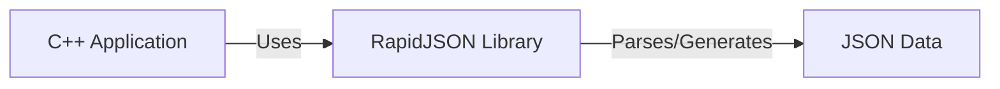
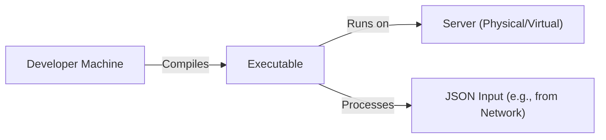
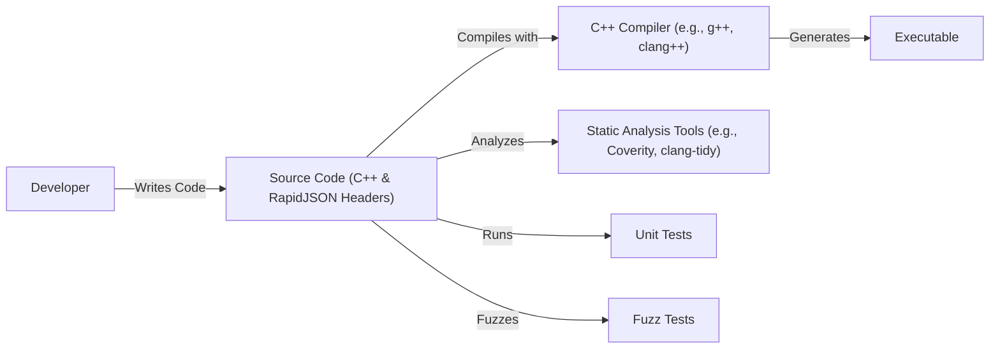

# BUSINESS POSTURE

RapidJSON is a header-only C++ library for parsing and generating JSON. It's designed for performance-sensitive systems. The business priorities likely revolve around:

*   Performance: RapidJSON's core value proposition is speed and efficiency in JSON processing.
*   Reliability: As a foundational library, it must be stable and dependable. Bugs or vulnerabilities can have cascading effects on applications using it.
*   Ease of Use: While performance is key, the library should be relatively easy to integrate and use within C++ projects.
*   Portability: Supporting a wide range of C++ compilers and platforms is crucial for broad adoption.
*   Minimal Dependencies: Being header-only minimizes external dependencies, simplifying integration and reducing potential conflicts.

Business risks that need to be addressed:

*   Security Vulnerabilities: Given its role in parsing potentially untrusted JSON input, vulnerabilities like buffer overflows, denial-of-service (DoS) via crafted input, or other parsing-related exploits pose a significant risk. These could lead to application crashes, arbitrary code execution, or information disclosure.
*   Performance Bottlenecks: While designed for speed, unexpected performance issues under specific workloads or input patterns could impact applications relying on RapidJSON.
*   Compatibility Issues: Changes or updates to the library could introduce compatibility problems with existing codebases, hindering upgrades or requiring significant refactoring.
*   Lack of Maintenance: If the project becomes unmaintained, security vulnerabilities might go unpatched, and the library might become incompatible with newer C++ standards or compilers.
*   Licensing Issues: Although RapidJSON uses the MIT license (permissive), any licensing concerns or ambiguities could deter adoption, especially in commercial projects.

# SECURITY POSTURE

Existing security controls:

*   security control: Fuzzing: The repository contains a `fuzz` directory, indicating the use of fuzz testing to discover potential vulnerabilities. This is a proactive measure to identify parsing errors and edge cases that could lead to security issues.
*   security control: Continuous Integration (CI): The presence of `.travis.yml` and `appveyor.yml` files suggests the use of CI for automated builds and testing. This helps ensure that new code changes don't introduce regressions or break existing functionality.  It's likely that tests include security-relevant checks.
*   security control: MIT License: The use of a permissive open-source license encourages community scrutiny and contributions, potentially leading to faster identification and resolution of security issues.
*   security control: Static Analysis: The documentation and build files suggest the use of static analysis tools (e.g., Coverity, clang-tidy) to identify potential coding errors and vulnerabilities before runtime.
*   security control: Compiler Warnings: The project aims to compile cleanly with high warning levels, reducing the likelihood of common coding errors that could lead to vulnerabilities.

Accepted risks:

*   accepted risk: Complexity of JSON Parsing: Parsing complex or deeply nested JSON structures can be inherently resource-intensive. While RapidJSON is optimized, it's likely accepted that extremely large or maliciously crafted JSON input could still lead to performance degradation or resource exhaustion (DoS).
*   accepted risk: C++ Memory Management: As a C++ library, RapidJSON relies on manual memory management. While the library likely employs best practices, the inherent risks of manual memory management in C++ (e.g., use-after-free, double-free) are likely accepted, with mitigation through careful coding and testing.

Recommended security controls:

*   Regular Security Audits: Conduct periodic security audits, both manual code reviews and automated penetration testing, to identify potential vulnerabilities that might be missed by fuzzing and static analysis.
*   Dependency Management: Even though it's header-only, track any updates to compilers, build tools, or testing frameworks used by RapidJSON to ensure compatibility and address any security issues in those components.
*   Security-Enhanced Build Options: Explore and enable compiler and linker options that enhance security, such as stack canaries, address space layout randomization (ASLR), and data execution prevention (DEP).
*   Content Security Policy (CSP) Considerations: If RapidJSON is used in environments where CSP is relevant (e.g., web browsers), provide guidance on how to configure CSP to mitigate potential risks related to JSON parsing.

Security requirements:

*   Authentication: Not directly applicable to a JSON parsing library.
*   Authorization: Not directly applicable to a JSON parsing library.
*   Input Validation:
    *   The library should handle invalid JSON input gracefully, without crashing or exhibiting undefined behavior.
    *   The library should provide mechanisms for users to validate the structure and content of parsed JSON data against a schema (e.g., using RapidJSON's schema validation features).
    *   The library should protect against common JSON-related vulnerabilities, such as injection attacks (if the parsed JSON is used to construct other data formats, like SQL queries).
*   Cryptography: Not directly applicable, unless RapidJSON is used to handle encrypted JSON payloads (in which case, it should integrate with appropriate cryptographic libraries).
*   Memory safety: The library should be free of memory corruption vulnerabilities, such as buffer overflows, use-after-free errors, and double-frees.

# DESIGN

## C4 CONTEXT

Element descriptions:

*   Element:
    *   Name: C++ Application
    *   Type: External System
    *   Description: Any C++ application that utilizes RapidJSON for JSON parsing and generation.
    *   Responsibilities:
        *   Provides JSON data to RapidJSON for parsing.
        *   Receives parsed JSON data from RapidJSON.
        *   Generates JSON data using RapidJSON.
        *   Consumes JSON data generated by RapidJSON.
    *   Security controls:
        *   Input validation of data before passing to RapidJSON.
        *   Secure handling of parsed data received from RapidJSON.
        *   Secure use of generated JSON data.

*   Element:
    *   Name: RapidJSON Library
    *   Type: Project
    *   Description: A header-only C++ library for parsing and generating JSON.
    *   Responsibilities:
        *   Parsing JSON data into a Document Object Model (DOM).
        *   Generating JSON data from a DOM.
        *   Providing schema validation capabilities.
        *   Handling various JSON encodings (UTF-8, UTF-16, UTF-32).
    *   Security controls:
        *   Fuzz testing.
        *   Static analysis.
        *   Compiler warnings.
        *   Continuous integration.

*   Element:
    *   Name: JSON Data
    *   Type: Data
    *   Description: JSON-formatted data, either input for parsing or output from generation.
    *   Responsibilities:
        *   Represents data in a structured format.
    *   Security controls:
        *   Data validation (by the C++ Application).
        *   Schema validation (using RapidJSON).

## C4 CONTAINER

Since RapidJSON is a header-only library, the container diagram is essentially the same as the context diagram. There are no separate deployable units.

Element descriptions:

*   Element:
    *   Name: C++ Application
    *   Type: External System
    *   Description: Any C++ application that utilizes RapidJSON for JSON parsing and generation.
    *   Responsibilities:
        *   Provides JSON data to RapidJSON for parsing.
        *   Receives parsed JSON data from RapidJSON.
        *   Generates JSON data using RapidJSON.
        *   Consumes JSON data generated by RapidJSON.
    *   Security controls:
        *   Input validation of data before passing to RapidJSON.
        *   Secure handling of parsed data received from RapidJSON.
        *   Secure use of generated JSON data.

*   Element:
    *   Name: RapidJSON Library
    *   Type: Project
    *   Description: A header-only C++ library for parsing and generating JSON.
    *   Responsibilities:
        *   Parsing JSON data into a Document Object Model (DOM).
        *   Generating JSON data from a DOM.
        *   Providing schema validation capabilities.
        *   Handling various JSON encodings (UTF-8, UTF-16, UTF-32).
    *   Security controls:
        *   Fuzz testing.
        *   Static analysis.
        *   Compiler warnings.
        *   Continuous integration.

*   Element:
    *   Name: JSON Data
    *   Type: Data
    *   Description: JSON-formatted data, either input for parsing or output from generation.
    *   Responsibilities:
        *   Represents data in a structured format.
    *   Security controls:
        *   Data validation (by the C++ Application).
        *   Schema validation (using RapidJSON).

## DEPLOYMENT

RapidJSON, being a header-only library, doesn't have a traditional deployment process in the sense of deploying a server or application.  Its "deployment" is simply the inclusion of the header files into a C++ project.  However, we can consider different ways a C++ application *using* RapidJSON might be deployed:

Possible deployment scenarios:

1.  Statically linked executable: The application using RapidJSON is compiled into a single, self-contained executable.
2.  Dynamically linked executable: The application links against a shared library (which itself might have statically or dynamically included RapidJSON). This is less likely given RapidJSON's header-only nature.
3.  Embedded system: The application is deployed to an embedded device.
4.  Cloud environment (e.g., AWS Lambda, Google Cloud Functions): The application is deployed as a serverless function.
5.  Traditional server environment: The application is deployed to a physical or virtual server.

Chosen deployment scenario (Statically linked executable):

Element descriptions:

*   Element:
    *   Name: Developer Machine
    *   Type: Workstation
    *   Description: The machine where the C++ application using RapidJSON is developed and compiled.
    *   Responsibilities:
        *   Compiling the application code, including RapidJSON headers.
        *   Running tests.
    *   Security controls:
        *   Secure coding practices.
        *   Use of secure development tools.

*   Element:
    *   Name: Executable
    *   Type: Application
    *   Description: The compiled C++ application, with RapidJSON statically linked.
    *   Responsibilities:
        *   Running the application logic.
        *   Parsing and generating JSON data using RapidJSON.
    *   Security controls:
        *   All security controls of the C++ Application and RapidJSON.

*   Element:
    *   Name: Server (Physical/Virtual)
    *   Type: Server
    *   Description: The physical or virtual server where the executable is deployed.
    *   Responsibilities:
        *   Providing the runtime environment for the executable.
    *   Security controls:
        *   Operating system hardening.
        *   Network firewalls.
        *   Intrusion detection/prevention systems.

*   Element:
    *   Name: JSON Input (e.g., from Network)
    *   Type: Data
    *   Description: The JSON data that the application processes. This could come from various sources, such as network requests, files, or other applications.
    *   Responsibilities:
        *   Providing data to the application.
    *   Security controls:
        *   Input validation (at the application level).
        *   Network security controls (if the data comes from the network).

## BUILD

The build process for RapidJSON itself is primarily focused on testing and ensuring code quality, as it's a header-only library.  The build process for an *application* using RapidJSON would involve compiling the application code and including the RapidJSON headers.

Build process description:

1.  Developer writes C++ code, including RapidJSON header files.
2.  Source code is compiled using a C++ compiler (e.g., g++, clang++). The compiler includes the RapidJSON headers directly into the application's code.
3.  Static analysis tools (e.g., Coverity, clang-tidy) are run on the source code to identify potential coding errors and vulnerabilities.
4.  Unit tests are executed to verify the functionality of the application and RapidJSON's integration.
5.  Fuzz tests are performed on RapidJSON (and potentially the application's interaction with it) to discover parsing errors and edge cases.
6.  If all tests and analyses pass, the compiler generates the executable.

Security controls in the build process:

*   Static Analysis: Tools like Coverity and clang-tidy help identify potential vulnerabilities before runtime.
*   Fuzz Testing: Helps discover parsing errors and edge cases that could lead to security issues.
*   Unit Tests: Ensure that the library functions as expected and that changes don't introduce regressions.
*   Compiler Warnings: Compiling with high warning levels helps catch common coding errors.
*   CI/CD: Automated builds and tests (using Travis CI and Appveyor) ensure that changes are continuously tested and that the library remains stable.
*   Secure Compiler and Linker Flags: Using flags like `-fstack-protector-all`, `-D_FORTIFY_SOURCE=2`, `-Wl,-z,relro`, `-Wl,-z,now` can enhance the security of the compiled executable.

# RISK ASSESSMENT

Critical business processes to protect:

*   JSON parsing and generation: This is the core functionality of the library. Any disruption or compromise of this process could impact applications relying on RapidJSON.
*   Application stability: Applications using RapidJSON should remain stable and not crash due to parsing errors or vulnerabilities.
*   Data integrity: The library should correctly parse and generate JSON data, preserving the integrity of the information.

Data to protect and sensitivity:

*   RapidJSON itself doesn't store or manage data directly. It processes JSON data provided by the application. The sensitivity of the data depends entirely on the application using RapidJSON.
*   If the application uses RapidJSON to handle sensitive data (e.g., personal information, financial data, authentication tokens), then that data needs to be protected according to its sensitivity level. The application is responsible for this protection, but RapidJSON must not introduce vulnerabilities that could expose or corrupt this data.

# QUESTIONS & ASSUMPTIONS

Questions:

*   Are there any specific performance targets or benchmarks that RapidJSON needs to meet?
*   What are the target platforms and compilers that RapidJSON must support?
*   Are there any specific security standards or regulations that the application using RapidJSON needs to comply with (e.g., GDPR, HIPAA, PCI DSS)?
*   What is the expected size and complexity of the JSON data that RapidJSON will typically handle?
*   Are there any plans to extend RapidJSON's functionality in the future (e.g., adding support for new JSON features or related standards)?

Assumptions:

*   BUSINESS POSTURE: The primary goal is to provide a fast and reliable JSON parsing and generation library.
*   SECURITY POSTURE: Security is a high priority, and reasonable efforts are made to prevent and address vulnerabilities.
*   DESIGN: The library is designed to be easy to integrate and use within C++ projects. The header-only nature simplifies deployment. The use of CI and fuzzing indicates a commitment to quality and security.