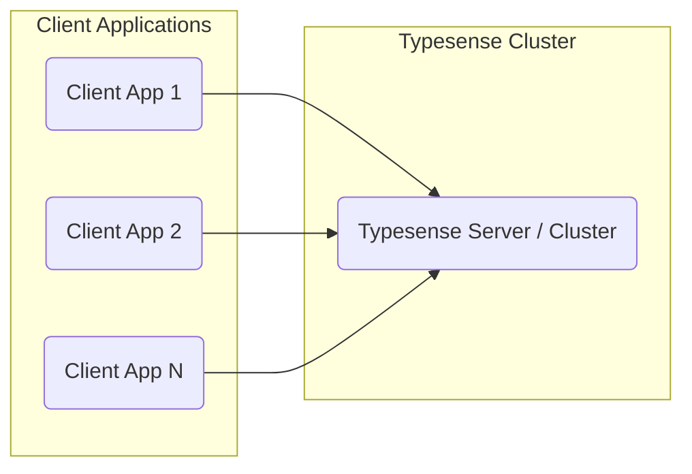
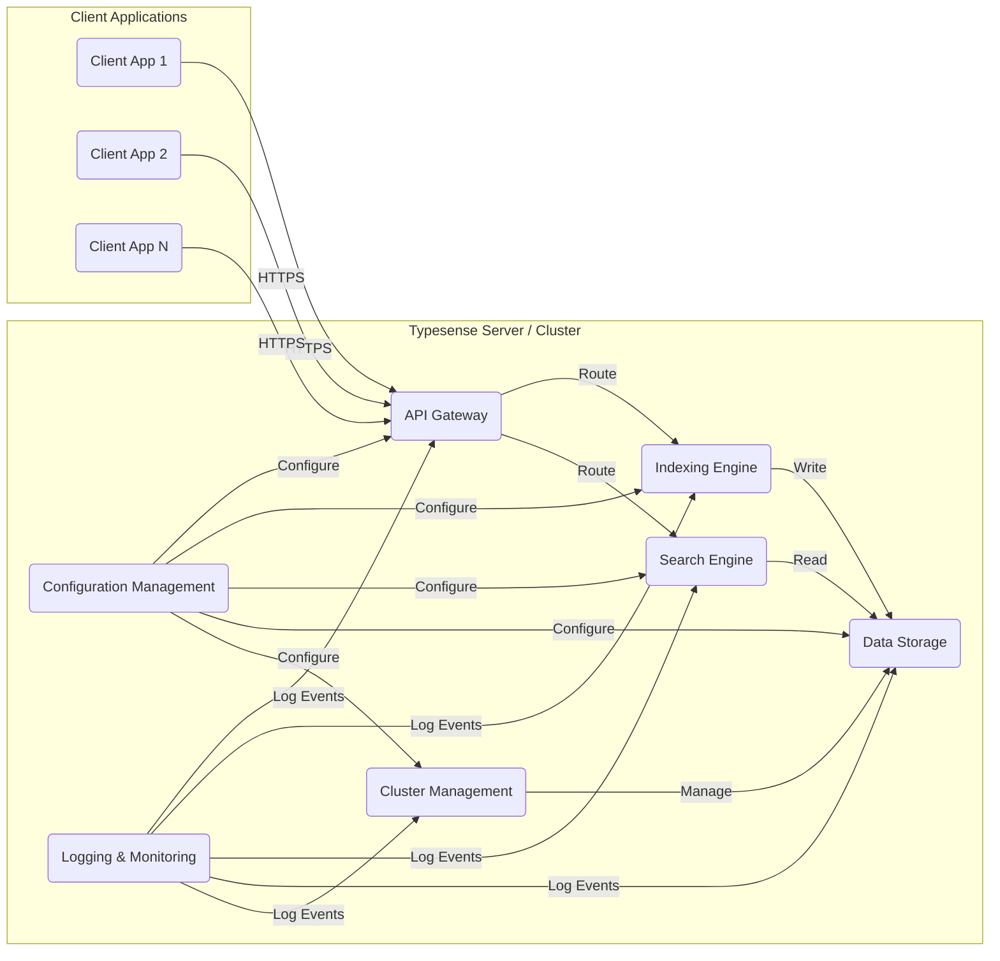

## Project Design Document: Typesense Search Engine - Improved

**Version:** 1.1
**Date:** October 26, 2023
**Author:** AI Architecture Expert

### 1. Introduction

This document provides an enhanced and more detailed design overview of the Typesense search engine project, based on the information available in the GitHub repository: [https://github.com/typesense/typesense](https://github.com/typesense/typesense). This improved document is specifically tailored to facilitate comprehensive threat modeling activities. It elaborates on the key components, data flows, and architectural nuances of the Typesense system, with a focus on security-relevant aspects.

### 2. Goals of Typesense

Based on the project description, the primary goals of Typesense are:

*   Provide a sub-second, low-latency search experience.
*   Offer a RESTful API for seamless integration with various applications.
*   Enable intuitive and efficient data indexing and management.
*   Support advanced search functionalities like typo tolerance, filtering, and sorting.
*   Ensure horizontal scalability and high availability through clustering.

### 3. High-Level Architecture

Typesense employs a client-server architecture where clients interact with the Typesense cluster (or a single instance) via a well-defined API.

*   **Client:** Any application, service, or user interface that communicates with the Typesense API to perform indexing, searching, or administrative tasks.
*   **Typesense Cluster/Server:** The core system responsible for receiving requests, managing data, indexing, and executing search queries. This can be a single server or a distributed cluster of nodes.

### 4. Key Components and their Functionality

This section provides a more detailed breakdown of the components within the Typesense system, highlighting their functionalities and potential security implications.

*   **API Gateway/Request Handler:**
    *   **Functionality:**
        *   Accepts incoming HTTP/HTTPS API requests from clients.
        *   Performs TLS termination for secure communication.
        *   Authenticates and authorizes requests based on API keys.
        *   Routes requests to the appropriate internal modules or cluster nodes.
        *   Implements rate limiting and request throttling to prevent abuse.
        *   Handles API versioning and request parsing.
    *   **Security Implications:**  A critical entry point; vulnerabilities here can expose the entire system. Proper authentication, authorization, and input validation are crucial.

*   **Indexing Engine:**
    *   **Functionality:**
        *   Processes data submitted for indexing, typically in JSON format.
        *   Builds and updates the inverted index, the core data structure for search.
        *   Manages schema definitions for collections and fields.
        *   Performs data validation and transformations based on the schema.
        *   Handles batch indexing and real-time updates.
    *   **Security Implications:**  Improper input validation during indexing can lead to data corruption or injection attacks. Access control to indexing operations is important.

*   **Search Engine:**
    *   **Functionality:**
        *   Receives and parses search queries from the API Gateway.
        *   Executes queries against the inverted index to retrieve matching documents.
        *   Implements ranking algorithms to determine the relevance of search results.
        *   Supports filtering, sorting, faceting, and other advanced search features.
        *   Handles typo tolerance and query suggestions.
    *   **Security Implications:**  Potential for query injection vulnerabilities if input sanitization is insufficient. Performance under malicious query loads needs consideration.

*   **Data Storage:**
    *   **Functionality:**
        *   Persistently stores the inverted index, document metadata, and configuration data.
        *   Likely utilizes an optimized storage engine like LevelDB or RocksDB for fast read/write operations.
        *   Manages data replication and persistence across cluster nodes (in a distributed setup).
    *   **Security Implications:**  Requires secure storage with appropriate permissions and encryption at rest. Access control to the underlying storage is vital.

*   **Cluster Management (for distributed deployments):**
    *   **Functionality:**
        *   Handles node discovery and membership within the cluster.
        *   Manages data replication and distribution across nodes for fault tolerance and scalability.
        *   Performs leader election to designate a primary node for coordination.
        *   Monitors node health and status, facilitating failover and recovery.
        *   Manages cluster configuration and updates.
    *   **Security Implications:**  Secure communication between cluster nodes is essential. Authentication and authorization for inter-node communication are critical to prevent unauthorized access or manipulation.

*   **Configuration Management:**
    *   **Functionality:**
        *   Stores and manages the server's configuration parameters, including API keys, network settings, and performance tuning options.
        *   May involve configuration files, environment variables, or a dedicated configuration store.
    *   **Security Implications:**  Secure storage and access control for configuration data, especially API keys, are paramount.

*   **Logging and Monitoring:**
    *   **Functionality:**
        *   Records server events, errors, API requests, and performance metrics.
        *   Provides insights into system behavior, potential issues, and security incidents.
        *   May integrate with external monitoring and logging systems.
    *   **Security Implications:**  Logs can contain sensitive information and need to be stored securely. Proper auditing and monitoring are essential for detecting security breaches.

### 5. Data Flow

This section provides more detailed data flow diagrams, highlighting the steps involved in indexing and searching, with an emphasis on security considerations.

#### 5.1. Indexing Data Flow (Detailed)

```mermaid
graph LR
    subgraph "Client"
        client_index("Client Application")
    end
    subgraph "Typesense Server"
        api_gw_index("API Gateway")
        auth_index("Authentication")
        authz_index("Authorization")
        rate_limit_index("Rate Limiting")
        validate_index("Input Validation")
        process_index("Indexing Engine")
        store_index("Data Storage")
    end

    client_index -- "1. HTTPS Index Request (Data, API Key)" --> api_gw_index
    api_gw_index -- "2. TLS Termination" --> auth_index
    api_gw_index -- "3. Apply Rate Limits" --> rate_limit_index
    auth_index -- "4. Authenticate API Key" --> authz_index
    authz_index -- "5. Authorize Indexing Action" --> validate_index
    validate_index -- "6. Validate Data against Schema" --> process_index
    process_index -- "7. Build/Update Inverted Index" --> store_index
    store_index -- "8. Persist Index Data" --> store_index
```

*   A client sends an HTTPS request containing data to be indexed and an API key.
*   The API Gateway terminates the TLS connection.
*   Rate limiting is applied to prevent abuse.
*   The API key is authenticated.
*   Authorization checks are performed to ensure the client has permission to index.
*   Input data is validated against the defined schema to prevent injection attacks and data corruption.
*   The Indexing Engine processes the validated data and updates the inverted index.
*   The updated index data is persisted in the Data Storage.

#### 5.2. Searching Data Flow (Detailed)

```mermaid
graph LR
    subgraph "Client"
        client_search("Client Application")
    end
    subgraph "Typesense Server"
        api_gw_search("API Gateway")
        auth_search("Authentication")
        authz_search("Authorization")
        rate_limit_search("Rate Limiting")
        validate_search("Query Validation")
        process_search("Search Engine")
        retrieve_search("Data Storage")
        rank_search("Ranking")
        format_search("Formatting")
    end

    client_search -- "1. HTTPS Search Request (Query, API Key)" --> api_gw_search
    api_gw_search -- "2. TLS Termination" --> auth_search
    api_gw_search -- "3. Apply Rate Limits" --> rate_limit_search
    auth_search -- "4. Authenticate API Key" --> authz_search
    authz_search -- "5. Authorize Search Action" --> validate_search
    validate_search -- "6. Validate Search Query" --> process_search
    process_search -- "7. Query Inverted Index" --> retrieve_search
    retrieve_search -- "8. Retrieve Matching Documents" --> process_search
    process_search -- "9. Apply Ranking Algorithms" --> rank_search
    rank_search -- "10. Format Search Results" --> format_search
    format_search -- "11. Send HTTPS Response (Results)" --> api_gw_search
    api_gw_search -- "12. API Response (Search Results)" --> client_search
```

*   A client sends an HTTPS request containing a search query and an API key.
*   The API Gateway terminates the TLS connection.
*   Rate limiting is applied.
*   The API key is authenticated.
*   Authorization checks are performed to ensure the client has permission to search.
*   The search query is validated to prevent injection attacks.
*   The Search Engine queries the inverted index in the Data Storage.
*   Matching documents are retrieved.
*   Ranking algorithms are applied to order the results.
*   The results are formatted.
*   The API Gateway sends the formatted search results back to the client over HTTPS.

### 6. Deployment Considerations and Security Implications

*   **Single Instance Deployment:**
    *   Simpler to manage but represents a single point of failure.
    *   Security relies heavily on securing the single server instance.
    *   All components reside on the same machine, increasing the impact of a successful breach.
*   **Clustered Deployment:**
    *   Provides high availability and scalability.
    *   Requires secure communication and authentication between cluster nodes.
    *   Data replication adds complexity but enhances fault tolerance.
    *   Load balancing distributes traffic, potentially mitigating some DoS attacks.
    *   Security configuration needs to be consistent across all nodes.

### 7. Technology Stack (Inferred and Potential)

This section expands on the potential technologies involved.

*   **Programming Language:** Primarily C++ or Go for performance and low-level control.
*   **API Communication:**  HTTP/HTTPS for the RESTful API. Potentially gRPC for internal communication in a cluster.
*   **Data Storage Engine:** Likely a key-value store optimized for search indexes, such as LevelDB, RocksDB, or a custom-built solution.
*   **Serialization Format:** JSON for API requests and responses. Potentially Protocol Buffers or MessagePack for internal communication efficiency.
*   **Cluster Management:**  Potentially using a consensus algorithm like Raft (as indicated by the presence of a `raft` package in the repository).
*   **Operating System:** Likely Linux-based for production deployments.

### 8. Security Considerations (Detailed)

This section provides a more structured and detailed overview of security considerations.

*   **API Security:**
    *   **Authentication:** Secure generation, storage, and validation of API keys. Consider different levels of API key permissions.
    *   **Authorization:** Implementing proper access controls to restrict actions based on API key permissions.
    *   **TLS/SSL:** Enforcing HTTPS for all API communication to protect data in transit. Proper certificate management is crucial.
    *   **Rate Limiting and Throttling:** Protecting against abuse and denial-of-service attacks.
    *   **Input Validation:** Rigorous validation of all API request parameters to prevent injection attacks (e.g., SQL injection, NoSQL injection, command injection).
    *   **CORS Policy:** Properly configuring Cross-Origin Resource Sharing (CORS) to prevent unauthorized access from web browsers.

*   **Data Security:**
    *   **Encryption at Rest:** Encrypting the stored index data and configuration files.
    *   **Encryption in Transit:** Enforcing HTTPS for all client-server communication and secure communication between cluster nodes.
    *   **Access Control:** Implementing strict access control mechanisms for the underlying data storage and file system.
    *   **Data Sanitization:**  Ensuring that sensitive data is properly handled and not inadvertently exposed in logs or error messages.

*   **Infrastructure Security:**
    *   **Network Security:** Implementing firewalls and network segmentation to isolate the Typesense server(s).
    *   **Operating System Security:** Regularly patching and updating the operating system and dependencies.
    *   **Secure Deployment Practices:** Following secure deployment guidelines and using secure infrastructure.

*   **Authentication and Authorization (Internal):**
    *   Secure authentication and authorization mechanisms for communication between cluster nodes.
    *   Role-based access control (RBAC) for administrative tasks.

*   **Input Validation (Indexing and Searching):**
    *   Thorough validation of data submitted for indexing to prevent data corruption and injection attacks.
    *   Sanitizing search queries to prevent query injection vulnerabilities.

*   **Denial of Service (DoS) Protection:**
    *   Implementing rate limiting and request throttling.
    *   Protecting against resource exhaustion attacks.
    *   Considering mechanisms for handling large or complex queries.

*   **Cluster Security:**
    *   Secure bootstrapping and joining of new nodes to the cluster.
    *   Mutual authentication between cluster nodes.
    *   Encryption of communication between cluster nodes.

*   **Logging and Monitoring Security:**
    *   Secure storage and access control for log files.
    *   Redacting sensitive information from logs.
    *   Regularly reviewing logs for suspicious activity.

### 9. Diagrams

This section contains the visual representations of the architecture and data flow, ensuring all node names are quoted.

#### 9.1. High-Level Architecture Diagram (Improved)

#### 9.2. Detailed Data Flow Diagram (Indexing)

```mermaid
graph LR
    subgraph "Client"
        client_index("Client App")
    end
    subgraph "Typesense Server"
        api_gw_index("API Gateway")
        auth_index("Authentication")
        authz_index("Authorization")
        rate_limit_index("Rate Limiting")
        validate_index("Input Validation")
        process_index("Indexing Engine")
        store_index("Data Storage")
    end

    client_index -- "1. HTTPS Index Request (Data)" --> api_gw_index
    api_gw_index -- "2. TLS Termination" --> api_gw_index
    api_gw_index -- "3. Apply Rate Limits" --> rate_limit_index
    rate_limit_index -- "4. Authenticate API Key" --> auth_index
    auth_index -- "5. Authorize Indexing" --> authz_index
    authz_index -- "6. Validate Data" --> validate_index
    validate_index -- "7. Process and Index Data" --> process_index
    process_index -- "8. Persist Index" --> store_index
```

#### 9.3. Detailed Data Flow Diagram (Searching)

```mermaid
graph LR
    subgraph "Client"
        client_search("Client App")
    end
    subgraph "Typesense Server"
        api_gw_search("API Gateway")
        auth_search("Authentication")
        authz_search("Authorization")
        rate_limit_search("Rate Limiting")
        validate_search("Query Validation")
        process_search("Search Engine")
        retrieve_search("Data Storage")
        rank_search("Ranking")
        format_search("Formatting")
    end

    client_search -- "1. HTTPS Search Request (Query)" --> api_gw_search
    api_gw_search -- "2. TLS Termination" --> api_gw_search
    api_gw_search -- "3. Apply Rate Limits" --> rate_limit_search
    rate_limit_search -- "4. Authenticate API Key" --> auth_search
    auth_search -- "5. Authorize Search" --> authz_search
    authz_search -- "6. Validate Query" --> validate_search
    validate_search -- "7. Query Index" --> process_search
    process_search -- "8. Retrieve Results" --> retrieve_search
    retrieve_search -- "9. Rank Results" --> rank_search
    rank_search -- "10. Format Results" --> format_search
    format_search -- "11. Send HTTPS Response" --> api_gw_search
```

### 10. Conclusion

This improved design document provides a more comprehensive and security-focused overview of the Typesense search engine. By detailing the components, data flows, and deployment considerations, along with a thorough examination of potential security vulnerabilities, this document serves as a valuable resource for conducting effective threat modeling and ensuring the security of the Typesense system.