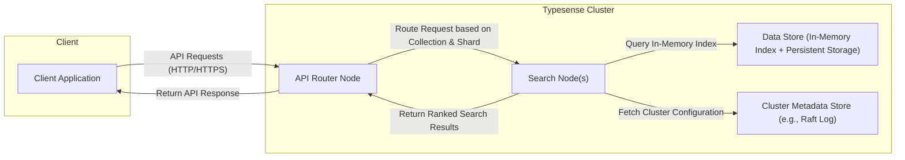
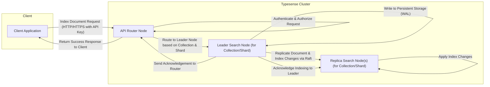
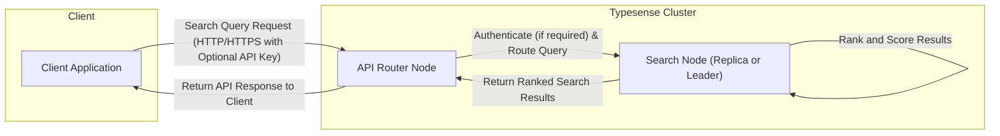

# Project Design Document: Typesense

**Version:** 1.1
**Date:** October 26, 2023
**Author:** Gemini (AI Language Model)

## 1. Introduction

This document provides an enhanced architectural design of the Typesense project, an open-source, typo-tolerant search engine. This detailed design serves as a robust foundation for subsequent threat modeling activities, offering a comprehensive understanding of the system's components, data flow, and interactions.

## 2. Goals and Objectives

The primary goals of Typesense are to provide:

*   A highly performant and relevant search experience for end-users.
*   Robust typo tolerance and intelligent handling of misspellings and variations in search terms.
*   Near real-time indexing and updating of data, ensuring search results are current.
*   A well-documented and developer-friendly API for seamless integration.
*   Horizontal scalability and high availability through a distributed cluster architecture.
*   Flexible support for diverse data types, complex filtering, and advanced search functionalities like vector search.

This design document aims to provide a granular view of the system's architecture, specifically tailored to facilitate a thorough and effective threat model.

## 3. Architectural Overview

Typesense employs a distributed, peer-to-peer architecture, typically deployed as a cluster of interconnected nodes. This design ensures resilience and scalability. The core components collaborate to deliver the search functionality.

## 4. Component Details

This section provides a more detailed breakdown of the key components within the Typesense system.

*   **Client Application:**
    *   Encompasses any software application (e.g., web frontend, mobile app, backend service) that interacts with the Typesense API.
    *   Communicates with the Typesense cluster using standard HTTP/HTTPS protocols.
    *   Responsible for constructing and formatting search queries according to the API specification and rendering the received search results.

*   **API Router Node:**
    *   Serves as the intelligent entry point for all external client requests directed to the Typesense cluster.
    *   Performs crucial functions like request routing based on the target collection and shard, and load balancing across available Search Nodes to optimize performance and distribute load.
    *   Handles API-level authentication (e.g., API key validation) and authorization checks to ensure only authorized requests are processed.
    *   Maintains transient state related to active connections but does not store any persistent application data.

*   **Search Node(s):**
    *   Form the core processing units of the Typesense system, responsible for the heavy lifting of indexing, searching, and ranking data.
    *   Each node holds a complete replica of the data (in smaller clusters) or a specific shard of the data (in larger, sharded deployments), ensuring data redundancy and fault tolerance.
    *   Processes incoming search queries by efficiently querying its local in-memory index.
    *   Maintains an optimized in-memory index structure for ultra-fast search operations.
    *   Persists indexed data to durable storage (disk) to ensure data persistence across restarts and failures.

*   **Data Store (In-Memory Index + Persistent Storage):**
    *   Typesense leverages a hybrid approach to data storage:
        *   **In-Memory Index:** The primary data structure for search operations, providing low-latency access. This index is meticulously crafted for efficient searching and filtering.
        *   **Persistent Storage:** Data is also written to disk for durability and to allow the in-memory index to be rebuilt upon node restarts. The storage mechanism is optimized for sequential writes during indexing and fast reads during index loading.

*   **Cluster Metadata Store (e.g., Raft Log):**
    *   A critical component responsible for maintaining a consistent view of the cluster's state and configuration across all nodes.
    *   Stores essential metadata such as cluster membership information (which nodes are active), collection schemas, API keys, and other cluster-wide settings.
    *   Typically implemented using a distributed consensus protocol like Raft to guarantee strong consistency and fault tolerance. This ensures that all nodes agree on the current state of the cluster.

## 5. Data Flow

This section provides more detailed diagrams illustrating the data flow for key operations within Typesense.

### 5.1. Indexing a Document

*   The client application sends an authenticated indexing request (including an API key) to the API Router Node.
*   The API Router Node authenticates the request using the provided API key and authorizes the action.
*   The API Router Node intelligently routes the request to the designated leader Search Node responsible for the specific collection and shard.
*   The leader Search Node receives and validates the incoming document.
*   The leader Search Node updates its local in-memory index with the new document data.
*   The leader Search Node writes the document and indexing changes to a Write-Ahead Log (WAL) in persistent storage for durability.
*   The leader Search Node initiates the replication process, sending the document and index changes to the replica Search Nodes via the Raft consensus protocol.
*   Replica Search Nodes receive and apply the index changes to their local in-memory indices and persistent storage.
*   Replica nodes acknowledge the successful application of changes to the leader.
*   The leader Search Node sends an acknowledgment back to the API Router Node.
*   The API Router Node returns a success response to the client application.

### 5.2. Performing a Search Query

*   The client application sends a search query request to the API Router Node (optionally including an API key for authentication if required by the collection's security settings).
*   The API Router Node authenticates the request (if necessary) and routes the query to an available Search Node (either a replica or the leader). Routing decisions can be based on load balancing strategies.
*   The selected Search Node receives and parses the incoming search query.
*   The Search Node efficiently queries its local in-memory index to find matching documents based on the query terms and filters.
*   The Search Node ranks and scores the matching documents based on relevance algorithms configured for the collection.
*   The Search Node returns the ranked search results to the API Router Node.
*   The API Router Node returns the API response containing the search results to the client application.

## 6. Security Considerations

This section provides a more in-depth look at potential security considerations for the Typesense project, crucial for effective threat modeling.

*   **Authentication and Authorization:**
    *   **API Keys:** Typesense primarily uses API keys for authentication. Consider:
        *   **Generation and Management:** How are API keys generated? What mechanisms are in place for creating, revoking, and rotating API keys?
        *   **Storage:** How are API keys stored securely within the Typesense cluster? Are they encrypted at rest?
        *   **Types of Keys:** Are there different types of API keys with varying levels of access (e.g., admin keys, search-only keys)?
        *   **Rate Limiting:** Are there mechanisms to prevent abuse of API keys through rate limiting?
    *   **Authorization:** How are permissions enforced for different API operations?
        *   **Collection-Level Access:** Can access be restricted to specific collections?
        *   **Action-Based Permissions:** Are there separate permissions for indexing, searching, and administrative tasks?

*   **Data Protection (At Rest and In Transit):**
    *   **Encryption at Rest:**
        *   Is data encrypted when stored on disk? What encryption algorithms are used? Is encryption enabled by default or configurable?
        *   How are encryption keys managed and protected?
    *   **Encryption in Transit:**
        *   **Client-to-Cluster:** Is HTTPS enforced for all communication between clients and the Typesense cluster?
        *   **Inter-Node Communication:** Is communication between nodes within the cluster encrypted (e.g., using TLS)? How are certificates managed?

*   **Network Security:**
    *   **Firewall Rules:** What are the recommended firewall configurations for a Typesense cluster? Which ports need to be open and for what purpose?
    *   **Network Segmentation:** Is network segmentation recommended to isolate the Typesense cluster from other parts of the infrastructure?
    *   **Access Control Lists (ACLs):** Can ACLs be used to restrict access to the cluster based on IP addresses or network ranges?

*   **Input Validation:**
    *   **API Request Validation:** How are API requests validated to prevent injection attacks (e.g., NoSQL injection, command injection)? Are there input sanitization measures in place?
    *   **Data Sanitization during Indexing:** How is user-provided data sanitized before being indexed to prevent the storage of malicious content?

*   **Access Control:**
    *   **Infrastructure Access:** Who has access to the underlying infrastructure (servers, virtual machines, containers) hosting the Typesense cluster?
    *   **Administrative Access:** How is access to administrative functionalities of Typesense controlled? Are there different roles with varying privileges?

*   **Logging and Auditing:**
    *   **Audit Logging:** What security-relevant events are logged (e.g., authentication attempts, authorization failures, administrative actions)?
    *   **Log Storage and Security:** Where are logs stored? How are they secured against unauthorized access and tampering?
    *   **Log Retention:** What is the log retention policy?

*   **Denial of Service (DoS) Protection:**
    *   **Rate Limiting:** Are there configurable rate limits for API requests to prevent abuse?
    *   **Request Throttling:** Can the cluster throttle requests during periods of high load?
    *   **Resource Limits:** Are there limits on the size of requests or the number of concurrent connections?

*   **Vulnerability Management:**
    *   **Software Updates:** How are security updates and patches applied to Typesense and its dependencies?
    *   **Vulnerability Scanning:** Are there processes for regularly scanning the codebase and infrastructure for vulnerabilities?
    *   **Security Audits:** Are periodic security audits conducted by internal or external experts?

*   **Cluster Security:**
    *   **Node Authentication:** How are new nodes authenticated when joining the cluster?
    *   **Secure Bootstrapping:** Are there secure procedures for bootstrapping a new Typesense cluster?
    *   **Node Isolation:** Are there mechanisms to isolate nodes within the cluster in case of compromise?

## 7. Deployment Considerations

The security posture of a Typesense deployment can be significantly influenced by the chosen deployment environment.

*   **Self-Hosted:**
    *   The user is responsible for all aspects of security, including infrastructure security, network configuration, and access control.
    *   Requires careful planning and implementation of security best practices.
*   **Cloud-Based:**
    *   Leverages the security features provided by the cloud platform (e.g., VPCs, security groups, IAM).
    *   Requires understanding and proper configuration of cloud security services.
*   **Managed Services:**
    *   Security responsibilities are shared with the managed service provider.
    *   Understanding the provider's security practices and compliance certifications is crucial.

## 8. Future Considerations

*   **Role-Based Access Control (RBAC):** Implementing a more sophisticated RBAC system for finer-grained control over API access and data manipulation.
*   **Data Masking and Tokenization:** Exploring techniques for masking or tokenizing sensitive data within the index.
*   **Integration with Identity Providers (IdPs):** Supporting integration with external identity providers for authentication.
*   **Web Application Firewall (WAF) Integration:** Recommending or providing guidance on integrating with WAFs for enhanced protection against web-based attacks.

This enhanced design document provides a more granular and security-focused view of the Typesense architecture. The detailed descriptions of components, data flows, and security considerations are intended to be directly actionable for a comprehensive threat modeling exercise, enabling the identification of potential vulnerabilities and the development of effective mitigation strategies.