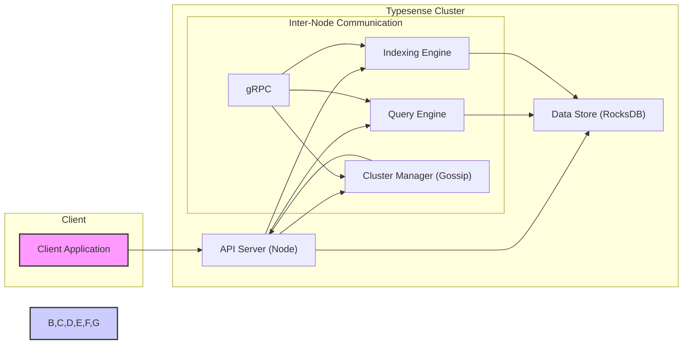

# Project Design Document: Typesense Search Engine - Version 1.1

**Project Name:** Typesense

**Project Repository:** [https://github.com/typesense/typesense](https://github.com/typesense/typesense)

**Document Version:** 1.1
**Date:** 2023-10-27
**Author:** AI Expert

**Changes from Version 1.0:**

*   Enhanced component descriptions with more detail, especially in security considerations.
*   Clarified data flow diagrams and descriptions with a stronger security focus.
*   Expanded on deployment models, particularly clustered and cloud deployments.
*   Added more specific examples in the technology stack section.
*   Refined the security considerations section for better threat modeling preparation.
*   Improved overall clarity and consistency.

## 1. Introduction

This document provides a detailed design overview of the Typesense search engine project, intended as a foundation for subsequent threat modeling activities. It outlines the system architecture, key components, data flow, and deployment considerations, focusing on aspects relevant to security. The goal is to provide a clear and comprehensive understanding of Typesense's internal workings from a security perspective, enabling effective threat identification and mitigation planning.

## 2. Project Overview

Typesense is an open-source, fast, typo-tolerant search engine designed for speed, ease of use, and a rich feature set. It aims to be a developer-friendly search solution with capabilities including:

*   **Exceptional Speed:** Optimized for low latency (single-digit milliseconds) and high query throughput.
*   **Typo Tolerance:**  Utilizes algorithms to handle misspellings and variations in search terms effectively.
*   **Comprehensive Search Features:** Supports faceted search, filtering, sorting, geosearch, synonyms, and custom ranking.
*   **Scalability and High Availability:** Achieved through a distributed cluster architecture with data replication and automatic failover.
*   **RESTful API:** Provides a clean and well-documented RESTful API for all operations.
*   **Configuration and Management:** Offers tools and APIs for easy configuration, schema management, and cluster monitoring.

## 3. System Architecture

Typesense employs a distributed, masterless architecture for high availability and horizontal scalability. Each node in the cluster is capable of handling both read and write operations.

### 3.1. High-Level Architecture Diagram



**Diagram Description:**

*   **Client Application:** Any application (web, mobile, backend service) that interacts with Typesense via the REST API.
*   **Typesense Cluster:** A set of interconnected Typesense nodes working collaboratively.
*   **API Server (Node):**  The primary interface for client requests. Each node runs an API server, handling authentication, authorization, request routing, and coordination within the cluster. It's stateless and can be scaled horizontally.
*   **Query Engine:** Processes search queries, retrieves data from the Data Store, ranks results based on relevance, and applies filters, facets, and sorting. Optimized for low latency.
*   **Indexing Engine:** Responsible for indexing documents. It receives data from the API Server, processes it according to the schema, and stores it in the Data Store in an optimized format for searching.
*   **Data Store (RocksDB):**  Persistent storage for indexed data. Typesense leverages RocksDB for its performance, efficiency, and embedded nature. Data is partitioned and replicated across nodes.
*   **Cluster Manager (Gossip):**  Manages cluster membership, node discovery, failure detection, and configuration propagation using a gossip protocol. This ensures resilience and decentralization.
*   **Inter-Node Communication (gRPC):** Typesense uses gRPC for efficient and fast communication between nodes within the cluster for tasks like data replication, query distribution, and cluster management.

## 4. Component Descriptions

### 4.1. API Server (Node)

*   **Functionality:**
    *   **REST API Gateway:** Exposes the Typesense RESTful API for client interaction (indexing, searching, schema management, cluster operations).
    *   **Request Parsing & Validation:** Parses incoming HTTP requests, validates input data against defined schemas, and handles errors.
    *   **Authentication & Authorization:** Enforces access control using API keys. Future enhancements might include OAuth 2.0 or other authentication methods. Authorization is role-based, controlling access to collections and operations.
    *   **Request Routing & Load Balancing:** Routes requests to the appropriate internal components (Query Engine, Indexing Engine, Cluster Manager) within the node. In a clustered setup, it participates in load balancing by handling requests and distributing queries across shards.
    *   **Response Formatting:** Formats responses in JSON and returns them to the client.
*   **Technology:** C++, using HTTP server libraries (e.g., Boost.Asio, or a dedicated HTTP framework), and potentially gRPC for internal communication.
*   **Security Considerations:**
    *   **API Key Management:** Secure generation, storage, and revocation of API keys. Protection against brute-force attacks on API keys.
    *   **Input Validation & Sanitization:** Rigorous validation of all API requests to prevent injection attacks (SQL injection is not directly applicable due to RocksDB, but NoSQL injection or command injection could be relevant). Sanitization of data before indexing to prevent stored XSS.
    *   **Rate Limiting & Request Throttling:** Implementation of rate limiting to prevent denial-of-service (DoS) attacks and abuse.
    *   **TLS/SSL Encryption (HTTPS):** Mandatory enforcement of HTTPS for all external API communication to protect data in transit. Configuration options for TLS versions and cipher suites.
    *   **CORS (Cross-Origin Resource Sharing):**  Configuration of CORS policies to control access from web browsers and prevent unauthorized cross-site requests.
    *   **HTTP Header Security:**  Setting appropriate HTTP security headers (e.g., `Strict-Transport-Security`, `X-Content-Type-Options`, `X-Frame-Options`, `Content-Security-Policy`) to enhance client-side security.

### 4.2. Query Engine

*   **Functionality:**
    *   **Query Parsing & Analysis:** Parses search queries, tokenizes terms, and analyzes query structure.
    *   **Index Lookup & Retrieval:** Efficiently retrieves relevant document IDs from the inverted indexes stored in RocksDB based on query terms.
    *   **Ranking & Scoring Algorithms:** Applies ranking algorithms (TF-IDF, BM25, custom ranking functions) to score and rank search results based on relevance, typo tolerance, and other factors.
    *   **Filtering & Faceting:** Applies filters based on query parameters and generates facet counts for refining search results.
    *   **Sorting & Pagination:** Sorts results according to specified criteria (relevance, field values) and handles pagination for large result sets.
    *   **Geosearch Processing:** Executes location-based queries, calculates distances, and applies geofilters.
    *   **Synonym Expansion:** Expands queries using configured synonym lists to improve recall.
*   **Technology:** C++, highly optimized algorithms for search, ranking, and data retrieval. Data structures like inverted indexes, skip lists, and potentially specialized data structures for geosearch.
*   **Security Considerations:**
    *   **Query Injection Prevention:**  Mitigation against maliciously crafted queries designed to bypass security controls, extract sensitive information, or cause performance degradation.  Careful parsing and sanitization of query parameters.
    *   **Resource Limits & Query Complexity Control:**  Mechanisms to limit the resources consumed by complex or expensive queries to prevent resource exhaustion and DoS. Query timeouts and complexity limits.
    *   **Data Access Control Enforcement:** While primary access control is at the API Server level, the Query Engine must respect data access boundaries and ensure users only retrieve data they are authorized to see based on collection-level permissions.
    *   **Denial of Service (DoS) Resilience:**  Design to handle a high volume of queries and prevent performance degradation or service disruption under heavy load.

### 4.3. Indexing Engine

*   **Functionality:**
    *   **Data Ingestion & Parsing:** Receives documents from the API Server, parses them based on the collection schema, and extracts fields for indexing.
    *   **Data Validation & Transformation:** Validates incoming data against the schema, performs data type conversions, and applies any configured transformations.
    *   **Index Building & Updates:** Creates and updates inverted indexes, forward indexes, and other data structures in RocksDB. Supports real-time or near real-time indexing.
    *   **Schema Management Integration:**  Works in conjunction with schema definitions to ensure data is indexed correctly according to the defined schema.
    *   **Batch Indexing & Optimization:** Supports efficient batch indexing for bulk data loading and optimizes index structures for search performance.
*   **Technology:** C++, optimized indexing algorithms and data structures. Utilizes RocksDB APIs for efficient data storage and updates.
*   **Security Considerations:**
    *   **Data Sanitization & Encoding:**  Sanitizing and encoding data during indexing to prevent stored XSS or other injection vulnerabilities when search results are displayed.
    *   **Schema Enforcement & Data Integrity:**  Strict enforcement of schema constraints to ensure data integrity and prevent inconsistent or malformed data from being indexed.
    *   **Index Integrity & Consistency:** Mechanisms to ensure the integrity and consistency of the index data, especially in a distributed environment. Checksums, data validation, and replication strategies.
    *   **Resource Management during Indexing:**  Efficient resource management (CPU, memory, disk I/O) during indexing to prevent performance impact on search operations and other cluster nodes.
    *   **Access Control for Indexing Operations:**  Restricting indexing operations to authorized users and API keys.

### 4.4. Data Store (RocksDB)

*   **Functionality:**
    *   **Persistent Data Storage:** Provides persistent storage for inverted indexes, forward indexes, document data, and other metadata.
    *   **Efficient Data Retrieval:** Offers fast key-value lookups and range queries for the Query Engine and Indexing Engine.
    *   **Data Persistence & Durability:** Ensures data persistence on disk and durability through write-ahead logging and other mechanisms.
    *   **Data Replication (Managed by Cluster Manager):**  Supports data replication across multiple nodes for fault tolerance and high availability (replication is orchestrated by the Cluster Manager).
    *   **Data Compaction & Optimization:**  Performs background compaction and optimization of data files to maintain performance and efficiency.
*   **Technology:** RocksDB (embedded key-value store based on LevelDB).
*   **Security Considerations:**
    *   **Data at Rest Encryption:**  Potential integration with RocksDB's encryption at rest features or operating system-level encryption mechanisms to protect sensitive data stored on disk. Key management for encryption keys.
    *   **Access Control (File System Level):**  Operating system level file permissions to restrict access to RocksDB data files and prevent unauthorized access or modification.
    *   **Data Backup & Recovery:**  Strategies and tools for backing up RocksDB data and restoring it in case of data loss or system failures. Regular backups and disaster recovery planning.
    *   **Secure Configuration of RocksDB:**  Configuration of RocksDB parameters to optimize for security and performance, such as limiting resource usage and disabling potentially insecure features if applicable.

### 4.5. Cluster Manager (Gossip)

*   **Functionality:**
    *   **Node Discovery & Membership Management:**  Uses a gossip protocol for automatic node discovery and maintaining cluster membership information.
    *   **Cluster State Management & Consensus:**  Maintains a consistent view of the cluster state across all nodes, including node status, data distribution, and configuration. Achieves eventual consistency through gossip.
    *   **Failure Detection & Node Removal:**  Detects node failures through gossip and removes failed nodes from the cluster membership.
    *   **Data Replication & Sharding Management:**  Orchestrates data replication across nodes to ensure data redundancy and fault tolerance. Manages data sharding and distribution across the cluster.
    *   **Configuration Propagation:**  Propagates configuration changes across the cluster using the gossip protocol.
    *   **Leader Election (Potentially for specific tasks):** While masterless in general operation, may use leader election for specific cluster-wide management tasks (details to be confirmed in code).
*   **Technology:** C++, implementation of a gossip protocol (e.g., SWIM, or a custom variant). gRPC for inter-node communication.
*   **Security Considerations:**
    *   **Secure Cluster Communication (gRPC Security):**  Enforcing authentication and encryption for all inter-node communication via gRPC to prevent eavesdropping, tampering, and man-in-the-middle attacks within the cluster. Mutual TLS (mTLS) could be considered.
    *   **Gossip Protocol Security:**  Ensuring the robustness and security of the gossip protocol itself. Preventing malicious nodes from injecting false information or disrupting cluster membership. Gossip protocol hardening techniques.
    *   **Membership Management Security:**  Securely managing node membership and preventing unauthorized nodes from joining the cluster. Node authentication and authorization during cluster join.
    *   **Protection against Split-Brain Scenarios:**  Mechanisms to prevent split-brain scenarios in case of network partitions and ensure cluster consistency. Quorum-based decisions or similar strategies.
    *   **Configuration Security:**  Secure storage and propagation of cluster configuration. Preventing unauthorized modification of cluster configuration.

## 5. Data Flow

### 5.1. Indexing Data Flow (Security Focused)

```mermaid
graph LR
    A["Client Application"] --> B["API Server (Node)"];
    subgraph "API Server (Node)"
        B --> BA[/"Authentication & Authorization/"];
        BA --> BB[/"Input Validation & Sanitization/"];
        BB --> C["Indexing Engine"];
    end
    C --> D["Data Store (RocksDB)"];
    style A fill:#f9f,stroke:#333,stroke-width:2px
    style B,BA,BB,C,D fill:#ccf,stroke:#333,stroke-width:2px
    C --> E["Cluster Manager (Gossip)"];
    E --> D["Data Store (RocksDB) - Replication"];
    style E fill:#ccf,stroke:#333,stroke-width:2px
```

**Data Flow Description (Indexing - Security Emphasized):**

1.  **Client Application** sends an indexing request to the **API Server (Node)** via HTTPS.
2.  **API Server (Node)** performs **Authentication & Authorization** to verify the client's identity and permissions using API keys.
3.  **API Server (Node)** applies **Input Validation & Sanitization** to the incoming data to prevent injection attacks and ensure data conforms to the schema.
4.  **API Server (Node)** forwards the validated and sanitized data to the **Indexing Engine**.
5.  **Indexing Engine** processes the data, builds indexes, and stores them in the **Data Store (RocksDB)**. Data is sanitized again before being written to storage to prevent stored XSS.
6.  **Cluster Manager (Gossip)** (in a cluster setup) orchestrates data replication to other **Data Store (RocksDB)** instances on other nodes, ensuring data redundancy and availability. Inter-node communication for replication is secured using gRPC with authentication and encryption.

### 5.2. Query Data Flow (Security Focused)

```mermaid
graph LR
    A["Client Application"] --> B["API Server (Node)"];
    subgraph "API Server (Node)"
        B --> BA[/"Authentication & Authorization/"];
        BA --> BB[/"Input Validation & Query Parsing/"];
        BB --> C["Query Engine"];
    end
    C --> D["Data Store (RocksDB)"];
    C --> BC["API Server (Node) - Response"];
    BC --> B;
    B --> A["Client Application"];
    style A fill:#f9f,stroke:#333,stroke-width:2px
    style B,BA,BB,BC,C,D fill:#ccf,stroke:#333,stroke-width:2px
```

**Data Flow Description (Query - Security Emphasized):**

1.  **Client Application** sends a search query to the **API Server (Node)** via HTTPS.
2.  **API Server (Node)** performs **Authentication & Authorization** to verify the client's identity and permissions using API keys.
3.  **API Server (Node)** applies **Input Validation & Query Parsing** to the search query to prevent query injection attacks and ensure the query is well-formed. Resource limits for query complexity are enforced.
4.  **API Server (Node)** forwards the validated query to the **Query Engine**.
5.  **Query Engine** retrieves relevant data from the **Data Store (RocksDB)**. Data access control is enforced to ensure users only retrieve authorized data.
6.  **Query Engine** processes the data, ranks results, and prepares the response.
7.  **Query Engine** sends the response back to the **API Server (Node)**.
8.  **API Server (Node)** sends the response back to the **Client Application** via HTTPS. Response headers include security headers to enhance client-side security.

## 6. Key Technologies

*   **Core Programming Language:** C++ (for performance-critical components: server, query engine, indexing engine, cluster manager)
*   **Data Storage:** RocksDB (embedded key-value store for persistent data storage)
*   **API Interface:** RESTful API over HTTP/HTTPS (for client interaction)
*   **Inter-Node Communication:** gRPC (for efficient and secure communication within the cluster)
*   **Cluster Management & Consensus:** Gossip protocol (for decentralized cluster management and fault tolerance), potentially Raft or similar for specific leader election tasks (implementation details to be confirmed).
*   **Search Algorithms:** Inverted indexes, typo-tolerance algorithms (e.g., Levenshtein distance, Damerau-Levenshtein distance), ranking algorithms (TF-IDF, BM25, custom ranking), geosearch algorithms (e.g., KD-trees, Geohashes).
*   **Security Libraries:**  Likely using standard C++ security libraries for TLS/SSL, cryptography, and potentially authentication/authorization frameworks. Specific libraries to be determined by code review.

## 7. Deployment Model

Typesense offers flexible deployment options:

*   **Single Node Deployment:** Simplest setup, suitable for development, testing, or small, non-critical applications. All components run on a single server. Limited high availability and scalability.
    *   **Security Considerations:** Focus on securing the single server OS, network access, and Typesense configuration.
*   **Clustered Deployment (Recommended for Production):** Provides high availability, scalability, and fault tolerance. Multiple nodes work together, replicating data and distributing load.
    *   **Replication:** Data is replicated across nodes (configurable replication factor) to ensure data durability and availability even if some nodes fail.
    *   **Sharding:** Collections can be sharded across nodes to distribute the indexing and query load horizontally, enabling scaling to large datasets and high query volumes.
    *   **Security Considerations:**  Securing inter-node communication (gRPC with TLS/mTLS), cluster membership management, and access control across the cluster. Network segmentation to isolate the cluster network.
*   **Cloud Deployment (AWS, GCP, Azure, etc.):**  Designed for easy deployment on cloud platforms using virtual machines, containers (Docker), and orchestration services (Kubernetes). Managed Typesense Cloud offerings are also available.
    *   **Cloud Provider Security:** Leverage cloud provider security features (VPCs, security groups, IAM roles, KMS for encryption key management).
    *   **Container Security (if using containers):** Secure container images, vulnerability scanning, and container runtime security.
    *   **Orchestration Security (if using Kubernetes):** Kubernetes RBAC, network policies, and secure configuration of Kubernetes components.
*   **On-Premise Deployment:** Deployment within an organization's own data center on physical servers or virtualized infrastructure.
    *   **Physical Security:** Physical security of the data center and servers.
    *   **Network Security:** Network segmentation, firewalls, and intrusion detection/prevention systems.
    *   **Operating System Security:** Hardening of server operating systems and regular security patching.

## 8. Security Considerations (Detailed)

This section expands on the high-level security considerations, providing more detail for threat modeling.

*   **Authentication and Authorization:**
    *   **API Keys:** Primary authentication mechanism. Secure generation, rotation, and storage of API keys. Protection against key leakage and brute-force attacks.
    *   **Role-Based Access Control (RBAC):**  Collection-level access control based on roles. Define granular permissions for different user roles.
    *   **Future Authentication Methods:** Potential for OAuth 2.0 or other standard authentication protocols for integration with existing identity providers.
*   **Data Encryption:**
    *   **Data in Transit (HTTPS):** Mandatory HTTPS for all external API communication. Strong TLS configuration.
    *   **Data in Transit (Inter-Node gRPC):**  Encryption and authentication for gRPC communication within the cluster (TLS/mTLS).
    *   **Data at Rest (RocksDB Encryption):**  Explore and implement data at rest encryption using RocksDB's built-in features or OS-level encryption. Secure key management for encryption keys.
*   **Input Validation and Sanitization:**
    *   **API Request Validation:**  Strict validation of all API requests against defined schemas.
    *   **Query Parameter Validation:**  Validation and sanitization of search query parameters to prevent injection attacks.
    *   **Data Sanitization during Indexing:**  Sanitization of data before indexing to prevent stored XSS and other vulnerabilities.
*   **Rate Limiting and DoS Protection:**
    *   **API Rate Limiting:**  Implement rate limiting at the API Server level to prevent DoS attacks and abuse. Configurable rate limits per API key or IP address.
    *   **Query Complexity Limits:**  Limit the complexity and resource consumption of search queries to prevent resource exhaustion.
*   **Secure Cluster Communication:**
    *   **gRPC Security:**  Enforce authentication and encryption for all gRPC communication between cluster nodes (TLS/mTLS).
    *   **Gossip Protocol Hardening:**  Harden the gossip protocol implementation to prevent manipulation and disruption by malicious nodes.
*   **Access Control to Data Store:**
    *   **File System Permissions:**  Restrict file system access to RocksDB data files using OS-level permissions.
    *   **Internal Access Control:**  Ensure internal components (Query Engine, Indexing Engine) only access data they are authorized to.
*   **Vulnerability Management:**
    *   **Regular Security Audits:**  Conduct periodic security audits and penetration testing to identify vulnerabilities.
    *   **Dependency Management:**  Maintain up-to-date dependencies and patch known vulnerabilities in third-party libraries.
    *   **Security Patching:**  Establish a process for promptly applying security patches to Typesense and underlying infrastructure.
*   **Compliance:**
    *   **GDPR, HIPAA, etc.:**  Consider compliance with relevant data privacy and security regulations depending on the application and data being indexed. Data minimization, anonymization, and data retention policies.

## 9. Assumptions and Constraints

*   **Assumption:** API Server is the sole entry point for external client interactions.
*   **Assumption:** RocksDB is the primary and only persistent data store used for indexes and data.
*   **Assumption:** Cluster management relies on a gossip-based protocol for node discovery and state synchronization.
*   **Constraint:** Performance (low latency, high throughput) is a paramount design consideration, influencing security implementation choices. Security measures must be implemented without significantly degrading performance.
*   **Constraint:** Developer-friendliness and ease of use are key design goals, which may influence default security configurations and the complexity of security setup. Security should be easy to configure and manage without being overly burdensome for developers.
*   **Constraint:** Open-source nature implies transparency and community scrutiny, but also potential for publicly known vulnerabilities if not addressed promptly.

## 10. Next Steps

This design document provides a comprehensive overview of Typesense architecture and security considerations. The immediate next step is to conduct a thorough **Threat Modeling** exercise based on this document. This will involve:

*   **Asset Identification:**  Clearly identify all valuable assets within the Typesense system (data, API keys, cluster configuration, etc.).
*   **Threat Identification:**  Brainstorm and document potential threats targeting each asset, considering various attack vectors (network attacks, application-level attacks, insider threats, etc.).
*   **Vulnerability Analysis:**  Analyze the system design and implementation to identify potential vulnerabilities that could be exploited by identified threats.
*   **Risk Assessment:**  Assess the likelihood and impact of each threat exploiting identified vulnerabilities to determine the overall risk level.
*   **Mitigation Strategy Development:**  Develop and document mitigation strategies and security controls to address identified risks and vulnerabilities. Prioritize mitigations based on risk level and feasibility.

This document will be a living document and will be updated as the threat modeling process progresses, new information becomes available, and the Typesense project evolves. Subsequent versions will incorporate findings from threat modeling and detail specific security controls and mitigations implemented.