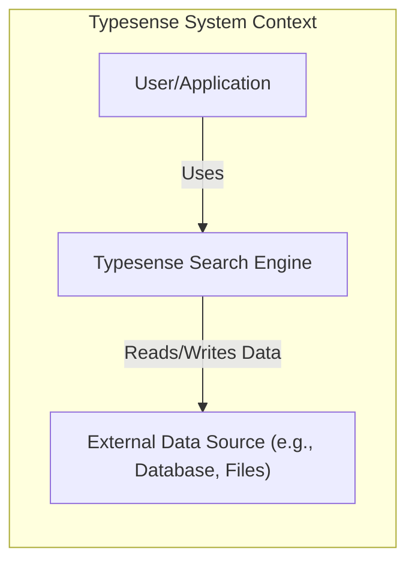
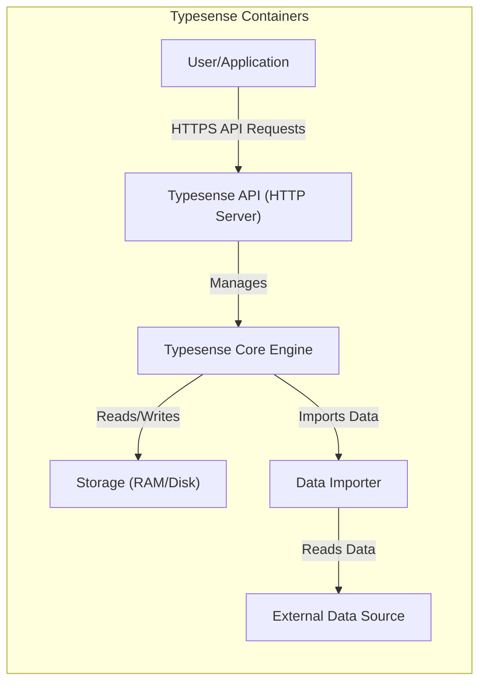
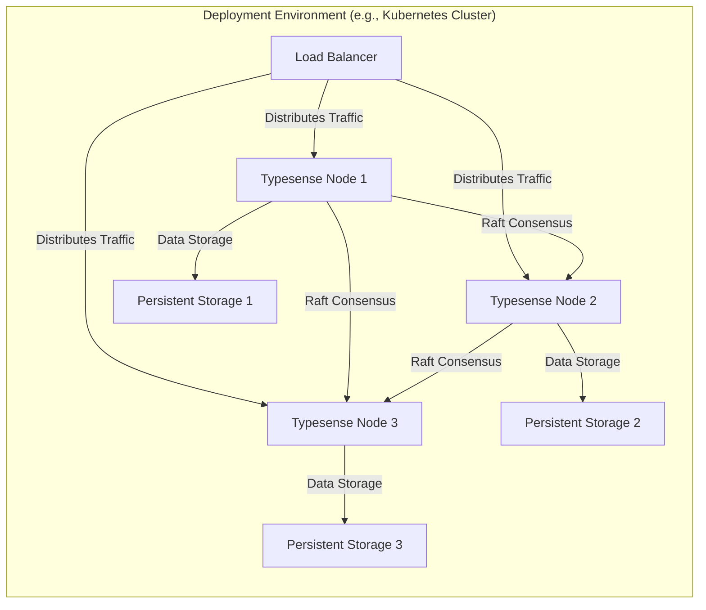
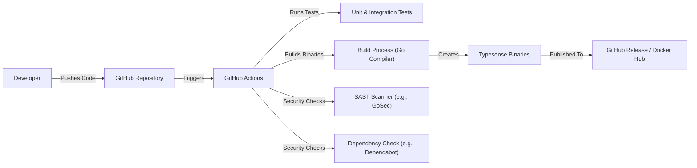

Okay, let's create a design document for Typesense based on the provided GitHub repository.

# BUSINESS POSTURE

Typesense is an open-source, typo-tolerant search engine optimized for speed and ease of use.  It's positioned as a simpler, faster alternative to larger, more complex search solutions like Elasticsearch.  The business priorities appear to be:

*   Developer Experience:  Easy setup, simple API, and clear documentation are crucial for attracting and retaining users.
*   Performance:  Speed and low latency are core value propositions.  This includes both indexing and search query performance.
*   Scalability:  The ability to handle growing datasets and query loads is essential for users with expanding needs.
*   Cost-Effectiveness:  Being open-source and resource-efficient makes it attractive compared to commercial or more resource-intensive solutions.
*   Accuracy: Providing relevant search results, even with typos, is a key differentiator.

Business risks that need to be addressed, based on these priorities:

*   Data Breaches:  Exposure of sensitive data indexed by Typesense instances.
*   Denial of Service:  Attacks that overwhelm Typesense servers, making them unavailable.
*   Data Corruption:  Accidental or malicious modification/deletion of indexed data.
*   Supply Chain Attacks: Compromise of the Typesense codebase or its dependencies, leading to vulnerabilities.
*   Misconfiguration:  Incorrectly configured Typesense instances leading to security or performance issues.
*   Lack of Compliance: Inability to meet regulatory requirements (e.g., GDPR, CCPA) related to data privacy and security.

# SECURITY POSTURE

Based on the repository and documentation, here's an assessment of the security posture:

Existing security controls:

*   security control: API Keys: Typesense uses API keys to control access to the API. Different keys can have different permissions (e.g., search-only, read-write). Described in documentation.
*   security control: HTTPS Support: Typesense can be configured to use HTTPS for encrypted communication. Described in documentation.
*   security control: CORS Configuration:  Typesense allows configuring Cross-Origin Resource Sharing (CORS) to restrict which websites can access the API. Described in documentation.
*   security control: Admin API Key: A special API key with full administrative privileges. Described in documentation.
*   security control: Multi-Tenancy Support: Typesense Cloud offers multi-tenancy, isolating data between different users/organizations. Described in documentation.
*   security control: Regular Updates: The project appears to have an active development cycle with regular releases, suggesting ongoing security patching. Observed in GitHub repository.
*   security control: Data Validation: Typesense performs data validation on the data being indexed, ensuring it conforms to the defined schema. Described in documentation.

Accepted risks:

*   accepted risk: Single-Node Vulnerability: A single-node Typesense deployment is a single point of failure. If the node goes down, the search service is unavailable.
*   accepted risk: Limited Built-in Authentication: Typesense primarily relies on API keys for authentication. It doesn't have built-in user management with features like password policies or multi-factor authentication.
*   accepted risk: No Built-in Encryption at Rest: Typesense does not natively encrypt data at rest. This must be handled at the infrastructure level (e.g., disk encryption).

Recommended security controls (high priority):

*   Network Segmentation: Isolate Typesense instances within a private network or VPC, limiting exposure to the public internet.
*   Firewall Rules: Implement strict firewall rules to control inbound and outbound traffic to Typesense servers.
*   Intrusion Detection/Prevention System (IDS/IPS): Deploy an IDS/IPS to monitor network traffic for malicious activity.
*   Regular Security Audits: Conduct periodic security audits and penetration testing to identify vulnerabilities.
*   Vulnerability Scanning: Regularly scan Typesense servers and dependencies for known vulnerabilities.
*   Logging and Monitoring: Implement comprehensive logging and monitoring to detect and respond to security incidents. This should include audit logs of API access.
*   Consider Encryption at Rest: Even though it's an accepted risk, strongly consider implementing encryption at rest using infrastructure-level solutions.

Security Requirements:

*   Authentication:
    *   All API requests must be authenticated using valid API keys.
    *   Different API keys should have granular permissions (e.g., search-only, document creation, schema modification).
    *   The admin API key should be protected with extreme care.
*   Authorization:
    *   Access to data and operations should be controlled based on the API key's permissions.
    *   Consider implementing role-based access control (RBAC) if more granular control is needed in the future.
*   Input Validation:
    *   All data being indexed should be validated against a predefined schema.
    *   Reject any data that doesn't conform to the schema.
    *   Sanitize input to prevent injection attacks.
*   Cryptography:
    *   All communication with Typesense servers should be encrypted using TLS/SSL (HTTPS).
    *   Use strong, industry-standard cryptographic algorithms and protocols.
    *   Consider using a Hardware Security Module (HSM) to protect sensitive keys if required by compliance or security policies.

# DESIGN

## C4 CONTEXT

Element descriptions:

*   Element:
    *   Name: User/Application
    *   Type: External Entity (Person or Software System)
    *   Description: Represents a user or an application that interacts with the Typesense search engine.
    *   Responsibilities:
        *   Sends search queries to Typesense.
        *   Provides data to be indexed by Typesense.
        *   Receives and processes search results.
    *   Security controls:
        *   Must authenticate with Typesense using API keys.
        *   May be subject to rate limiting.

*   Element:
    *   Name: Typesense Search Engine
    *   Type: Software System
    *   Description: The core Typesense search engine that indexes and searches data.
    *   Responsibilities:
        *   Receives and processes search queries.
        *   Indexes data from external data sources.
        *   Returns search results to users/applications.
        *   Manages schema and configuration.
    *   Security controls:
        *   API key authentication.
        *   HTTPS encryption.
        *   CORS configuration.
        *   Data validation.

*   Element:
    *   Name: External Data Source (e.g., Database, Files)
    *   Type: External System
    *   Description: The source of the data that is being indexed by Typesense. This could be a database, a set of files, or another data source.
    *   Responsibilities:
        *   Provides data to Typesense for indexing.
        *   May be updated independently of Typesense.
    *   Security controls:
        *   Should be secured independently of Typesense.
        *   Access from Typesense should be restricted to the minimum necessary.

## C4 CONTAINER

Element descriptions:

*   Element:
    *   Name: Typesense API (HTTP Server)
    *   Type: Container (Web Server)
    *   Description: The entry point for all API requests. Handles request parsing, authentication, and routing.
    *   Responsibilities:
        *   Receives and validates API requests.
        *   Authenticates requests using API keys.
        *   Routes requests to the appropriate handler in the Typesense Core Engine.
        *   Handles CORS configuration.
        *   Provides HTTPS encryption.
    *   Security controls:
        *   API key authentication.
        *   HTTPS encryption.
        *   CORS configuration.
        *   Input validation.
        *   Rate limiting.

*   Element:
    *   Name: Typesense Core Engine
    *   Type: Container (Application)
    *   Description: The core logic of the search engine. Handles indexing, searching, and data management.
    *   Responsibilities:
        *   Processes search queries.
        *   Manages the search index.
        *   Handles data updates and deletions.
        *   Enforces schema constraints.
    *   Security controls:
        *   Data validation.
        *   Internal access controls.

*   Element:
    *   Name: Storage (RAM/Disk)
    *   Type: Container (Storage)
    *   Description: Stores the search index and configuration data. Uses RAM for fast access and disk for persistence.
    *   Responsibilities:
        *   Stores the search index.
        *   Provides fast access to indexed data.
        *   Persists data to disk.
    *   Security controls:
        *   Should be protected by operating system-level security controls.
        *   Consider encryption at rest.

*   Element:
    *   Name: Data Importer
    *   Type: Container (Application)
    *   Description: Responsible for importing data from external sources into Typesense.
    *   Responsibilities:
        *   Reads data from external data sources.
        *   Transforms data into the correct format for Typesense.
        *   Sends data to the Typesense Core Engine for indexing.
    *   Security controls:
        *   Should have limited access to external data sources.
        *   Should validate and sanitize data before sending it to the core engine.

*   Element:
    *   Name: External Data Source
    *   Type: External System
    *   Description: The source of the data that is being indexed by Typesense.
    *   Responsibilities:
        *   Provides data to Typesense for indexing.
    *   Security controls:
        *   Should be secured independently of Typesense.

## DEPLOYMENT

Typesense can be deployed in several ways:

1.  Single-Node: A single instance of Typesense running on a server.
2.  Multi-Node Cluster (Self-Hosted): Multiple Typesense instances running on separate servers, forming a cluster for high availability and scalability.
3.  Typesense Cloud: A managed service provided by the Typesense team.

We'll describe the Multi-Node Cluster deployment in detail:

Element descriptions:

*   Element:
    *   Name: Load Balancer
    *   Type: Infrastructure Node (Load Balancer)
    *   Description: Distributes incoming traffic across multiple Typesense nodes.
    *   Responsibilities:
        *   Receives incoming requests.
        *   Distributes requests to healthy Typesense nodes.
        *   Provides a single point of access for clients.
    *   Security controls:
        *   Should be configured to use HTTPS.
        *   Should have firewall rules to restrict access.

*   Element:
    *   Name: Typesense Node 1, 2, 3
    *   Type: Infrastructure Node (Server)
    *   Description: An individual instance of the Typesense server.
    *   Responsibilities:
        *   Runs the Typesense software.
        *   Handles search requests.
        *   Participates in the Raft consensus algorithm for data replication and leader election.
    *   Security controls:
        *   Should be secured at the operating system level.
        *   Should have firewall rules to restrict access.
        *   Should use HTTPS for communication.

*   Element:
    *   Name: Persistent Storage 1, 2, 3
    *   Type: Infrastructure Node (Storage Volume)
    *   Description: Persistent storage for each Typesense node.
    *   Responsibilities:
        *   Stores the search index and configuration data.
        *   Provides data persistence in case of node failure.
    *   Security controls:
        *   Should be encrypted at rest.
        *   Should be backed up regularly.

## BUILD

Typesense uses a combination of GitHub Actions and custom scripts for its build process.

Build Process Description:

1.  Developers push code changes to the GitHub repository.
2.  GitHub Actions workflows are triggered by these pushes.
3.  Workflows run unit and integration tests to ensure code quality.
4.  Static Application Security Testing (SAST) tools (like GoSec) are used to scan the codebase for potential vulnerabilities.
5.  Dependency checks (e.g., using Dependabot) are performed to identify and update vulnerable dependencies.
6.  The Go compiler builds the Typesense binaries for various platforms.
7.  The built binaries are packaged and published as GitHub Releases and Docker images.

Security Controls in Build Process:

*   security control: Automated Testing: Unit and integration tests help prevent regressions and ensure code quality.
*   security control: SAST Scanning:  GoSec (or similar tools) are used to identify potential security vulnerabilities in the code.
*   security control: Dependency Management: Dependabot (or similar tools) help keep dependencies up-to-date and reduce the risk of using vulnerable libraries.
*   security control: Code Review:  Pull requests are reviewed by other developers before being merged, providing an additional layer of security scrutiny.
*   security control: Build Automation: GitHub Actions provide a consistent and reproducible build process, reducing the risk of manual errors.

# RISK ASSESSMENT

*   Critical Business Processes:
    *   Providing fast and accurate search results to users.
    *   Maintaining the availability and integrity of the search index.
    *   Protecting user data from unauthorized access.

*   Data Sensitivity:
    *   The sensitivity of the data depends entirely on what users index in Typesense. It could range from publicly available information to highly sensitive personal or business data. Typesense itself doesn't inherently know the sensitivity level. This is a crucial responsibility of the *user* to manage and protect accordingly.
    *   Typesense configuration data (including API keys) is highly sensitive and must be protected.

# QUESTIONS & ASSUMPTIONS

*   Questions:
    *   What are the specific compliance requirements (if any) that Typesense deployments need to meet (e.g., GDPR, HIPAA, PCI DSS)?
    *   What is the expected scale of data and query volume for typical Typesense deployments?
    *   Are there any specific threat models or attack vectors that are of particular concern?
    *   What level of support is provided for auditing and logging?
    *   What is the process for reporting and handling security vulnerabilities?

*   Assumptions:
    *   BUSINESS POSTURE: We assume that users are responsible for securing the data they index in Typesense and for complying with relevant regulations.
    *   SECURITY POSTURE: We assume that basic operating system security measures (e.g., firewalls, user access controls) are in place on the servers running Typesense.
    *   DESIGN: We assume that a multi-node cluster deployment is the recommended approach for production environments requiring high availability and scalability. We assume users will use HTTPS.