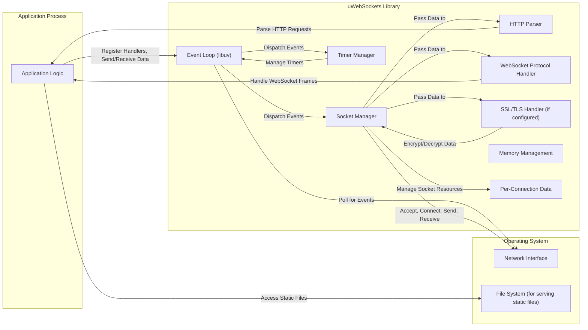
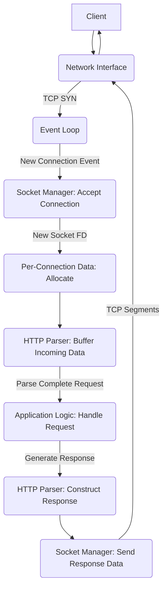
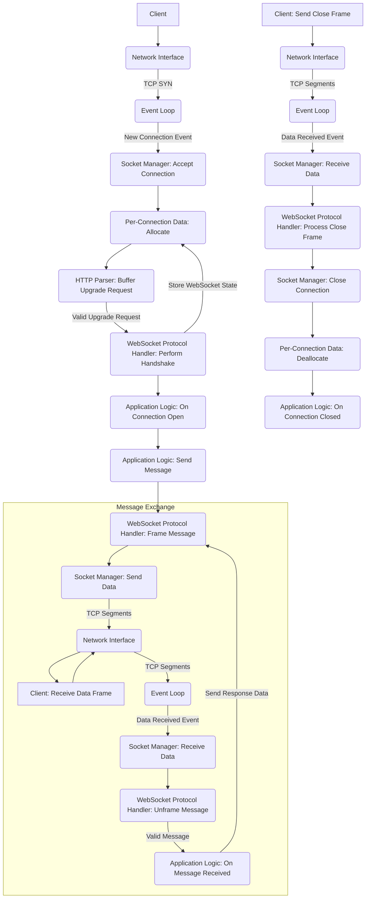

## Project Design Document: uWebSockets (Improved)

**1. Introduction**

This document provides an enhanced design overview of the uWebSockets project, an open-source C++ library engineered for high-performance WebSocket and HTTP handling. This detailed design serves as a crucial foundation for subsequent threat modeling activities, offering a comprehensive understanding of the library's architecture, data flow, and inherent security considerations.

**2. Goals and Objectives**

The core objectives driving the development of uWebSockets are:

* **Extreme Performance:** To achieve industry-leading speed and efficiency in managing network connections and processing data.
* **Exceptional Scalability:** To support a massive number of concurrent connections while maintaining minimal resource utilization.
* **Strict Standards Adherence:** To fully comply with relevant WebSocket (RFC 6455) and HTTP specifications (e.g., RFC 7230-7235).
* **Granular Low-Level Control:** To empower developers with precise control over underlying network operations and configurations.
* **Broad Cross-Platform Support:** To ensure compatibility across various operating systems, including Linux, macOS, and Windows.
* **Simplified Integration:** To offer intuitive and straightforward APIs for seamless integration into diverse application architectures.

**3. System Architecture**

uWebSockets is built upon an event-driven, non-blocking I/O paradigm, leveraging the robust libuv library for platform-agnostic asynchronous input/output operations. This architecture allows for efficient handling of numerous concurrent connections without relying on threads per connection.

**3.1. High-Level Architecture**

**3.2. Component Description**

* **Application Logic:** This represents the developer-written code that utilizes the uWebSockets library to define application-specific behavior for handling HTTP requests and WebSocket communications. It registers handlers for various events (e.g., connection, message, close).
* **Event Loop (libuv):** The core of the asynchronous I/O model. It monitors file descriptors (sockets, timers, pipes) for events (readiness for reading, writing, errors) and dispatches corresponding callbacks. libuv provides platform abstraction for these operations.
* **Socket Manager:** Responsible for the lifecycle management of network sockets. This includes creating listening sockets, accepting new connections, establishing outgoing connections, and managing socket closure. It interacts directly with the operating system's networking APIs through libuv.
* **HTTP Parser:**  A dedicated component for parsing incoming HTTP requests according to HTTP specifications. It extracts information such as HTTP method, URI, headers, and body. It also handles the generation of well-formed HTTP responses.
* **WebSocket Protocol Handler:** Implements the WebSocket protocol as defined in RFC 6455. This component manages the WebSocket handshake process, framing and unframing of WebSocket messages (text and binary), and handles control frames (ping, pong, close).
* **SSL/TLS Handler (if configured):** Provides secure communication over TLS/SSL. When enabled, this component integrates with a chosen TLS library (e.g., OpenSSL, BoringSSL) to handle encryption and decryption of data transmitted over sockets. It manages the TLS handshake and secure session establishment.
* **Timer Manager:**  Manages timers for various purposes, such as implementing connection timeouts, sending periodic ping messages for WebSocket connections, and scheduling delayed tasks. Timers are integrated with the event loop.
* **Memory Management:**  Handles memory allocation and deallocation within the library. This is critical for performance and preventing memory leaks or other memory-related vulnerabilities. uWebSockets often employs custom allocators for efficiency.
* **Per-Connection Data:**  A mechanism to store data associated with individual connections (both HTTP and WebSocket). This can include session information, application-specific state, or other relevant context. Proper management of this data is important for security and resource utilization.

**4. Data Flow**

**4.1. HTTP Request Flow (Detailed)**

**4.2. WebSocket Connection Flow (Detailed)**

**5. Security Considerations (Expanded)**

This section details potential security considerations within the uWebSockets library, providing a more in-depth analysis for threat modeling.

* **Input Validation Vulnerabilities:**
    - **HTTP Header Injection:** Maliciously crafted HTTP headers could be injected if the HTTP Parser doesn't strictly validate header names and values. This could lead to HTTP response splitting or other attacks.
    - **CRLF Injection:**  Improper handling of carriage return (CR) and line feed (LF) characters in HTTP headers could allow attackers to inject arbitrary headers or even HTTP responses.
    - **WebSocket Handshake Manipulation:**  Insufficient validation of the WebSocket handshake request (e.g., `Sec-WebSocket-Key`, `Origin`) could allow unauthorized connections or cross-site WebSocket hijacking.
    - **Malformed WebSocket Frames:** The WebSocket Protocol Handler must robustly handle malformed or oversized frames to prevent crashes or denial-of-service.
* **Memory Management Exploits:**
    - **Buffer Overflows:**  Insufficient bounds checking when copying data into buffers could lead to buffer overflows, potentially allowing attackers to overwrite adjacent memory regions and execute arbitrary code.
    - **Use-After-Free:**  Accessing memory that has already been freed can lead to crashes or exploitable vulnerabilities. Proper tracking of memory ownership is crucial.
    - **Memory Leaks:**  Failure to deallocate memory can lead to resource exhaustion and potentially denial-of-service.
* **Denial of Service (DoS) Attacks:**
    - **SYN Flood:**  An attacker could send a large number of SYN packets without completing the TCP handshake, exhausting server resources.
    - **Slowloris:**  Sending incomplete HTTP requests slowly over time can tie up server resources.
    - **WebSocket Ping Flood:**  Sending excessive ping frames could overwhelm the server.
    - **Large Message Attacks:**  Sending extremely large HTTP requests or WebSocket messages could consume excessive memory or processing power.
    - **Connection Exhaustion:**  Opening a large number of connections without sending data or closing them properly can exhaust available file descriptors or other resources.
* **WebSocket-Specific Security Risks:**
    - **Cross-Site WebSocket Hijacking (CSWSH):** If the server doesn't properly validate the `Origin` header during the WebSocket handshake, a malicious website could establish a WebSocket connection to the server on behalf of a legitimate user.
    - **Message Injection:**  In scenarios where the application logic doesn't properly sanitize or validate data received over WebSocket, attackers could inject malicious scripts or commands.
* **SSL/TLS Implementation Weaknesses:**
    - **Man-in-the-Middle (MITM) Attacks:**  Vulnerabilities in the SSL/TLS implementation or improper configuration could allow attackers to intercept and decrypt communication.
    - **Outdated Protocols and Cipher Suites:**  Using outdated TLS versions or weak cipher suites can make the connection vulnerable to known attacks.
    - **Improper Certificate Validation:**  Failure to properly validate server or client certificates can lead to security breaches.
* **Error Handling and Information Disclosure:**
    - **Verbose Error Messages:**  Error messages that reveal sensitive information about the server's internal state or configuration could be exploited by attackers.
    - **Lack of Proper Logging:**  Insufficient logging can hinder security monitoring and incident response.
* **Dependency Vulnerabilities:**
    - Vulnerabilities in libuv or the chosen SSL/TLS library could directly impact the security of uWebSockets. Regular updates and security assessments of dependencies are essential.
* **Timing Attacks:**  While less likely in this context, subtle differences in processing time for different inputs could potentially be exploited to infer information.

**6. Dependencies**

* **libuv:** A high-performance, multi-platform asynchronous I/O library. It provides the foundation for uWebSockets' event loop and network operations.
* **A suitable SSL/TLS library (optional, configurable at build time):**
    - **OpenSSL:** A widely used, open-source cryptography library.
    - **BoringSSL:** A fork of OpenSSL, primarily used within Google.
    - Other compatible TLS libraries could potentially be used.
* **C++ Standard Library:** Provides fundamental language features and utilities.

**7. Deployment Considerations**

Deploying applications using uWebSockets requires careful consideration of the following:

* **Operating System Selection:** Ensure the chosen operating system is supported by uWebSockets and its dependencies.
* **SSL/TLS Certificate Management:** If using HTTPS or secure WebSockets (WSS), proper generation, installation, and renewal of SSL/TLS certificates are crucial.
* **Resource Limits Configuration:** Configure appropriate operating system-level resource limits, such as the maximum number of open files (for sockets), memory limits, and process limits, to prevent resource exhaustion.
* **Load Balancing Strategies:** For high-traffic applications, implement load balancing across multiple instances of the application to distribute the load and improve resilience. Consider using layer 4 or layer 7 load balancers.
* **Firewall Configuration:** Configure firewalls to allow necessary network traffic to and from the application, restricting access to only authorized sources.
* **Security Hardening:** Apply standard security hardening practices to the server environment, such as disabling unnecessary services, keeping software up-to-date, and using strong passwords.
* **Monitoring and Logging:** Implement robust monitoring and logging mechanisms to track application performance, identify potential security incidents, and facilitate debugging.
* **Reverse Proxies:** Consider using a reverse proxy (e.g., Nginx, Apache) in front of the uWebSockets application for tasks like SSL termination, load balancing, and request routing.

**8. Future Considerations**

* **Formal Security Audits:** Conducting regular, independent security audits and penetration testing is vital for proactively identifying and addressing potential vulnerabilities.
* **Integration with Security Scanning Tools:** Explore integration with static and dynamic application security testing (SAST/DAST) tools to automate vulnerability detection.
* **Enhanced Rate Limiting and Abuse Prevention:** Implement more sophisticated rate limiting algorithms and mechanisms to prevent abuse and protect against denial-of-service attacks.
* **Support for Emerging Security Standards:** Continuously evaluate and integrate support for new security standards and best practices.
* **Improved Documentation on Security Best Practices:** Provide comprehensive documentation and guidance for developers on how to securely use the uWebSockets library.

This improved design document provides a more detailed and nuanced understanding of the uWebSockets project, offering a stronger foundation for comprehensive threat modeling and security analysis. The expanded information on data flow and security considerations will be invaluable in identifying potential attack vectors and vulnerabilities.