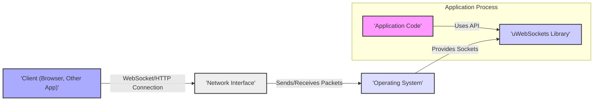
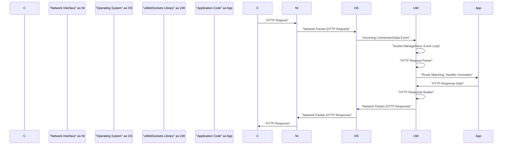
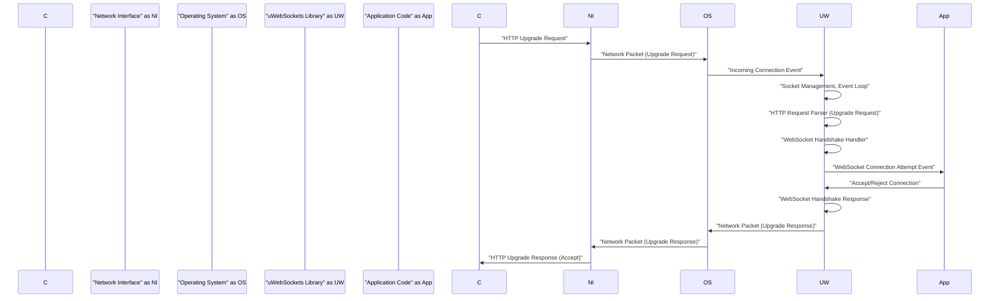
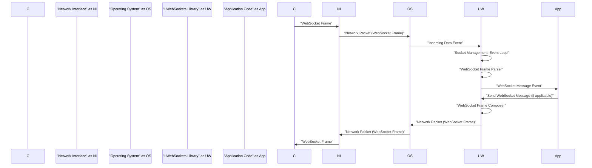

# Project Design Document: uWebSockets

**Version:** 1.1
**Date:** October 26, 2023
**Prepared By:** Gemini (AI Language Model)

## 1. Introduction

This document provides a detailed design overview of the uWebSockets library, an open-source project renowned for its high-performance WebSocket and HTTP implementations. This document is specifically crafted to serve as a robust foundation for subsequent threat modeling activities, offering a clear and comprehensive understanding of the system's architecture, individual components, and the flow of data within it. This detailed design will aid in identifying potential vulnerabilities and attack vectors.

## 2. Project Overview

* **Project Name:** uWebSockets
* **Project Repository:** [https://github.com/unetworking/uwebsockets](https://github.com/unetworking/uwebsockets)
* **Project Goal:** To deliver an exceptionally lightweight, efficient, and highly scalable library for constructing real-time applications leveraging WebSockets and for handling standard HTTP requests. The primary design focus is on achieving maximum performance with minimal resource consumption, making it suitable for demanding environments.
* **Key Performance Characteristics:**
    * **High Throughput:** Designed to handle a large number of concurrent connections and messages.
    * **Low Latency:** Optimized for minimal delay in message delivery.
    * **Small Footprint:**  Efficient memory usage and low overhead.
* **Target Users:** Software developers building applications that necessitate real-time bidirectional communication via WebSockets, or those requiring high-performance HTTP servers capable of handling significant load.

## 3. System Architecture

The uWebSockets library is predominantly implemented in C++ and leverages underlying operating system APIs for core networking functionalities. It employs an event-driven, non-blocking I/O model as its fundamental mechanism for achieving high concurrency and responsiveness.

**Components:**

* **Application Code:** This represents the custom application logic developed by the user that integrates and utilizes the uWebSockets library. It is responsible for defining specific WebSocket endpoints, HTTP routes, and the business logic associated with handling incoming requests and messages.
* **uWebSockets Library:** This is the core component of the system. It handles all low-level networking operations, including managing network connections, parsing incoming WebSocket frames and HTTP requests, orchestrating the event loop, and exposing an API that the application code uses to interact with connected clients.
* **Operating System:** The underlying operating system provides essential networking primitives, such as sockets and mechanisms for asynchronous I/O event notification (e.g., `epoll` on Linux, `kqueue` on macOS/BSD, and `IOCP` on Windows). uWebSockets relies heavily on these OS features for efficient network management.
* **Network Interface:** This represents the physical or virtual network interface card (NIC) through which network packets are transmitted to and received from the network.
* **Client (Browser, Other App):** This is the external entity that initiates either a WebSocket or a standard HTTP connection to the application server that is utilizing the uWebSockets library. This could be a web browser, another application, or a command-line tool.

## 4. Component Details

### 4.1. uWebSockets Library Internals

The uWebSockets library's internal workings can be further dissected into several key modules, each with specific responsibilities:

* **Networking Core:**
    * **Socket Management:**  Responsible for the lifecycle management of network sockets, including their creation, binding to addresses and ports, listening for incoming connections, and accepting new connections. This module directly interacts with the operating system's socket APIs.
    * **Event Loop (Reactor Pattern):** The central control mechanism that monitors file descriptors (sockets) for I/O events (readiness to read, readiness to write, connection establishment, errors). It uses OS-specific mechanisms like `epoll`, `kqueue`, or `IOCP` for efficient event notification. When an event occurs, the event loop dispatches it to the appropriate handler.
    * **Connection Handling:** Manages the state and resources associated with individual network connections. This includes tracking connection status (e.g., connecting, open, closing, closed), managing timeouts, and potentially implementing connection pooling.
    * **TLS/SSL Integration (Optional):** Provides support for secure communication over TLS/SSL. This typically involves integrating with external libraries like OpenSSL or mbedTLS to handle the encryption and decryption of data transmitted over secure connections. This module is crucial for protecting sensitive data in transit.

* **HTTP Handling:**
    * **Request Parser:**  Responsible for parsing incoming HTTP requests from the network stream. This involves extracting the HTTP method, URI, headers, and body of the request. The parser needs to be robust to handle various HTTP request formats and potential malformed requests.
    * **Response Builder:**  Constructs HTTP responses to be sent back to the client. This involves setting the HTTP status code, headers, and the response body based on the application's logic.
    * **Routing Mechanism:**  Matches incoming HTTP requests to the appropriate request handlers defined in the application code based on the request's URI and method. This module often involves efficient data structures for storing and matching routes.

* **WebSocket Handling:**
    * **Handshake Handler:** Implements the WebSocket handshake process as defined in the WebSocket protocol specification (RFC 6455). This involves processing the initial HTTP upgrade request from the client and sending back the appropriate handshake response to establish the WebSocket connection. Security checks, such as verifying the `Sec-WebSocket-Key`, are performed during this phase.
    * **Frame Parser:** Parses incoming WebSocket frames from the network stream. This involves extracting the frame's opcode (indicating the type of data), payload data, and flags (e.g., FIN bit, RSV bits, masking bit). The parser needs to handle different frame types (text, binary, control frames like ping and pong) and handle potential fragmentation.
    * **Frame Composer:**  Constructs WebSocket frames to be sent to clients. This involves assembling the frame header with the appropriate opcode, payload length, and flags, and then appending the payload data.
    * **Message Fragmentation/Defragmentation:** Handles the process of splitting large WebSocket messages into smaller frames for transmission and reassembling fragmented messages received from the client. This is important for handling messages larger than the underlying network MTU.
    * **Ping/Pong Mechanism:** Implements the WebSocket protocol's keep-alive mechanism by sending and responding to Ping and Pong control frames. This helps in detecting and closing dead connections.

* **Memory Management:**
    * **Buffer Management:**  Manages the allocation and deallocation of memory buffers used for storing incoming and outgoing data. Efficient buffer management is crucial for performance and preventing memory leaks or buffer overflows.
    * **Object Pooling (Potential):** May utilize object pooling techniques to reduce the overhead of frequently allocating and deallocating objects, such as connection objects or frame objects. This can improve performance, especially under high load.

* **API Layer:**
    * Provides a well-defined set of C++ interfaces that the application code uses to interact with the uWebSockets library. This includes functions for registering HTTP routes and WebSocket endpoints, handling various WebSocket events (connection open, message received, connection closed, errors), sending data to clients, and managing server lifecycle.

### 4.2. Application Code

* **Defines Endpoints/Routes:** The application developer defines the specific HTTP routes and WebSocket endpoints that the server will listen for and handle. This involves mapping specific URIs or paths to corresponding handler functions.
* **Implements Handlers:**  Provides the implementation logic for handling incoming HTTP requests and WebSocket events. This logic defines how the application responds to client interactions, processes data, and generates responses or sends messages.
* **Uses uWebSockets API:**  The application code interacts with the uWebSockets library through its provided API to perform actions such as sending data to connected clients, closing connections, accessing connection-specific information, and managing the server's behavior.

### 4.3. Client

* **Initiates Connections:**  The client application initiates either an HTTP request or a WebSocket connection to the server running the uWebSockets library. For WebSockets, this starts with an HTTP upgrade request.
* **Sends Requests/Messages:** Sends HTTP requests to the server to access resources or trigger actions, or sends WebSocket messages for real-time communication.
* **Receives Responses/Messages:** Receives HTTP responses from the server in response to requests, or receives WebSocket messages sent by the server.

## 5. Data Flow

### 5.1. HTTP Request Flow

### 5.2. WebSocket Connection Establishment

### 5.3. WebSocket Message Flow

## 6. Key Technologies

* **Primary Programming Language:** C++ (Core library implementation)
* **Core Networking Libraries:**  Direct utilization of operating system-specific socket APIs (e.g., BSD sockets on Unix-like systems, Winsock on Windows).
* **Asynchronous I/O Event Handling:**  Employs efficient event notification mechanisms provided by the operating system: `epoll` (Linux), `kqueue` (macOS, BSD), `IOCP` (Windows).
* **Optional TLS/SSL Support:** Integration with external TLS/SSL libraries for secure communication, commonly OpenSSL, mbedTLS, or BoringSSL.
* **HTTP Parsing Implementation:** Likely uses a custom-built, high-performance HTTP parser or a lightweight external library to minimize overhead.
* **WebSocket Protocol Adherence:** Implements the WebSocket protocol as defined by RFC 6455.

## 7. Security Considerations

This section outlines potential security considerations relevant to uWebSockets, which will be crucial for subsequent threat modeling.

* **Input Validation Vulnerabilities:**
    * **HTTP Request Parsing:** Insufficient validation of HTTP headers (e.g., `Content-Length`, `Host`), request URI, and body can lead to various attacks, including buffer overflows, HTTP header injection, and request smuggling.
    * **WebSocket Frame Parsing:** Lack of proper validation of WebSocket frame headers (e.g., payload length, opcode) and payload content can result in vulnerabilities like buffer overflows, denial-of-service, and potential exploitation of application logic.
    * **Data Sanitization:** Failure to sanitize data received from clients before using it in application logic or storing it can lead to injection attacks (e.g., cross-site scripting (XSS) if displaying data in a web browser, SQL injection if used in database queries).

* **Memory Safety Issues (C++ Specific):**
    * **Buffer Overflows:** Improper bounds checking when handling incoming data can lead to writing beyond allocated buffer boundaries, potentially causing crashes or allowing arbitrary code execution.
    * **Use-After-Free:**  Accessing memory that has been freed can lead to unpredictable behavior and potential security vulnerabilities.
    * **Double-Free:** Attempting to free the same memory region twice can corrupt memory management structures and lead to crashes or exploitable conditions.
    * **Memory Leaks:** Failure to properly release allocated memory can lead to resource exhaustion and denial of service.

* **Denial of Service (DoS) Attacks:**
    * **Slowloris/Slow Post Attacks:** Susceptible to attacks that attempt to exhaust server resources by sending incomplete or very slow HTTP requests, keeping connections open for extended periods.
    * **WebSocket Bomb:**  Handling excessively large WebSocket messages or a rapid influx of messages can overwhelm the server's processing capabilities, leading to resource exhaustion and denial of service.
    * **Connection Exhaustion:** Lack of proper limits on the number of concurrent connections can allow an attacker to exhaust server resources by opening a large number of connections.
    * **CPU Exhaustion:**  Processing computationally intensive or malformed requests or messages could consume excessive CPU resources, leading to service degradation or failure.

* **WebSocket Specific Security Concerns:**
    * **Frame Injection:** Malicious clients might attempt to send crafted WebSocket frames with invalid opcodes, manipulated flags, or excessively large payloads to bypass security measures or exploit vulnerabilities in the application's handling of WebSocket data.
    * **Cross-Site WebSocket Hijacking (CSWSH):** If the application does not implement proper origin validation (e.g., checking the `Origin` header during the handshake), a malicious website could trick a user's browser into establishing a WebSocket connection to the vulnerable server, potentially allowing the attacker to perform actions on behalf of the user.

* **TLS/SSL Configuration and Implementation:**
    * **Weak Cipher Suites:** Using outdated or weak cipher suites can make the connection vulnerable to eavesdropping and man-in-the-middle attacks.
    * **Improper Certificate Validation:** Failure to properly validate client or server certificates can lead to accepting connections from untrusted entities.
    * **Protocol Downgrade Attacks:**  Vulnerabilities in the TLS/SSL implementation might allow attackers to force the connection to use an older, less secure protocol version.

* **Dependency Vulnerabilities:**
    * Security vulnerabilities in third-party libraries used by uWebSockets (e.g., the TLS/SSL library) can introduce security risks to the application. Regular updates and vulnerability scanning of dependencies are crucial.

* **Error Handling and Information Disclosure:**
    * Verbose error messages or stack traces exposed to clients can reveal sensitive information about the server's internal workings, potentially aiding attackers.

* **Permissions and Privileges:**
    * Running the uWebSockets application process with excessive privileges increases the potential impact of a successful attack. The principle of least privilege should be followed.

## 8. Deployment Model

uWebSockets is typically deployed as a library that is linked directly into the application's executable. The resulting application process then runs on a server or within a containerized environment.

* **Standalone Server Application:** The application incorporating the uWebSockets library directly listens on a specified network port and handles all incoming client connections (both HTTP and WebSocket).
* **Deployment Behind a Reverse Proxy:**  uWebSockets applications are often deployed behind a reverse proxy server (e.g., Nginx, HAProxy, Apache). The reverse proxy can handle tasks such as TLS termination, load balancing across multiple instances of the application, and request routing. This model adds an extra layer of security and scalability.
* **Containerized Environments (e.g., Docker, Kubernetes):**  Deployment within containers is a common practice, providing isolation, portability, and simplified management and scaling. Container orchestration platforms like Kubernetes can manage the deployment and scaling of uWebSockets-based applications.

## 9. Assumptions and Constraints

* **Operating System Dependency:** The performance and behavior of uWebSockets are inherently tied to the underlying operating system's networking capabilities and the efficiency of its event notification mechanisms.
* **Developer Security Responsibility:** The overall security of an application built with uWebSockets heavily relies on the developer's secure coding practices, proper usage of the library's API, and careful implementation of application-specific security measures.
* **Configuration Security:**  It is assumed that the deployer will properly configure security-related settings, such as TLS/SSL configurations, connection limits, and resource constraints, according to security best practices.
* **Resource Availability:** The system assumes the availability of sufficient computing resources (CPU, memory, network bandwidth) to handle the anticipated workload and prevent resource exhaustion attacks.
* **No Built-in Authentication/Authorization:** uWebSockets itself does not provide built-in authentication or authorization mechanisms. These functionalities must be implemented at the application level.

This improved design document provides a more detailed and security-focused overview of the uWebSockets project. The enhanced descriptions of internal components, expanded security considerations, and clarified data flow diagrams will significantly contribute to a more effective and comprehensive threat modeling process.