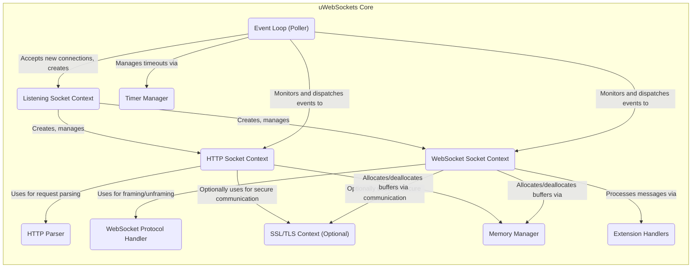

## Project Design Document: uWebSockets

**1. Introduction**

This document provides a detailed design overview of the `uWebSockets` project, a highly performant and lightweight C++ library for building WebSocket and HTTP servers and clients. This document aims to capture the key architectural components, data flow, and design decisions to facilitate future threat modeling activities.

**1.1. Purpose**

The primary purpose of this document is to provide a comprehensive architectural understanding of `uWebSockets` for security analysis and threat modeling. It outlines the core components, their interactions, and the data flow within the library, enabling security professionals to identify potential vulnerabilities.

**1.2. Scope**

This document focuses on the internal architecture and design of the `uWebSockets` library itself. It covers the core functionalities related to network I/O, protocol handling (HTTP and WebSocket), memory management, and SSL/TLS integration. It does not delve into the specifics of applications built using `uWebSockets` or the operating system environment in which it runs, except where directly relevant to the library's design and security considerations.

**1.3. Goals**

*   Clearly articulate the architectural components of `uWebSockets` and their responsibilities.
*   Describe the detailed data flow within the library for both HTTP and WebSocket communication, including error handling and different processing stages.
*   Identify key design decisions that have security implications, providing specific examples where possible.
*   Provide a solid foundation for subsequent threat modeling exercises, enabling the identification of potential attack vectors and vulnerabilities.

**2. Overview**

`uWebSockets` is engineered for exceptional performance and minimal resource footprint. It achieves this through an event-driven, asynchronous, and non-blocking architecture. It leverages the operating system's efficient event notification mechanisms: epoll (Linux), kqueue (macOS, BSD), or IOCP (Windows). The library offers a low-level API, granting developers granular control over network operations and resource management. It supports both server and client roles for HTTP/1.1 and RFC 6455 compliant WebSocket protocols. A key design principle is zero-copy operation where feasible, minimizing data movement and improving efficiency.

**3. Architecture**

The architecture of `uWebSockets` is modular and centers around an event loop that manages network events. Key components include:

*   **Event Loop (Poller):** The core of the library. It monitors file descriptors (sockets) for I/O events (read, write, error) using the operating system's polling mechanism (epoll, kqueue, IOCP). It then dispatches these events to the appropriate handlers associated with the socket.
*   **Socket Contexts:** Represent individual network connections. Different types of socket contexts manage the state and data associated with different connection types:
    *   **Listening Socket Context:**  Handles accepting new incoming connections.
    *   **HTTP Socket Context:** Manages the state of an ongoing HTTP connection, including request parsing and response generation.
    *   **WebSocket Socket Context:** Manages the state of an established WebSocket connection, handling framing and message delivery.
*   **HTTP Parser (http-parser):**  An external, high-performance HTTP parser library (often a modified version) responsible for parsing incoming HTTP request and response headers and bodies. It's crucial for correctly interpreting HTTP semantics.
*   **WebSocket Protocol Handler:** Implements the WebSocket protocol logic, including:
    *   **Handshake Handling:** Processing the initial HTTP upgrade request and generating the WebSocket handshake response.
    *   **Framing and Unframing:**  Encoding and decoding WebSocket frames, including handling fragmentation, opcodes, and masking.
    *   **Control Frame Processing:** Handling ping, pong, and close frames.
*   **SSL/TLS Integration (OpenSSL or BoringSSL):** Provides secure communication channels using TLS encryption. This component handles the TLS handshake, encryption, and decryption of data. It's typically integrated through a wrapper or adapter.
*   **Memory Manager:** `uWebSockets` employs custom memory management techniques, often involving pre-allocation, object pooling, and arena allocation to minimize dynamic memory allocations and improve performance. This includes managing buffers for socket data.
*   **Timer Management:**  Manages timeouts for various operations, such as connection timeouts, ping timeouts in WebSockets, and application-defined timers.
*   **Extension Handlers:**  Allows for extending the base WebSocket protocol functionality. Examples include permessage-deflate for compression. These handlers intercept and modify WebSocket messages.

**3.1. Component Interaction Diagram**

**4. Data Flow**

The data flow within `uWebSockets` is event-driven and differs slightly between HTTP and WebSocket connections.

**4.1. HTTP Request Flow (Server)**

1. **Connection Establishment:** The **Event Loop (Poller)** detects a new connection on a **Listening Socket Context**.
2. **Socket Context Creation:** A new **HTTP Socket Context** is created to manage the connection.
3. **Data Reception:** Incoming data arrives on the socket, and the **Event Loop** notifies the **HTTP Socket Context**.
4. **Buffering:** Received data is buffered within the **HTTP Socket Context's** managed memory.
5. **Parsing:** The **HTTP Parser** processes the buffered data incrementally, attempting to parse HTTP headers and the body.
6. **Request Completion:** Once a complete HTTP request is parsed, the application's request handler (using the `uWebSockets` API) is invoked with the parsed request information.
7. **Response Generation:** The application generates an HTTP response.
8. **Response Transmission:** The response data is sent back through the **HTTP Socket Context**, potentially utilizing the **SSL/TLS Context** for secure connections. The **Event Loop** manages the sending process.
9. **Connection Management:** The connection may be kept alive (based on HTTP headers) or closed. The **Timer Manager** might be involved for keep-alive timeouts.
10. **Error Handling:** If parsing errors occur, the connection might be closed, or an error response might be sent.

**4.2. WebSocket Handshake Flow (Server)**

1. **Initial HTTP Request:** The flow begins like a standard HTTP request.
2. **Upgrade Detection:** The **HTTP Parser** identifies a potential WebSocket upgrade request (indicated by `Upgrade` and `Connection` headers).
3. **Handshake Validation:** The application logic (using the `uWebSockets` API) can validate the handshake request (e.g., checking `Sec-WebSocket-Key`).
4. **Handshake Response:** If the upgrade is accepted, the **WebSocket Protocol Handler** generates the WebSocket handshake response headers.
5. **Protocol Upgrade:** The **HTTP Socket Context** is upgraded to a **WebSocket Socket Context**.
6. **Secure Upgrade (Optional):** If TLS is used, the TLS connection remains active for the WebSocket connection.

**4.3. WebSocket Message Flow (Server)**

1. **Data Reception:** Incoming data arrives on the socket, and the **Event Loop** notifies the **WebSocket Socket Context**.
2. **Buffering:** Received data is buffered within the **WebSocket Socket Context's** managed memory.
3. **Unframing:** The **WebSocket Protocol Handler** processes the buffered data, identifying and extracting WebSocket frames. This includes handling fragmentation and masking (for client-to-server messages).
4. **Message Reassembly:** Fragmented messages are reassembled.
5. **Extension Processing:** If extensions are enabled, the **Extension Handlers** process the message data (e.g., decompression).
6. **Message Delivery:** Complete WebSocket messages (text or binary) are delivered to the application logic (using the `uWebSockets` API).
7. **Message Framing (Outgoing):** Outgoing messages from the application are framed by the **WebSocket Protocol Handler**, including applying masking for server-to-client messages.
8. **Data Transmission:** Framed messages are sent back through the **WebSocket Socket Context** via the **Event Loop**, potentially using the **SSL/TLS Context**.
9. **Control Frame Handling:** The **WebSocket Protocol Handler** also handles control frames (ping, pong, close) according to the WebSocket specification.
10. **Error Handling:** Invalid frames or protocol violations result in connection closure.

**5. Security Considerations**

The design of `uWebSockets`, while focused on performance, presents several security considerations:

*   **Memory Management Vulnerabilities:**  Custom memory management increases the risk of buffer overflows, use-after-free errors, and double-free vulnerabilities if not implemented with extreme care. Incorrect bounds checking or improper deallocation can be exploited.
*   **HTTP Parsing Vulnerabilities:**  Flaws in the **HTTP Parser** (even if it's an external library) can lead to critical vulnerabilities like HTTP request smuggling, header injection attacks, and denial-of-service through malformed requests.
*   **WebSocket Protocol Handling Vulnerabilities:** Incorrect implementation of the WebSocket protocol can lead to:
    *   **Frame Injection:** Attackers might craft malicious frames to inject data or commands.
    *   **Denial of Service:** Sending large numbers of fragmented messages or control frames could overwhelm the server.
    *   **Masking Issues:** Failure to properly handle masking could lead to security breaches.
*   **SSL/TLS Configuration and Vulnerabilities:** The security of the SSL/TLS integration depends heavily on the configuration and the underlying OpenSSL or BoringSSL library. Weak cipher suites, improper certificate validation, or vulnerabilities in the SSL/TLS library itself can compromise confidentiality and integrity.
*   **Extension Handler Vulnerabilities:**  Security flaws in extension handlers (especially third-party ones) can introduce vulnerabilities like arbitrary code execution or data manipulation.
*   **Denial of Service (DoS) Attacks:** The event-driven nature can be targeted by DoS attacks:
    *   **SYN Floods:**  While the OS handles the initial TCP handshake, excessive connection attempts can still strain resources.
    *   **Slowloris Attacks:** Sending incomplete HTTP requests slowly to tie up resources.
    *   **WebSocket Ping Floods:** Sending excessive ping frames.
    *   **Large Message Attacks:** Sending extremely large HTTP requests or WebSocket messages to consume memory.
*   **Integer Overflows:** Calculations involving message lengths, frame sizes, and buffer allocations must be carefully checked to prevent integer overflows, which could lead to buffer overflows.
*   **Concurrency and Thread Safety:** While primarily single-threaded, interactions with external libraries or any internal concurrency mechanisms must be thread-safe to prevent race conditions and data corruption.
*   **Input Validation:**  Insufficient validation of input data (both HTTP headers/body and WebSocket messages) can lead to various injection attacks (e.g., cross-site scripting if the data is reflected in a web application).

**6. Deployment Considerations**

`uWebSockets` is designed to be embedded within a larger application. The security responsibilities are shared between the library developers and the application developers:

*   **Library Developers:** Responsible for ensuring the core library components (event loop, parsers, protocol handlers) are free from vulnerabilities.
*   **Application Developers:** Responsible for:
    *   Properly configuring `uWebSockets`, including SSL/TLS settings.
    *   Implementing secure application logic to handle parsed requests and messages.
    *   Validating user input received through `uWebSockets`.
    *   Protecting against application-level attacks (e.g., authentication, authorization).
    *   Setting appropriate timeouts and resource limits to mitigate DoS attacks.
    *   Keeping the `uWebSockets` library and its dependencies (like OpenSSL) up-to-date with security patches.
    *   Carefully vetting and using any third-party extension handlers.

Common deployment scenarios include:

*   Standalone high-performance WebSocket servers.
*   Real-time web applications.
*   IoT devices requiring efficient communication.
*   Backend services for mobile applications.

**7. Future Considerations**

Potential future developments or features that could impact the architecture and security include:

*   Support for newer HTTP versions (e.g., HTTP/2, HTTP/3).
*   Integration with different or newer versions of SSL/TLS libraries.
*   Further optimizations to memory management, potentially introducing new security considerations.
*   More sophisticated rate limiting or traffic shaping features.
*   Standardization or formalization of extension handling mechanisms.

This document provides a comprehensive architectural overview of `uWebSockets`, highlighting key components, data flow, and security considerations. This detailed information is essential for conducting thorough threat modeling and implementing appropriate security measures when using this high-performance library.