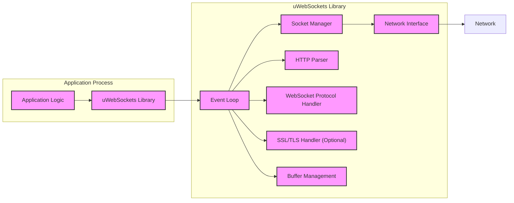

# Project Design Document: uWebSockets (Improved)

**Project Name:** uWebSockets

**Project Repository:** [https://github.com/unetworking/uwebsockets](https://github.com/unetworking/uwebsockets)

**Document Version:** 1.1
**Date:** 2023-10-27
**Author:** AI Software Architect

**Changes from Version 1.0:**

*   Expanded Security Considerations section with more specific threats and mitigation strategies.
*   Added details to Component Descriptions, especially for Event Loop and Socket Manager.
*   Clarified Data Flow Description.
*   Added Error Handling and Logging considerations.
*   Minor formatting and wording improvements for clarity.

## 1. Project Overview

uWebSockets (often stylized as µWebSockets or uWS) is a highly performant and scalable C++ library for building WebSocket and HTTP servers and clients. It is engineered for exceptional resource efficiency and speed, making it an ideal choice for applications demanding real-time, high-concurrency communication. This document provides a detailed design overview of uWebSockets, specifically tailored to facilitate comprehensive threat modeling and security analysis.

### 1.1. Project Goals

*   **Extreme Performance:** Achieve industry-leading speed and minimal latency in both WebSocket and HTTP communication.
*   **Massive Scalability:** Efficiently manage and sustain a very large number of concurrent connections without performance degradation.
*   **Minimal Resource Footprint:** Optimize for low CPU and memory consumption, crucial for resource-constrained environments and maximizing server density.
*   **API Flexibility and Extensibility:** Offer a versatile and adaptable API that empowers developers to build a wide spectrum of WebSocket and HTTP-based applications.
*   **Broad Platform Support:** Ensure compatibility and consistent performance across major operating systems including Linux, macOS, and Windows.

### 1.2. Target Audience

This document is designed for a diverse audience:

*   **Security Engineers & Auditors:** Professionals responsible for conducting threat modeling, vulnerability assessments, and security audits of systems incorporating uWebSockets.
*   **Software Developers:** Engineers integrating uWebSockets into their applications, requiring a deep understanding of its architecture for effective and secure utilization.
*   **System Administrators & DevOps:** Personnel involved in deploying and managing applications built with uWebSockets, needing insights into its operational characteristics and security implications.
*   **Performance Analysts:** Individuals interested in understanding the internal workings of high-performance networking libraries and optimizing application performance.
*   **Security Researchers:** Researchers investigating the security landscape of modern networking libraries and seeking to identify potential vulnerabilities in uWebSockets.

## 2. System Architecture

uWebSockets employs an event-driven, non-blocking I/O architecture, leveraging operating system-specific primitives such as `epoll` (Linux), `kqueue` (macOS), and IOCP (Windows) for optimal efficiency. It presents a low-level API, granting fine-grained control over network connections and protocol handling.

**Description of Components:**

*   **Application Logic:** Represents the custom application code developed by users that utilizes the uWebSockets library to implement specific WebSocket or HTTP server/client functionalities. This is where business logic and application-specific security measures reside.
*   **uWebSockets Library:** The core C++ library providing the fundamental API and mechanisms for high-performance network communication. It encapsulates the event loop, socket management, protocol handling, and optional security features.
*   **Event Loop:** The central orchestrator of uWebSockets. It continuously monitors registered file descriptors (sockets) for I/O events using OS-level mechanisms. Upon event detection, it dispatches events to the appropriate handlers, ensuring non-blocking operation and high concurrency.
*   **Socket Manager:** Responsible for the complete lifecycle management of network sockets. This includes:
    *   Creation and binding of listening sockets for server applications.
    *   Acceptance of incoming connection requests on listening sockets.
    *   Creation of client sockets for initiating outgoing connections.
    *   Configuration of socket options (e.g., `TCP_NODELAY`, `SO_REUSEADDR`, buffer sizes).
    *   Graceful closure and resource cleanup of sockets.
    *   Potentially includes internal socket pooling or reuse optimizations for performance.
*   **HTTP Parser:**  Dedicated to parsing incoming HTTP requests and responses according to HTTP specifications (e.g., RFC 7230 series).
    *   Request Parsing: Deconstructs HTTP requests to extract method, URI, headers, and body.
    *   Response Parsing: Analyzes HTTP responses to retrieve status code, headers, and body (primarily for client-side operations).
    *   Header Management: Handles parsing, validation, and serialization of HTTP headers.
    *   May implement defenses against HTTP parsing vulnerabilities (e.g., request smuggling, header injection).
*   **WebSocket Protocol Handler:** Implements the WebSocket protocol (RFC 6455), enabling persistent, bidirectional communication channels over TCP.
    *   Handshake Processing: Manages the WebSocket handshake negotiation between client and server.
    *   Framing/Unframing: Encapsulates outgoing messages into WebSocket frames and decapsulates incoming frames to reconstruct messages.
    *   Message Type Handling: Supports all standard WebSocket message types (text, binary, ping, pong, close control frames).
    *   Connection State Management: Tracks the state of WebSocket connections and manages connection lifecycle events.
    *   Potentially supports WebSocket extensions (e.g., compression extensions like permessage-deflate).
*   **SSL/TLS Handler (Optional):** Provides secure communication capabilities by integrating SSL/TLS encryption.
    *   TLS Handshake: Executes the TLS handshake protocol to establish secure, encrypted connections.
    *   Encryption/Decryption: Performs encryption of outgoing data and decryption of incoming data using negotiated TLS ciphers.
    *   Certificate Management: Handles SSL/TLS certificate loading, validation, and management for server and client authentication (if configured). Typically relies on external libraries like OpenSSL, BoringSSL, or LibreSSL.
*   **Buffer Management:** Manages memory buffers used for socket I/O operations, HTTP parsing, and WebSocket framing. Efficient buffer management is critical for performance and preventing memory-related vulnerabilities.  May include techniques like buffer pooling or zero-copy operations.
*   **Network Interface:** Represents the operating system's network stack and hardware interface through which uWebSockets interacts with the physical network.
*   **Network:** Represents the external network environment, which could be the internet, a local network, or any other network over which communication occurs.

## 3. Component Details

### 3.1. Event Loop (Detailed)

*   **Functionality:** The core of uWebSockets' non-blocking architecture. It continuously polls registered file descriptors (primarily socket file descriptors) for readiness events (readable, writable, error).
    *   **OS Integration:** Leverages highly efficient OS-specific APIs: `epoll` (Linux), `kqueue` (macOS/BSD), IOCP (Windows). These APIs allow for monitoring a large number of file descriptors efficiently without excessive CPU usage.
    *   **Event Demultiplexing:**  When an event occurs on a monitored socket, the OS API notifies the event loop, which then identifies the socket and the type of event (e.g., `EPOLLIN` for readable, `EPOLLOUT` for writable).
    *   **Event Dispatching:**  The event loop dispatches the event to the appropriate handler function associated with the socket. This handler is typically within the Socket Manager, HTTP Parser, or WebSocket Protocol Handler components.
    *   **Non-Blocking Nature:**  Crucially, the event loop itself does not block. It quickly checks for events and dispatches them, allowing the application to remain responsive and handle many concurrent connections.
*   **Key Features:**
    *   **High Concurrency:** Enables handling thousands or even millions of concurrent connections on a single thread by efficiently managing I/O events.
    *   **Low Latency:** Minimizes latency by immediately processing events as they occur, avoiding delays associated with blocking I/O.
    *   **Resource Efficiency:** Reduces CPU overhead compared to traditional thread-per-connection models, as the event loop efficiently manages I/O without creating excessive threads.
    *   **Scalability Foundation:** Provides the fundamental building block for uWebSockets' scalability, allowing it to handle increasing load gracefully.

### 3.2. Socket Manager (Detailed)

*   **Functionality:**  Abstracts the complexities of OS socket APIs and provides a higher-level interface for socket operations within uWebSockets.
    *   **Socket Creation and Binding:** Creates sockets (TCP or potentially UDP in future extensions) and binds them to specific addresses and ports for server applications.
    *   **Listening and Accepting:** Puts server sockets into listening mode and accepts incoming connection requests, creating new sockets for each accepted connection.
    *   **Connection Establishment (Client):** Creates and connects client sockets to remote server addresses.
    *   **Socket Options Management:** Sets various socket options to tune performance and behavior, such as:
        *   `TCP_NODELAY`: Disables Nagle's algorithm for lower latency in TCP communication.
        *   `SO_REUSEADDR`: Allows reuse of addresses and ports, useful for server restarts and load balancing.
        *   `SO_KEEPALIVE`: Enables TCP keep-alive probes to detect dead connections.
        *   `SO_RCVBUF`, `SO_SNDBUF`: Adjusts receive and send buffer sizes for performance tuning.
    *   **Socket Closure and Cleanup:**  Handles graceful socket closure, ensuring proper TCP connection termination and releasing associated resources.
    *   **Potentially Socket Pooling/Reuse:**  May implement internal mechanisms to pool or reuse sockets to reduce the overhead of socket creation and destruction, further enhancing performance.
*   **Key Features:**
    *   **Abstraction and Portability:** Provides a consistent socket API across different operating systems, simplifying development and improving portability.
    *   **Performance Optimization:**  Manages socket options and potentially implements pooling to optimize socket operations for high performance.
    *   **Resource Management:**  Ensures proper socket lifecycle management, preventing resource leaks and contributing to overall system stability.

### 3.3. HTTP Parser

*   **Functionality:**  Parses HTTP messages (requests and responses) efficiently and according to HTTP standards.
    *   **Stateful Parsing:** Likely employs a state machine-based parser for efficient and robust parsing of HTTP streams.
    *   **Header Parsing:**  Handles parsing of various HTTP header formats, including key-value pairs, and potentially supports header folding and other complexities.
    *   **Body Handling:**  Manages HTTP message bodies, including chunked transfer encoding and content length handling.
    *   **Error Handling:**  Detects and handles HTTP parsing errors, potentially providing error codes and mechanisms for error reporting.
*   **Key Features:**
    *   **Performance Focus:** Designed for speed and minimal overhead, crucial for high-throughput HTTP servers.
    *   **Strict or Lenient Modes:** May offer configuration options to control parsing strictness, balancing security (strict parsing to reject malformed requests) and compatibility (lenient parsing for handling slightly non-compliant clients).
    *   **Security Considerations:**  Should be designed to mitigate HTTP parsing vulnerabilities such as:
        *   **Request Smuggling:**  Preventing ambiguities in request parsing that could lead to request smuggling attacks.
        *   **Header Injection:**  Protecting against injection of malicious headers that could be exploited by applications.
        *   **Buffer Overflows:**  Ensuring robust buffer management to prevent overflows during parsing of long headers or bodies.

### 3.4. WebSocket Protocol Handler

*   **Functionality:** Implements the WebSocket protocol for real-time, bidirectional communication.
    *   **Handshake Negotiation:**  Handles the WebSocket handshake process, validating client handshake requests and sending appropriate server handshake responses.
    *   **Frame Processing:**  Parses incoming WebSocket frames, extracting payload data, opcode, and flags. Constructs outgoing WebSocket frames according to the protocol specification.
    *   **Message Assembly/Disassembly:**  Assembles fragmented WebSocket messages from multiple frames and disassembles large messages into frames for transmission.
    *   **Control Frame Handling:**  Processes WebSocket control frames (ping, pong, close) for connection management and keep-alive.
    *   **Extension Handling:**  May support negotiation and handling of WebSocket extensions, such as permessage-deflate for compression.
*   **Key Features:**
    *   **RFC 6455 Compliance:**  Adheres strictly to the WebSocket protocol specification for interoperability.
    *   **Efficient Framing:**  Optimized for low overhead in WebSocket framing and unframing operations.
    *   **Security Features:**  Implements security aspects of the WebSocket protocol, such as:
        *   **Origin Validation:**  May provide mechanisms for validating the `Origin` header during the handshake to prevent cross-site WebSocket hijacking.
        *   **Close Frame Handling:**  Properly handles WebSocket close frames for graceful connection termination and error signaling.
        *   **Extension Security:**  If extensions are supported, ensures secure implementation and configuration of extensions to prevent vulnerabilities.

### 3.5. SSL/TLS Handler (Optional)

*   **Functionality:** Provides secure communication channels using SSL/TLS encryption.
    *   **TLS Handshake Management:**  Initiates and manages the TLS handshake process, negotiating cipher suites, exchanging certificates, and establishing a secure session.
    *   **Encryption and Decryption:**  Performs encryption of outgoing data before sending it over the network and decryption of incoming data received from the network.
    *   **Certificate and Key Management:**  Handles loading, storage, and management of SSL/TLS certificates and private keys.
    *   **Session Management:**  May implement TLS session resumption mechanisms to improve performance by reducing the overhead of full TLS handshakes for repeated connections.
*   **Key Features:**
    *   **Integration with Robust Libraries:**  Relies on well-established and security-audited SSL/TLS libraries like OpenSSL, BoringSSL, or LibreSSL.
    *   **Protocol Version Support:**  Supports modern TLS protocol versions (TLS 1.2, TLS 1.3) and potentially allows configuration of supported versions and cipher suites.
    *   **Performance Optimization:**  Aims for efficient integration with SSL/TLS libraries to minimize the performance impact of encryption and decryption.
    *   **Security Best Practices:**  Should encourage or enforce secure SSL/TLS configurations, such as:
        *   **Strong Cipher Suites:**  Defaulting to and recommending strong cipher suites that provide robust encryption.
        *   **Certificate Validation:**  Performing proper certificate validation to prevent man-in-the-middle attacks.
        *   **Regular Updates:**  Recommending and facilitating updates of the underlying SSL/TLS library to address security vulnerabilities.

### 3.6. Buffer Management

*   **Functionality:**  Manages memory buffers used throughout uWebSockets for various purposes, including:
    *   Socket receive and send buffers.
    *   Buffers for HTTP request and response parsing.
    *   Buffers for WebSocket frame processing.
    *   Potentially buffers for internal data structures.
*   **Key Features:**
    *   **Efficiency:**  Optimized buffer allocation and deallocation to minimize memory overhead and fragmentation.
    *   **Buffer Pooling:**  May utilize buffer pooling techniques to reuse buffers, reducing the frequency of memory allocation and improving performance.
    *   **Zero-Copy Potential:**  May employ zero-copy techniques where possible to minimize data copying and improve throughput.
    *   **Security:**  Designed to prevent buffer-related vulnerabilities such as:
        *   **Buffer Overflows:**  Strict bounds checking and safe memory operations to prevent writing beyond buffer boundaries.
        *   **Memory Leaks:**  Properly releasing allocated buffers when they are no longer needed to avoid memory leaks.
        *   **Use-After-Free:**  Ensuring that buffers are not accessed after they have been freed.

## 4. Data Flow Diagram (Improved)

This diagram provides a more detailed illustration of the data flow for handling an incoming WebSocket message in a uWebSockets server application, including buffer management.

```mermaid
graph LR
    A["Network"] --> B["Network Interface"];
    B --> C["Socket Manager"];
    C --> D["Event Loop"];
    D --> E["Socket Buffer (Receive)"];
    E --> F["WebSocket Protocol Handler"];
    F --> G["Message Buffer"];
    G --> H["Application Logic (uWebSockets API)"];
    H --> I["WebSocket Connection Object"];
    I --> J["Application Message Handler"];
    J --> K["Response Buffer"];
    K --> L["WebSocket Protocol Handler"];
    L --> M["Socket Buffer (Send)"];
    M --> C;
    C --> B;
    B --> A;


    classDef component fill:#f9f,stroke:#333,stroke-width:2px
    class A,B,C,D,E,F,G,H,I,J,K,L,M component
```

**Data Flow Description (Improved):**

1.  **Network to Network Interface:** Incoming network data (WebSocket frame) arrives at the network interface.
2.  **Network Interface to Socket Manager:** Network interface passes data to the Socket Manager associated with the socket.
3.  **Socket Manager to Event Loop:** Socket Manager signals the Event Loop that data is available on the socket.
4.  **Event Loop to Socket Buffer (Receive):** Event Loop directs the Socket Manager to read data from the socket into a **Receive Socket Buffer**.
5.  **Socket Buffer (Receive) to WebSocket Protocol Handler:** The WebSocket Protocol Handler reads data from the Receive Socket Buffer.
6.  **WebSocket Protocol Handler to Message Buffer:** The Protocol Handler processes the WebSocket frame, potentially assembling a complete message into a **Message Buffer**.
7.  **Message Buffer to Application Logic (uWebSockets API):** The Application Logic receives the message from the Message Buffer via the uWebSockets API callback.
8.  **Application Logic to WebSocket Connection Object:** Application Logic interacts with the WebSocket Connection Object to access connection context and prepare a response.
9.  **WebSocket Connection Object to Application Message Handler:** Application's message handler processes the received message and generates a response.
10. **Application Message Handler to Response Buffer:** The response message is written into a **Response Buffer**.
11. **Response Buffer to WebSocket Protocol Handler:** The WebSocket Protocol Handler frames the response message and writes it to the Response Buffer.
12. **Response Buffer to Socket Buffer (Send):** The framed response is moved to the **Send Socket Buffer**.
13. **Socket Buffer (Send) to Socket Manager:** The Socket Manager is notified that data is ready to be sent.
14. **Socket Manager to Network Interface:** Socket Manager instructs the Network Interface to send data from the Send Socket Buffer.
15. **Network Interface to Network:** Data is transmitted over the network.

## 5. Technology Stack

*   **Core Programming Language:** C++ (Modern C++, likely C++11 or later, leveraging features for performance and safety)
*   **Operating System API Abstraction:** POSIX (for Linux, macOS, other Unix-like systems), Windows API (IOCP)
*   **SSL/TLS Library (Optional):** OpenSSL (most probable), potentially configurable to use BoringSSL, LibreSSL, or other compatible TLS libraries.
*   **Build System and Toolchain:** CMake (cross-platform build system), standard C++ compiler (GCC, Clang, MSVC).
*   **Networking Protocols:** TCP (primary transport), HTTP (for initial handshake and HTTP server functionality), WebSocket (RFC 6455), SSL/TLS (optional for secure communication).

## 6. Deployment Model

uWebSockets is designed as a library to be embedded within applications. Deployment models are application-dependent:

*   **Standalone Applications:** Applications directly link with uWebSockets and are deployed as self-contained executables. Common for custom servers, real-time applications, and embedded systems.
*   **Microservices Architecture:** uWebSockets is well-suited for building high-performance microservices communicating via WebSockets or HTTP APIs. These can be containerized (Docker) and orchestrated (Kubernetes).
*   **IoT and Edge Computing:** Resource efficiency makes uWebSockets suitable for deployment on resource-constrained IoT devices and edge servers requiring real-time communication and low latency.
*   **API Gateways and Real-time Web Servers:** Can be used to build specialized API gateways or web servers focused on WebSocket and real-time functionalities, potentially as components within larger web infrastructure.
*   **Embedded Systems:** Due to its small footprint and efficiency, uWebSockets can be integrated into embedded systems requiring network communication capabilities.

## 7. Security Considerations (Detailed)

This section expands on security considerations, providing a more detailed overview of potential threats and mitigation strategies.

*   **Input Validation & Sanitization:**
    *   **Threat:** Injection attacks (e.g., HTTP header injection, WebSocket message injection), buffer overflows, format string vulnerabilities.
    *   **Mitigation:**
        *   Strictly validate all inputs: HTTP headers, URIs, WebSocket messages, socket data.
        *   Sanitize inputs before processing or using them in application logic.
        *   Use safe parsing libraries and functions that prevent buffer overflows.
        *   Implement input length limits to prevent excessive resource consumption and potential buffer overflows.
*   **Memory Safety:**
    *   **Threat:** Buffer overflows, use-after-free, double-free, memory leaks, leading to crashes, denial of service, or potentially code execution.
    *   **Mitigation:**
        *   Employ safe memory management practices in C++ (RAII, smart pointers where appropriate).
        *   Rigorous code reviews and static analysis to identify potential memory safety issues.
        *   Use memory-safe string handling functions and libraries.
        *   Consider using memory sanitizers (e.g., AddressSanitizer, MemorySanitizer) during development and testing.
*   **Denial of Service (DoS):**
    *   **Threat:** Resource exhaustion (CPU, memory, network bandwidth), connection flooding, slowloris attacks, WebSocket ping floods.
    *   **Mitigation:**
        *   Implement rate limiting for connections and requests.
        *   Set connection limits to prevent resource exhaustion.
        *   Implement timeouts for connections and operations.
        *   Employ resource monitoring and throttling mechanisms.
        *   For WebSocket, implement ping/pong timeout mechanisms and limits on ping frequency.
        *   Consider using techniques like SYN cookies to mitigate SYN flood attacks at the OS level.
*   **WebSocket Protocol Specific Security:**
    *   **Threat:** Cross-Site WebSocket Hijacking (CSWSH), WebSocket injection, insecure WebSocket extensions.
    *   **Mitigation:**
        *   Validate the `Origin` header during the WebSocket handshake to prevent CSWSH.
        *   Implement proper access control and authentication for WebSocket connections at the application level.
        *   Carefully evaluate and secure any WebSocket extensions used.
        *   Sanitize and validate data received over WebSocket connections.
        *   Use TLS/SSL for WebSocket connections (`wss://`) to encrypt communication and protect against eavesdropping and tampering.
*   **SSL/TLS Security (If Enabled):**
    *   **Threat:** Weak cipher suites, outdated TLS protocols, certificate validation errors, man-in-the-middle attacks, vulnerabilities in the underlying SSL/TLS library.
    *   **Mitigation:**
        *   Configure uWebSockets to use strong cipher suites and disable weak or outdated ones.
        *   Enforce the use of modern TLS protocols (TLS 1.2, TLS 1.3).
        *   Ensure proper SSL/TLS certificate validation is enabled and configured correctly.
        *   Regularly update the underlying SSL/TLS library (e.g., OpenSSL) to patch security vulnerabilities.
        *   Consider using certificate pinning for enhanced security in specific scenarios.
*   **Dependency Management:**
    *   **Threat:** Vulnerabilities in third-party libraries (especially SSL/TLS libraries) used by uWebSockets.
    *   **Mitigation:**
        *   Maintain an inventory of all dependencies.
        *   Regularly monitor dependencies for known vulnerabilities using vulnerability scanning tools.
        *   Keep dependencies updated to the latest stable and secure versions.
        *   Consider using dependency management tools that facilitate vulnerability scanning and updates.
*   **Error Handling and Logging:**
    *   **Threat:** Information leakage through verbose error messages, denial of service due to excessive error logging, security vulnerabilities due to improper error handling.
    *   **Mitigation:**
        *   Implement robust error handling throughout the library.
        *   Log errors and security-related events appropriately for auditing and debugging.
        *   Avoid exposing sensitive information in error messages (especially to external clients).
        *   Implement rate limiting or throttling for error logging to prevent DoS through excessive logging.
*   **Access Control (Application Level):**
    *   **Threat:** Unauthorized access to resources and functionalities exposed through uWebSockets applications.
    *   **Mitigation:**
        *   Implement robust authentication and authorization mechanisms within the application logic built on top of uWebockets.
        *   Follow the principle of least privilege when granting access to resources.
        *   Regularly review and audit access control configurations.

## 8. Assumptions and Constraints

*   **Performance Remains Paramount:**  Performance optimization is a core design principle. Security measures should be implemented without significantly degrading performance.
*   **Application Developer Security Responsibility:** uWebSockets provides a secure foundation, but application-level security (authentication, authorization, business logic security) is the responsibility of the developers using the library.
*   **Reliance on External SSL/TLS Libraries:** Security of SSL/TLS functionality is inherently tied to the security of the external SSL/TLS library used (e.g., OpenSSL). Regular updates of these libraries are crucial.
*   **Cross-Platform Compatibility Trade-offs:** Achieving cross-platform compatibility may introduce complexities in leveraging platform-specific security features or require careful abstraction to maintain security across different OS environments.
*   **Open Source Transparency:** The open-source nature of uWebSockets allows for community scrutiny and vulnerability discovery, but also means potential attackers have access to the codebase.  Proactive security practices and community engagement are essential.
*   **Configuration and Deployment Security:** Secure configuration and deployment of applications using uWebSockets are critical. Misconfigurations can introduce vulnerabilities even if the library itself is secure.

This improved design document provides a more comprehensive foundation for threat modeling and security analysis of uWebSockets. The next step is to conduct a detailed threat modeling exercise, identifying specific threats, vulnerabilities, and developing detailed mitigation strategies based on this enhanced design understanding.