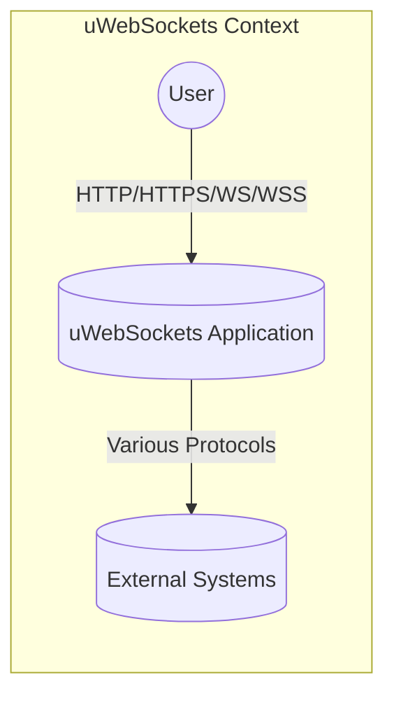
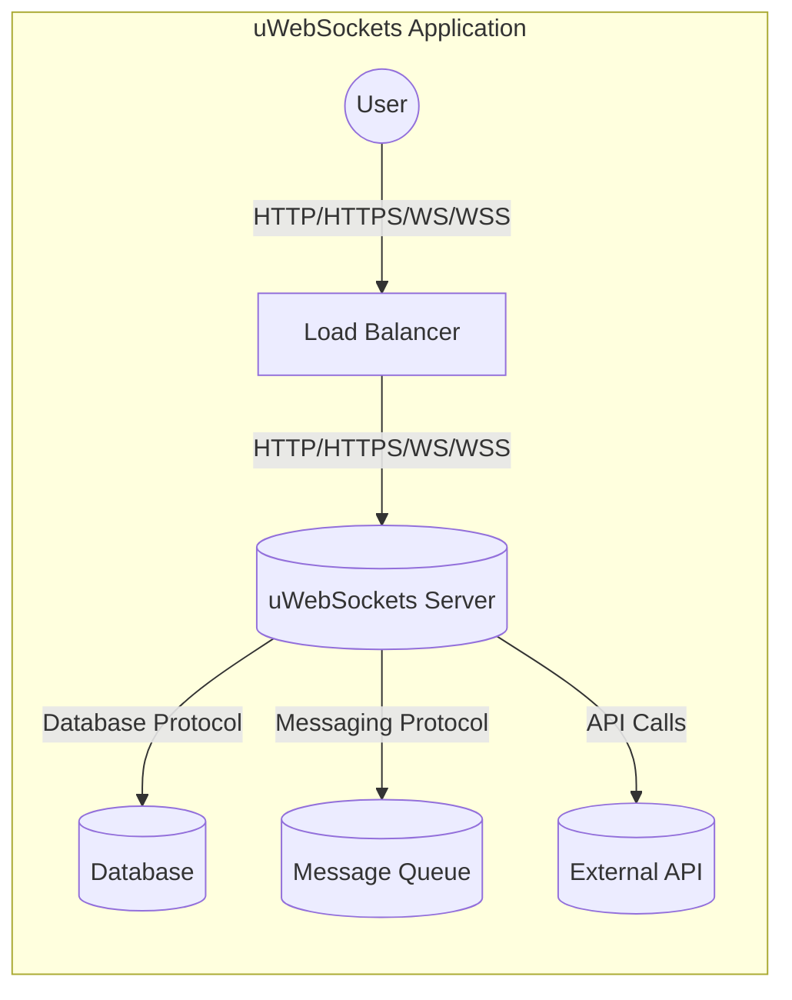
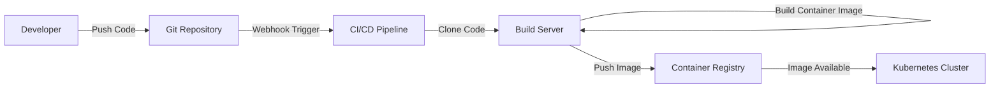

Okay, let's create a design document for the uWebSockets project.

# BUSINESS POSTURE

uWebSockets is a widely used, high-performance WebSocket and HTTP server/client library.  It's designed for resource-constrained environments and prioritizes speed and efficiency over extensive feature sets.  It's often used as a foundational component in applications requiring real-time communication, such as online gaming, financial trading platforms, and collaborative applications.

Priorities:

*   Performance:  Minimize latency and maximize throughput for WebSocket and HTTP communication.
*   Efficiency:  Reduce CPU and memory usage, allowing for high connection density on limited hardware.
*   Reliability:  Maintain stable connections and handle network disruptions gracefully.
*   Security: Protect against common web vulnerabilities and ensure data integrity and confidentiality.
*   Ease of Use (secondary): Provide a relatively straightforward API for developers, although performance is prioritized over absolute simplicity.

Goals:

*   Provide a highly performant alternative to other WebSocket and HTTP libraries.
*   Enable developers to build scalable real-time applications.
*   Serve as a reliable foundation for performance-critical systems.

Business Risks:

*   Vulnerabilities leading to denial-of-service (DoS) attacks: Given its focus on performance, vulnerabilities that allow attackers to consume excessive resources or crash the server are a major risk.
*   Data breaches:  If used in applications handling sensitive data, vulnerabilities that expose or allow modification of data in transit or at rest are critical.
*   Compromise of dependent systems: As a foundational component, a vulnerability in uWebSockets could be exploited to compromise the entire application built upon it.
*   Reputation damage:  Security incidents could damage the reputation of the library and any projects that rely on it.
*   Loss of competitive advantage: If other libraries offer better security with comparable performance, users may migrate away.

# SECURITY POSTURE

Existing Security Controls:

*   security control: Fuzzing: The project uses continuous fuzzing with OSS-Fuzz (mentioned in the README and build system). This helps identify potential memory corruption bugs and other vulnerabilities.
*   security control: AddressSanitizer (ASan): Used during testing to detect memory errors like buffer overflows and use-after-free vulnerabilities.
*   security control: MemorySanitizer (MSan): Used to detect use of uninitialized memory.
*   security control: UndefinedBehaviorSanitizer (UBSan): Detects undefined behavior in C/C++ code.
*   security control: Static Analysis: The project mentions using static analysis tools, although the specific tools are not detailed in the provided information.
*   security control: Regular Updates: The project appears to be actively maintained, with regular updates and bug fixes, which is crucial for addressing newly discovered vulnerabilities.
*   security control: SSL/TLS Support: uWebSockets supports SSL/TLS for secure communication (wss:// and https://), leveraging OpenSSL or other compatible libraries. This is described in documentation.
*   security control: HTTP/2 and HTTP/3 support: uWebSockets supports modern HTTP protocols.

Accepted Risks:

*   accepted risk: Dependency on external libraries: uWebSockets relies on external libraries like OpenSSL, Libuv, and zlib. Vulnerabilities in these dependencies could impact the security of uWebSockets.
*   accepted risk: Complexity of C/C++: The use of C/C++ introduces inherent risks related to memory management and potential buffer overflows, despite mitigation efforts.
*   accepted risk: Limited built-in input validation: While some input validation is likely present, the library's focus on performance may mean that extensive validation is left to the application layer.

Recommended Security Controls:

*   Integrate a Software Composition Analysis (SCA) tool: To automatically identify and track vulnerabilities in dependencies like OpenSSL, Libuv, and zlib.
*   Implement Content Security Policy (CSP) and other HTTP security headers: Provide guidance and examples for using these headers to mitigate XSS and other web-based attacks.
*   Provide specific guidance on secure WebSocket usage: Including recommendations for authentication, authorization, and input validation within WebSocket message handlers.
*   Consider a bug bounty program: To incentivize external security researchers to find and report vulnerabilities.

Security Requirements:

*   Authentication:
    *   The library should support standard authentication mechanisms for HTTP and WebSocket connections (e.g., HTTP Basic Auth, Bearer Tokens, cookies).
    *   Integration with external authentication providers (e.g., OAuth 2.0, OpenID Connect) should be possible, though likely handled at the application level.
    *   Provide examples and best practices for secure session management.

*   Authorization:
    *   The library should allow developers to implement authorization checks to control access to specific resources or endpoints.
    *   Support for role-based access control (RBAC) or attribute-based access control (ABAC) should be considered, potentially through callbacks or hooks.

*   Input Validation:
    *   The library should perform basic validation of WebSocket and HTTP protocol elements (e.g., headers, URLs).
    *   Provide clear guidance and helper functions for validating user-supplied data within WebSocket messages and HTTP requests.
    *   Encourage the use of parameterized queries or prepared statements when interacting with databases to prevent SQL injection.

*   Cryptography:
    *   Ensure that SSL/TLS is correctly configured by default, with strong cipher suites and protocols.
    *   Provide options for customizing SSL/TLS settings to meet specific security requirements.
    *   Use cryptographically secure random number generators for all security-sensitive operations.
    *   Provide guidance on securely storing and managing cryptographic keys.

# DESIGN

## C4 CONTEXT



Element Descriptions:

*   Element: User
    *   Name: User
    *   Type: Person
    *   Description: Represents a user interacting with the uWebSockets application via a web browser or other client.
    *   Responsibilities: Initiates connections, sends requests, and receives responses.
    *   Security Controls: Browser security features (e.g., same-origin policy, CSP), TLS/SSL (if using HTTPS/WSS).

*   Element: uWebSockets Application
    *   Name: uWebSockets Application
    *   Type: Software System
    *   Description: The application built using the uWebSockets library.
    *   Responsibilities: Handles HTTP and WebSocket connections, processes requests, interacts with external systems, and sends responses to users.
    *   Security Controls: Input validation, authentication, authorization, secure communication (TLS/SSL), protection against common web vulnerabilities.

*   Element: External Systems
    *   Name: External Systems
    *   Type: Software System
    *   Description: Represents external systems that the uWebSockets application interacts with, such as databases, message queues, or other APIs.
    *   Responsibilities: Varies depending on the specific system.
    *   Security Controls: Dependent on the specific system; should include appropriate security measures for the type of interaction.

## C4 CONTAINER



Element Descriptions:

*   Element: Load Balancer
    *   Name: Load Balancer
    *   Type: Container
    *   Description: Distributes incoming traffic across multiple instances of the uWebSockets server.
    *   Responsibilities: Health checks, traffic routing, SSL/TLS termination (optional).
    *   Security Controls: DDoS protection, SSL/TLS configuration, access control lists.

*   Element: uWebSockets Server
    *   Name: uWebSockets Server
    *   Type: Container: uWebSockets
    *   Description: An instance of the application running the uWebSockets library.
    *   Responsibilities: Handles HTTP and WebSocket connections, processes requests, interacts with internal and external services.
    *   Security Controls: Input validation, authentication, authorization, secure communication (TLS/SSL), application-specific security logic.

*   Element: Database
    *   Name: Database
    *   Type: Container: Database
    *   Description: Stores persistent data for the application.
    *   Responsibilities: Data storage, retrieval, and management.
    *   Security Controls: Access control, encryption at rest, encryption in transit, auditing.

*   Element: Message Queue
    *   Name: Message Queue
    *   Type: Container: Message Queue
    *   Description: Provides asynchronous communication between different parts of the application or with external systems.
    *   Responsibilities: Message queuing, delivery, and persistence.
    *   Security Controls: Access control, message encryption, authentication.

*   Element: External API
    *   Name: External API
    *   Type: Container: External System
    *   Description: An external service that the uWebSockets application interacts with.
    *   Responsibilities: Varies depending on the specific API.
    *   Security Controls: Dependent on the specific API; should include appropriate security measures for the type of interaction.

## DEPLOYMENT

Possible Deployment Solutions:

1.  Bare Metal/Virtual Machines: Deploying directly onto servers.
2.  Containers (Docker): Packaging the application and its dependencies into a container.
3.  Kubernetes: Orchestrating multiple container instances for scalability and resilience.
4.  Serverless (less likely, but possible with adaptations): Using serverless functions to handle specific WebSocket events.

Chosen Solution (Kubernetes):

```mermaid
graph LR
    subgraph Kubernetes Cluster
        Internet((Internet)) -- Ingress --> IngressController[Ingress Controller]
        IngressController -- HTTP/HTTPS/WS/WSS --> Service[Service]
        Service -- HTTP/HTTPS/WS/WSS --> Pod1[Pod (uWebSockets Server)]
        Service -- HTTP/HTTPS/WS/WSS --> Pod2[Pod (uWebSockets Server)]
        Service -- HTTP/HTTPS/WS/WSS --> PodN[Pod (uWebSockets Server)]
        Pod1 -- "Database Protocol" --> Database[(Database - External)]
        Pod1 -- "Messaging Protocol" --> MessageQueue[(Message Queue - External)]
    end
```

Element Descriptions:

*   Element: Internet
    *   Name: Internet
    *   Type: Node
    *   Description: The public internet.
    *   Responsibilities: Source of incoming traffic.
    *   Security Controls: Firewall, DDoS protection.

*   Element: Ingress Controller
    *   Name: Ingress Controller
    *   Type: Node
    *   Description: Manages external access to the services within the Kubernetes cluster.
    *   Responsibilities: Routing traffic, SSL/TLS termination.
    *   Security Controls: SSL/TLS configuration, access control rules, web application firewall (WAF).

*   Element: Service
    *   Name: Service
    *   Type: Node
    *   Description: A Kubernetes abstraction that provides a stable endpoint for accessing a set of pods.
    *   Responsibilities: Load balancing traffic across pods.
    *   Security Controls: Network policies.

*   Element: Pod (uWebSockets Server)
    *   Name: Pod (uWebSockets Server)
    *   Type: Node
    *   Description: A Kubernetes pod running a container with the uWebSockets server application.
    *   Responsibilities: Handling HTTP and WebSocket connections, processing requests.
    *   Security Controls: Container security context, network policies, resource limits.

*   Element: Database (External)
    *   Name: Database (External)
    *   Type: Node
    *   Description: An external database service (e.g., managed database offering from a cloud provider).
    *   Responsibilities: Data storage and retrieval.
    *   Security Controls: Managed by the database provider; should include access control, encryption, and auditing.

*   Element: Message Queue (External)
    *   Name: Message Queue (External)
    *   Type: Node
    *   Description: An external message queue service (e.g., managed message queue offering from a cloud provider).
    *   Responsibilities: Message queuing and delivery.
    *   Security Controls: Managed by the message queue provider; should include access control, encryption, and authentication.

## BUILD



Build Process Description:

1.  Developer pushes code changes to the Git repository (e.g., GitHub).
2.  A webhook triggers the CI/CD pipeline (e.g., GitHub Actions, Jenkins).
3.  The build server clones the code from the repository.
4.  The code is compiled and linked using the appropriate build tools (e.g., CMake, Make).
5.  Static analysis tools (e.g., clang-tidy, Coverity) are run to identify potential code quality and security issues.
6.  Unit tests are executed to verify the functionality of individual components.
7.  Fuzz tests (using OSS-Fuzz or similar) are run to identify potential vulnerabilities.
8.  A container image is built, packaging the compiled application and its dependencies.
9.  The container image is pushed to a container registry (e.g., Docker Hub, Google Container Registry).
10. The Kubernetes cluster can then pull and deploy the new image.

Security Controls:

*   security control: Static Analysis: Performed during the build process to identify potential vulnerabilities.
*   security control: Fuzzing: Continuous fuzzing with OSS-Fuzz helps identify memory corruption bugs and other vulnerabilities.
*   security control: Software Composition Analysis (SCA): (Recommended) Should be integrated into the build process to identify vulnerabilities in dependencies.
*   security control: Container Image Scanning: (Recommended) The container registry should scan images for known vulnerabilities before deployment.
*   security control: Signed Commits: (Recommended) Developers should sign their commits to ensure the integrity of the codebase.
*   security control: Least Privilege: Build server and CI/CD pipeline should operate with the least necessary privileges.

# RISK ASSESSMENT

Critical Business Processes:

*   Real-time communication: The core functionality of uWebSockets is to enable real-time communication between clients and servers.  Disruption of this process would directly impact applications relying on this functionality.
*   Data transmission:  uWebSockets handles the transmission of data, which may be sensitive or critical to the application's operation.

Data Sensitivity:

*   The data handled by uWebSockets can vary greatly in sensitivity depending on the application.
*   It could range from non-sensitive public data to highly confidential information like financial transactions, personal data, or trade secrets.
*   Applications using uWebSockets should classify their data and implement appropriate security measures based on the sensitivity level.

# QUESTIONS & ASSUMPTIONS

Questions:

*   What specific static analysis tools are currently used?
*   What are the specific procedures for handling security vulnerabilities reported by external researchers or users?
*   Are there any existing penetration testing reports or security audits?
*   What are the specific requirements for compliance with relevant regulations (e.g., GDPR, HIPAA)?
*   What level of logging and monitoring is implemented, and how are security-relevant events handled?
*   What is the process for managing and rotating cryptographic keys used for TLS/SSL?

Assumptions:

*   BUSINESS POSTURE: The primary concern is performance and efficiency, with security being a critical but secondary consideration.
*   SECURITY POSTURE: Developers using uWebSockets are expected to have a reasonable understanding of security best practices and will implement application-level security controls.
*   DESIGN: The library is used in a variety of deployment environments, including cloud-based and on-premise setups. The provided deployment diagram is a representative example, and specific configurations may vary. The build process is automated, and security checks are integrated into the CI/CD pipeline.