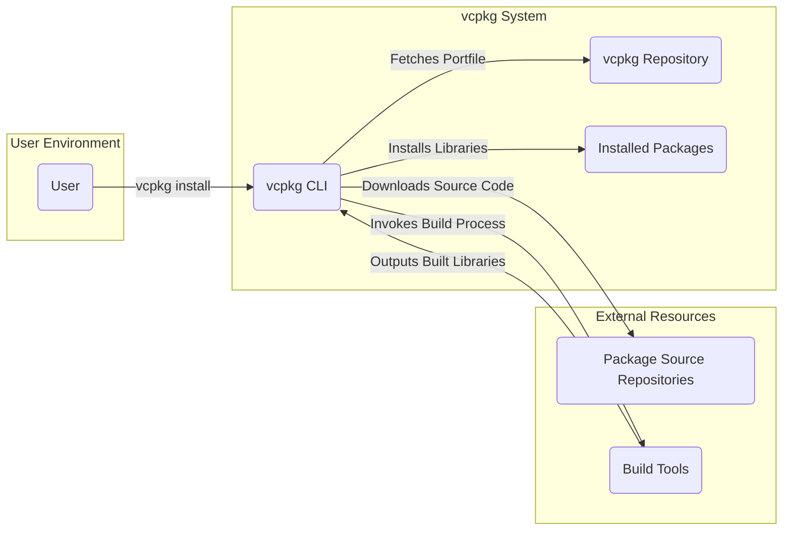
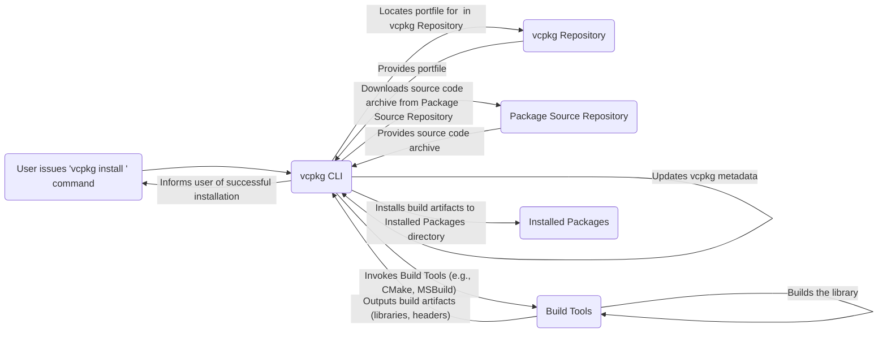

# Project Design Document: vcpkg

**Version:** 1.1
**Date:** October 26, 2023
**Prepared By:** AI Software Architect

## 1. Introduction

This document provides a detailed design overview of the vcpkg project, a free C/C++ package manager for acquiring and managing libraries. This document is intended to serve as a foundation for subsequent threat modeling activities. It outlines the key components, data flows, and interactions within the vcpkg ecosystem.

## 2. Goals

The primary goals of vcpkg are to:

* Provide a simple and consistent way to acquire and manage C/C++ libraries on Windows, Linux, and macOS.
* Enable reproducible builds by managing dependencies and their versions.
* Support a wide range of libraries and build systems.
* Allow users to easily contribute new libraries and updates.
* Be open-source and community-driven.

## 3. Scope

This design document focuses on the core functionality of vcpkg, including:

* The vcpkg command-line interface (CLI).
* The vcpkg repository structure (ports and triplets).
* The process of installing, updating, and removing packages.
* Interaction with external resources (e.g., GitHub, source code repositories).
* The build process for packages.
* The concept of manifests and dependency resolution.

This document does not cover:

* The internal implementation details of specific build systems (e.g., CMake, MSBuild).
* The detailed implementation of the vcpkg library itself.
* Specific details of individual port implementations.
* The vcpkg documentation website.

## 4. High-Level Architecture

The vcpkg system can be broadly understood through the interaction of the following key actors and components:

* **User:** Interacts with vcpkg through the CLI.
* **vcpkg CLI:** The command-line interface used to manage packages.
* **vcpkg Repository:** A Git repository containing portfiles (recipes for building packages) and metadata.
* **Package Source Repositories:** External repositories (e.g., GitHub, GitLab) where the source code of libraries is hosted.
* **Build Tools:**  Compilers, linkers, and other tools required to build packages (e.g., CMake, MSBuild).
* **Installed Packages:** The directory where built libraries and headers are stored.

## 5. Detailed Component Description

### 5.1. vcpkg CLI

* **Functionality:** The primary interface for users to interact with vcpkg. It handles commands for installing, removing, updating, and searching for packages. It also manages the vcpkg environment and configuration.
* **Key Responsibilities:**
    * Parsing user commands.
    * Interacting with the vcpkg repository.
    * Downloading source code.
    * Invoking build tools.
    * Managing installed packages.
    * Handling error conditions.
* **Implementation:** Primarily implemented in C++.

### 5.2. vcpkg Repository

* **Functionality:** A Git repository that stores the recipes (portfiles) for building and installing packages. It also contains metadata about available packages and their dependencies.
* **Key Responsibilities:**
    * Providing a central source of truth for available packages.
    * Defining the steps required to build each package.
    * Specifying dependencies between packages.
    * Managing different versions of packages.
* **Structure:** Organized into directories for ports and triplets.
    * **Ports:** Contain the portfile (e.g., `portfile.cmake`) and any necessary patches for a specific library.
    * **Triplets:** Define the target architecture, operating system, and compiler settings (e.g., `x64-windows`, `x64-linux`).

### 5.3. Installed Packages

* **Functionality:** The directory on the user's system where the built libraries (headers, static libraries, dynamic libraries) are installed.
* **Key Responsibilities:**
    * Providing a location for build systems to find installed libraries.
    * Organizing installed packages based on target triplet.
* **Structure:** Typically organized under a `packages` directory within the vcpkg installation, with subdirectories for each triplet and package.

### 5.4. Package Source Repositories

* **Functionality:** External repositories (often hosted on platforms like GitHub or GitLab) where the source code of the libraries managed by vcpkg is located.
* **Key Responsibilities:**
    * Hosting the source code of the libraries.
    * Providing access to different versions of the source code (e.g., through Git tags or branches).
* **Interaction:** vcpkg CLI downloads source code archives (e.g., ZIP files, tarballs) from these repositories based on information in the portfile.

### 5.5. Build Tools

* **Functionality:** The compilers, linkers, and other tools necessary to build the libraries from source code. Examples include CMake, MSBuild, GCC, Clang.
* **Key Responsibilities:**
    * Compiling source code into object files.
    * Linking object files into libraries.
    * Generating necessary build artifacts.
* **Interaction:** vcpkg CLI invokes these tools based on the instructions in the portfile.

## 6. Data Flow Diagram

The following diagram illustrates the typical data flow during the installation of a package using vcpkg:

## 7. Key Data Flows

The following are key data flows within the vcpkg system:

* **User Command to vcpkg CLI:** The user provides commands (e.g., `install`, `remove`, `update`) to the vcpkg CLI. This data includes the desired action and the target package name.
* **vcpkg CLI to vcpkg Repository:** The CLI fetches portfiles and metadata from the vcpkg repository. This data includes portfile contents, dependency information, and available versions.
* **vcpkg CLI to Package Source Repositories:** The CLI downloads source code archives from external repositories. This data includes compressed source code files (e.g., ZIP, tar.gz).
* **Portfile to Build Tools:** The portfile provides instructions to the build tools on how to configure and build the package. This data includes CMakeLists.txt content, build scripts, and compiler flags.
* **Build Tools to Installed Packages:** The build tools output the compiled libraries and headers to the vcpkg installation directory. This data includes binary files (e.g., `.lib`, `.dll`, `.so`, `.dylib`) and header files (`.h`).
* **vcpkg CLI to Installed Packages:** The CLI manages the files within the installed packages directory, adding, removing, and updating libraries.

## 8. Security Considerations

This section highlights potential security considerations relevant to vcpkg:

* **Supply Chain Security:**
    * **Compromised vcpkg Repository:** If the vcpkg repository is compromised, malicious portfiles could be introduced, leading to the installation of backdoored libraries.
    * **Compromised Package Source Repositories:** If a source code repository is compromised, malicious code could be introduced into the libraries.
    * **Man-in-the-Middle Attacks:** During download of portfiles or source code, there's a risk of interception and modification of data.
* **Build Process Security:**
    * **Malicious Build Scripts:** Portfiles might contain malicious scripts that execute arbitrary code during the build process.
    * **Vulnerabilities in Build Tools:** Exploiting vulnerabilities in the build tools themselves could lead to compromised builds.
* **Local Security:**
    * **Privilege Escalation:** Improper handling of permissions during installation could lead to privilege escalation.
    * **Path Traversal:** Vulnerabilities in how vcpkg handles file paths could allow writing to arbitrary locations on the file system.
* **Dependency Confusion:** If a malicious package with the same name as a legitimate internal dependency is introduced, it could be inadvertently installed.

## 9. Deployment Considerations

vcpkg is typically deployed as a local installation on a developer's machine or within a CI/CD environment. Key deployment considerations include:

* **Installation Location:** The location where vcpkg is installed can impact permissions and accessibility.
* **Triplet Configuration:** Correctly configuring triplets is crucial for targeting the desired platform and architecture.
* **Integration with Build Systems:** Ensuring seamless integration with build systems (e.g., CMake toolchain file) is important for usability.
* **CI/CD Integration:** Automating vcpkg usage within CI/CD pipelines requires careful consideration of caching and dependency management.

## 10. Assumptions

The following assumptions are made in this design document:

* The user has a working internet connection to download portfiles and source code.
* The user has the necessary build tools installed on their system.
* The vcpkg repository and package source repositories are generally trusted.

## 11. Out of Scope

As mentioned in Section 3, this document does not cover:

* The internal implementation details of the vcpkg library.
* Specific details of individual port implementations.
* The vcpkg documentation website.
* Advanced features like overlays or registries.

## 12. Future Considerations

Potential future enhancements that could impact the design and security of vcpkg include:

* **Enhanced Verification of Source Code:** Implementing mechanisms to verify the integrity and authenticity of downloaded source code (e.g., using checksums or digital signatures).
* **Sandboxing the Build Process:** Isolating the build process to limit the potential impact of malicious build scripts.
* **Improved Dependency Resolution:** Implementing more sophisticated algorithms for resolving dependency conflicts.
* **Support for Binary Caching:** Caching pre-built binaries to speed up installation times.

This document provides a comprehensive overview of the vcpkg project's design, laying the groundwork for effective threat modeling. By understanding the components, data flows, and potential security considerations, stakeholders can better assess and mitigate risks associated with using vcpkg.
