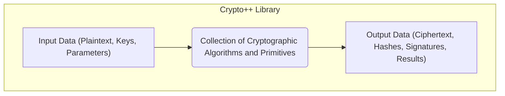
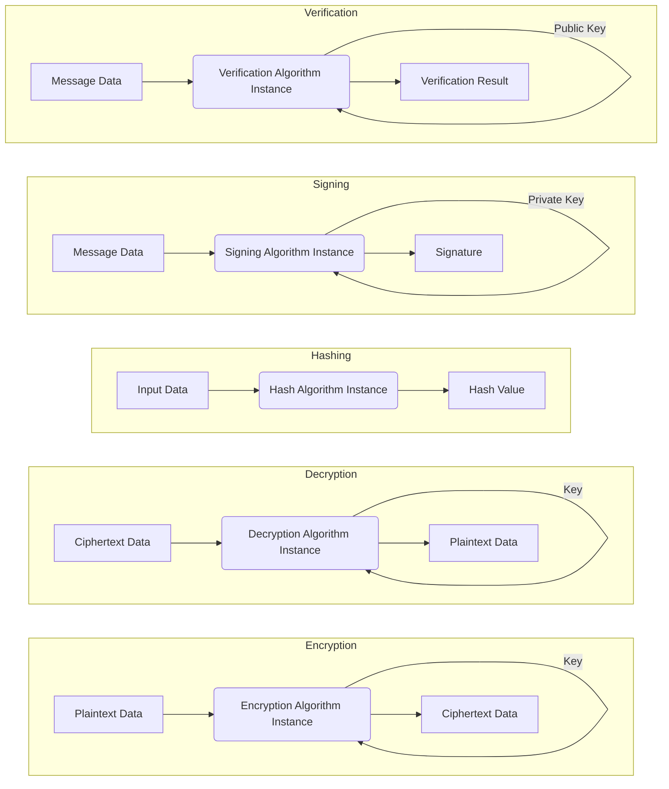

# Project Design Document: Crypto++ Library

**Project Link:** https://github.com/weidai11/cryptopp

**Version:** 1.1
**Date:** October 26, 2023
**Author:** Gemini (AI Language Model)

## 1. Introduction

This document provides an enhanced design overview of the Crypto++ library, a widely-used collection of cryptographic algorithms and primitives implemented in C++. It details the library's architecture, core components, data flow patterns, and underlying technologies. This refined document serves as a robust foundation for subsequent threat modeling exercises.

## 2. Goals and Objectives

The overarching goal of the Crypto++ library is to empower developers with a reliable and performant suite of cryptographic tools. Key objectives include:

* **Robust Security:**  Providing correct and secure implementations of cryptographic primitives to safeguard sensitive information.
* **High Performance:** Offering efficient implementations of cryptographic algorithms suitable for various application needs.
* **Cross-Platform Compatibility:** Ensuring the library can be compiled and executed across a diverse range of operating systems and hardware architectures.
* **Extensible Framework:**  Designing the library to facilitate the integration of new cryptographic algorithms and functionalities.
* **Developer-Friendly API:**  Offering a well-documented and intuitive Application Programming Interface (API) to simplify cryptographic integration for developers.

## 3. Scope

This design document comprehensively covers the architectural and functional aspects of the Crypto++ library as represented in the specified GitHub repository. This includes:

* The comprehensive set of cryptographic algorithms and foundational primitives.
* The library's public API, including classes, functions, and interfaces.
* The standard build process and its associated dependencies.
* Common and illustrative usage patterns demonstrating library functionality.

This document explicitly excludes:

* Specific applications or software projects that utilize the Crypto++ library.
* Detailed and granular performance benchmarks or comparisons against other libraries.
* The historical development timeline, specific version changes, or patch histories of the library.

## 4. Target Users

The primary audience for the Crypto++ library consists of software developers requiring cryptographic capabilities within their applications. This encompasses developers working on:

* Applications demanding strong security measures.
* Network communication protocols and security layers.
* Secure data storage and management systems.
* Resource-constrained embedded systems requiring cryptography.

## 5. High-Level Architecture

The Crypto++ library is predominantly a header-only C++ library, meaning its core functionality is implemented within header files. This design choice simplifies integration into projects. The library employs an object-oriented approach, encapsulating various cryptographic algorithms and functionalities within distinct classes and namespaces.

**Key architectural characteristics:**

* **Predominantly Header-Only:**  The core of the library resides in header files, facilitating easy inclusion in projects without complex linking procedures in many cases. Platform-specific assembly optimizations may exist in separate compilation units.
* **Modular Organization:**  Cryptographic algorithms are organized into logical modules and namespaces, enhancing maintainability and reducing naming conflicts.
* **Abstraction through Classes:**  Cryptographic functionalities are exposed through well-defined C++ classes, providing an abstraction layer over the underlying mathematical operations. This allows developers to interact with cryptographic operations at a higher level.
* **Policy-Based Design for Flexibility:**  The library utilizes policy-based design patterns, allowing customization of certain algorithm behaviors or underlying types (e.g., integer types for public-key cryptography) without modifying the core algorithm implementation. This promotes flexibility and adaptability.
* **Extensible Interface Design:** The architecture is designed to allow the addition of new cryptographic algorithms and functionalities relatively easily, adhering to established interfaces and patterns within the library.

## 6. Key Components

The Crypto++ library encompasses a wide array of cryptographic components, broadly categorized as follows:

* **Symmetric-Key Cryptography:**
    * **Block Ciphers:**  Implementations of algorithms like "AES", "DES", "Triple-DES", "Blowfish", "Camellia", etc.
    * **Stream Ciphers:** Implementations of algorithms like "Salsa20", "ChaCha20", "RC4".
    * **Block Cipher Modes of Operation:** Implementations of modes like "CBC", "ECB", "CTR", "GCM", "CCM", used with block ciphers.
* **Cryptographic Hash Functions:** Implementations of algorithms like "SHA-1", "SHA-256", "SHA-512", "SHA-3", "BLAKE2", "RIPEMD".
* **Message Authentication Codes (MACs):**
    * **HMAC (Hash-based MAC):**  Implementations using various hash functions.
    * **CMAC (Cipher-based MAC):** Implementations using block ciphers.
    * "Poly1305" MAC.
* **Public-Key Cryptography:**
    * **RSA:** Implementation of the RSA algorithm for encryption and digital signatures.
    * **DSA (Digital Signature Algorithm):** Implementation of the DSA algorithm for digital signatures.
    * **ECDSA (Elliptic Curve Digital Signature Algorithm):** Implementation of ECDSA for digital signatures.
    * **Diffie-Hellman:** Implementation of the Diffie-Hellman key exchange protocol.
    * **Elliptic-Curve Diffie-Hellman (ECDH):** Implementation of ECDH key exchange.
    * **Public-Key Encryption Schemes:**  Implementations of schemes like "PKCS#1 v1.5 padding" and "OAEP".
* **Authenticated Encryption with Associated Data (AEAD):** Implementations of combined encryption and authentication algorithms like "AES-GCM", "ChaCha20-Poly1305", "CCM".
* **Random Number Generation:**
    * Cryptographically secure pseudo-random number generators (CSPRNGs).
    * Interfaces for accessing system-provided random number sources.
* **Encoding and Decoding:**
    * "Base64" encoding and decoding.
    * "Hexadecimal" encoding and decoding.
    * "PEM (Privacy Enhanced Mail)" encoding and decoding.
* **Integer Arithmetic:** Classes for performing arbitrary-precision integer arithmetic, essential for public-key cryptography.
* **Buffered Transformation Framework:** A flexible mechanism for processing data through a series of cryptographic transformations in a streaming or chunked manner.

## 7. Data Flow

Data flow within the Crypto++ library involves passing data through instances of cryptographic algorithm classes. The specific flow depends on the cryptographic operation being performed.

**Key aspects of data flow:**

* **Algorithm Object Instantiation:** Developers create instances of specific algorithm classes (e.g., `AESEncryption`, `SHA256`) to perform cryptographic operations.
* **Key Material Input:**  Cryptographic keys are typically provided as input to the algorithm instances, either during construction or through dedicated setter methods.
* **Data Processing:** Input data is fed into the algorithm object, which performs the cryptographic transformation according to its defined logic.
* **Output Generation:** The algorithm produces the corresponding output (ciphertext, hash, signature, etc.).
* **Buffered Processing:** The `BufferedTransformation` framework allows for processing data in chunks, which is useful for handling large files or streaming data.

## 8. Technology Stack

The Crypto++ library is built upon the following core technologies:

* **C++ Programming Language (Primarily C++03 with some later features):** The primary implementation language.
* **Standard Template Library (STL):**  Extensively used for data structures, algorithms, and utilities.
* **Compiler-Specific Intrinsics and Assembly Language (Optional):**  Utilized for performance optimizations on specific platforms and architectures.
* **Build Systems (Primarily Makefiles, with some CMake support):** Used for compiling and building the library across different platforms.

## 9. Security Considerations (Detailed)

Security is paramount for a cryptographic library. Key security considerations for Crypto++ include:

* **Correctness of Algorithm Implementations:**  The security of the library hinges on the accurate and bug-free implementation of cryptographic algorithms. Flaws can lead to vulnerabilities exploitable by attackers.
* **Resistance to Side-Channel Attacks:**  Implementations should be designed to mitigate side-channel attacks (e.g., timing attacks, power analysis) that could leak sensitive information.
* **Secure Random Number Generation:**  The quality and unpredictability of the random number generator are critical for key generation and other cryptographic operations. Weak RNG can compromise security.
* **Memory Safety:**  As a C++ library, careful memory management is essential to prevent vulnerabilities like buffer overflows, use-after-free errors, and other memory corruption issues.
* **Key Management Practices:** While the library provides tools for key generation, the secure storage, handling, and lifecycle management of keys are the responsibility of the application using the library.
* **Resistance to Fault Injection Attacks:**  In certain environments, resistance to fault injection attacks might be a concern.
* **Protection Against Implementation-Specific Vulnerabilities:**  Bugs in the library's infrastructure code (e.g., integer handling, memory allocation) could introduce vulnerabilities.
* **Secure Defaults:**  The library should provide secure default settings and configurations to minimize the risk of misuse by developers.
* **Regular Security Audits:**  Periodic security audits by independent experts are crucial for identifying and addressing potential vulnerabilities.
* **Vulnerability Disclosure and Patching Process:** A clear process for reporting, acknowledging, and patching security vulnerabilities is essential.

## 10. Deployment Model

The Crypto++ library is typically deployed in the following ways:

* **Header Inclusion:** Developers include the necessary header files directly into their C++ projects. This is the most common deployment method due to the header-only nature of much of the library.
* **Static Linking:**  The library can be compiled into a static library (`.lib` on Windows, `.a` on Linux/macOS) and linked directly into the application executable.
* **Dynamic Linking (Shared Library):** The library can be built as a shared library (`.dll` on Windows, `.so` on Linux, `.dylib` on macOS) and loaded at runtime by the application. This can reduce the size of the executable and allow for easier updates.
* **Source Code Distribution:** The library is often distributed as source code, allowing users to compile it themselves for their specific target platforms and compiler configurations.

## 11. Assumptions and Constraints

The design and usage of the Crypto++ library are based on the following assumptions and constraints:

* **Developers Possess Cryptographic Knowledge:** It is assumed that developers using the library have a foundational understanding of cryptographic principles and best practices.
* **Secure Usage by Developers is Critical:** The security of applications utilizing Crypto++ heavily relies on developers using the library's API correctly and securely. Misuse can introduce vulnerabilities.
* **Platform Dependencies May Exist:** While designed for portability, some platform-specific optimizations or build configurations might be necessary or available.
* **Reliance on Underlying System Security:** The security of the library can be influenced by the security of the underlying operating system, compiler, and hardware.
* **No Built-in Secure Key Storage:** The library itself does not provide mechanisms for secure key storage. This is the responsibility of the application developer.

## 12. Future Considerations

Potential future enhancements and considerations for the Crypto++ library include:

* **Adoption of Modern C++ Standards (C++11/14/17/20):**  Leveraging features from newer C++ standards to improve code clarity, safety, and performance.
* **Enhanced Documentation and Examples:**  Providing even more comprehensive and user-friendly documentation and illustrative code examples.
* **Formal Verification Efforts:** Exploring the application of formal verification techniques to mathematically prove the correctness of critical cryptographic implementations.
* **Improved Hardware Acceleration Support:**  Further integration with hardware acceleration features provided by modern processors for cryptographic operations.
* **Support for Emerging Cryptographic Standards and Algorithms:**  Adding implementations of newly standardized and relevant cryptographic algorithms and protocols.
* **Refactoring for Improved Security and Maintainability:** Continuously reviewing and refactoring the codebase to enhance security and ease of maintenance.

This improved design document provides a more comprehensive and detailed understanding of the Crypto++ library's architecture, components, and security considerations, making it a more effective resource for threat modeling activities.