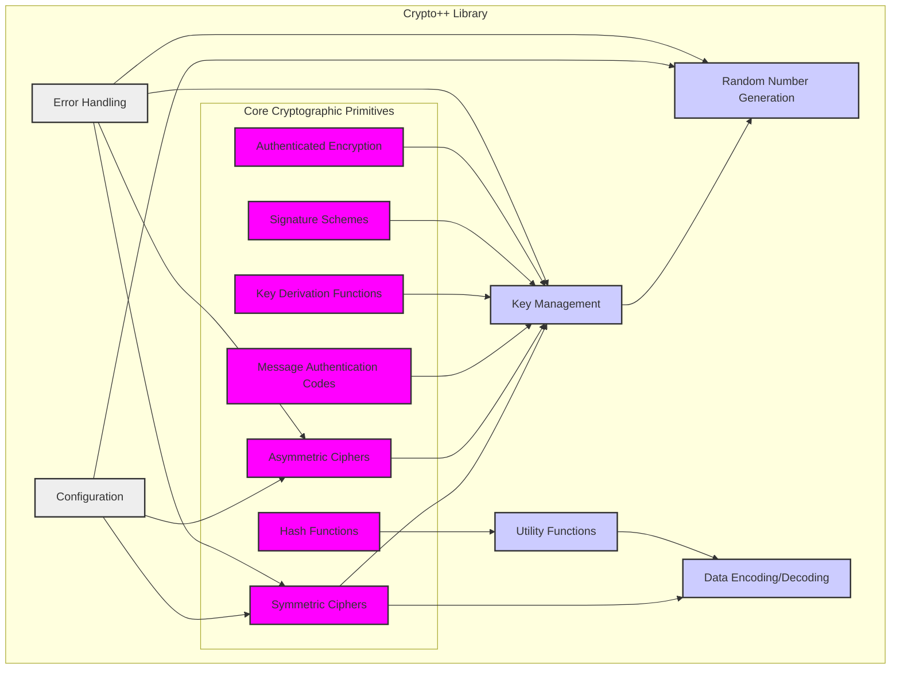
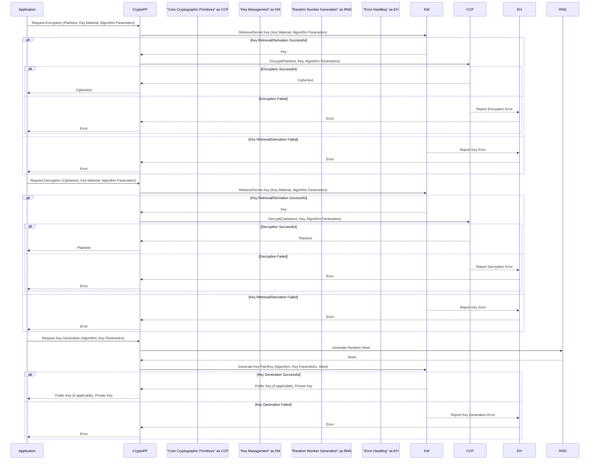

# Project Design Document: Crypto++ Library

**Version:** 1.1
**Date:** October 26, 2023
**Author:** AI Software Architect

## 1. Introduction

This document provides an enhanced and more detailed design overview of the Crypto++ library (as represented by the GitHub repository: https://github.com/weidai11/cryptopp). Building upon the previous version, this document aims to provide an even stronger foundation for subsequent threat modeling activities. It further elaborates on the key components, architecture, data flow, and external interfaces of the library, incorporating more granular details.

## 2. Goals

*   Provide a comprehensive and granular architectural overview of the Crypto++ library.
*   Identify key components and their specific interactions with greater detail.
*   Describe the data flow within the library during various cryptographic operations, including error handling and configuration.
*   Outline the external interfaces and dependencies of the library with specific examples.
*   Establish a clear and detailed understanding of the system for effective and targeted threat modeling.

## 3. Overview

Crypto++ is a widely-used, free C++ class library providing a rich set of cryptographic primitives. Its design emphasizes performance, flexibility, and adherence to cryptographic standards. Key features include:

*   A broad range of symmetric and asymmetric encryption algorithms.
*   Comprehensive support for cryptographic hash functions.
*   Implementations of various message authentication codes (MACs).
*   Key agreement and key derivation function (KDF) support.
*   Robust random number generation capabilities.
*   Utilities for data encoding and decoding (Base64, Hex, etc.).
*   A modular design allowing for selective inclusion of components.
*   Extensive test suites for ensuring correctness.
*   Configuration options to tailor the library's behavior.

The library's architecture allows developers to integrate specific cryptographic functionalities into their C++ applications with fine-grained control. Many components are header-only, simplifying integration for common use cases.

## 4. System Architecture

The Crypto++ library maintains a modular design, with distinct components handling specific cryptographic tasks. The architecture can be visualized with a more detailed breakdown of the core primitives:

### 4.1. Key Components

*   **Core Cryptographic Primitives:** This component is further subdivided into specific categories of cryptographic algorithms.
    *   **Symmetric Ciphers:** Implementations of block ciphers (e.g., "AES", "DES", "TripleDES", "Blowfish", "Camellia", "ChaCha20") and stream ciphers.
    *   **Asymmetric Ciphers:** Implementations of public-key cryptography algorithms (e.g., "RSA", "ECC" (various curves like "secp256r1", "Curve25519"), "DSA", "ElGamal").
    *   **Hash Functions:** Implementations of cryptographic hash algorithms (e.g., "SHA-1", "SHA-256", "SHA-3", "Blake2s", "Blake2b", "MD5").
    *   **Message Authentication Codes (MACs):** Implementations of algorithms for verifying data integrity and authenticity (e.g., "HMAC" (with various hash functions), "CMAC", "Poly1305").
    *   **Key Derivation Functions (KDFs):** Implementations of functions for deriving cryptographic keys from secrets (e.g., "HKDF", "PBKDF1", "PBKDF2").
    *   **Signature Schemes:** Implementations of algorithms for digitally signing data (e.g., "ECDSA", "RSASSA-PKCS1v15", "RSASSA-PSS", "EdDSA").
    *   **Authenticated Encryption with Associated Data (AEAD):** Implementations of algorithms providing both confidentiality and integrity (e.g., "AES/GCM/NoPadding", "ChaCha20/Poly1305/NoPadding").

*   **Key Management:** This component handles the lifecycle of cryptographic keys.
    *   Key generation routines for symmetric and asymmetric algorithms, often relying on the Random Number Generation component.
    *   Key agreement protocol implementations (e.g., "Diffie-Hellman", "ECDH").
    *   Mechanisms for encoding and decoding keys in various formats (e.g., "PEM", "DER").
    *   In-memory representation and manipulation of keys. *Note: Crypto++ primarily manages keys in memory. Secure storage outside of the application's memory space is the responsibility of the integrating application.*

*   **Random Number Generation:** This component provides cryptographically secure random numbers essential for key generation and other security-sensitive operations.
    *   Multiple Random Number Generator (RNG) implementations, including:
        *   Operating System provided RNGs (e.g., accessing `/dev/urandom` on Unix-like systems or using `CryptGenRandom` on Windows).
        *   Hardware RNG interfaces (if available and configured).
        *   Pseudo-Random Number Generators (PRNGs) seeded with high-entropy sources.
    *   Mechanisms for seeding RNGs with entropy from various sources.

*   **Data Encoding/Decoding:** This component facilitates the conversion of data between different representations.
    *   "Base64" encoding and decoding.
    *   "Hexadecimal" encoding and decoding.
    *   Other encoding schemes like "BER" and "DER" for ASN.1 structures.

*   **Utility Functions:** This component offers supporting functionalities.
    *   Byte array ("SecByteBlock") and integer ("Integer") manipulation.
    *   Big integer arithmetic required for many cryptographic algorithms.
    *   Timing utilities, potentially used for performance measurements or side-channel attack mitigation.
    *   Exception handling mechanisms for reporting errors.

*   **Configuration:** This component allows for customizing the library's behavior.
    *   Compile-time configuration options (e.g., enabling/disabling specific algorithms).
    *   Runtime configuration settings (though less common).
    *   Mechanisms for selecting specific implementations or providers (e.g., choosing a specific elliptic curve).

*   **Error Handling:** This component manages error conditions within the library.
    *   Exception classes for reporting various types of errors (e.g., invalid key, authentication failure).
    *   Mechanisms for handling and propagating errors to the calling application.

## 5. Data Flow

The data flow within Crypto++ is dictated by the specific cryptographic operation being performed. Let's consider a more detailed encryption/decryption scenario, including potential error handling:

**Detailed Steps in Encryption (with Error Handling):**

1. The application requests encryption, providing plaintext, key material (e.g., a password or existing key), and algorithm parameters.
2. Crypto++ interacts with the Key Management component to retrieve or derive the cryptographic key based on the provided key material and parameters.
3. If key retrieval/derivation is successful, the key is passed to the Core Cryptographic Primitives component along with the plaintext and algorithm parameters.
4. The appropriate encryption algorithm is executed.
5. If encryption is successful, the ciphertext is returned to the application.
6. If either key retrieval/derivation or encryption fails, the Error Handling component is invoked, and an error is propagated back to the application.

**Detailed Steps in Decryption (with Error Handling):** Similar to encryption, but the decryption algorithm is used, and error handling is in place for key retrieval/derivation and decryption failures.

**Key Generation Flow (with Error Handling):**

1. The application requests key generation for a specific algorithm, potentially providing key parameters.
2. Crypto++ utilizes the Random Number Generation component to obtain a cryptographically secure random seed.
3. The seed and algorithm parameters are passed to the Key Management component.
4. The Key Management component generates the key pair (for asymmetric algorithms) or a single key (for symmetric algorithms).
5. If key generation is successful, the generated key(s) are returned to the application.
6. If key generation fails, the Error Handling component is invoked, and an error is propagated back to the application.

## 6. External Interfaces

Crypto++ interacts with the external environment through various interfaces:

*   **Application Programming Interface (API):** The primary interface for application interaction, consisting of C++ classes, methods, and functions organized into namespaces (e.g., `CryptoPP`).
*   **Operating System (OS) Interfaces:**
    *   **Entropy Sources:** Accessing system-provided entropy sources for seeding the Random Number Generators (e.g., `open("/dev/urandom", ...)` on Linux/macOS, `CryptAcquireContext` and `CryptGenRandom` on Windows).
    *   **Memory Management:** Utilizing standard C++ memory allocation (`new`, `delete`) and potentially OS-specific memory management functions.
    *   **Timing Functions:** Using system clock functions (e.g., `std::chrono`, platform-specific APIs) for performance measurements or side-channel resistance techniques.
    *   **File System Access:** Potentially for loading keys from files or other configuration data.
*   **Build System Interfaces:**
    *   **Compilers:** Requires a C++ compiler supporting modern C++ standards (e.g., g++, clang, MSVC).
    *   **Linkers:** Used to link the library if not using header-only components.
    *   **Build Tools:**  Utilizes build systems like Make, CMake, or Visual Studio project files for compilation and linking.
*   **Test Frameworks:** Relies on testing frameworks like Google Test for executing its extensive test suite.
*   **Hardware Security Modules (HSMs) (Potential):**  Can be extended to interact with HSMs through vendor-specific APIs or standard interfaces (e.g., PKCS#11), though this is not a core, built-in feature. Integration would require application-level code using Crypto++ as a foundation.

## 7. Security Considerations (Detailed for Threat Modeling)

This section provides a more detailed breakdown of security considerations relevant for threat modeling.

*   **Cryptographic Algorithm Security:**
    *   **Algorithm Choice:** Using weak or outdated algorithms (e.g., "MD5", "SHA-1" for certain applications, short key lengths).
    *   **Implementation Errors:** Bugs in the implementation of cryptographic algorithms leading to vulnerabilities.
    *   **Parameter Mismatches:** Incorrectly configuring algorithm parameters (e.g., using incorrect initialization vectors or modes of operation).
*   **Key Management Security:**
    *   **Weak Key Generation:** Using insufficient entropy for key generation, leading to predictable keys.
    *   **Insecure Key Storage:** Storing keys in plaintext or using weak encryption for key storage.
    *   **Key Leakage:** Accidental exposure of keys through memory dumps, logs, or insecure communication channels.
    *   **Insufficient Key Lifespan:** Not rotating keys frequently enough.
    *   **Lack of Secure Key Deletion:** Failing to securely erase keys from memory when no longer needed.
*   **Random Number Generation Security:**
    *   **Insufficient Entropy:** Seeding the RNG with low-entropy sources, making the output predictable.
    *   **RNG Bias:** Flaws in the RNG algorithm leading to biased output.
    *   **Predictable RNG State:**  Compromising the internal state of the RNG, allowing future outputs to be predicted.
*   **Implementation Security:**
    *   **Buffer Overflows:** Vulnerabilities in code handling input data, potentially allowing attackers to overwrite memory.
    *   **Integer Overflows:** Errors in arithmetic operations leading to unexpected behavior.
    *   **Use-After-Free:** Accessing memory that has already been freed.
    *   **Format String Bugs:** Vulnerabilities related to improper handling of format strings.
*   **Side-Channel Attacks:**
    *   **Timing Attacks:** Leaking information based on the time taken to perform cryptographic operations.
    *   **Power Analysis:**  Analyzing power consumption to infer secret information.
    *   **Cache Attacks:** Exploiting CPU cache behavior to gain information.
*   **Supply Chain Security:**
    *   **Compromised Dependencies:**  If external dependencies were introduced, they could be a source of vulnerabilities.
    *   **Malicious Code Injection:**  The risk of malicious code being inserted into the Crypto++ codebase or build process.
*   **API Misuse:**
    *   **Incorrect API Usage:** Developers using the library's API in ways that introduce security vulnerabilities (e.g., reusing nonces, incorrect padding).
    *   **Ignoring Error Codes:** Failing to properly handle error conditions returned by the library.
*   **Configuration Vulnerabilities:**
    *   **Default Configurations:**  Using default configurations that are not secure.
    *   **Overly Permissive Settings:** Enabling features or algorithms that are not necessary and increase the attack surface.

## 8. Deployment Considerations

The deployment of Crypto++ impacts its security posture.

*   **Linked Library:**
    *   Requires distributing the compiled library, increasing the attack surface if the distribution mechanism is insecure.
    *   Applications are dependent on the specific version of the library.
*   **Header-Only:**
    *   Simplifies deployment but increases compile times.
    *   The entire codebase is included in the application, potentially increasing the attack surface if not all components are used.
*   **Static vs. Dynamic Linking:** Static linking includes the library code directly into the executable, while dynamic linking relies on a shared library at runtime. Each has different security implications regarding updates and dependencies.
*   **Operating System and Environment:** The security of the underlying operating system and execution environment directly affects the security of Crypto++.

## 9. Future Considerations

*   **Enhanced HSM Integration:** Providing more seamless and robust integration with HSMs through standard interfaces.
*   **Post-Quantum Cryptography (PQC) Implementations:**  Actively researching and implementing PQC algorithms to mitigate future threats from quantum computers.
*   **Formal Verification:** Applying formal methods to verify the correctness and security of critical cryptographic primitives.
*   **Improved Side-Channel Attack Resistance:** Implementing countermeasures against various side-channel attacks.
*   **Standardized Error Reporting:**  Adopting more standardized error codes and reporting mechanisms.
*   ** নিয়মিত Security Audits:**  Conducting regular security audits by external experts to identify potential vulnerabilities.

This enhanced design document provides a more detailed and granular understanding of the Crypto++ library's architecture, data flow, and external interfaces. This level of detail is crucial for conducting a comprehensive threat modeling exercise, enabling the identification of a wider range of potential security vulnerabilities and the development of more effective mitigation strategies.