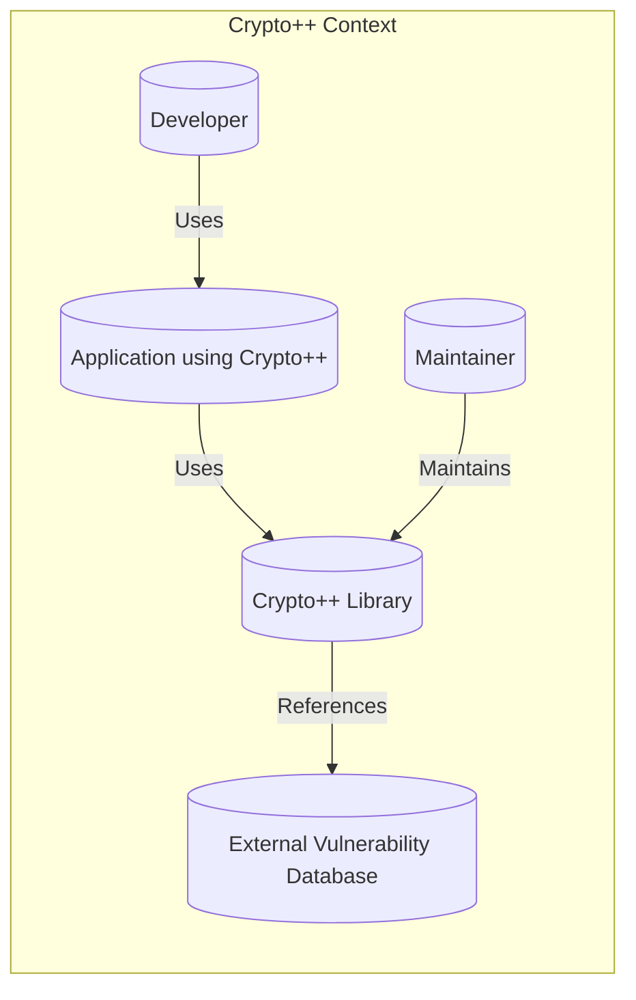
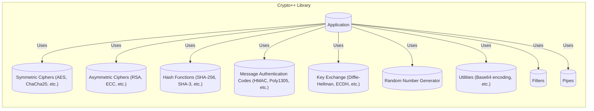
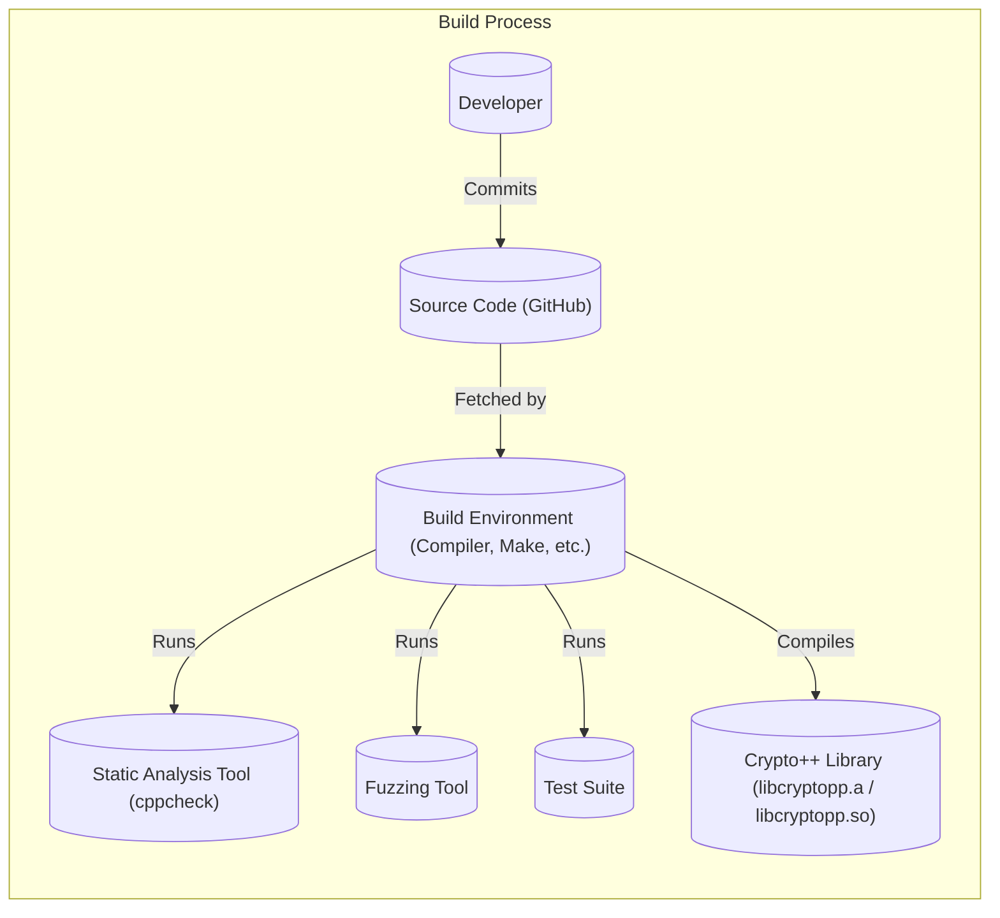

Okay, let's create a design document for the Crypto++ library based on the provided GitHub repository.

# BUSINESS POSTURE

Crypto++ is a mature, widely-used, open-source C++ library providing a comprehensive collection of cryptographic algorithms.  It's not a product or service in itself, but rather a building block used by other software projects.

Priorities:

*   Provide a wide range of robust and well-tested cryptographic primitives.
*   Maintain high performance and efficiency.
*   Ensure cross-platform compatibility (as evidenced by the build files for various compilers and operating systems).
*   Maintain long-term stability and backward compatibility (to the extent possible, given the nature of cryptography).
*   Provide clear and accurate documentation.
*   Facilitate community contributions and issue reporting.

Goals:

*   Enable developers to easily implement strong cryptography in their applications.
*   Serve as a reference implementation for various cryptographic algorithms.
*   Stay up-to-date with the latest cryptographic standards and best practices.
*   Avoid introducing vulnerabilities that could compromise the security of applications using the library.

Business Risks:

*   Cryptographic Algorithm Weakness:  The most significant risk is the discovery of weaknesses in the implemented cryptographic algorithms themselves. This is an inherent risk in cryptography, as algorithms can become vulnerable over time due to advances in cryptanalysis.
*   Implementation Bugs:  Even if the underlying algorithm is sound, implementation errors (e.g., buffer overflows, timing attacks, side-channel leaks) can introduce vulnerabilities.
*   Supply Chain Attacks: Compromise of the development or distribution infrastructure (e.g., GitHub, developer machines) could lead to malicious code being injected into the library.
*   Incorrect Usage: Developers using the library incorrectly (e.g., using weak parameters, improper key management) can create vulnerabilities in their applications, even if the library itself is secure.
*   Lack of Maintenance: If the library is not actively maintained, it may become outdated and vulnerable to newly discovered attacks.
*   License Issues: While Crypto++ uses a permissive license, misuse or misunderstanding of the license terms could create legal issues.

# SECURITY POSTURE

Existing Security Controls:

*   security control: Extensive Test Suite: The repository includes a comprehensive test suite (test.cpp, etc.) that verifies the correctness of the implementations.
*   security control: Code Reviews: As an open-source project, Crypto++ benefits from community code reviews, although the rigor and consistency of these reviews may vary.
*   security control: Static Analysis: The project appears to use some form of static analysis, as indicated by files like `cppcheck.sh`.
*   security control: Fuzzing: There's evidence of fuzzing being used (fuzz.cpp and related files), which helps to discover unexpected behavior and potential vulnerabilities.
*   security control: Compiler Warnings: The build process enables compiler warnings, which can help identify potential coding errors.
*   security control: Use of Safe C++ Practices: The code generally uses safe C++ practices, avoiding many common pitfalls, although a thorough audit would be needed to confirm this completely.
*   security control: Documentation: The project provides extensive documentation, including a wiki and manual, which helps developers use the library correctly.

Accepted Risks:

*   accepted risk: Algorithm Obsolescence:  It's accepted that some algorithms may become obsolete over time and will need to be deprecated and replaced.
*   accepted risk: Resource Constraints: As a volunteer-driven project, there may be limitations in the resources available for security audits, penetration testing, and rapid response to newly discovered vulnerabilities.
*   accepted risk: Zero-Day Vulnerabilities:  Like all software, Crypto++ is potentially vulnerable to zero-day exploits that are unknown to the developers.

Recommended Security Controls:

*   Continuous Integration/Continuous Delivery (CI/CD) Pipeline: Implement a robust CI/CD pipeline that automatically runs the test suite, static analysis, and fuzzing on every commit. This should include integration with services like GitHub Actions.
*   Regular Security Audits: Conduct regular, independent security audits of the codebase.
*   Formal Code Review Process: Establish a formal code review process with documented guidelines and checklists.
*   Bug Bounty Program: Consider implementing a bug bounty program to incentivize security researchers to find and report vulnerabilities.
*   Supply Chain Security Measures: Implement measures to protect the development and distribution infrastructure, such as code signing, two-factor authentication for maintainers, and regular security scans of the build environment.
*   Memory Safety: Explore the use of memory-safe languages or tools (e.g., Rust, memory-safe C++ subsets) for new development or critical components.
*   Side-Channel Analysis and Mitigation: Conduct thorough side-channel analysis and implement mitigations where necessary.

Security Requirements:

*   Authentication: N/A - Crypto++ is a library, not a system with authentication requirements.
*   Authorization: N/A - Crypto++ is a library, not a system with authorization requirements.
*   Input Validation:
    *   All input parameters to cryptographic functions should be validated to ensure they are within the expected range and format.
    *   Key sizes, nonce lengths, and other parameters should be checked against the requirements of the specific algorithm.
    *   Invalid input should result in a clear error, not undefined behavior.
*   Cryptography:
    *   Implement a wide range of modern, secure cryptographic algorithms, including symmetric ciphers (AES, ChaCha20), asymmetric ciphers (RSA, ECC), hash functions (SHA-256, SHA-3), message authentication codes (HMAC, Poly1305), and key exchange mechanisms (Diffie-Hellman, ECDH).
    *   Provide options for different key sizes and modes of operation, allowing developers to choose the appropriate level of security.
    *   Use constant-time implementations where appropriate to mitigate timing attacks.
    *   Provide secure random number generation.
    *   Follow cryptographic best practices, such as using appropriate padding schemes and avoiding weak algorithms.
    *   Clearly document the security properties and limitations of each algorithm.
    *   Provide mechanisms for key management, although the specific implementation will depend on the application using the library.

# DESIGN

## C4 CONTEXT



Element Descriptions:

*   Element:
    *   Name: Developer
    *   Type: Person
    *   Description: A software developer who uses the Crypto++ library in their application.
    *   Responsibilities: Integrates Crypto++ into their application, chooses appropriate algorithms and parameters, and handles key management.
    *   Security controls: Follows secure coding practices, uses the library correctly, and keeps up-to-date with security best practices.

*   Element:
    *   Name: Application using Crypto++
    *   Type: Software System
    *   Description: An application that utilizes the Crypto++ library for cryptographic operations.
    *   Responsibilities: Performs cryptographic operations using Crypto++, handles sensitive data securely, and implements appropriate security controls.
    *   Security controls: Depends on the specific application, but should include secure key management, input validation, and protection against common vulnerabilities.

*   Element:
    *   Name: Crypto++ Library
    *   Type: Software Library
    *   Description: The Crypto++ library itself, providing cryptographic primitives.
    *   Responsibilities: Provides a wide range of cryptographic algorithms, ensures correct implementation, and maintains performance and efficiency.
    *   Security controls: Extensive test suite, static analysis, fuzzing, compiler warnings, safe C++ practices, and documentation.

*   Element:
    *   Name: Maintainer
    *   Type: Person
    *   Description: A maintainer of the Crypto++ project.
    *   Responsibilities: Reviews code contributions, manages releases, addresses security issues, and maintains the project's infrastructure.
    *   Security controls: Follows secure coding practices, uses two-factor authentication for access to the repository, and responds promptly to security reports.

*   Element:
    *   Name: External Vulnerability Database
    *   Type: External System
    *   Description: Databases like CVE, NVD that track publicly known vulnerabilities.
    *   Responsibilities: Collect and disseminate information about security vulnerabilities.
    *   Security controls: Data integrity checks, access controls.

## C4 CONTAINER

Since Crypto++ is a library, the container diagram is essentially an expanded view of the single "Crypto++ Library" element from the context diagram.



Element Descriptions:

*   Element:
    *   Name: Symmetric Ciphers
    *   Type: Component
    *   Description: Implementations of symmetric encryption algorithms.
    *   Responsibilities: Provides encryption and decryption functionality using symmetric keys.
    *   Security controls: Constant-time implementations, secure key handling (within the library's scope), and adherence to cryptographic best practices.

*   Element:
    *   Name: Asymmetric Ciphers
    *   Type: Component
    *   Description: Implementations of asymmetric encryption algorithms.
    *   Responsibilities: Provides encryption, decryption, and digital signature functionality using public and private keys.
    *   Security controls: Secure key generation, protection against side-channel attacks, and adherence to cryptographic best practices.

*   Element:
    *   Name: Hash Functions
    *   Type: Component
    *   Description: Implementations of cryptographic hash functions.
    *   Responsibilities: Provides one-way hash functionality for data integrity and other applications.
    *   Security controls: Collision resistance, pre-image resistance, and second pre-image resistance.

*   Element:
    *   Name: Message Authentication Codes (MACs)
    *   Type: Component
    *   Description: Implementations of message authentication codes.
    *   Responsibilities: Provides data integrity and authenticity verification using secret keys.
    *   Security controls: Secure key handling, resistance to forgery attacks.

*   Element:
    *   Name: Key Exchange
    *   Type: Component
    *   Description: Implementations of key exchange protocols.
    *   Responsibilities: Allows two parties to securely establish a shared secret key over an insecure channel.
    *   Security controls: Protection against man-in-the-middle attacks, secure key derivation.

*   Element:
    *   Name: Random Number Generator
    *   Type: Component
    *   Description: Provides a source of cryptographically secure random numbers.
    *   Responsibilities: Generates high-quality random numbers suitable for cryptographic use.
    *   Security controls: Uses appropriate entropy sources, resists prediction and bias.

*   Element:
    *   Name: Utilities
    *   Type: Component
    *   Description: Provides utility functions such as base64 encoding, hex encoding, etc.
    *   Responsibilities: Supports various data encoding and manipulation tasks.
    *   Security controls: Correct implementation, avoidance of buffer overflows and other common vulnerabilities.

*   Element:
    *   Name: Filters
    *   Type: Component
    *   Description: Provides a way to process data through a series of transformations.
    *   Responsibilities: Stream processing of data.
    *   Security controls: Correct implementation, avoidance of buffer overflows and other common vulnerabilities.

*   Element:
    *   Name: Pipes
    *   Type: Component
    *   Description: Provides a way to chain multiple filters together.
    *   Responsibilities: Connects filters for data processing.
    *   Security controls: Correct implementation, avoidance of buffer overflows and other common vulnerabilities.

*   Element:
    *   Name: Application
    *   Type: Software System
    *   Description: An application that utilizes the Crypto++ library for cryptographic operations.
    *   Responsibilities: Performs cryptographic operations using Crypto++, handles sensitive data securely, and implements appropriate security controls.
    *   Security controls: Depends on the specific application, but should include secure key management, input validation, and protection against common vulnerabilities.

## DEPLOYMENT

Crypto++ is a library, and therefore its "deployment" is its integration into other applications. There isn't a single deployment model. However, we can describe common scenarios:

Possible Deployment Solutions:

1.  Static Linking: The Crypto++ library is compiled and statically linked into the application executable. This is the simplest approach and results in a single, self-contained executable.
2.  Dynamic Linking: The Crypto++ library is compiled as a shared library (e.g., .so, .dll) and dynamically linked at runtime. This allows multiple applications to share the same library, reducing disk space and memory usage.
3.  System Package: The Crypto++ library is installed as a system package (e.g., using apt, yum, or a similar package manager). This allows for easy updates and management of the library.
4.  Embedded Systems: The library is cross-compiled for a specific embedded platform and integrated into the embedded system's firmware.

Chosen Deployment Solution (Example: Dynamic Linking on Linux):

```mermaid
graph TD
    subgraph Deployment Environment (Linux Server)
        ApplicationServer[("Application Server")]
        CryptoPPLib[(("Crypto++ Library (libcryptopp.so)"))]
        Application[("Application using Crypto++")]

        Application -- Dynamically Links --> CryptoPPLib
        ApplicationServer -- Runs --> Application
    end
```

Element Descriptions:

*   Element:
    *   Name: Application Server
    *   Type: Server
    *   Description: The server where the application using Crypto++ is deployed.
    *   Responsibilities: Provides the runtime environment for the application.
    *   Security controls: Operating system hardening, firewall, intrusion detection system, regular security updates.

*   Element:
    *   Name: Crypto++ Library (libcryptopp.so)
    *   Type: Shared Library
    *   Description: The compiled Crypto++ library as a shared object.
    *   Responsibilities: Provides cryptographic functionality to the application.
    *   Security controls: Compiled with security flags (e.g., stack protection, ASLR), code signing (if applicable).

*   Element:
    *   Name: Application using Crypto++
    *   Type: Application
    *   Description: The application that uses the Crypto++ library.
    *   Responsibilities: Performs its intended function, utilizing Crypto++ for cryptographic operations.
    *   Security controls: Secure coding practices, proper use of the Crypto++ library, secure key management.

## BUILD

The build process for Crypto++ involves compiling the source code into a library that can be used by other applications.  The repository contains Makefiles, scripts for various compilers (GNU, MSVC, Intel, etc.), and configurations for different platforms.


Security Controls in Build Process:

*   Compiler Warnings: The build process enables compiler warnings to identify potential coding errors.
*   Static Analysis:  `cppcheck.sh` indicates the use of a static analysis tool to detect potential bugs and vulnerabilities.
*   Test Suite:  The comprehensive test suite (`test.cpp`, etc.) is run during the build process to verify the correctness of the implementations.
*   Fuzzing: Fuzzing is performed to discover unexpected behavior and potential vulnerabilities.
*   Automation (Makefiles): The build process is automated using Makefiles, reducing the risk of manual errors.

# RISK ASSESSMENT

Critical Business Processes:

*   Providing secure cryptographic primitives to developers.
*   Maintaining the integrity and availability of the Crypto++ library.
*   Protecting the reputation of the Crypto++ project.

Data to Protect:

*   Source Code:  The source code of the Crypto++ library is the primary data to protect.  Its sensitivity is high because compromise could lead to the introduction of vulnerabilities.
*   Test Data: Test vectors and other test data are important for verifying the correctness of the implementations.  Their sensitivity is moderate.
*   Documentation:  The documentation is important for ensuring that developers use the library correctly.  Its sensitivity is moderate.
*   Build Scripts and Configuration:  These files are important for ensuring the reproducibility and security of the build process. Their sensitivity is moderate to high.
*   Developer and Maintainer Credentials: Access credentials to the GitHub repository and other infrastructure are highly sensitive.

# QUESTIONS & ASSUMPTIONS

Questions:

*   What is the frequency and scope of external security audits?
*   Are there any specific compliance requirements (e.g., FIPS 140-2) that need to be considered?
*   What is the process for handling vulnerability reports?
*   What are the specific procedures for code review and merging pull requests?
*   What are the plans for long-term maintenance and support of the library?
*   Are there any plans to integrate with hardware security modules (HSMs)?
*   What level of assurance is provided for the random number generator?
*   Are there any specific threat models that have been developed for Crypto++?

Assumptions:

*   BUSINESS POSTURE: The Crypto++ project is primarily driven by volunteers and relies on community contributions.
*   BUSINESS POSTURE: The project aims to provide a general-purpose cryptographic library, not a tailored solution for specific security requirements.
*   SECURITY POSTURE: The existing security controls are implemented with best effort, but may not be as rigorous as those in a commercial product.
*   SECURITY POSTURE: Developers using the library are responsible for understanding and implementing appropriate security practices in their own applications.
*   DESIGN: The library is designed to be modular and extensible, allowing developers to choose the specific algorithms and features they need.
*   DESIGN: The build process is designed to be portable and support a wide range of platforms and compilers.
*   DESIGN: The library is primarily used through static or dynamic linking, rather than as a standalone service.